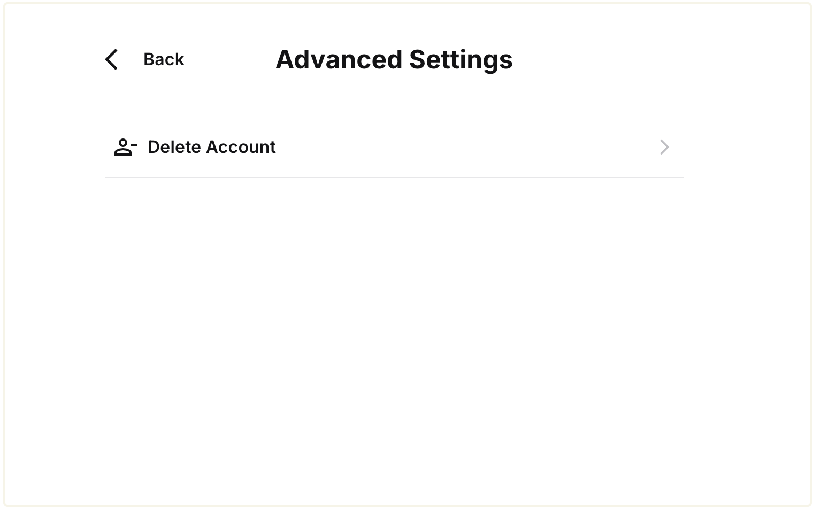
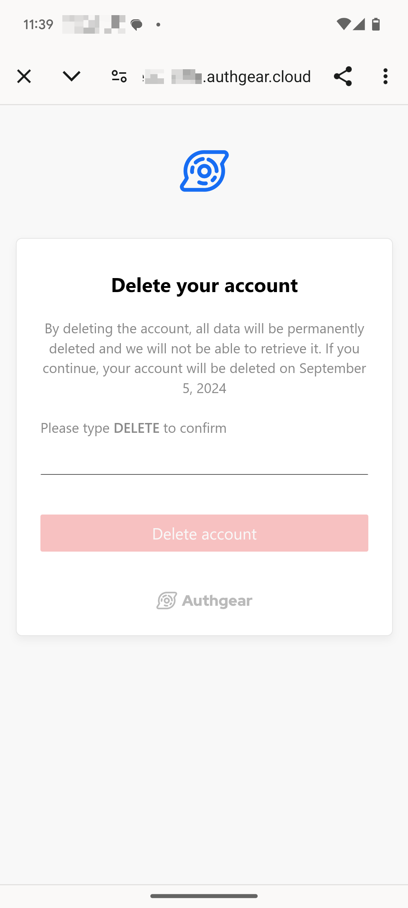

# Account Deletion

In Oct 2021, [Apple announced](https://developer.apple.com/news/?id=mdkbobfo) that all apps allowing users to create accounts should also provide ways for them to **initiate account deletion within the apps,** starting from January 31, 2022. It is also a good design to give your end-users more control over their data.

On Jan 22, 2022 [Apple decided](https://developer.apple.com/news/?id=i71db0mv) to extend the deadline to June 30 2022.

## Show "Delete Account" button in User Settings

In the pre-built [**User Settings**](../../customization/ui-customization/built-in-ui/user-settings.md) page, you can show a button for the end-users to initiate account deletion. Users can access the **Delete Account** button under Advanced Settings in the User Settings page when you enable Account Deletion on your project.




Enable this button by:

1. Go to **Advanced** -> **Account Deletion** page in the **Portal**
2. Enable the button and press **Save**

<figure><figcaption></figcaption></figure>

Note that if you enable this feature, you have to prepare for encountering invalid session every time your users close User Settings in your mobile apps. If your users unfortunately decided to delete their account in User Settings, all their sessions will become invalid immediately.

You must verify the validity of the session every time the User Settings is closed. The `open` method in the SDK is blocking. You can verify if the user session is still valid when the method resolves. Here is an example with the React Native SDK:



```tsx
// This method blocks until the user closes User Settings.
await authgear.open(Page.Settings);
// One way to verify the validity of the session is to get User Info once.
await authgear.fetchUserInfo();
```



```dart
// This method blocks until the user closes User Settings.
await authgear.open(SettingsPage.settings);
// One way to verify the validity of the session is to get User Info once.
await authgear.getUserInfo();
```



```csharp
// This method blocks until the user closes User Settings.
await authgear.OpenAsync(SettingsPage.Settings);
// One way to verify the validity of the session is to get User Info once.
await authgear.FetchUserInfoAsync();
```



## Open Account Deletion Page From Authgear SDK

You can now open the account deletion directly from Authgear SDKs. The account deletion page will be opened in a WebView.

<figure><figcaption></figcaption></figure>

You must enable the button in **Portal -> Advanced** -> **Account Deletion** before calling the function.

The following code examples show how to open the account deletion page from Authgear SDKs:&#x20;



```typescript
authgear
  .deleteAccount({
    redirectURI: "<POST_DELETE_REDIRECT_URI>", 
    //the same redirectURI as in authentication
    colorScheme: colorScheme as ColorScheme,
  })
```



```dart
_authgear.deleteAccount(
        redirectURI: "<POST_DELETE_REDIRECT_URI>",
        //the same redirectURI as in authentication
 );
```



```java
SettingsActionOptions options = new SettingsActionOptions(
        "<POST_DELETE_REDIRECT_URI>"
        //the same redirectURI as in authentication
);
options.setColorScheme(getColorScheme());
mAuthgear.deleteAccount(options, new OnOpenSettingsActionListener() {
    @Override
    public void onFinished() {
        mIsLoading.setValue(false);
        Log.d(TAG, "deleteAccount finished");
    }

    @Override
    public void onFailed(Throwable throwable) {
        Log.d(TAG, throwable.toString());
        mIsLoading.setValue(false);
        setError(throwable);
    }
});
```



```swift
authgear?.deleteAccount(
    colorScheme: self.colorScheme,
    redirectURI: "<POST_DELETE_REDIRECT_URI>"
    //the same redirectURI as in authentication
) { result in
    switch result {
    case .success:
        self.successAlertMessage = "Deleted account successfully"
    case let .failure(error):
        self.setError(error)
    }
}
```



## Deactivated User

When the end-user has initiated the account deletion, their account will be **deactivated** and scheduled for deletion after the grace period.

**Deactivated** users are always **disabled**. They will not be able to complete the authentication process. The `is_deactivated` status signal that the `is_disabled` status was turned `true` by the end-user themselves rather than the admin.

## Schedule Deletion

You can set the grace period for how long the user account will be deactivated before deleted from the system. The default value is 30 days, you can choose between 1 to 180 days.

## Initiate Deletion from the Portal

An end-user account can also be deleted using the **Portal**. In the **User Management** page, click the **Remove User** button to remove them immediately or schedule the deletion.

## Initiate Deletion from Admin API

Alternatively, if you did not enable the "Delete Account" button in **User Settings**, you can implement the button in your app by yourself. You can schedule a deletion or delete immediately.

### Schedule Deletion

Your backend server can invoke the mutation `scheduleAccountDeletion` with the [Admin API](../../api-reference/apis/admin-api/) to initiate the account deletion.

Here is an example:

**GraphQL**

```graphql
mutation {
  scheduleAccountDeletion(input: {
    userID: "USER_ID"
  }) {
    user {
      id
      isDisabled
      isDeactivated
      disableReason
      deleteAt
    }
  }
}
```

### Immediate Deletion

Your backend server can invoke the mutation `scheduleAccountDeletion` with the [Admin API](../../api-reference/apis/admin-api/) to initiate the account deletion.

Here is an example:

**GraphQL**

```graphql
mutation {
  deleteUser(input: {
    userID: "USER_ID"
  }) {
    deletedUserID
}
```

## Webhook events

You may listen to the following events to integrate the deletion behavior to your apps.

**Non-blocking events**

* `user.disabled`
* `user.reenabled`
* `user.deletion_scheduled`
* `user.deletion_unscheduled`
* `user.deleted`

**Blocking event**

* `user.pre_schedule_deletion`

See the event details in [Webhooks](../../customization/events-hooks/webhooks.md).
