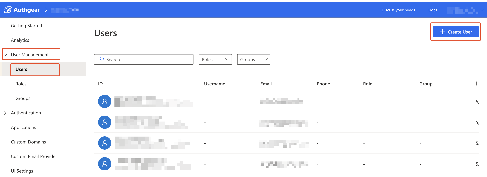
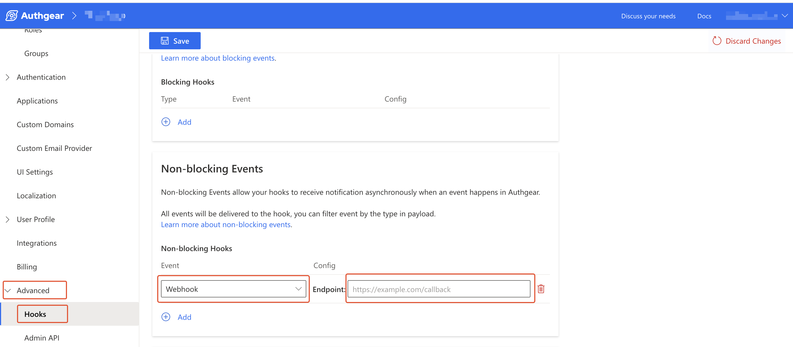
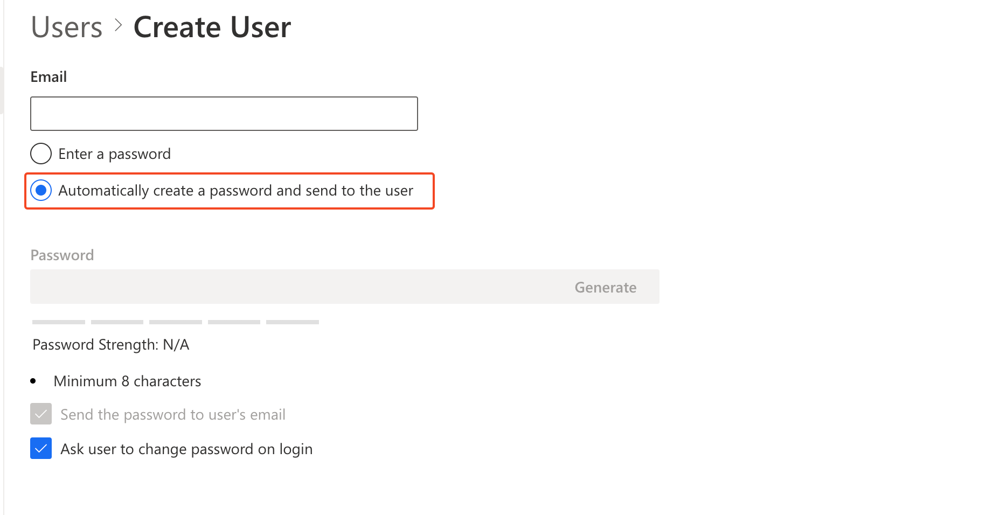

# How to Handle Password While Creating Accounts for Users

In some use cases, you (the admin) may need to create an account on behalf of a user. In such cases, the admin can do this either from the Portal or using the Admin API. A common question that arises when admins create accounts for users is how to handle the process of setting a password for the user.

In this post, we'll cover a few options and describe examples of automating the process of sending passwords to new users using Authgear Portal or webhooks.

Some of the options are:

* Use the "Automatically create a password and send to the user" feature so that Authgear can auto-generate a secure password and send it to the user.
* Set your own unique and secure password for the new user and let Authgear send it in an email to the user so they can log in with it.&#x20;

To improve security, enable the "Ask user to change password on login" feature so that users are required to change the password set by an admin.

## How to Create Accounts for Users and Send them their Password

You can create accounts for users using Authgear Portal or [Admin API](../../reference/apis/admin-api/) and the password you set or a random auto-generated password will be sent to the user's email address. In addition, you can also configure the new accounts such that users are required to set a new password on login.

### Step 1: Open the Create User Page

First, log in to Authgear Portal, select your project, then navigate to **User Management** > **Users**. From the Users page, click on the **Create User** button on the top right corner to open the Create User page.

<figure><figcaption></figcaption></figure>

### Step 2: Enter New User's Details

On the **Create User** page, enter the user's email (only `email` supports auto-sending of password from Authgear currently).

Next, enter a secure password you wish to set for the user in the **Password** field.

Check the "Send the password to user's email" box to enable Authgear to send the password entered in the **Password** field to the user.

<figure><figcaption></figcaption></figure>

If you're using a phone number instead of email for user identity,  you need to use your own means to send the password to the user as Authgear only sends passwords to email at this time. For example, you can set up a webhook to send the password to a phone number as shown below.

#### Using Webhook to Send Password

Creating a new account on behalf of a user from either the Authgear Portal or using the Admin API will trigger the `user.created` event.

**Note:** Creating a user via the batch [user import API](import-users-using-user-import-api.md) does not trigger `user.created`. Also, you need to set up your webhook before you start creating new users.

To set up a webhook, navigate to **Advanced** > **Hooks** in the Authgear Portal. Next, click on the **Add** button under **Non-blocking Events** to add a new webhook.&#x20;

Select **Webhook** under the **Event** dropdown and enter the URL for the webhook endpoint that will be listening for webhook events from Authgear. Or select **TypeScript** to run everything on Authgear. Click **Save** when you're done.

<figure><figcaption></figcaption></figure>

Here is an example of an event log entry for a `user.created` event when a new user is created from the Portal:

```json
{
    "context": {
      "app_id": "authui-review-8",
      "ip_address": "123.45.678.72",
      "language": "en",
      "preferred_languages": [],
      "timestamp": 1724703646,
      "triggered_by": "admin_api",
      "user_agent": "Mozilla/5.0 (Macintosh; Intel Mac OS X 10_15_7) AppleWebKit/537.36 (KHTML, like Gecko) Chrome/126.0.0.0 Safari/537.36",
      "user_id": "73090db5-b4bb-4f5c-8cd5-ba82dab3093e"
    },
    "id": "000000000006c286",
    "payload": {
      "user": {
        "can_reauthenticate": true,
        "created_at": "2024-08-26T20:20:46.442182Z",
        "id": "73090db5-b4bb-4f5c-8cd5-ba82dab3093e",
        "standard_attributes": {
          "phone_number": "+2348060386628",
          "phone_number_verified": false,
          "updated_at": 1724703646
        },
        "updated_at": "2024-08-26T20:20:46.494665Z"
      }
    },
    "seq": 443014,
    "type": "admin_api.mutation.create_user.executed"
  }
```

You can use the value of `context.triggered_by` to determine how the new user account was created then, only send a message when the account was created by an admin (`admin_api`). You can extract the new user's phone number from  `payload.user.standard_attributes.phone_number`.

The following code shows what a TypeScript hook that listens for the `user.created` event looks like:

```typescript
import { HookEvent } from "https://deno.land/x/authgear_deno_hook@v1.3.0/mod.ts";

export default async function(e: HookEvent): Promise<void> {
  switch (e.type) {
  case "user.created":
    // Thanks to TypeScript compiler, e is now of type EventUserCreated.
    const created_using = e.context.triggered_by;
    if(created_using == "admin_api") {
      const new_user_phone_number = e.payload.user.standard_attributes.phone_number; // This is subjective, you may use any other claim like phone number and send SMS instead of email.

      // TODO Add code for sending a message to @new_user_phone_number here

    }
    
    break;
  default:
    // Add a default case to catch the rest.
    // You can add more case to match other events.
    break;
  }
```

The message you send to new users from your webhook after creating an account for them can look like this:

```
"Hello, a new account has been created for you on {service_name}.
 Kindly visit {url} to log in.
 Your userID is {phone_number}, password: {password}"
```

### Step 3: \[Optional] Let Authgear Automatically Create a Password for the User

You can skip the step of creating a random secure password for your new user by selecting the "Automatically create a password and send to the user" radio button on the Create User page.

To do this, on the **Create User** page, click on the "Automatically create a password and send to the user" radio button.&#x20;

<figure><figcaption></figcaption></figure>

### Step 4: Force Users to Change Password Set by Admin

In the Create User page, just below the "Send the password to user's email" checkbox, you'll find a "Ask user to change password on login" checkbox which should be checked by default.&#x20;

If you wish to force users to change their password after they login using the password that was set for them in Authgear Portal either by an admin or automatically, make sure the "Ask user to change password on login" box is checked. Otherwise, uncheck it if you wish to allow users to continue using the password you set for them.

When you're done with the above steps, click on the **Add User** button on the top left corner of the Create User page to create the new account.&#x20;

### If the user lost the preset password

Users can still log in to their new account if they lose or can't find the password you set for them. To log in, they can click the **Forgot Password** button from the login page.  A Verification code or link will be sent to the user via email or text message. Next, the user can then set a new password that they can continue using to log in to their account.

## Create a New User from the Admin API

Alternative to the above steps, you can create a new user account from the Admin API and have Authgear send them their password using the following Admin API mutation:

```graphql
mutation {
  createUser(input: {definition: {loginID: {key: "email", value: "user@example.com"}}, password: "s3c0rp4$sw0rd", sendPassword: true, setPasswordExpired: true}) {
    user{
      id
      standardAttributes
    }
  }
}
```

The input parameter of the `createUser` mutation includes the following objects and fields:

* `definition`: The value of this field is `loginID`. In loginID, you define the identity type using the `key` field and the actual value of the identity (eg. the user's email address) in the `value` field.
* `password`: Enter the value for the password you wish to set for the user here.
* `sendPassword`: Use this field by setting the value to `true` or `false` to enable or disable the automatic sending of password to users.&#x20;
* `setPasswordExpired`: Set to `true` to force users to change their password on login.

### Use the resetPassword Mutation to Send Password

The `resetPassword` Admin API mutation also supports  `sendPassword` and  `setPasswordExpired` inputs. Hence, you can use it to set a password for a user you've already created and want to send them a new password and require them to change their password on their next log-in.

Example:

```graphql
mutation {
  resetPassword(input: {userID: "<ENCODED USER ID>", password: "n3w-p4$s", sendPassword: true, setPasswordExpired: true}) {
    user {
      id
      standardAttributes
    }
  }
}
```

## Conclusion

The steps described in this post, show how you can customize the post account creation experience for accounts created for a user by an admin.&#x20;

For the particular case we considered, we described how to use webhooks to notify a user about their new account and what they should do next. Even if you use other tools to notify users about their new account, it's worth noting that Authgear's `user.created` event can help you to know when a new account has been created.
