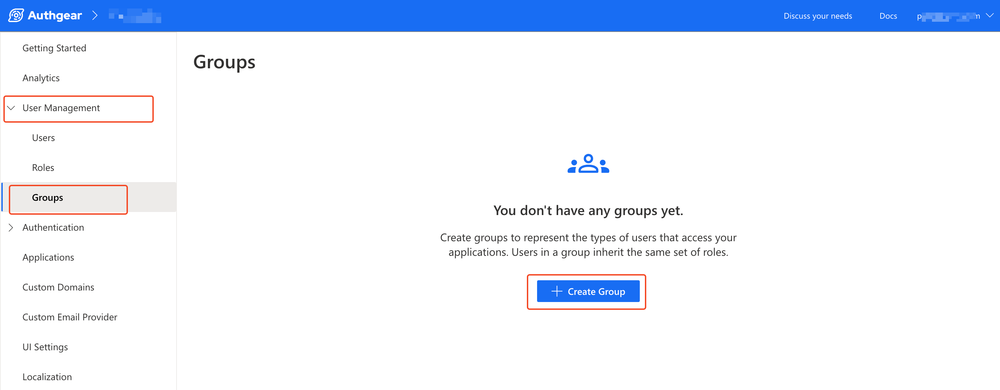
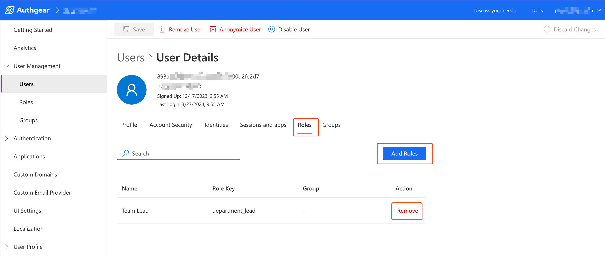

# Manage Users Roles and Groups

## 1.0 Introduction

Roles and Groups can extend access management on your application that Authgear powers. Authgear includes a user's roles in the response from the [UserInfo endpoint](https://docs.authgear.com/~/changes/S9PzpQKqtjCE4EDWHGO4/reference/apis/oauth-2.0-and-openid-connect-oidc/userinfo) and in the JWT access token.

The following case is an example of how you can use roles to deliver unique features and interfaces to different categories of users of your application. Let's say you have an application XYZ that powers a transportation business. The app has roles for `admin`, `driver` and `passenger`. You can use the value Authgear returns in UserInfo or JWT access token to enable features for managing drivers to a user with `admin` role only. Similarly, you can allow only users with `driver` role view features to manage their vehicle, passengers, and trip. Finally, you can restrict users with the `passenger` role to only view their ticket and trip details.

In this post, you'll learn how to create roles and groups for your Authgear project and how to manage them.

You can create a group in your Authgear project and add one or more roles to the group. Both groups and roles can be applied to a user. For instance, if your Authgear project, has the following roles:

* `management`
* `department_lead`
* `team_member`

And a `managers` group, you can add the `management` and `department_lead` roles to the group. Then, adding a user to the `managers` group will grant them both `management` and `department_lead` roles.

The following figure shows the core relationship with Groups, Roles, and Users in Authgear.

<figure><figcaption><p>roles and group flowchart</p></figcaption></figure>

### 1.1 Properties of Roles and Groups

Each role or group has three properties that describe it. These include a required `key`, and optional `name` and `description`.

#### 1. Role/Group Key

The `key` property serves as the identifier for the role or group. The value for `key` is what AUthgear will include in the UserInfo and JWT access token of a user. A valid key must meet the following conditions:

* The value of `key` can not be empty.
* A key must be between 1 and 40 characters long.
* The valid characters are `[a-zA-Z0-9:_]`.
* The prefix `authgear:` is reserved for Authgear internal use.

The following are some examples of valid keys:

* `reader`
* `app:editor`
* `store_manager`

#### 2. Name

Name is an optional label for a role or group. The value for the name property is what will be displayed in Authgear portal. It has less strict constrict for allowed characters. For example, you can use white spaces here.

#### 3. Description

The description property is also optional. You can use it to give more details about a role or group.

In the next section of this post, we'll show you how to create roles and groups for your project.

### 1.2 Example of Role in UserInfo Endpoint Response

The. following JSON document shows how roles are returned when your application requests for UserInfo:

```json
{
  "custom_attributes": [],
  "email": "user@example.com",
  "email_verified": true,
  "family_name": "John",
  "gender": "male",
  "given_name": "Doe",
  "https://authgear.com/claims/user/can_reauthenticate": true,
  "https://authgear.com/claims/user/is_anonymous": false,
  "https://authgear.com/claims/user/is_verified": true,
  "https://authgear.com/claims/user/roles": [
    "department_lead",
    "team_member"
  ],
  "sub": "e3079029-f230-4c24-91c1-c2cd63a6a4af",
  "updated_at": 1694947082,
  "x_web3": {
    "accounts": []
  }
}
```

The value of the `https://authgear.com/claims/user/roles` attribute is an array that contains the roles of the current user.

## 2.0 How to Create a New Role

It is up to you to create roles for your Authgear project based on your unique need and use case. You can create new roles using the Authgear Portal or the [Admin API](https://docs.authgear.com/reference/apis/admin-api) (using GraphQL).

### 2.1 Creating Roles from the Authgear Portal

Follow these steps to create new roles in your Authgear project via the Portal.

#### Step 1

First, log in to Authgear Portal, select your project then navigate to **User Management** > **Roles** to open the **Roles** page.

<figure><figcaption><p>navigate to roles management page</p></figcaption></figure>

#### Step 2

Click the **Create Role** button in the middle of the Roles page (or the top right corner if you have existing roles) to start creating a new role.

<figure><figcaption><p>create new role page</p></figcaption></figure>

Enter the **Name**, **Role Key**, and **Description** of your new role in their respective fields. Click on the **Create** button at the bottom of the form to finish creating your new role.

Repeat the above steps to add more roles.

### 2.2 Creating Roles using the Admin API

As mentioned earlier in this post, you can also create new roles using the Admin API. In this section, we'll walk you through the steps for doing that.

#### Step 1

Set up your custom code with the [necessary authorization to interact with the Admin API](https://docs.authgear.com/reference/apis/admin-api/authentication-and-security) GraphQL endpoint. Or use the GraphiQL Explorer provided by Authgear (Navigate to **Advanced** > **Admin API** > **GraphiQL Explorer** in Authgear Portal to access).

#### Step 2

Run the following mutation to create a new role:



```graphql
mutation {
  createRole(input: { key:"department_lead", name:"Team Lead", description: "Role for a leader of a specific department" }) {
    role {
      id
      key
    }
  }
}
```



```json
{
  "data": {
    "createRole": {
      "role": {
        "id": "Um9sZTozNDM5MWQ1Ni00OTEwLTQ1ZDAtOTI1Yi1lMjQxODFhYmMxODc",
        "key": "department_lead"
      }
    }
  }
}
```



## 3.0 How to Create a New Group

Just like roles, you are responsible for creating groups for your Authgear project. You can also create new groups either via Authgear Portal or using the Admin API.

### 3.1 Creating Groups from the Authgear Portal

The steps for creating a new group from the Portal are similar to that of roles. The steps are as follows:

#### Step 1

First, log in to Authgear Portal, select your project then navigate to **User Management** > **Groups** to open the **Groups** page.

<figure><figcaption><p>navigate to groups management page</p></figcaption></figure>

#### Step 2

Click the **Create Group** button in the middle of the screen (or in the top right corner if you already have some groups) to access the **Create Group** form.

<figure><figcaption></figcaption></figure>

Enter the **Name**, **Group Key** and **Description** in the group creation form then click the **Create** button to finish.

### 3.2 Creating Groups using the Admin API

It's possible to create a new group using the Admin API GraphQL. The following guide shows the steps for doing that.

#### Step 1

Implement your own custom code that has [access to the Admin API endpoint](https://docs.authgear.com/reference/apis/admin-api/authentication-and-security). Alternatively, you can use the GraphiQL Explorer in Authgear Portal (Navigate to **Advanced** > **Admin API** > **GraphiQL Explorer**).

#### Step 2

Execute the following GraphQL mutation to create a new group:



```graphql
mutation {
  createGroup(input: { key:"managers", name:"Managers", description: "Group for managers with access to all departments" }) {
    group {
      id
      key
    }
  }
}
```



```json
{
  "data": {
    "createGroup": {
      "group": {
        "id": "R3JvdXA6NDM2ZDg4OTctMmNjYi00ZjQ3LWJiOGYtN2U2MzE4ZTVhNDM3",
        "key": "managers"
      }
    }
  }
}
```



## 4.0 Managing Existing Roles

You can manage the roles you've created via the Portal or using the Admin API. In this section, we'll cover how to manage roles.

### 4.1 Add Role to a User

To add a role to a user, first, in the Authgear Portal, navigate to **User Management** > **Users**. From this page, you can view a list of all the users who have signed up on your Authgear project. You can also search users by their current roles there.

<figure><figcaption></figcaption></figure>

Next, click on the user you wish to add a new role to. This will open their **User Details** page. From that page, navigate to the **Roles** tab

<figure><figcaption></figcaption></figure>

Then, click the **Add Roles** button, select a role from the drop-down menu, and click **Add**. If the drop-down is empty, it is possible that you have not created any roles yet. See [how to create roles](manage-users-roles-and-groups.md#id-2.0-how-to-create-a-new-role).

<figure><figcaption></figcaption></figure>

To remove an existing role from a user, click on the **Remove** button next to the role in the user's **Roles** tab.

### 4.2 Add Group to Role

Adding a group to a role is a way of connecting a role and a group from the role management side.

To do this in Authgear Portal, first navigate to **User Management** > **Roles**, then click on the role you wish add a group to.

<figure><figcaption></figcaption></figure>

Next, in the details page for the selected role, go to the **Groups** tab, then click the **Add to Group** button. Select the group you wish to add from the drop-down then click **Add**. If there's no groups in the dropdown, try creating some new groups first.

<figure><figcaption></figcaption></figure>

### 4.3 Update or Delete a Role

To update the properties of an existing role such as the name, description or key, navigate to User **User Management** > **Roles** in Authgear Portal. Click on the role you wish to modify to open the **Settings** tab, then change the value for the property you wish to update in the form. Once you're done, click on the **Save** button.

<figure><figcaption></figcaption></figure>

To delete a role, click on the **Delete** button once you open the role's **Settings** tab.

## 5.0 Managing Existing Rules

### 5.1 Add Group to User

To add a group to a user's profile in the Portal, first navigate to **User Management** > **Users** and select a user.

In the **User Details** page, switch to the **Groups** tab then click on **Add to Group**.

<figure><figcaption></figcaption></figure>

Select the group you wish to add the user to from the drop-down then click on **Add**.

<figure><figcaption></figcaption></figure>

### 5.2 Add Role to Group

To add a role to a group, navigate to **User Management** > **Groups** then click on the group you wish to add roles to.

In the group details page, switch to the **Roles** tab, then click on the **Add Role** button.

<figure><figcaption></figcaption></figure>

Select the roles you wish to add to the group from the drop-down then click on the **Add** button.

<figure><figcaption></figcaption></figure>

### 5.3 Update or Delete Group

To update an existing group, go to **User Management** > **Groups** and click on the group you wish to update. Modify the property you wish to update using the form in the group's **Setting** tab. Once you're done, click on **Save** to keep your changes.

<figure><figcaption></figcaption></figure>

To delete an existing group, click on the Delete Group button once you're in the Settings tab for that group.
