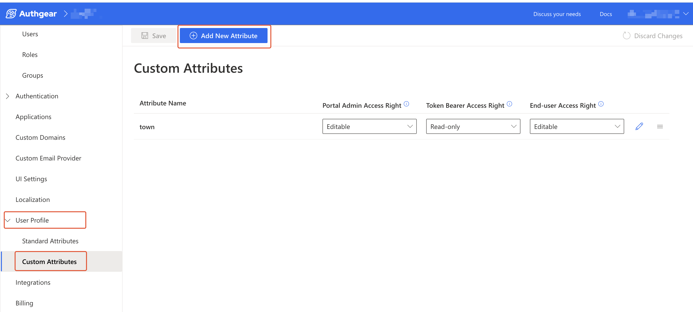
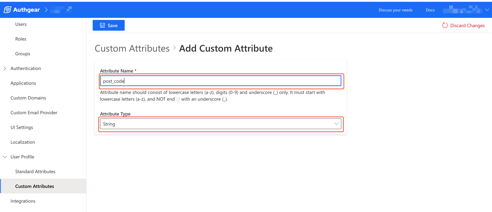
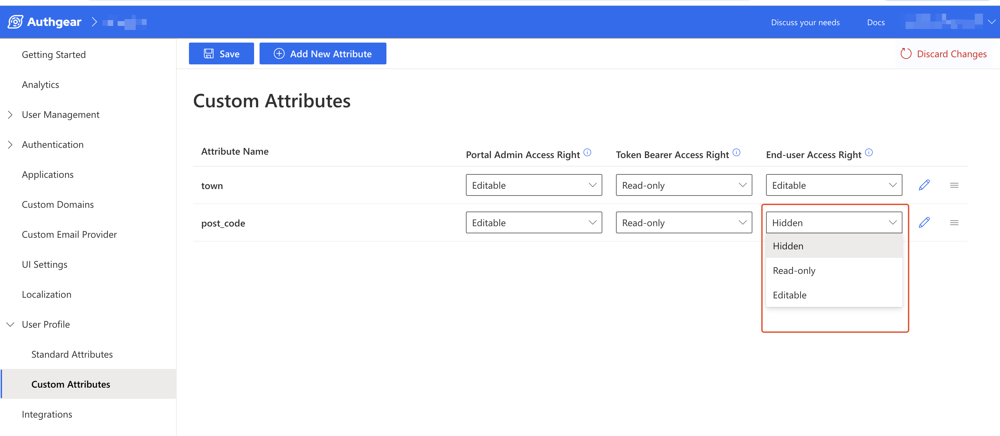
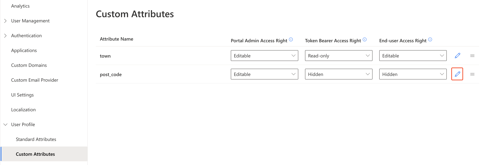
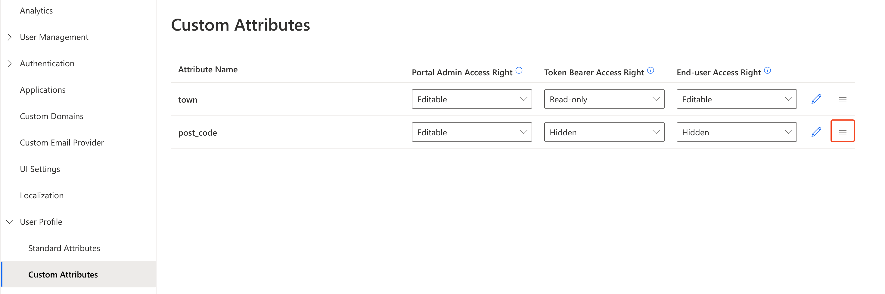

# Profile Custom Attributes

In Authgear, a user's profile includes two types of attributes.&#x20;

The first is the standard attributes which are basically common profile fields such as Primary Email, Primary Phone, Username, Name, Birthday, etc that are present by default.&#x20;

The second type is the custom attributes an Authgear user can set for their project. This allows you to add custom fields to the profiles of your users. For example, you can add a Post Code custom attribute to your Authgear so users can provide this data for their profile.&#x20;

All custom attributes are returned in the [UserInfo](../../api-reference/apis/oauth-2.0-and-openid-connect-oidc/userinfo.md) response under the `custom_attributes` field.

In this post, you'll learn how to add new custom attributes to your Authgear project. You'll also learn how to manage existing custom attributes.

### 1. How to Add a New Custom Attribute

You can add new custom attributes to your project from the Authgear Portal. To do this, first, navigate to **User Profile** > **Custom Attributes**. Then, click on the **Add New Attribute** button to open the **Add Custom Attribute** page.

<figure><figcaption></figcaption></figure>

Enter the  **Attribute Name**, a valid attribute name should consist of lowercase letters (a-z), digits (0-9), and underscore (_) only, must start with lowercase letters (a-z), and NOT end with an underscore (\__).

Select the appropriate **Attribute Type** based on the type of data you expect users to enter in the custom attribute. The option you select will affect the type of input field (text field, dropdown, etc) users will see in their profile settings UI.

<figure><figcaption></figcaption></figure>

Once you're done, click the **Save** button to add the new custom attribute.

### 2. Set Who Can Access a Custom Attribute

Usually, the next key action to take after adding a new custom attribute will be to set the access right. An attribute's Access Right is a configuration that determines who can see (Read-only) or add or modify (Editable) the value of an attribute's field.

You can set the **Access Right** for an attribute under the following groups:

* **Portal Admin**: Access control for the user profile attributes in Admin Portal > User Management.
* **Token Bearer**: Access control for the user profile attributes in the UserInfo endpoint.
* **End-user**: Access control for the user profile attributes in the End-user settings page.

To set the access right for an attribute, navigate to User Profile > Custom Attributes in the Authgear Portal. On the Custom Attributes list, click the Access Right dropdown for the group and custom attribute you wish to update. Click **Save** when you're done to keep the changes.

<figure><figcaption></figcaption></figure>

**Note:** Selecting the **Hidden** access right, for any group will hide the field for the attribute from that group. For example, selecting Hidden for the `post_code` attribute for the Token Bearer group means the `post_code` field will be hidden (not included) in the UserInfo endpoint response.

### 3. Modify Custom Attribute Name

From the Custom Attributes list, click on the pencil icon to open the **Edit Custom Attribute** page.

**Note:** You can't modify the **Attribute Type** for an existing attribute. The alternative will be to create a new custom attribute with the new **Type** and migrate data from the old attribute to it. Also, rename and change the access right for the old attribute to make it obsolete.

<figure><figcaption></figcaption></figure>

### 4. Reorder Custom Attribute Position

You can set the order of how custom attributes appear in the UI.

To do that, in the Custom Attributes list, click and drag the stacked icon next to an attribute up or down to move the position.

<figure><figcaption></figcaption></figure>

### 5. Delete Custom Attribute

Delete is not supported. Instead, you should change the name and access right to make the attribute obsolete.
