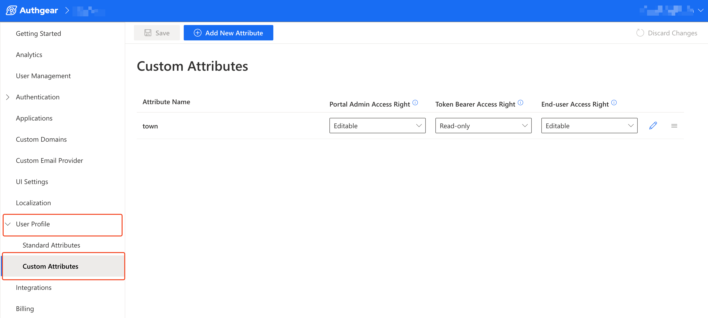

# API Queries and Mutations

Authgear provides a GraphQL API that you can use to manage users and other resources right from your application or using the GraphiQL Explorer in **Authgear Portal** > **Advanced** > **Admin API**.

The following section shows a detailed description and examples of supported queries and mutations.

## 1. Queries

### 1.1. auditLogs

The auditLogs query returns a list of all activities (logs) from the audit log.

**Schema:**

```graphql
auditLogs(
first: Int
last: Int
userIDs: [ID!]
sortDirection: SortDirection
before: String
after: String
rangeFrom: DateTime
rangeTo: DateTime
activityTypes: [AuditLogActivityType!]
): AuditLogConnection
```

**Example:**



```graphql
query {
  auditLogs(first: 4) {
    edges {
      node {
        id
        activityType
        createdAt
      }
    }
  }
}
```



```json
{
  "data": {
    "auditLogs": {
      "edges": [
        {
          "node": {
            "activityType": "USER_AUTHENTICATED",
            "createdAt": "2023-09-11T09:23:51Z",
            "id": "QXVkaXRMb2c6MDAwMDAwMDAwMDA0ZDVjOQ"
          }
        }
      ]
    }
  }
}
```



### 1.2. users

You can use this query to fetch all registered users on your application. The `users` query returns a list of type `User`.

The `users` query depends on a search index. Hence, the data it returns is **NOT immediately consistent** as it requires reindexing before the most recent data and updates are included. If getting real-time user data is important for your use case, consider using the `node` /`nodes` or `getUser`/`getUsers` queries instead.

**Schema:**

```graphql
users(
first: Int
last: Int
searchKeyword: String
sortBy: UserSortBy
sortDirection: SortDirection
before: String
after: String
): UserConnection
```

**Example:**



```graphql
query {
  users(first: 2) {
    edges {
      node {
        id
        standardAttributes
      }
    }
  }
}
```



```json
{
  "data": {
    "users": {
      "edges": [
        {
          "node": {
            "id": "VXNlcjo4ZGM4ZDgyjjkoKA0LTRjZGEtODZiOC03OTY4MGUwYzA5OGM",
            "standardAttributes": {
              "email": "myuser@gmail.com",
              "email_verified": true,
              "family_name": "John",
              "given_name": "Doe",
              "updated_at": 1686820949
            }
          }
        },
        {
          "node": {
            "id": "VXNlcjplMzA3OTAyaxKJuILTRjMjQtOTFjMS1jMmNkNjNhNmE0YWY",
            "standardAttributes": {
              "email": "user2@gmail.com",
              "email_verified": true,
              "family_name": "Eliano",
              "given_name": "Don",
              "updated_at": 1694359032
            }
          }
        }
      ]
    }
  }
}
```



### 1.3. node

A node represents a single object of different Types. The node query allows you to query a single object using the node ID. You learn more about node ID here: [https://docs.authgear.com/reference/apis/admin-api/node-id](https://docs.authgear.com/reference/apis/admin-api/node-id).

**Schema:**

```graphql
node(id: ID!): Node
```

**Example:**

You can specify different object types to the node query to fetch an item of that type. Examples of node Types include `User`, `AuditLog`, `Session`, `Authenticator`, `Authorization`, and `Identity`.

The following example uses the AuditLog node type.



```graphql
query {
  node(id: "QXVkaXRMb2c6MDAwHJKwMDAwMDA0ZDViOQ") {
    id
    ... on AuditLog {
      id
      activityType
      createdAt
    }
  }
}
```



```json
{
  "data": {
    "node": {
      "activityType": "USER_AUTHENTICATED",
      "createdAt": "2023-09-11T09:23:51Z",
      "id": "QXVkaXRMb2c6MDAwHJKwMDAwMDA0ZDViOQ"
    }
  }
}
```



### 1.4. nodes

The nodes query returns a list of nodes. This works similarly to the node query except that instead of supplying a single ID, you can provide a list of IDs for the objects you are querying for.

**Schema:**

```graphql
nodes(ids: [ID!]!): [Node]!
```

**Example:**



```graphql
query {
  nodes(ids: ["<NODE ID1>","<NODE ID2>"]) {
    id
    ... on AuditLog {
      id
      activityType
      createdAt
    }
  }
}
```



```json
{
  "data": {
    "nodes": [
      {
        "activityType": "USER_AUTHENTICATED",
        "createdAt": "2023-09-11T09:23:51Z",
        "id": "QXKytXRMb4n6MDAwMDAwMDAwMDA0ZDVjUK"
      },
      {
        "activityType": "USER_PROFILE_UPDATED",
        "createdAt": "2023-09-14T06:57:27Z",
        "id": "QXVkaXABb7c6MDAwMDAwMDAwMDA0ZGKkZA"
      }
    ]
  }
}
```



### 1.5 groups

The groups query returns a list of all [groups](../../../admin/user-management/manage-users-roles-and-groups.md) in an Authgear project. It will return nothing if no group has been created yet. Groups can be a field in the `roles` query.

**Schema:**

```graphql
groups(
searchKeyword: String
excludedIDs: [ID!]
after: String
first: Int
last: Int
before: String
): GroupConnection
```

**Example:**



```graphql
query {
  groups(first: 10) {
    edges {
      cursor
      node {
        id
        key
        description
      }
    }
  }
}
```



```json
{
  "data": {
    "groups": {
      "edges": [
        {
          "cursor": "b2Zmc2V0OjA",
          "node": {
            "description": "Staff members with super admin permissions",
            "id": "R3JvdXA6OTU4YTA2ODIXRMb4n6MDAwMDAwMDAwMDA0ZDVjUKx",
            "key": "admin_staff"
          }
        },
        {
          "cursor": "b2Zmc2V0OjE",
          "node": {
            "description": "Group for quickly applying team_member role to batch users.",
            "id": "R3JvdXA6XRMb4n6MDAwMDAwMDAwMDA0ZDVjUKJl",
            "key": "regular_staff"
          }
        }
      ]
    }
  }
}
```



### 1.6 roles

You can use this query to get all the roles available in an Authgear project. The roles query will return nothing if no roles have been created for the Authgear project. Roles can also be a field in the node of the `groups` query. See [Manage Users Roles and Groups](../../../admin/user-management/manage-users-roles-and-groups.md) to learn more about roles and groups.

**Schema:**

```graphql
roles(
excludedIDs: [ID!]
last: Int
before: String
after: String
first: Int
searchKeyword: String
): RoleConnection
```

**Example:**



```graphql
query {
  roles(first: 10) {
    edges {
      cursor
      node {
        id
        key
        description
        groups {
          edges{
            node {
              key
            }
          }
        }
      }
    }
  }
}
```



```json
{
  "data": {
    "roles": {
      "edges": [
        {
          "cursor": "b2Zmc2V0OjA",
          "node": {
            "description": "Leads a specific department where they also work.",
            "groups": {
              "edges": []
            },
            "id": "Um9sZTozMjc5NWRiNhOTgtOTzMzZkZGNi1hOWVkLTE2MC0RlOWFkMTM",
            "key": "department_lead"
          }
        },
        {
          "cursor": "b2Zmc2V0OjE",
          "node": {
            "description": "Regular staff working in a specific department.",
            "groups": {
              "edges": [
                {
                  "node": {
                    "key": "regular_staff"
                  }
                }
              ]
            },
            "id": "Um9sZToyMjc5NWRiNhOTgtOTzMzZkZGNi1hOWVkLTE2MC0RlOWFkZTA",
            "key": "team_member"
          }
        }
      ]
    }
  }
}
```



### 1.7 getUser and getUsers Queries

The `getUser` and `getUsers` queries are a collection of Admin API queries for getting details about a single user or multiple users using specific attributes as the search key and in real-time. Unlike the `users()` query, the result from the getUser and getUsers queries is immediately consistent.

Learn more about all the queries in this collection [here](retrieving-users-using-admin-api.md).

## 2. Mutations

With mutations, you can modify data from your application using the Admin API GraphQL. For example, you can use mutation to update

### 2.1. anonymizeUser

Calling this mutation will change a specific user account to an anonymous account. In other words, this query anonymizes a specific user. This action will delete the user's data like name and gender.

**Schema:**

```graphql
anonymizeUser(input: AnonymizeUserInput!): AnonymizeUserPayload!
```

**Example:**



```
mutation {
  anonymizeUser(input: {userID: "<ENCODED USER ID>"}) {
    anonymizedUserID
  }
}
```



```json
{
  "data": {
    "anonymizeUser": {
      "anonymizedUserID": "XYQlcjo4ZGM4ZDg5OC1jNjA0ERRjZGEtODZiOC134TY4MGUwYzA5OGM"
    }
  }
}
```



### 2.2. createIdentity

The createIdentity mutation creates a new identity for a user.

**Schema:**

```graphql
createIdentity(input: CreateIdentityInput!): CreateIdentityPayload!
```


Note: To use any loginID key, you must first enable the corresponding Login Method in your Authgear Portal. For example, enable Mobile login method to create an identity using phone number.


**Example:**



```graphql
mutation {
  createIdentity(input: {userID: "<ENCODED USER ID>", definition: {loginID: {key: "email", value: "user@gmail.com"}}, password: "@x1ujD-9$"}) {
    identity {
      id
      claims
    }
  }
}
```



```json
{
  "data": {
    "createIdentity": {
      "identity": {
        "claims": {
          "email": "user@gmail.com",
          "https://authgear.com/claims/login_id/key": "email",
          "https://authgear.com/claims/login_id/original_value": "user@gmail.com",
          "https://authgear.com/claims/login_id/type": "email",
          "https://authgear.com/claims/login_id/value": "user@gmail.com"
        },
        "id": "SWRlbnRpdHk6YjHiZGVhNjctABCwMy00OWU2LWIyOTMtNTIwMGU3KKUkMTBl"
      }
    }
  }
}
```



### 2.3. createUser

The createUser mutation makes it possible to create a new user account from the Admin API.

**Schema:**

```graphql
createUser(input: CreateUserInput!): CreateUserPayload!
```

**Example:**



```graphql
mutation {
  createUser(input: {definition: {loginID: {key: "email", value: "user@gmail.com"}}, password:"my$ecurepa55", sendPassword: true, setPasswordExpired: true}) {
    user{
      id
      standardAttributes
    }
  }
}
```

Note on `password`:

* If `password` is an empty string (""), the server will generate a password only if the project has `password` enabled.
  * You can include `sendPassword: true` and `setPasswordExpired: true` in the input for the `resetPassword` mutation to send the new password to a user and set it as expired so they can set a new one the next time they log in.
* If `password` is null, no password will be created regardless of the project's configuration.



```json
{
  "data": {
    "createUser": {
      "user": {
        "id": "VXNlciklODRkMzdjZi1hZDQ5LTRiZDItOTMzZJ2tOGY1YThlYjc34RE",
        "standardAttributes": {
          "email": "user@gmail.com",
          "email_verified": false,
          "updated_at": 1694713743
        }
      }
    }
  }
}
```



### 2.4. deleteAuthenticator

This mutation deletes an authenticator for a specific user.

**Schema:**

```graphql
deleteAuthenticator(input: DeleteAuthenticatorInput!): DeleteAuthenticatorPayload!
```

**Example:**



```graphql
mutation {
  deleteAuthenticator(input: {authenticatorID: "<ENCODED AUTHENTICATOR ID>"}) {
    user {
      authenticators {
        edges {
          node {
            id
          }
        }
      }
    }
  }
}
```



```json
{
    "deleteAuthenticator": {
        "user": {
            "authenticators": {
                "edges": [
                    {
                        "node": {
                            "id": "QXV0aGVudGljYXRvcjpkGHczOGM0Yy0yNmY2LTQyOWMtODc0OS1kYTA3NjYxZjE0ABC"
                        }
                    }
                ]
            }
        }
    }
}
```



### 2.5. deleteAuthorization

You can use the deleteAuthorization mutation to delete an existing authorization for a user.

**Schema:**

```graphql
deleteAuthorization(input: DeleteAuthorizationInput!): DeleteAuthorizationPayload!
```

**Example:**



```graphql
mutation {
  deleteAuthorization(input: {authorizationID: "<ENCODED AUTHORIZATION ID>"}) {
    user {
      authorizations {
        edges {
          node {
            id
          }
        }
      }
    }
  }
}
```



```json
{
    "deleteAuthorization": {
        "user": {
            "authorizations": {
                "edges": [
                    {
                        "node": {
                            "id": "QXV0aG9yaXphdGlvbjpkHFczOGM0Yy0yNmY2LTQyOWMtODc0OS1kYTA3NjYxZjE0EFG"
                        }
                    }
                ]
            }
        }
    }
}
```



### 2.6. deleteIdentity

The deleteIdentity mutation deletes the identity of a user.

**Schema:**

```graphql
deleteIdentity(input: DeleteIdentityInput!): DeleteIdentityPayload!
```

**Example:**



```graphql
mutation {
  deleteIdentity(
    input: {identityID: "<ENCODED IDENTITY ID>"}) {
    user {
      identities {
        edges {
          node {
            id
          }
        }
      }
    }
  }
}
```



```json
{
  "data": {
    "deleteIdentity": {
      "user": {
        "identities": {
          "edges": [
            {
              "node": {
                "id": "SWRlbgsgdggGj7776JJkDc1My00ZTM2LWEyNTktZjg0ZjUyOER4NWJi"
              }
            }
          ]
        }
      }
    }
  }
}
```



### 2.7. deleteUser

This mutation allows you to delete a specific user using the Admin API.

**Schema:**

```graphql
deleteUser(input: DeleteUserInput!): DeleteUserPayload!
```

**Example:**



```graphql
mutation {
  deleteUser(input: { userID: "<ENCODED USER ID>"}) {
    deletedUserID
  }
}
```



```json
{
  "data": {
    "deleteUser": {
      "deletedUserID": "VXNxcjowOKKcMzdjZi1hZDQ5LTRiZDItOTMzZC0yOGY1YThlYja86DQ"
    }
  }
}
```



### 2.8. generateOOBOTPCode

Calling the generateOOBOTPCode mutation will generate a new OOB OTP Code for a user. This mutation allows you to specify the purpose and target of the OTP as input.

**Schema:**

```graphql
generateOOBOTPCode(input: GenerateOOBOTPCodeInput!): GenerateOOBOTPCodePayload!
```

**Example:**



```graphql
mutation {
  generateOOBOTPCode(input: {purpose: LOGIN, target: "user@gmail.com"}) {
    code
  }
}
```



```json
{
  "data": {
    "generateOOBOTPCode": {
      "code": "552660"
    }
  }
}
```



### 2.9. resetPassword

The resetPassword mutation lets you reset a user's password from the Admin API. This is only available if the user already has an existing password - it cannot be used for users who registered using third-party services (like Google).

**Schema:**

```graphql
resetPassword(input: ResetPasswordInput!): ResetPasswordPayload!
```

**Example 1:**



```graphql
mutation {
  resetPassword(input: {userID: "<ENCODED USER ID>", password: "n3w-p4$s"}) {
    user {
      id
      standardAttributes
    }
  }
}
```

If `password` is an empty string ("") or null, a random password will be generated.



```json
{
  "data": {
    "resetPassword": {
      "user": {
        "id": "VXNlcjowNGUyJJO4Mi04NmEzLTRjYjItOGQxNy14ZWU0Y2FlNzQ5Kse",
        "standardAttributes": {
          "email": "user@gmail.com",
          "email_verified": false,
          "updated_at": 1694742340
        }
      }
    }
  }
}
```



**Example 2 (send new password to user):**

You can include the following in the `resetPassword` mutation:

* `sendPassword: true` sends the new password to a user
* `setPasswordExpired: true`  forces the user to change their password on next login.

```graphql
mutation {
  resetPassword(input: {userID: "<ENCODED USER ID>", password: "n3w-p4$s", sendPassword: true, setPasswordExpired: true}) {
    user {
      id
      standardAttributes
    }
  }
}
```

### 2.10. revokeAllSessions

With the revokeAllSessions mutation, you can revoke all sessions for a specific user.

**Schema:**

```graphql
revokeAllSessions(input: RevokeAllSessionsInput!): RevokeAllSessionsPayload!
```

**Example:**



```graphql
mutation {
  revokeAllSessions(input: {userID: "<ENCODED USER ID>"}) {
    user {
      id
      standardAttributes
    }
  }
}
```



```json
{
  "data": {
    "revokeAllSessions": {
      "user": {
        "id": "VXNlcjowNGUyJJO4Mi04NmEzLTRjYjItOGQxNy14ZWU0Y2FlNzQ5Kse",
        "standardAttributes": {
          "email": "user@gmail.com",
          "email_verified": false,
          "updated_at": 1694742340
        }
      }
    }
  }
}
```



### 2.11. revokeSession

This mutation revokes a specific user session. You can specify the session using the session ID.

**Schema:**

```graphql
revokeSession(input: RevokeSessionInput!): RevokeSessionPayload!
```

**Example:**



```graphql
mutation {
  revokeSession(input: {sessionID: "<ENCODED SESSION ID>"}) {
    user {
      id
      standardAttributes
    }
  }
}
```



```json
{
  "data": {
    "revokeSession": {
      "user": {
        "id": "VXNlcjowNGUyJJO4Mi04NmEzLTRjYjItOGQxNy14ZWU0Y2FlNzQ5Kse",
        "standardAttributes": {
          "email": "user@gmail.com",
          "email_verified": false,
          "updated_at": 1694742340
        }
      }
    }
  }
}
```



### 2.12. scheduleAccountAnonymization

The scheduleAccountAnonymization mutation provides a means to schedule a user account anonymization from the Admin API.

**Schema:**

```graphql
scheduleAccountAnonymization(input: ScheduleAccountAnonymizationInput!): ScheduleAccountAnonymizationPayload!
```

**Example:**



```graphql
mutation {
  scheduleAccountAnonymization(input: {userID: "<ENCODED USER ID>"}) {
    user {
      id
      standardAttributes
    }
  }
}
```



```
{
  "data": {
    "scheduleAccountAnonymization": {
      "user": {
        "id": "VXNlcjowNGUyJJO4Mi04NmEzLTRjYjItOGQxNy14ZWU0Y2FlNzQ5Kse",
        "standardAttributes": {
          "email": "user@gmail.com",
          "email_verified": false,
          "updated_at": 1694742340
        }
      }
    }
  }
}
```



### 2.13. scheduleAccountDeletion

The scheduleAccountDeletion mutation provides a means to schedule a user account deletion from the Admin API.

**Schema:**

<pre class="language-graphql"><code class="lang-graphql"><strong>scheduleAccountDeletion(input: ScheduleAccountDeletionInput!): ScheduleAccountDeletionPayload!
</strong></code></pre>

**Example:**



```graphql
mutation {
  scheduleAccountDeletion(input: {userID: "<ENCODED USER ID>"}) {
    user {
      id
      standardAttributes
    }
  }
}
```



```json
{
  "data": {
    "scheduleAccountDeletion": {
      "user": {
        "id": "VXNlcjowNGUyJJO4Mi04NmEzLTRjYjItOGQxNy14ZWU0Y2FlNzQ5Kse",
        "standardAttributes": {
          "email": "user@gmail.com",
          "email_verified": false,
          "updated_at": 1694742340
        }
      }
    }
  }
}
```



### 2.14. sendResetPasswordMessage

You can send a password reset message to a user from the Admin API using the sendResetPasswordMessage mutation.

**Schema:**

```graphql
sendResetPasswordMessage(input: SendResetPasswordMessageInput!): Boolean
```

**Example:**



```graphql
mutation {
  sendResetPasswordMessage(input: {loginID: "<USER LOGIN ID LIKE EMAIL>"})  
}
```



```json
{
  "data": {
    "sendResetPasswordMessage": null
  }
}
```



### 2.15. setDisabledStatus

The setDisabledStatus mutation enables you to enable or disable a user's account.

**Schema:**

```graphql
setDisabledStatus(input: SetDisabledStatusInput!): SetDisabledStatusPayload!
```

**Example:**



```graphql
mutation {
  setDisabledStatus(input: {userID: "<ENCODED USER ID>", isDisabled: true, reason: "Test"}) {
    user {
      id
      isDeactivated
    }
  } 
}
```



```json
{
  "data": {
    "setDisabledStatus": {
      "user": {
        "id": "VXNlcjowNGUyJJO4Mi04NmEzLTRjYjItOGQxNy14ZWU0Y2FlNzQ5Kse",
        "isDeactivated": false
      }
    }
  }
}
```



### 2.16. setVerifiedStatus

You can use the setVerifiedStatus mutation to set a user as verified and unveried from the Admin API.

**Schema:**

```graphql
setVerifiedStatus(input: SetVerifiedStatusInput!): SetVerifiedStatusPayload!
```

**Example:**



```graphql
mutation {
  setVerifiedStatus(input: {userID: "<ENCODED USER ID>", claimName: "email", claimValue: "user@gmail.com", isVerified: true}) {
    user {
      id
      verifiedClaims {
        name
        value
      }
    }
  } 
}
```



```json
{
  "data": {
    "setVerifiedStatus": {
      "user": {
        "id": "VXNlcjowNGUyJJO4Mi04NmEzLTRjYjItOGQxNy14ZWU0Y2FlNzQ5Kse",
        "verifiedClaims": [
          {
            "name": "email",
            "value": "myapkneeds@gmail.com"
          }
        ]
      }
    }
  }
}
```



### 2.17. unscheduleAccountAnonymization

This mutation allows you to cancel a previously scheduled mutation.

**Schema:**

```graphql
unscheduleAccountAnonymization(input: UnscheduleAccountAnonymizationInput!): UnscheduleAccountAnonymizationPayload!
```

**Example:**



```graphql
mutation {
  unscheduleAccountAnonymization(input: {userID: "<ENCODED USER ID>"}) {
    user {
      id
    }
  } 
}
```



```json
{
  "data": {
    "unscheduleAccountAnonymization": {
      "user": {
        "id": "VXNlcjowNGUyJJO4Mi04NmEzLTRjYjItOGQxNy14ZWU0Y2FlNzQ5Kse"
      }
    }
  }
}
```



### 2.18. unscheduleAccountDeletion

This mutation allows you to cancel a previously scheduled deletion.

**Schema:**

```graphql
unscheduleAccountDeletion(input: UnscheduleAccountDeletionInput!): UnscheduleAccountDeletionPayload!
```

**Example:**



```
mutation {
  unscheduleAccountDeletion(input: {userID: "<ENCODED USER ID>"}) {
    user {
      id
    }
  } 
}
```



```json
{
  "data": {
    "unscheduleAccountDeletion": {
      "user": {
        "id": "VXNlcjowNGUyJJO4Mi04NmEzLTRjYjItOGQxNy14ZWU0Y2FlNzQ5Kse"
      }
    }
  }
}
```



### 2.19. updateIdentity

The updateIdentity mutation updates an existing identiy of a user.

**Schema:**

```graphql
updateIdentity(input: UpdateIdentityInput!): UpdateIdentityPayload!
```

**Example:**



```graphql
mutation {
  updateIdentity(input: { definition: {loginID: {key: "email", value: "user@gmail.com"}}, userID: "<ENCODED USER ID>", identityID: "<ENCODED IDENTITY ID>"}) {
    user {
      id
    }
  } 
}
```



```json
{
  "data": {
    "updateIdentity": {
      "user": {
        "id": "VXNlcjowNGUyJJO4Mi04NmEzLTRjYjItOGQxNy14ZWU0Y2FlNzQ5Kse"
      }
    }
  }
}
```



### 2.20. updateUser

You can use this mutation to update an existing user's details. You can update standard attributes such as email, phone, family\_name, given\_name, and gender for the user. Or you can modify custom fields using the `customAttributes` argument.


**Note:** To update the `email`, `phone` or `username` standard attribute for a user using this mutation, you must first add the new value to the user's Identities. See [createIdentity](api-queries-and-mutations.md#id-2.2.-createidentity) mutation and [updateIdentity](api-queries-and-mutations.md#id-2.19.-updateidentity).


**Schema:**

```graphql
updateUser(input: UpdateUserInput!): UpdateUserPayload!
```

**Example 1 (Standard Attributes):**

For this `updateUser` example, we will be updating the standard attributes for a user. The first thing to do is to extract all the current values of the user's standard attributes into a variable. Then, add new fields or modify existing fields in the variable with new values.

**Note:** It is important to include the current values of the fields that you don't wish to update but still want to keep. The Admin API will delete any existing fields you omit in the variable.

The following block of code shows an example variable. If you're using GraphiQL, simply create the variable in the variable tab of GraphiQL like this:

```json
{
  "standardAttributes": {
    "family_name": "John",
    "given_name": "Doe",
    "gender": "male"
  }
}
```



```graphql
mutation ($standardAttributes: UserStandardAttributes) {
  updateUser(input: {userID: "<ENCODED USER ID>", standardAttributes: $standardAttributes}) {
    user {
      id
      standardAttributes
    }
  }
}
```



```json
{
  "data": {
    "updateUser": {
      "user": {
        "id": "VXNlcjowNGUyJJO4Mi04NmEzLTRjYjItOGQxNy14ZWU0Y2FlNzQ5Kse",
        "standardAttributes": {
          "email": "user@gmail.com",
          "email_verified": true,
          "family_name": "John",
          "gender": "male",
          "given_name": "Doe",
          "updated_at": 1694947082
        }
      }
    }
  }
}
```



**Example 2 (Custom Attributes)**

The following example shows how to update custom attributes.

**Note:** You must have created the custom attributes you wish to update in **Authgear Portal** > **User Profile** > **Custom Attributes**.

<figure><figcaption></figcaption></figure>

Create a variable and extract the current custom attributes into it. Modify the values of the attributes you wish to update or add new attributes.

**Note:** Again, it is important to include the current values of the fields that you don't wish to update but still want to keep. The Admin API will delete any existing fields you omit in the variable.

The following block of code shows an example of the variable. You can set the variable in the variable tab of GraphiQL.

```graphql
{
  "customAttributes": {
    "town": "Lagos"
  }
}
```



```graphql
mutation ($customAttributes: UserCustomAttributes) {
  updateUser(input: {userID: "<ENCODED USER ID>", customAttributes: $customAttributes}) {
    user {
      id
      customAttributes
    }
  }
}

```



```json
{
  "data": {
    "updateUser": {
      "user": {
        "customAttributes": {
          "town": "John"
        },
        "id": "VABlcjo2Y2I3KBU9Zi0zNGYwLTRhNTPdYjQ3ZS0wYWWeMWYzNzQyA1A"
      }
    }
  }
}
```



### 2.21 createGroup

Run this mutation to add a new access management group to your Authgear application.

**Schema:**

```graphql
createGroup(input: CreateGroupInput!): CreateGroupPayload!
```

**Example:**



```graphql
mutation {
  createGroup(input: {key: "test_group", name: "Test group", description: "This is a test group created using the Admin API"}) {
    group {
      id
    }
  }
}
```



```json
{
  "data": {
    "createGroup": {
      "group": {
        "id": "R3JvdXA6YTUxYTNmMWQtMDE0ZC00N2JmLTgwNDQtMjEzOTczZDJlMTkx"
      }
    }
  }
}
```



**Note:** The value of `key` can not be empty, must be between 1 and 40 characters long, accepted characters are `[a-zA-Z0-9:_]` and the prefix `authgear:` is reserved for Authgear internal use.

### 2.22 createRole

You can use this mutation to add a new access management role to your Authgear application.

**Schema:**

```graphql
createRole(input: CreateRoleInput!): CreateRolePayload!
```

**Example:**



```graphql
mutation {
  createRole(input: {key: "test_role", name: "Test role", description: "This is a test role created using the Admin API"}) {
    role {
      id
    }
  }
}
```



```json
{
  "data": {
    "createRole": {
      "role": {
        "id": "Um9sZTo2NzNhZGE3Mi1mYWI1LTRiMmMtOTBmYy1hMjY1YmQxY2Q2YjA"
      }
    }
  }
}
```



**Note:** The value of `key` can not be empty, must be between 1 and 40 characters long, accepted characters are `[a-zA-Z0-9:_]` and the prefix `authgear:` is reserved for Authgear internal use.

### 2.23 addRoleToGroups

Use this mutation to add a role to one or more groups in a single operation.

**Schema:**

```graphql
addRoleToGroups(input: AddRoleToGroupsInput!): AddRoleToGroupsPayload!
```

**Example:**



```graphql
mutation {
  addRoleToGroups(input: {roleKey: "test_role", groupKeys: ["test_group", "another_group"]}) {
    role {
      id
    }
  }
}
```



```json
{
  "data": {
    "addRoleToGroups": {
      "role": {
        "id": "Um9sZTo2NzNhZGE3Mi1mYWI1LTRiMmMtOTBmYy1hMjY1YmQxY2Q2YjA"
      }
    }
  }
}
```



### 2.24 addGroupToRoles

Adds a group to one or more roles in a single operation.

**Schema:**

```graphql
addGroupToRoles(input: AddGroupToRolesInput!): AddGroupToRolesPayload!
```

**Example:**



```graphql
mutation {
  addGroupToRoles(input: {groupKey: "test_group", roleKeys: ["test_role", "another_role"]}) {
    group {
      id
    }
  }
}
```



```json
{
  "data": {
    "addGroupToRoles": {
      "group": {
        "id": "R3JvdXA6YTUxYTNmMWQtMDE0ZC00N2JmLTgwNDQtMjEzOTczZDJlMTkx"
      }
    }
  }
}
```



### 2.25 addUserToRoles

Adds a user to one or more roles in a single operation.

**Schema:**

```graphql
addUserToRoles(input: AddUserToRolesInput!): AddUserToRolesPayload!
```

**Example:**



```graphql
mutation {
  addUserToRoles(input: {userID: "<ENCODED USER ID>", roleKeys: ["test_role", "another_role"]}) {
    user {
      id
      standardAttributes
    }
  }
}
```



```json
{
  "data": {
    "addUserToRoles": {
      "user": {
        "id": "VXNlcjomMyOS02ZGIzlmZWQxN2LTRhMTgtYWE3My03NzQxM5YzcxZmQ",
        "standardAttributes": {
          "email": "user2@example.com",
          "email_verified": false,
          "family_name": "Doe",
          "given_name": "John",
          "name": "John Doe",
          "updated_at": 1712213796
        }
      }
    }
  }
}
```



### 2.26 addRoleToUsers

Adds a role to one or more users in a single operation.

**Schema:**

```graphql
addRoleToUsers(input: AddRoleToUsersInput!): AddRoleToUsersPayload!
```

**Example:**



```graphql
mutation {
  addRoleToUsers(input: {roleKey: "test_role", userIDs: ["<ENCODED USER ID>", "<ANOTHER ENCODED USER ID>"]}) {
    role {
      id
    }
  }
}
```



```json
{
  "data": {
    "addRoleToUsers": {
      "role": {
        "id": "Um9sZTo2NzNhZGE3Mi1mYWI1LTRiMmMtOTBmYy1hMjY1YmQxY2Q2YjA"
      }
    }
  }
}
```



### 2.27 addUserToGroups

Adds a user to one or more groups in a single operation.

**Schema:**

```graphql
addUserToGroups(input: AddUserToGroupsInput!): AddUserToGroupsPayload!
```

**Example:**



```graphql
mutation {
  addUserToGroups(input: {userID: "<ENCODED USER ID>", groupKeys: ["test_group", "another_group"]}) {
    user {
      id
      standardAttributes
    }
  }
}
```



```json
{
  "data": {
    "addUserToGroups": {
      "user": {
        "id": "VXNlcjo5YzcxZmMyOS02ZGI2LTRhMTgtYWE3My03NzQxMzlmZWQxNmQ",
        "standardAttributes": {
          "email": "user2@example.com",
          "email_verified": false,
          "family_name": "Doe",
          "given_name": "John",
          "name": "John Doe",
          "updated_at": 1712213796
        }
      }
    }
  }
}
```



### 2.28 addGroupToUsers

Adds a group to one or more user in a single operation.

**Schema:**

```graphql
addGroupToUsers(input: AddGroupToUsersInput!): AddGroupToUsersPayload!
```

**Example:**



```graphql
mutation {
  addGroupToUsers(input: {groupKey: "test_group", userIDs: ["<ENCODED USER ID>", "<ANOTHER ENCODED USER ID>"]}) {
    group {
      id
    }
  }
}
```



```json
{
  "data": {
    "addGroupToUsers": {
      "group": {
        "id": "R3JvdXA6YTUxYTNmMWQtMDE0ZC00N2JmLTgwNDQtMjEzOTczZDJlMTkx"
      }
    }
  }
}
```



### 2.29 updateRole

Updates details about an existing role.

**Schema:**

```graphql
updateRole(input: UpdateRoleInput!): UpdateRolePayload!
```

**Example:**



```graphql
mutation {
  updateRole(input: {id:"<ENCODED ROLE ID>", key: "test_role_updated", name: "Test Role Updated", description: "Updated version of this role"}) {
    role {
      id
    }
  }
}
```



```json
{
  "data": {
    "updateRole": {
      "role": {
        "id": "Um9sZTo2ODk1YWVhZi0yM2U4LTQ5ODYtYWQ3NC1mY2VlZWEwNWQwMzU"
      }
    }
  }
}
```



**Note:** Pass `null` as the value of `key`, `name` or `description` if you do not wish to update them and pass and empty string (`""`) to delete the value of name and description. Also, some GrahpQL libraries may not allow you to pass a literal `null` directly in the query, in such cases, use a variable to defind the value of `input`.

### 2.30 updateGroup

Updates details about an existing group.

**Schema:**

```graphql
updateGroup(input: UpdateGroupInput!): UpdateGroupPayload!
```

**Example:**



```graphql
mutation {
  updateGroup(input: {id:"<ENCODED GROUP ID>", key: "test_group_updated", name: "Test Group Updated", description: "Updated version of this group"}) {
    group {
      id
    }
  }
}
```



```json
{
  "data": {
    "updateGroup": {
      "group": {
        "id": "R3JvdXA6NzI3MTMxNDgtMzIzMy00ZWVjLTlhOGMtYWNiYjg2MWY5OTlk"
      }
    }
  }
}
```



**Note:** Pass `null` as the value of `key`, `name` or `description` if you do not wish to update them and pass and empty string (`""`) to delete the value of name and description. Also, some GrahpQL libraries may not allow you to pass a literal `null` directly in the query, in such cases, use a variable to defind the value of `input`.

### 2.31 removeUserFromGroups

Removes a user from one or more groups they're currently in.

**Schema:**

```graphql
removeUserFromGroups(input: RemoveUserFromGroupsInput!): RemoveUserFromGroupsPayload!
```

**Example:**



```graphql
mutation {
  removeUserFromGroups(input: {userID: "<ENCODED USER ID>", groupKeys: ["test_group", "another_group"]}) {
    user {
      id
      standardAttributes
    }
  }
}
```



```json
{
  "data": {
    "removeUserFromGroups": {
      "user": {
        "id": "VXNlcjo5YzcxZmMyOS02ZGI2LTRhMTgtYWE3My03NzQxMzlmZWQxNmQ",
        "standardAttributes": {
          "email": "user2@example.com",
          "email_verified": false,
          "family_name": "Doe",
          "given_name": "John",
          "name": "John Doe",
          "updated_at": 1712213796
        }
      }
    }
  }
}
```



### 2.32 removeRoleFromGroups

Removes a role from one or more groups.

**Schema:**

```graphql
removeRoleFromGroups(input: RemoveRoleFromGroupsInput!): RemoveRoleFromGroupsPayload!
```

Example:



```graphql
mutation {
  removeRoleFromGroups(input: {roleKey: "test_role", groupKeys: ["test_group", "another_role"]}) {
    role {
      id
    }
  }
}
```



```json
{
  "data": {
    "removeRoleFromGroups": {
      "role": {
        "id": "Um9sZToyOWIwMDM3Yy01ZDEyLTQ3ZjQtYWVhOS1mMGRjMGJiYjk2ZTA",
      }
    }
  }
}
```



### 2.33 removeUserFromRoles

Removes a user from one or more roles.

**Schema:**

```graphql
removeUserFromRoles(input: RemoveUserFromRolesInput!): RemoveUserFromRolesPayload!
```

**Example:**



```graphql
mutation {
  removeUserFromRoles(input: {userID: "<ENCODED USER ID>", roleKeys: ["test_role", "another_role"]}) {
    user {
      id
      standardAttributes
    }
  }
}
```



```json
{
  "data": {
    "removeUserFromRoles": {
      "user": {
        "id": "VXNlcjo5YzcxZmMyOS02ZGI2LTRhMTgtYWE3My03NzQxMzlmZWQxNmQ",
        "standardAttributes": {
          "email": "user2@example.com",
          "email_verified": false,
          "family_name": "Doe",
          "given_name": "John",
          "name": "John Doe",
          "updated_at": 1712213796
        }
      }
    }
  }
}
```



### 2.34 removeGroupFromRoles

Removes a group from one or more roles in a single operation.

**Schema:**

```graphql
removeGroupFromRoles(input: RemoveGroupFromRolesInput!): RemoveGroupFromRolesPayload!
```

**Example:**



```graphql
mutation {
  removeGroupFromRoles(input: {groupKey: "test_group", roleKeys: ["test_role", "another_role"]}) {
    group {
      id
    }
  }
}
```



```json
{
  "data": {
    "removeGroupFromRoles": {
      "group": {
        "id": "R3JvdXA6OTU4YTA2ODItMDU3ZS00ZmJjLTg3MzItNGRhMDliNWQxNTAx",
      }
    }
  }
}
```



### 2.35 removeRoleFromUsers

Removes a role from one or more users in a single operation.

**Schema:**

```graphql
removeRoleFromUsers(input: RemoveRoleFromUsersInput!): RemoveRoleFromUsersPayload!
```

**Example:**



```graphql
mutation {
  removeRoleFromUsers(input: {roleKey: "test_role", userIDs: ["<ENCODED USER ID>", "<ANOTHER ENCODED USER ID>"]}) {
    role {
      id
    }
  }
}
```



```json
{
  "data": {
    "removeRoleFromUsers": {
      "role": {
        "id": "Um9sZTozMjc5NWRiNi1hOWVkLTRhOTgtOTE2MC0zMzZkZGNlOWFkMTM",
      }
    }
  }
}
```



### 2.36 removeGroupFromUsers

Removes group from one or more users in a single operation.

**Schema:**

```graphql
removeGroupFromUsers(input: RemoveGroupFromUsersInput!): RemoveGroupToUsersPayload!
```

**Example:**



```graphql
mutation {
  removeGroupFromUsers(input: {groupKey: "test_group", userIDs: ["<ENCODED USER ID>", "<ANOTHER ENCODED USER ID>"]}) {
    group {
      id
    }
  }
}
```



```json
{
  "data": {
    "removeGroupFromUsers": {
      "group": {
        "id": "R3JvdXA6OTU4YTA2ODItMDU3ZS00ZmJjLTg3MzItNGRhMDliNWQxNTAx",
      }
    }
  }
}
```



### 2.37 deleteGroup

Use this mutation to delete an existing group.

**Schema:**

```graphql
deleteGroup(input: DeleteGroupInput!): DeleteGroupPayload!
```

**Example:**



```graphql
mutation {
  deleteGroup(input: {id: "<ENCODED GROUP ID>"}) {
    ok
  }
}
```



```json
{
  "data": {
    "deleteGroup": {
      "ok": true
    }
  }
}
```



### 2.38 deleteRole

Use this mutation to delete an existing role.

**Schema:**

```graphql
deleteRole(input: DeleteRoleInput!): DeleteRolePayload!
```

**Example:**



```graphql
mutation {
  deleteRole(input: {id: "<ENCODED ROLE ID>"}) {
    ok
  }
}
```



```json
{
  "data": {
    "deleteRole": {
      "ok": true
    }
  }
}
```


