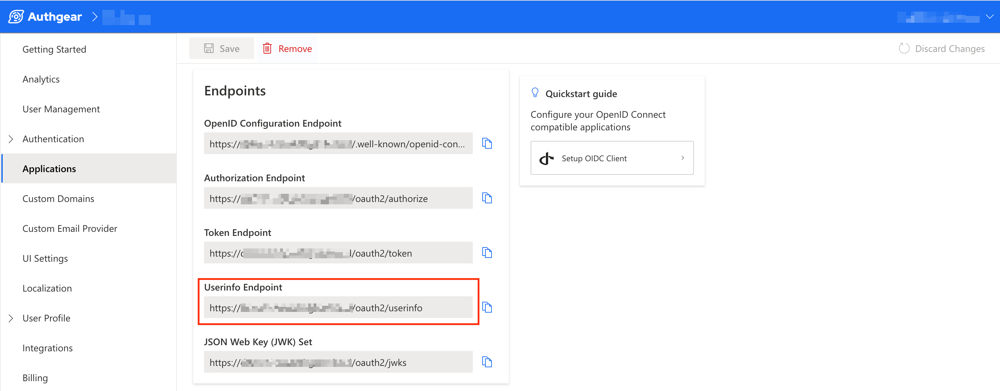

# UserInfo

Authgear provides a UserInfo endpoint that your client application can send requests to for information about the current authenticated user. The current user is the owner of the access token included in your request to the UserInfo endpoint.

The following is the path for the UserInfo endpoint:

```
/oauth2/userinfo
```

An example of a full URL for this endpoint looks like this: `https://your-project.authgear.cloud/oauth2/userinfo`. Replace the "**your-project.authgear.cloud**" part with the correct hostname for your Authgear project.

You can also find the full URL for the UserInfo endpoint for your Authgear OIDC Client Application under **Application** > **\[your application]** in Authgear Portal.

<figure><figcaption></figcaption></figure>

If you're using any of the Authgear SDKs, you can request the data from the UserInfo endpoint just by calling a method. For example, in the JavaScript Authgear SDK, the `fetchUserInfo()` method returns information about the current user. You can learn more about other SDKs [here](https://docs.authgear.com/get-started/native-mobile-app).

The following code shows an example of the structure and some information that's usually in the JSON response of the UserInfo endpoint.

```json
{
    "custom_attributes": {},
    "email": "user@gmail.com",
    "email_verified": true,
    "family_name": "John",
    "gender": "male",
    "given_name": "Doe",
    "phone_number": "0805551112";
    "phone_number_verified": true;
    "https://authgear.com/claims/user/can_reauthenticate": true,
    "https://authgear.com/claims/user/is_anonymous": false,
    "https://authgear.com/claims/user/is_verified": true,
    "sub": "e3079029-f123-4a56-78b9-c0de12f3a4af",
    "updated_at": 1694947082,
    "x_web3": {
        "accounts": []
    }
}
```

The endpoint can return both standard attributes defined by Authgear and custom attributes defined by you for your application.

The following section explains each standard attribute and examples of some custom attributes you can define.

### Standard Attributes

* `email`: the email address associated with the current user account.
* `email_verified`: contains a boolean value that represents the current status of the user's email verification.
* `family_name`: family name of the current user.
* `given_name`: givenname of the current user.
* `gender`: holds the value set for the current users' gender (male, female, or some other string).
* `sub`: sub is short for "subject" and it is a standard field in O. The value is the user's unique ID generated by Authgear. You can use this user ID to generate a [user node ID](https://docs.authgear.com/reference/apis/admin-api/node-id#1.-generate-id-for-user-node-type) which you can then use in **Admin API** to query a user or perform mutations.
* `https://authgear.com/claims/user/can_reauthenticate`: this field contains a boolean value that is `true` if this user can perform reauthentication and `false` if they can't.
* `https://authgear.com/claims/user/is_anonymous`: returns `true` if the current user is an anonymous user.
* `https://authgear.com/claims/user/is_verified`: this field contains a boolean value that's `true` if the current user has verified their email and `false` if they have not.
* `phone_number`: a phone number associated with the current user's account.
* `phone_number_verified`: returns `true` if the associated phone number is verified and `false` if it's not.
* `picture`: contains the URL to the user's profile photo.
* `updated_at`: returns the date and time for the last time the user's profile was updated.
* `custom_attributes`: this field contains an object that has all the custom attributes you defined.
* `x_web3`: **Deprecated** - this field contains an object that has details related to deprecated web3 support.

**Note**: The above list is not an exhaustive list of all the fields that the UserInfo endpoint can return. Also, fields that are not defined for the current user will be excluded from the response. For example, if a user does not have any phone number associated with their account, the `phone_number` field will not be included in the JSON response.

### Custom Attributes

Your custom attributes are included inside an object in the `custom_attributes` field in the JSON response as described in the previous section.

You can set custom attributes from **User Profile** > **Custom Attributes** in the Authgear Portal.

If we add a new customer attribute for `passport_number`, the response from the UserInfo endpoint will look like this:

```json
{
    "custom_attributes": {
        "passport_number": "A123456"
    },
    "email": "user@gmail.com",
    "email_verified": true,
    "family_name": "John",
    "gender": "male",
    "given_name": "Doe"
}
```
