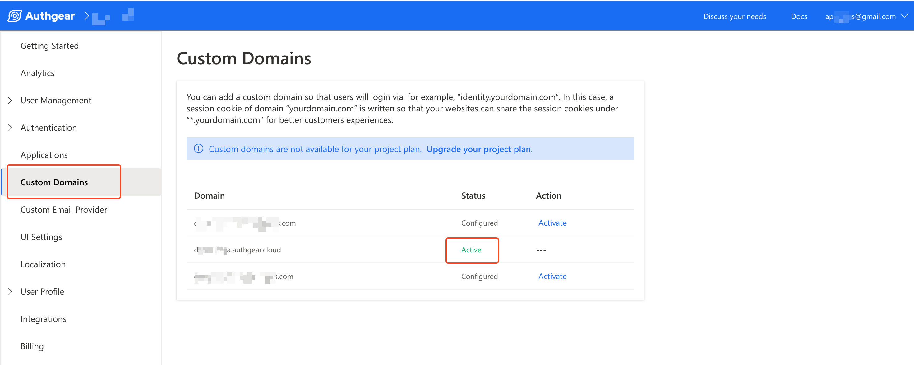

# Glossary

This glossary provides definitions for technical terms and abbreviations to make it easier to understand concepts and work with Authgear.

We've arranged the glossary terms and abbreviations in alphabetical order on the left side. Select any term to see the full definition and explanation.&#x20;

### Access token

An access token is a credential that a client application can use to access a user's account and resources on Authgear. The user needs to first grant a client authorization to their account before the client can request an access token.

Authgear also uses access token to protect resources on the backend server. As a result, HTTP requests to the backend server must contain a valid access token.

### Admin API

The Admin API provides a GraphQL interface for developers to interact with services and data on Authgear from their own code or custom application.&#x20;

You can also access Inspect the GraphQL schema and build queries and mutations with GraphiQL in the Authgear portal.

### Anonymous Users

Anonymous users are users that do not have any identity (e.g. email or phone number) attached to their account. However, they can be later promoted to normal users.

This concept makes it possible to create a temporary account for guests on your website or application so that they can access features before they sign up using their email or phone number. When you promote an anonymous user, the value of their `sub` remains the same and as a result you can easily link their previous activities after they sign up.

### Auth UI

By default, Authgear provides a customizable User Interface (UI) for login, user registration, and profile settings pages for your project. These pages make up what is referred to as Auth UI.

### Authentication

Authentication simply means the process of verifying the identity of a user on your application. Authgear supports different methods for authentication including email and password, mobile and passwordless.

### Authorization

Authorization is the process of granting or denying access to resources based on the identity of a user. For example, a user may grant a client application authorization to their info on Authgear, this authorization may not be used to access another user's data.

### Authorization code

This is a code issued by an authorization server that a client application can exchange for an access token. In the OAuth 2.0 flow, the authorization server sends this authorization code to the client via the redirect URI after the user grants the client authorization.

### Authorized Redirect URIs

These are basically URLs that point to valid pages on the client's application that users are redirected to during the authorization flow. Usually, this is the page where you implement the code that gets the value of the authorization code from the URL parameter and initiates the process of exchanging the authorization code for an access token.

In Authgear, you can also set the page to redirect anonymous users after promotion in the Authorized Redirect URIs for your project.

### Biometric authentication

Biometric authentication allows you to authenticate users on your application using biometric attributes such as fingerprint and face scan. This feature is only available on Android 6.0+ and iOS 11.3+.

### Blocking events

Blocking events are events that are triggered before an operation such as user creation and the block of the operation from completion until the associated hook returns a JSON with `is_allowed` set to `true`.

Examples of blocking events Authgear supports include: `user.pre_create`, `user.profile.pre_update`, `user.pre_schedule_deletion`, and `oidc.jwt.pre_create`.

### Claims

Claims contain details that can be used to identify a user or application. They are typically included in the authentication tokens such as JWT and can contain details like username, scope, and role.

See [this post](https://docs.authgear.com/how-to-guide/integration/add-custom-fields-to-a-jwt-access-token) for instructions on how to add custom fields (details) to Authgear's JWT access token to meet your specific needs.&#x20;

### Client ID

This is a unique string that is used to identify your Authgear application when sending requests from your client application.

### Client Secret

The client secret is a confidential string sent together with the client ID as credentials for authenticating your client application on Authugear's server.

### Custom Attributes

Custom Attributes allow you to add extra fields to the user attributes. Custom attributes can help capture extra data that isn't already included in the standard attribute.

### Groups

Groups is an access management feature in Authgear that makes it possible to create one or more groups, add [roles](glossary.md#roles) to the groups, and add users to the groups.

If a user is in a group, all the roles for that group are returned for their profile. See our [roles and group documentation](../admin/user-management/manage-users-roles-and-groups.md) to learn more about using groups.

### JWT

JWT stands for JSON Web Token. JWTs are self-contained and can be securely used to share authentication and authorization information between a server and a client.

### JavaScript / TypeScript Hooks

JavaScript / TypeScript hooks is a feature on the Authgear portal that allows you to write custom JavaScript / TypeScript code that will run when a specific event is triggered. This works very similar to traditional webhooks except from the fact that it eliminates the need to host your script on an external server.

### Magic link

Magic link, also known as email link is a type of user authentication method that uses a unique login link that's sent to a user's email instead of a traditional password.

### Multi-factor authentication (MFA)

Multi-factor authentication or short MFA is an application security measure that requires users to provide two or more factors to verify that it's them actually trying to access their account. For example, when an application requires a user to enter their password (something they know) and an OTP sent to their phone (something they have).

### Non-Blocking Events

Non-blocking events are hooks events that don't block the operations that trigger them. In fact, non-blocking events are triggered after the operations that trigger them are complete and your hook must finish within 60 seconds to avoid timeout.

### OAuth

OAuth is an open authorization standard that makes it possible for users to securely grant third-party applications access to their profile and data without requiring their password.

Authgear supports the OAuth 2.0 standard and you can use it to access your user's data from your custom application.

### OpenID Connect (OIDC)

OpenID Connect (OIDC) is an authentication protocol based on the OAuth 2.0 standard. It makes it possible for applications to verify the identity of a user using data from an authorization provider.&#x20;

You can use Authgear as an OpenID Connect provider to enable user authentication on your application without having to store or manage user passwords on your application.&#x20;

### Passkey

The use of passkeys is a modern method of passwordless login. When using passkeys, the user's browser or operating system helps them select the current passkey associated with their account on a website or application. Passkey verifies the user using biometrics or PIN on their device and can replace traditional OTP or biometric login.

### Passwordless

This includes login methods that use a one-time code or link to verify the identity of a user instead of a traditional password.

### Project

Your Authgear project is a container that holds all the configuration and data associated with your implementation of Authgear. You can create multiple projects for multiple implementations to separate their configuration and data. Each project has a unique URL that you can use to interact with it.

### Reauthentication

Reauthentication is the process of verifying the identity of a user that's already authenticated before they can perform sensitive operations. This process can help improve security by making sure a user doesn't perform sensitive operations with old grants that might have been compromised.

### Refresh token

A refresh token is a special token that can be used to obtain a new access token without having to re-authenticate a user.

### Roles

Roles can be used to control access to certain parts of an application or API that's powered by Authgear.  Roles are returned using the `https://authgear.com/claims/user/roles` attribute in Authgear's JWT access token and [UserInfo](apis/oauth-2.0-and-openid-connect-oidc/userinfo.md) as an array.&#x20;

The following is an example of how you can use roles. In a blog application with two roles (`admin` and `reader`), you can restrict access for editing and adding new posts to only users with the `admin` role. Check out our documentation on [roles and groups](../admin/user-management/manage-users-roles-and-groups.md) to learn more about managing roles in Authgear.

### SDK

SDK stands for Software Development Kit. It is basically a set of tools and code that developers can use to build and debug their own applications for a target platform. Authgear provides SDKs for adding Authentication to your own application using popular languages, frameworks, and platforms like [JavaScript/React-native](https://github.com/authgear/authgear-sdk-js), [Android](https://github.com/authgear/authgear-sdk-android), [iOS](https://github.com/authgear/authgear-sdk-ios), [Flutter](https://github.com/authgear/authgear-sdk-flutter), and [Xamarin](https://github.com/authgear/authgear-sdk-xamarin).

### Single sign-on (SSO)

Single sign-on or short SSO is an authentication method that allows users to log in once and access multiple application applications without re-authentication.

In Authgear you can enable SSO for multiple applications that use the same Authgear project.

### Social login

Authgear simplifies the process of allowing your users to sign in to your application using their existing accounts on popular social media sites like Facebook, Google, LinkedIn, Github, and Apple.

You can enable this feature from **Authentication** > **Social / Enterprise Login** in the Authgear Portal.

### Standard Attributes

Standard Attributes consist of common user attributes such as email, phone number, name, gender, and birthday. Authgear determines the fields in Standard Attributes. You can view a full list of standard attributes under **User Profile** > **Standard Attributes**.

### TOTP

TOTP is short for Time-based One-time Password. This is a method of two-factor authentication (2FA) that requires the user to enter a time-based single-use code that's generated using a mobile app like Google Authenticator or Authy.

The user will first need to register their device on the service they wish to log in to by scanning a QR code or typing a secret key from the service.

### User Anonymization

User anonymization is the process of deleting the identity and all other data of a normal user and demoting them to an anonymous user. When you anonymize a user, only the user ID is kept.

You can anonymize a user immediately or schedule their anonymization.

### User Deletion

User delete is the process of completely deleting a user's account account and all their associated data. This can be scheduled or done immediately.

### User Settings

This is one of the default pages Authgear provides as part of Auth UI. On this page, your users can view their account details and settings.

### UserInfo Endpoint

The UserInfo endpoint is an HTTP endpoint in your Authgear application that your client application can send requests to on behalf of an authenticated user for their account information. This endpoint returns a JSON response with data such as the user's `email`, and `sub`.

### Webhooks

A webhook is a method of sending notifications of events on one web application to another web application.

Authgear webhooks can send HTTP POST requests to a URL you specify when an event like new user creation is triggered. The HTTP request contains a payload with data related to the event. Using webhooks you can implement more custom features for your Authgear project.

### Your Authgear Endpoint

Your Authgear endpoint or project endpoint is the active domain name that points to your Authgear project. Your Authgear endpoint has many uses. For example, you'll need it to connect a client application to your Authgear project or redirect users to your login and sign-up page.

The easiest way to find out what your Authgear endpoint is is to navigate to **Custom Domains** in the Authgear Portal. Your endpoint is the domain in the row with a green **Active** status.

<figure><figcaption></figcaption></figure>

