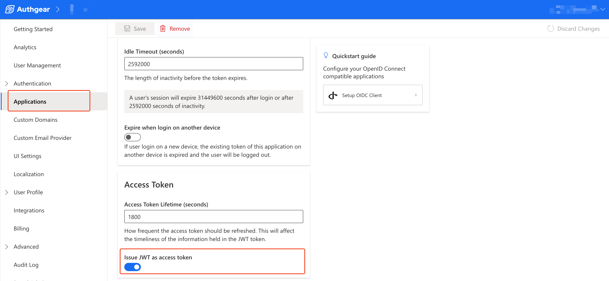

# JWT Access Token

You can enable the issuing of JWT as an access token in the configuration page of your Application in the Authgear Portal.&#x20;

<figure><figcaption></figcaption></figure>

This JWT contains several claims that describe your user and your application. The JWT access token that Authgear generates contains claims that are designed specifically for Authgear. Also, it may or may not include some standard JWT claims by default.

In this section, we'll list all the claims in the JWT access token by default and explain each claim.

The following code shows an example of the claims in a JWT access token from Authgear:

```json
{
  "aud": [
    "https://my-project.authgear.cloud"
  ],
  "client_id": "497d841ea22f33d3",
  "exp": 1696432809,
  "https://authgear.com/claims/user/can_reauthenticate": true,
  "https://authgear.com/claims/user/is_anonymous": false,
  "https://authgear.com/claims/user/is_verified": true,
  "iat": 1696431009,
  "iss": "https://my-project.authgear.cloud",
  "jti": "820a487ac1ce118cade7e8eca68e68a9288cf312343b83a5678f8bfd091b4768",
  "sub": "e3079029-f123-4c56-80c1-c2cd63a5b6af"
}
```

* `aud`: the aud claim stands for "audience" and its value specifies the recipient of the JWT - [RFC 7519](https://www.rfc-editor.org/rfc/rfc7519.html#section-4.1.3). In Authgear, the value for `aud` is the endpoint for your Authgear project. E.g. `https://my-project.authgear.cloud`. However, in ID Token, the value for `aud` is the client ID.
* `client_id`: this claim contains the client ID for your Authgear application. This is helpful when the `aud` claim contains your project's endpoint.
* `exp`: exp claim stands for expiration. The value in this claim defines the time on or after which the token should expire and not be accepted for any processing - [RFC 7519](https://www.rfc-editor.org/rfc/rfc7519.html#section-4.1.4).
* `https://authgear.com/claims/user/can_reauthenticate`: this claim returns true if a user can [re-authenticate](https://docs.authgear.com/how-to-guide/authenticate/reauthentication) and false if they can't. For example, a user with only Google sign-in can not re-authenticate while a user with a password can re-authenticate. This claim can help developers check before they call `reauthenticate()` in Authgear SDK.
* `https://authgear.com/claims/user/is_anonymous`: this claim tells that a user is an anonymous user when the value is `true`. You can [anonymize a user](https://docs.authgear.com/how-to-guide/authenticate/anonymous-users) from the Authgear Portal.
* `https://authgear.com/claims/user/is_verified`: the value for this claim is a boolean that tells if the user is considered verified or not. You can configure the condition of such consideration in Authgear portal. If your project has both email and phone enabled, you can see this settings in **Authentication** > **Login Methods** > **Verification** > **Configure how a user should be verified** > **isVerified is true when...**
* `iat`: iat stands for "issued at". The value of the `iat` claim is the time the JWT was issued - [RFC 7519](https://www.rfc-editor.org/rfc/rfc7519.html#section-4.1.6).
* `iss`: iss stands for issuer. This claim identifies the principal that issued the JWT - [RFC 7519](https://www.rfc-editor.org/rfc/rfc7519.html#section-4.1.1). For Authgear, the value of the `iss` claim is the endpoint of your project.
* `jti`: jti stands for "JWT ID". It is a unique identifier for the JWT access token - [RFC 7519](https://www.rfc-editor.org/rfc/rfc7519.html#section-4.1.7).
* `sub`: sub is short for "subject" and it is a standard field in OIDC. The value is the user's unique ID generated by Authgear. You can use this user ID to generate a [user node ID](https://docs.authgear.com/reference/apis/admin-api/node-id#1.-generate-id-for-user-node-type) which you can then use in **Admin API** to query a user or perform mutations.

### Adding Custom Claims

In addition to the above claims, you can add extra claims such as a user's **name** and **email** to the JWT access token using JavaScript Hook.

For a more detailed step, see this post on [how to add custom fields to JWT access token](https://docs.authgear.com/how-to-guide/integration/add-custom-fields-to-a-jwt-access-token).

