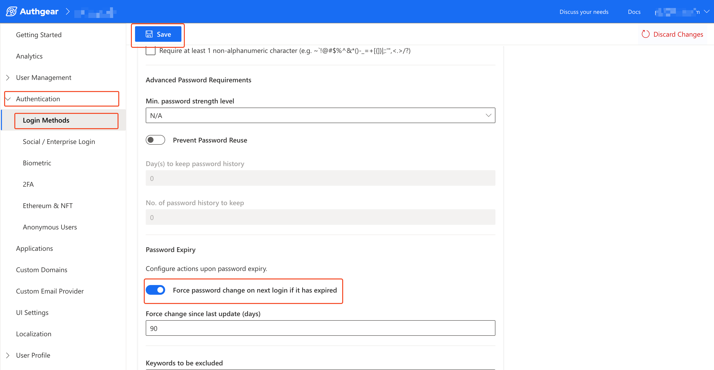

# Set Password Expiry

You can set up your Authgear project such that a user's password expires after a specific number of days. When a user logs in after the password expiry date, they'll see a prompt to change their password before they're redirected back to your app.&#x20;


By default, password expiry is turned off for your Authgear project. [Recent security research](https://www.ncsc.gov.uk/blog-post/problems-forcing-regular-password-expiry) shows that forcing users to change their password after some time can do more harm than good.


In this post, you'll learn how to set the Password Expiry feature in the Authgear Portal.

### Step 1: Enable Password Expiry

To enable password expiry, first, log into the Authgear portal, select your project then navigate to **Authentication** > **Login Methods**. Next, select a Login method that supports password, then switch to the **Passwords** tab and scroll to the **Password Expiry** section. Toggle the "**Force password change on next login if it has expired"** button to enable password expiry.

<figure><figcaption>
authgear portal password expiry
</figcaption></figure>

### &#x20;Step 2: Set Expiry Date

You can use the text field labeled **Force change since last update (days)** to specify the number after which a user's password should expire. The value should be the number of days in the future from the last date the user set or updated their password. For example, setting the value to 90 means the user's password will expire 90 days later from the last date they set or updated their password.

Once you're done, click on the **Save** button at the top of the page to keep your changes.
