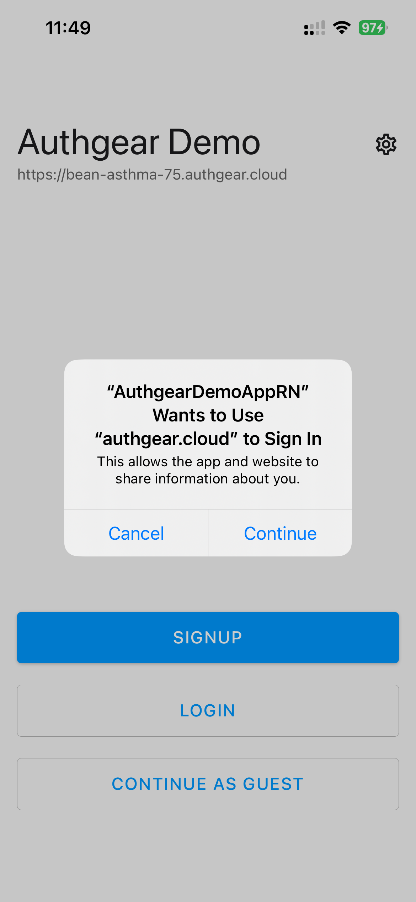

# SSO with Mobile App / Web SPA

If you are building token-based websites or mobile apps, you can enable the SSO feature via the SDK.

When SSO-enabled is ON, the end-user will need to enter their authentication credentials when they login to the first app. Later on, when they login to the second app, they will see a **continue screen** so that they can log in with just a click, without authenticating themselves again.


It is important that when the SSO feature is ON, don't set the `prompt` parameter when authenticating (e.g. `prompt=login`), it will force to show the login screen.


When the end-user logout the SSO-enabled app, all the apps will be logged out at the same time.

You can turn on this feature when you configure the SDK by setting the **is sso enabled** option to `true`.



```typescript
authgear.configure({
    clientID: CLIENT_ID,
    endpoint: ENDPOINT,
    sessionType: "refresh_token",
    isSSOEnabled: true,
});
```



```typescript
authgear.configure({
    clientID: CLIENT_ID,
    endpoint: ENDPOINT,
    isSSOEnabled: true,
});
```



```dart
final authgear = Authgear(
    clientID: CLIENT_ID,
    endpoint: ENDPOINT,
    isSsoEnabled: true,
);
```



```csharp
var authgearOptions = new AuthgearOptions
{
    ClientId = CLIENT_ID,
    AuthgearEndpoint = ENDPOINT,
    IsSsoEnabled = true,
};
// Android
#if __ANDROID__
var authgear = new AuthgearSdk(GetActivity().ApplicationContext, authgearOptions);
#else
#if __IOS__
var authgear = new AuthgearSdk(UIKit.UIApplication.SharedApplication, authgearOptions);
#endif
#endif
```



```swift
Authgear(
    clientId: CLIENT_ID,
    endpoint: ENDPOINT,
    isSSOEnabled: true,
)
```



```java
new Authgear(
    getApplication(),
    CLIENT_ID,
    ENDPOINT,
    new PersistentTokenStorage(getApplication()),
    true // isSsoEnabled = true
);
```



These type of SSO requires sharing the cookies between mobile apps and the system browsers on mobile, hence underlying it use `ASWebAuthenticationSession` on iOS and `Custom Tab` on Android, which will show a popup box like this:

<figure><figcaption></figcaption></figure>

If you want to avoid the said popup box, you will need to use `WKWebView` on iOS and `WebKitWebView` on Android for `UIImplementation` instead; And use [App2App Login](app2app-authorization.md) for sharing login session between mobile apps, and [Pre-authenticated URLs](pre-authenticated-urls.md) between mobile and web instead.
