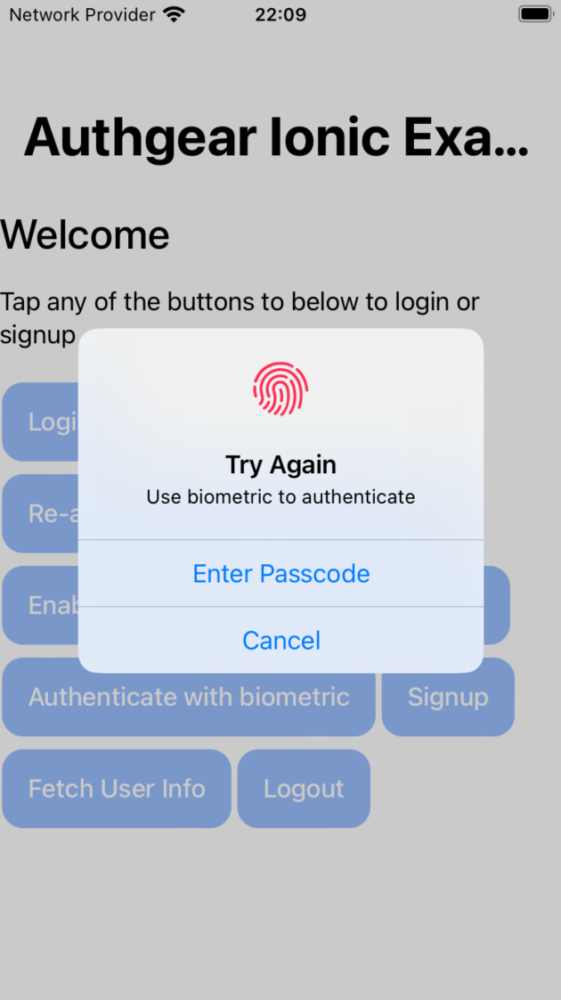
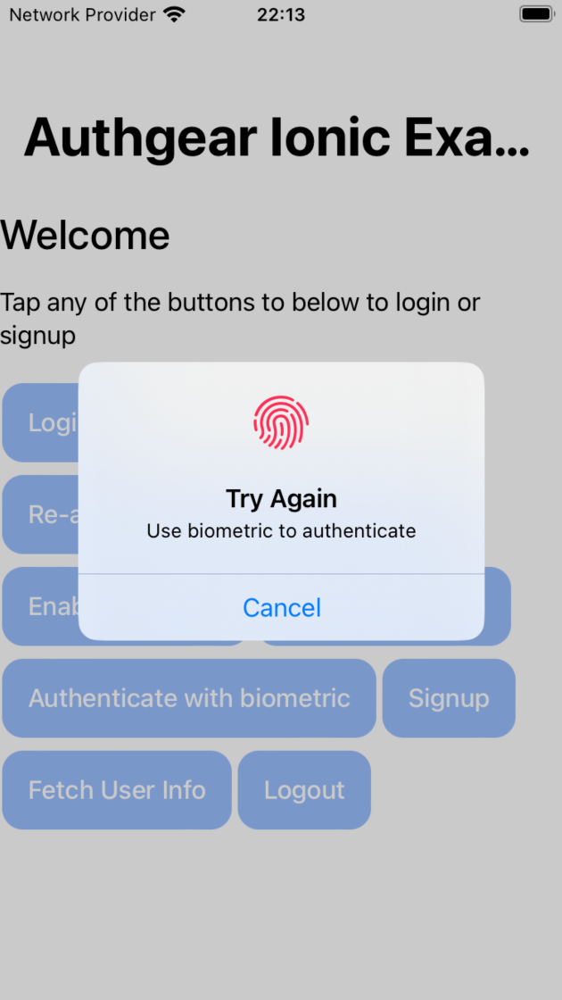

# Add Biometric Login

## Overview


Biometric login is supported for the following operating systems:

* iOS 11.3 or higher
* Android 6.0 (API 23) or higher


Authgear supports enabling biometric login in the native mobile application. You will need to

1. Enable biometric login in your application via the portal.
2. In the mobile app, use the mobile SDK to enable biometric login for your users.

A pair of cryptographic keys will be generated upon registering biometric login. The private key will be stored securely in the device (using Keystore in Android and Keychain in iOS), while the public key is stored in the Authgear server. To authenticate the user, fingerprint or face is presented to unlock the private key, and a digital signed message is sent to the server to proof the authenticity of the user.

**Fig 1.0. The following figure shows the sequence for enabling Biometric Login on a supported device:**

<figure><figcaption><p>Enable Biometric Login</p></figcaption></figure>

The Client App that is already logged in to a user's account will check if biometrics is supported by the user's device. If the device supports biometric login, it is then enabled. The public key is sent to Authgear server and associated with the logged-in user's account.

The flow is then completed and biometric login is enabled for the user on the Client App.

**Fig 2.0. The following figure shows the sequence for a user logging in with Biometric:**

<figure><figcaption><p>Logging in with Biometric</p></figcaption></figure>

With biometric login already enabled for the user, the next time they need to log in they can initiate a biometric authentication flow which will follow the sequence shown in Fig 2.0 above. Once the biometric login is successful, Authgear server will return an access token and a refresh token. The client application can then use the access token to make authenticated requests.

Sounds overwhelming? Authgear's magic handles all these for you. Follow this guide to enable biometric login with a few lines of code in your app.

## Enable biometric authentication for your project

1. In the portal, go to **Authentication > Biometric**.
2. Turn on **Enable biometric authentication**.
3. **Save** the settings.

## Set reasonably short token lifetimes for client applications

Biometric login is usually used when you want the user to re-login after a relatively short period of time. For sensitive applications such as financial apps, it's _**recommended**_ to use a short refresh token lifetime and a short idle timeout.

1. In the Authgear Portal, go to **Applications**
2. Select the client application that represent the integration with the mobile app
3. Set a short **Refresh Token Lifetime** to say 3,600 seconds (1 hour)
4. Enable **Expire after idling**
5. Set a short **Idle Timeout**, to say 1,800 seconds (30 minutes)

By doing so, the end-user's session will be expired 1 hour after their login, or after 30 minutes of inactivity. The end-user will need to authenticate themself again with biometric, even if the app process has not yet been killed.

## Configure SDK so users must re-login after app closed

Apart from the short token lifetimes, it's also common for sensitive apps to ask the user to re-login by biometric after the app process is killed and relaunched.

The SDK should be configured to use TransientTokenStorage so the tokens are stored in memory, and will be cleared when the app is closed. So the end-users must authenticate with biometrics again.




```swift
let authgear = Authgear(
    clientId: "{your_client_id}", 
    endpoint: "{your_app_endpoint}",
    tokenStorage: TransientTokenStorage())
authgear.configure() { result in
    switch result {
    case .success():
        // configured successfully
    case let .failure(error):
        // failed to configured
    }
}
```




```kotlin
public class MyAwesomeApplication extends Application {
    // The client ID of the oauth client.
    private static final String CLIENT_ID = "a_random_generated_string"
    // Deployed authgear's endpoint
    private static final String AUTHGEAR_ENDPOINT = "http://<myapp>.authgear.cloud/"
    private Authgear mAuthgear;
    public void onCreate() {
        super.onCreate();
        mAuthgear = new Authgear(this, CLIENT_ID, AUTHGEAR_ENDPOINT, new TransientTokenStorage());
        mAuthgear.configure(new OnConfigureListener() {
            @Override
            public void onConfigured() {
                // Authgear can be used.
            }

            @Override
            public void onConfigurationFailed(@NonNull Throwable throwable) {
                Log.d(TAG, throwable.toString());
                // Something went wrong, check the client ID or endpoint.
            }
        });
    }

    public Authgear getAuthgear() {
        return mAuthgear;
    }
}
```



```javascript
import React, { useCallback } from "react";
import { View, Button } from "react-native";
import authgear, { TransientTokenStorage } from "@authgear/react-native";

function LoginScreen() {
  const onPress = useCallback(() => {
    // Normally you should only configure once when the app launches.
    authgear
      .configure({
        clientID: "client_id",
        endpoint: "http://<myapp>.authgear.cloud",
        tokenStorage: new TransientTokenStorage()
      })
      .then(() => {
        authgear
          .authenticate({
            redirectURI: "com.myapp.example://host/path",
          })
          .then(({ userInfo }) => {
            console.log(userInfo);
          });
      });
  }, []);

  return (
    <View>
      <Button onPress={onPress} title="Authenticate" />
    </View>
  );
}
```



```dart
Future<void> _init() async {
    _authgear = Authgear(
        endpoint: "ENDPOINT", 
        clientID: "CLIENT_ID", 
        tokenStorage: TransientTokenStorage()
    );
    await _authgear.configure();
}
```



```typescript
import authgearCapacitor, { TransientTokenStorage, CancelError as CapacitorCancelError } from "@authgear/capacitor";
import authgearWeb, { SessionState, UserInfo, CancelError as WebCancelError } from "@authgear/web";
import { Capacitor } from "@capacitor/core";
import { useCallback, useState } from "react";

function isPlatformWeb(): boolean {
    return Capacitor.getPlatform() === "web";
}

const CLIENT_ID = "client_id";
const ENDPOINT = "http://<myapp>.authgear.cloud";

function AuthenticationScreen() {

    const [isAlertOpen, setIsAlertOpen] = useState(false);
    const [alertHeader, setAlertHeader] = useState("");
    const [alertMessage, setAlertMessage] = useState("");
    const [loading, setLoading] = useState(false);
    const [initialized, setInitialized] = useState(false);

    const [sessionState, setSessionState] = useState<SessionState | null>(() => {
        if (isPlatformWeb()) {
            return authgearWeb.sessionState;
        }
        return authgearCapacitor.sessionState;
    });

    const showError = useCallback((e: any) => {
        const json = JSON.parse(JSON.stringify(e));
        json["constructor.name"] = e?.constructor?.name;
        json["message"] = e?.message;
        let message = JSON.stringify(json);

        if (e instanceof WebCancelError || e instanceof CapacitorCancelError) {
            // Cancel is not an error actually.
            return;
        }

        setIsAlertOpen(true);
        setAlertHeader("Error");
        setAlertMessage(message);
    }, []);

    const postConfigure = useCallback(async () => {
        const sessionState = isPlatformWeb()
            ? authgearWeb.sessionState
            : authgearCapacitor.sessionState;
        if (sessionState !== "AUTHENTICATED") {
            setInitialized(true);
            return;
        }

        if (isPlatformWeb()) {
            await authgearWeb.fetchUserInfo();
        } else {
            await authgearCapacitor.fetchUserInfo();
        }

        setInitialized(true);
    }, []);

    const configure = useCallback(async () => {
        setLoading(true);
        try {

            if (isPlatformWeb()) {
                await authgearWeb.configure({
                    clientID: CLIENT_ID,
                    endpoint: ENDPOINT,
                    sessionType: "refresh_token",
                    isSSOEnabled: false,
                });
            } else {
                await authgearCapacitor.configure({
                    clientID: CLIENT_ID,
                    endpoint: ENDPOINT,
                    tokenStorage: new TransientTokenStorage()
                });

            }
            await postConfigure();
        } catch (e) {
            showError(e);
        } finally {
            setLoading(false);
        }
    }, [
        CLIENT_ID,
        ENDPOINT
    ]);
}
```



```csharp
using System;

using Android.App;
using Android.Content.PM;
using Android.Runtime;
using Android.OS;

using Xamarin.Forms;
using Authgear.Xamarin;

namespace MyApp.Droid
{
    public class MainActivity : global::Xamarin.Forms.Platform.Android.FormsAppCompatActivity
    {
        protected override void OnCreate(Bundle savedInstanceState)
        {
            // ...

            var authgear = new AuthgearSdk(this, new AuthgearOptions
            {
                ClientId = CLIENT_ID,
                AuthgearEndpoint = ENDPOINT,
                TokenStorage = new TransientTokenStorage()
            });
            DependencyService.RegisterSingleton<AuthgearSdk>(authgear);
            LoadApplication(new App());

            // ...
        }

        // other methods are omitted for brevity.
    }
}
```



## Enable biometric login in mobile SDK

In the following section, we will show you how to use biometric login in the SDK. In the SDK code snippet, `authgear` is referring to the configured Authgear container.

### Biometric options

In the SDKs, a set of biometric options is required to check the support or enable biometric on the device.

#### iOS

There are 3 options on iOS:

* `localizedReason`: The custom localized message to explain to the user why TouchID or FaceID is required.
* `policy` constrainst how the user is authenticated locally.&#x20;
  * `deviceOwnerAuthenticationWithBiometrics`: The user MUST use TouchID or FaceID. This also implies the device must have TouchID or FaceID already set up. See also [#error-handling](biometric.md#error-handling "mention")
  * `deviceOwnerAuthentication`: If the device has TouchID or FaceID set up, it is used first. Otherwise, the device passcode is used. This also implies the device must have a passcode. See also [#error-handling](biometric.md#error-handling "mention")
  * It refers to the `LAPolicy` enum on iOS, see [reference in Apple Developers Doc on these options](https://developer.apple.com/documentation/localauthentication/lapolicy).
* `constraint` is an enum that constraint the access of key stored under different conditions:
  * `BiometryCurrentSet`: The biometric login will be invalidated if the device has any changes to TouchID or FaceID. Changes include adding, or removing, re-enrolling any fingerprints or faces.
  * `biometryAny`: The biometric login stays valid even if the device has any changes to TouchID or FaceID.
  * `userPresence`: Either biometry or device passcode/PIN can be used to access the private key.
  * See [reference in Apple Developers Doc on these options](https://developer.apple.com/documentation/security/secaccesscontrolcreateflags).

In summary, based on the desired behavior and business requirements, set the policy and constraint options as below.

<table><thead><tr><th width="195.256103515625">Requirement</th><th width="359.66845703125">Policy</th><th>Constraint</th></tr></thead><tbody><tr><td>Sign in with any currently set biometry. Re-enrollment causes reset.</td><td><code>deviceOwnerAuthenticationWithBiometrics</code></td><td><code>BiometryCurrentSet</code></td></tr><tr><td>Sign in with any biometry. Re-enrollment does not cause reset.</td><td><code>deviceOwnerAuthenticationWithBiometrics</code></td><td><code>biometryAny</code></td></tr><tr><td>Sign in with either biometry, or device passcode</td><td><code>deviceOwnerAuthentication</code><br></td><td><code>userPresence</code></td></tr></tbody></table>

#### Android

There are 6 options on Android:

* `title` is the Title of the biometric dialog presented to the users
* `subtitle` is the subtitle of the biometric dialog presented to the users
* `description` is the description of the biometric dialog presented to the users
* `negativeButtonText` is what the dismiss button says in the biometric dialog
* `constraint` is an **array** that defines the requirement of security level, which can be `BIOMETRIC_STRONG`, `BIOMETRIC_WEAK`, `DEVICE_CREDENTIAL`. See reference in Android developers documentation on [`BiometricManager.Authenticators`](https://developer.android.com/reference/android/hardware/biometrics/BiometricManager.Authenticators)
* `invalidatedByBiometricEnrollment` is a boolean that controls if the key pair will be invalidated if a new biometric is enrolled, or when all existing biometrics are deleted. See reference in Android developers documentation on [`KeyGenParameterSpec.Builder`](https://developer.android.com/reference/android/security/keystore/KeyGenParameterSpec.Builder#setInvalidatedByBiometricEnrollment\(boolean\)).

In summary, based on the desired behavior and business requirements, set the policy and constraint options as below.

| Requirement                                                                             | Constraint                                                   |
| --------------------------------------------------------------------------------------- | ------------------------------------------------------------ |
| Any strong biometric exceed the requirements for Class 3 as defined by the Android CDD. | `[BIOMETRIC_STRONG]`                                         |
| Any biometric exceed the requirements for Class 2 as defined by the Android CDD.        | `[BIOMETRIC_WEAK, DEVICE_CREDENTIAL]`                        |
| Any biometric or non-biometric credentials (i.e., PIN, pattern, or password)            | `[BIOMETRIC_STRONG``, BIOMETRIC_WEA``K, DEVICE_CREDENTIAL]`  |

### Code examples

#### Check support

Always check if the current device supports biometric login before calling any biometric API, including before enabling biometric login and before using biometrics to login.



```swift
// check if current device supports biometric login
var supported = false
do {
    try authgear.checkBiometricSupported()
    supported = true
} catch {}

if supported {
    // biometric login is supported
}
```



```java
boolean supported = false;
try {
    // biometric login is supported SDK_INT >= 23 (Marshmallow)
    if (Build.VERSION.SDK_INT >= 23) {
        // check if current device supports biometric login
        authgear.checkBiometricSupported(
                this.getApplication(),
                ALLOWED
        );
        supported = true;
    }
} catch (Exception e) {}
if (supported) {
    // biometric login is supported
}
```



```javascript
// We will need the options for the other biometric api
const biometricOptions = {
  ios: {
    localizedReason: 'Use biometric to authenticate',
    constraint: 'biometryCurrentSet' as const,
  },
  android: {
    title: 'Biometric Authentication',
    subtitle: 'Biometric authentication',
    description: 'Use biometric to authenticate',
    negativeButtonText: 'Cancel',
    constraint: ['BIOMETRIC_STRONG' as const],
    invalidatedByBiometricEnrollment: true,
  },
};
// check if current device supports biometric login
authgear
    .checkBiometricSupported(biometricOptions)
    .then(() => {
        // biometric login is supported
    })
    .catch(() => {
        // biometric login is not supported
    });
```



```dart
// We will need the options for the other biometric api
final ios = BiometricOptionsIOS(
    localizedReason: "Use biometric to authenticate",
    constraint: BiometricAccessConstraintIOS.biometryAny,
);
final android = BiometricOptionsAndroid(
    title: "Biometric Authentication",
    subtitle: "Biometric authentication",
    description: "Use biometric to authenticate",
    negativeButtonText: "Cancel",
    constraint: [BiometricAccessConstraintAndroid.biometricStrong],
    invalidatedByBiometricEnrollment: false,
);

try {
    // check if current device supports biometric login
    await authgear.checkBiometricSupported(ios: ios, android: android);
    // biometric login is supported
} catch (e) {
    // biometric login is not supported
}
```



```typescript
const biometricOptions: BiometricOptions = {
  ios: {
    localizedReason: "Use biometric to authenticate",
    constraint: BiometricAccessConstraintIOS.BiometryCurrentSet,
    policy: BiometricLAPolicy.deviceOwnerAuthenticationWithBiometrics,
  },
  android: {
    title: "Biometric Authentication",
    subtitle: "Biometric authentication",
    description: "Use biometric to authenticate",
    negativeButtonText: "Cancel",
    constraint: [BiometricAccessConstraintAndroid.BiometricStrong],
    invalidatedByBiometricEnrollment: true,
  },
};

const updateBiometricState = useCallback(async () => {
    if (isPlatformWeb()) {
      return;
    }

    try {
      await authgearCapacitor.checkBiometricSupported(biometricOptions);
     //enable biometric...
    } catch (e) {
      console.error(e);
    }
  }, []);


```



```csharp
// We will need the options for the other biometric api
var ios = new BiometricOptionsIos
{
    LocalizedReason = "Use biometric to authenticate",
    AccessConstraint = BiometricAccessConstraintIos.BiometricAny,
};
var android = new BiometricOptionsAndroid
{
    Title = "Biometric Authentication",
    Subtitle = "Biometric authentication",
    Description = "Use biometric to authenticate",
    NegativeButtonText = "Cancel",
    AccessConstraint = BiometricAccessConstraintAndroid.BiometricOnly,
    InvalidatedByBiometricEnrollment = false,
};
var biometricOptions = new BiometricOptions
{
    Ios = ios, 
    Android = android
};
try
{
    // check if current device supports biometric login
    authgear.EnsureBiometricIsSupported(biometricOptions);
    // biometric login is supported
}
catch
{
    // biometric login is not supported
}
```



#### Enable biometric login

Enable biometric login for logged in user



```swift
// provide localizedReason for requesting authentication
// which displays in the authentication dialog presented to the user
authgear.enableBiometric(
    localizedReason: "REPLACE_WITH_LOCALIZED_REASON",
    constraint: .biometryCurrentSet
) { result in
    if case let .failure(error) = result {
        // failed to enable biometric with error
    } else {
        // enabled biometric successfully
    }
}
```



```java
// We will need the options for the other biometric api
BiometricOptions biometricOptions = new BiometricOptions(
    activity, // FragmentActivity
    "Biometric authentication", // title
    "Biometric authentication", // subtitle
    "Use biometric to authenticate", // description
    "Cancel", // negativeButtonText
    ALLOWED, // allowedAuthenticators
    true // invalidatedByBiometricEnrollment
);
authgear.enableBiometric(
    biometricOptions,
    new OnEnableBiometricListener() {
        @Override
        public void onEnabled() {
            // enabled biometric login successfully
        }

        @Override
        public void onFailed(Throwable throwable) {
            // failed to enable biometric with error
        }
    }
);
```



```javascript
authgear
    .enableBiometric(biometricOptions)
    .then(() => {
        // enabled biometric login successfully
    })
    .catch((err) => {
        // failed to enable biometric with error
    });
```



```dart
try {
    await authgear.enableBiometric(ios: ios, android: android);
    // enabled biometric login successfully
} catch (e) {
    // failed to enable biometric with error
}
```



```typescript
const enableBiometric = useCallback(async () => {
  setLoading(true);
  try {
    await authgearCapacitor.enableBiometric(biometricOptions);
  } catch (e: unknown) {
    showError(e);
  } finally {
    setLoading(false);
    await updateBiometricState();
  }
}, [showError, updateBiometricState]);

const onClickEnableBiometric = useCallback(
  (e: MouseEvent<HTMLIonButtonElement>) => {
    e.preventDefault();
    e.stopPropagation();

    enableBiometric();
  },
  [enableBiometric]
);
```



```csharp
try
{
    await authgear.EnableBiometricAsync(biometricOptions);
    // enabled biometric login successfully
}
catch
{
    // failed to enable biometric with error
}
```



#### Check if biometric has been enabled before

Before asking the user to log in with biometric, Check if biometric login has been enabled on the current device. I.e. Is the key pair exist on the device (Keystore in Android and Keychain in iOS).

This method will still return true even if all the fingerprint and facial data has been removed from the device. Before this method, you should use the "checkBiometricSupported" to check if biometry is supported in the device level.



```swift
var enabled = (try? authgear.isBiometricEnabled()) ?? false
```



```java
boolean enabled = false;
try {
    enabled = authgear.isBiometricEnabled();
} catch (Exception e) {}
```



```javascript
authgear
    .isBiometricEnabled()
    .then((enabled) => {
        // show if biometric login is enabled
    })
    .catch(() => {
        // failed to check the enabled status
    });
```



```dart
try {
    final enabled = await authgear.isBiometricEnabled();
    // show if biometric login is enabled
} catch (e) {
    // failed to check the enabled status
}
```



```typescript
try {
   const enabled = await authgearCapacitor.isBiometricEnabled();
} catch (e) {
      console.error(e);
}
```



```csharp
try
{
    var enabled = await authgear.GetIsBiometricEnabledAsync();
    // show if biometric login is enabled
}
catch
{
    // failed to check the enabled status
}
```



#### Login with biometric credentials

If biometric is supported and enabled, you can use the Authenticate Biometric method to log the user in. If the key pair is invalidated due to changes in the biometry settings, e.g added fingerprint or re-enrolled face data, the `biometricPrivateKeyNotFound` will be thrown. You should handle the error by the Disable Biometric method, and ask the user to register biometric login again.



```swift
authgear.authenticateBiometric { result in
    switch result {
        case let .success(userInfo):
            let userInfo = userInfo
            // logged in successfully
        case let .failure(error):
            // failed to login
        }
}
```



```java
authgear.authenticateBiometric(
    biometricOptions,
    new OnAuthenticateBiometricListener() {
        @Override
        public void onAuthenticated(UserInfo userInfo) {
            // logged in successfully
        }

        @Override
        public void onAuthenticationFailed(Throwable throwable) {
            // failed to login
        }
    }
);
```



```javascript
authgear
    .authenticateBiometric(biometricOptions)
    .then(({userInfo}) => {
        // logged in successfully
    })
    .catch((e) => {
        // failed to login
    });
```



```dart
try {
    final userInfo = await authgear.authenticateBiometric(ios: ios, android: android);
    // logged in successfully
} catch (e) {
    // failed to login
}
```



```typescript
      const showUserInfo = useCallback((userInfo: UserInfo) => {
        const message = JSON.stringify(userInfo, null, 2);
        setIsAlertOpen(true);
        setAlertHeader("UserInfo");
        setAlertMessage(message);
      }, []);
      
      const authenticateBiometric = useCallback(async () => {
        setLoading(true);
        try {
          const { userInfo } = await authgearCapacitor.authenticateBiometric(
            biometricOptions
          );
          showUserInfo(userInfo);
        } catch (e: unknown) {
          showError(e);
        } finally {
          setLoading(false);
          await updateBiometricState();
        }
      }, [showError, showUserInfo, updateBiometricState]);
```



```csharp
try
{
    var userInfo = await authgear.AuthenticateBiometricAsync(biometricOptions);
    // logged in successfully
}
catch
{
    // failed to login
}
```



#### Disable biometric login on the current device



```swift
do {
    try authgear.disableBiometric()
    // disabled biometric login successfully
} catch {
    // failed to disable biometric login
}
```



```java
try {
    authgear.disableBiometric();
    // disabled biometric login successfully
} catch (Exception e) {
    // failed to disable biometric login
}
```



```javascript
authgear
    .disableBiometric()
    .then(() => {
        // disabled biometric login successfully
    })
    .catch((err) => {
        // failed to disable biometric login
    });
```



```dart
try {
    await authgear.disableBiometric();
    // disabled biometric login successfully
} catch (e) {
    // failed to disable biometric login
}
```



```typescript
  const disableBiometric = useCallback(async () => {
    setLoading(true);
    try {
      await authgearCapacitor.disableBiometric();
    } catch (e: unknown) {
      showError(e);
    } finally {
      setLoading(false);
      await updateBiometricState();
    }
  }, [showError, updateBiometricState]);
```



```csharp
try
{
    await authgear.DisableBiometricAsync();
    // disabled biometric login successfully
}
catch
{
    // failed to disable biometric login
}
```



#### Error handling

In all methods related to biometric, the SDK may throw the following errors that describe the status of the biometry enrollment or the key pair stored on the device.



```swift
if let authgearError = error as? AuthgearError {
    switch authgearError {
    case .cancel:
        // user cancel
    case .biometricPrivateKeyNotFound:
        // biometric info has changed. e.g. Touch ID or Face ID has changed.
        // user have to set up biometric authentication again
    case .biometricNotSupportedOrPermissionDenied:
        // user has denied the permission of using Face ID
    case .biometricNoPasscode:
        // device does not have passcode set up
    case .biometricNoEnrollment:
        // device does not have Face ID or Touch ID set up
    case .biometricLockout:
        // the biometric is locked out due to too many failed attempts
    default:
        // other error
        // you may consider showing a generic error message to the user
    }
}
```



```java
import com.oursky.authgear.BiometricLockoutException;
import com.oursky.authgear.BiometricNoEnrollmentException;
import com.oursky.authgear.BiometricNoPasscodeException;
import com.oursky.authgear.BiometricNotSupportedOrPermissionDeniedException;
import com.oursky.authgear.BiometricPrivateKeyNotFoundException;
import com.oursky.authgear.CancelException;


if (e instanceof CancelException) {
    // user cancel
} else if (e instanceof BiometricPrivateKeyNotFoundException) {
    // biometric info has changed
    // user have to set up biometric authentication again
} else if (e instanceof BiometricNoEnrollmentException) {
    // device does not have biometric set up
} else if (e instanceof BiometricNotSupportedOrPermissionDeniedException) {
    // biometric is not supported in the current device
    // or user has denied the permission of using biometric
} else if (e instanceof BiometricNoPasscodeException) {
    // device does not have unlock credential set up
} else if (e instanceof BiometricLockoutException) {
    // the biometric is locked out due to too many failed attempts
} else {
    // other error
    // you may consider showing a generic error message to the user
}
```



```javascript
import {
    CancelError,
    BiometricPrivateKeyNotFoundError,
    BiometricNotSupportedOrPermissionDeniedError,
    BiometricNoEnrollmentError,
    BiometricNoPasscodeError,
    BiometricLockoutError,
} from '@authgear/react-native'

if (e instanceof CancelError) {
    // user cancel
} else if (e instanceof BiometricPrivateKeyNotFoundError) {
    // biometric info has changed. e.g. Touch ID or Face ID has changed.
    // user have to set up biometric authentication again
} else if (e instanceof BiometricNoEnrollmentError) {
    // device does not have biometric set up
    // e.g. have not set up Face ID or Touch ID in the device
} else if (e instanceof BiometricNotSupportedOrPermissionDeniedError) {
    // biometric is not supported in the current device
    // or user has denied the permission of using Face ID
} else if (e instanceof BiometricNoPasscodeError) {
    // device does not have unlock credential or passcode set up
} else if (e instanceof BiometricLockoutError) {
    // the biometric is locked out due to too many failed attempts
} else {
    // other error
    // you may consider showing a generic error message to the user
}
```



```dart
try {
    // ...
} on CancelException catch (e) {
    // user cancel
} on BiometricPrivateKeyNotFoundException catch (e) {
    // biometric info has changed. e.g. Touch ID or Face ID has changed.
    // user have to set up biometric authentication again
} on BiometricNoEnrollmentException catch (e) {
    // device does not have biometric set up
    // e.g. have not set up Face ID or Touch ID in the device
} on BiometricNotSupportedOrPermissionDeniedException catch (e) {
    // biometric is not supported in the current device
    // or user has denied the permission of using Face ID
} on BiometricNoPasscodeException catch (e) {
    // device does not have unlock credential or passcode set up
} on BiometricLockoutException catch (e) {
    // the biometric is locked out due to too many failed attempts
} catch (e) {
    // other error
    // you may consider showing a generic error message to the user
}
```



```typescript
import {
    CancelError,
    BiometricPrivateKeyNotFoundError,
    BiometricNotSupportedOrPermissionDeniedError,
    BiometricNoEnrollmentError,
    BiometricNoPasscodeError,
    BiometricLockoutError,
} from '@authgear/capacitor'

if (e instanceof CancelError) {
    // user cancel
} else if (e instanceof BiometricPrivateKeyNotFoundError) {
    // biometric info has changed. e.g. Touch ID or Face ID has changed.
    // user have to set up biometric authentication again
} else if (e instanceof BiometricNoEnrollmentError) {
    // device does not have biometric set up
    // e.g. have not set up Face ID or Touch ID in the device
} else if (e instanceof BiometricNotSupportedOrPermissionDeniedError) {
    // biometric is not supported in the current device
    // or user has denied the permission of using Face ID
} else if (e instanceof BiometricNoPasscodeError) {
    // device does not have unlock credential or passcode set up
} else if (e instanceof BiometricLockoutError) {
    // the biometric is locked out due to too many failed attempts
} else {
    // other error
    // you may consider showing a generic error message to the user
}
```



```csharp
try 
{
    // ...
}
catch (OperationCanceledException ex)
{
    // user cancel
}
catch (BiometricPrivateKeyNotFoundException ex)
{
    // biometric info has changed. e.g. Touch ID or Face ID has changed.
    // user have to set up biometric authentication again
}
catch (BiometricNoEnrollmentException ex)
{
    // device does not have biometric set up
    // e.g. have not set up Face ID or Touch ID in the device
}
catch (BiometricNotSupportedOrPermissionDeniedException ex)
{
    // biometric is not supported in the current device
    // or user has denied the permission of using Face ID
}
catch (BiometricNoPasscodeException ex)
{
    // device does not have unlock credential or passcode set up
}
catch (BiometricLockoutException ex)
{
    // the biometric is locked out due to too many failed attempts
}
catch
{
    // other error
    // you may consider showing a generic error message to the user
}
```



## Biometric Verification Fallback Support

In some use cases, you may want to provide an alternative means for users to log in when biometric verification fails on their devices. For example, in a case where a user's finger is dirty (touch-based) or when the user's face is covered (Face ID).

### Use of Device PIN/Password

In the biometric options, the parameters **policy**: `BiometricLAPolicy.deviceOwnerAuthentication` (iOS) and **constraint** `BiometricAccessConstraintAndroid.DeviceCredential` (Android) can be used to allow users to enter their device PIN/Password when biometric verification fails.

You can set the policy for iOS and constraint for Android in the [Biometric options](biometric.md#biometric-options) of the Authgear SDK. The following is an example of a biometric options that allows users to use device's PIN/Password in iOS and Android:

```javascript
const biometricOptions: BiometricOptions = {
  ios: {
    localizedReason: "Use biometric to authenticate",
    constraint: BiometricAccessConstraintIOS.userPresence,
    policy: BiometricLAPolicy.deviceOwnerAuthentication,
  },
  android: {
    title: "Biometric Authentication",
    subtitle: "Biometric authentication",
    description: "Use biometric to authenticate",
    negativeButtonText: "Cancel",
    constraint: [
      BiometricAccessConstraintAndroid.BiometricStrong, 
      BiometricAccessConstraintAndroid.BiometricWeak,
      BiometricAccessConstraintAndroid.DeviceCredential],
    invalidatedByBiometricEnrollment: true,
  },
};
```

The biometric pop-up will look like this after a failed biometric log-in attempt with `BiometricLAPolicy.deviceOwnerAuthentication` policy on iOS:

<figure><figcaption></figcaption></figure>

With the `BiometricLAPolicy.deviceOwnerAuthenticationWithBiometrics` policy, the biometric login pop-up will not include the **Enter Passcode** button. An example is shown below:

<figure><figcaption></figcaption></figure>
