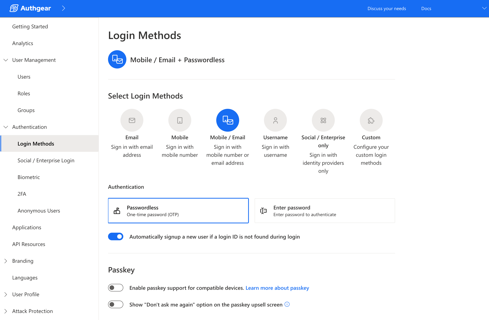

# Custom Authentication Flow

Authgear lets you define exactly how users sign up and log in. Instead of using the default UI, you can configure a custom authentication flow — a sequence of steps that controls which identifiers you accept, how you verify them, and how users authenticate.

Configure flows in the Authgear portal under **Portal > Advanced > Edit Config**, in the `authentication_flow` section of the YAML.

### Key concepts

Before reading the examples, here are the building blocks you'll see throughout the YAML:

| Term                         | What it does                                                                                                                  |
| ---------------------------- | ----------------------------------------------------------------------------------------------------------------------------- |
| `signup_flows`               | Defines steps for registering a new user                                                                                      |
| `login_flows`                | Defines steps for authenticating a returning user                                                                             |
| `signup_login_flows`         | A single flow that detects whether the user is new or returning, then routes to the appropriate `signup_flow` or `login_flow` |
| `type: identify`             | A step that asks the user for an identifier (email, phone, etc.)                                                              |
| `type: verify`               | A step that confirms the user owns the identifier (e.g. via OTP)                                                              |
| `type: authenticate`         | A step that authenticates the user with a registered credential                                                               |
| `type: create_authenticator` | A step that registers a new authenticator for the user                                                                        |
| `one_of`                     | Lists the allowed options for a step. Required even when there is only one option.                                            |
| `target_step`                | Links a `verify` or `create_authenticator` step back to the `identify` step that collected the credential                     |

***

### Prerequisites

The examples on this page use OTP-based passwordless authentication over email and SMS. Before adding the YAML config, enable the right login method in the portal:

1. Go to **Authentication > Login Methods**
2. Select **Mobile / Email**
3. Under **Authentication**, select **Passwordless**

If you use a different login method (e.g. password-based), the `primary_oob_otp_email` and `primary_oob_otp_sms` authenticators in the examples will not work — adjust the `authentication` values to match your chosen method.

<figure><figcaption></figcaption></figure>

### Example: Signup requiring both email and phone

By default, when both email and phone are enabled, users can choose one identifier to sign up with — not both. This example changes that: it requires users to provide and verify both an email address and a phone number during signup. After signup, they can log in with either.


```yaml
authentication_flow:
  signup_flows:
  - name: default
    steps:
    - name: setup_email
      type: identify
      one_of:
      - identification: email
        steps:
        - type: verify
          target_step: setup_email
        - type: create_authenticator
          name: authenticate_primary_email
          one_of:
          - authentication: primary_oob_otp_email
            target_step: setup_email
    - name: setup_phone
      type: identify
      one_of:
      - identification: phone
        steps:
        - type: verify
          target_step: setup_phone
        - type: create_authenticator
          name: authenticate_primary_phone
          one_of:
          - authentication: primary_oob_otp_sms
            target_step: setup_phone  
```


The signup flow has two sequential steps: `setup_email`, then `setup_phone`.

Each step collects one identifier and immediately verifies it with a one-time passcode. The `create_authenticator` step then registers that identifier as a login method, so the user can use it to log in later.

`target_step` is required here because the `verify` and `create_authenticator` steps are nested inside an `identify` step — they need to explicitly reference the parent step that collected the credential.


This config only defines a `signup_flow`. It does not include login steps. Disable **"Automatically sign up a new user if a login ID is not found during login"** in the portal, or returning users may trigger a signup instead of a login.


***

### Example: Combined signup and login, with both identifiers collected on signup

`signup_login_flows` handles new and returning users in one flow. The user enters an identifier (email or phone), and Authgear checks whether an account exists:

* Account found → routes to `login_flow`
* No account found → routes to `signup_flow`

This means your UI only needs one screen — no separate "Log in" and "Sign up" buttons required.

The example below combines this with the two-identifier requirement from the previous example. Users log in with whichever identifier they have. New users must verify both a phone number and an email during signup, so they can use either to log in in the future.

```yaml
authentication_flow:
  signup_login_flows:
  - name: default
    steps:
    - type: identify
      one_of:
      - identification: phone
        login_flow: default
        signup_flow: default
      - identification: email
        login_flow: default
        signup_flow: default

  login_flows:
  - name: default
    steps:
    - type: identify
      one_of:
      - identification: phone
        steps:
        - type: authenticate
          one_of:
          - authentication: primary_oob_otp_sms
      - identification: email
        steps:
        - type: authenticate
          one_of:
          - authentication: primary_oob_otp_email

  signup_flows:
  - name: default
    steps:
    - type: identify
      name: setup_id1
      one_of:
      - identification: phone
        steps:
        - type: verify
          target_step: setup_id1
        - type: identify
          name: setup_id2
          one_of:
          - identification: email
            steps:
            - type: verify
              target_step: setup_id2
      - identification: email
        steps:
        - type: verify
          target_step: setup_id1
        - type: identify
          name: setup_id3
          one_of:
          - identification: phone
            steps:
            - type: verify
              target_step: setup_id3
    - type: create_authenticator
      one_of:
      - authentication: primary_oob_otp_sms
      - authentication: primary_oob_otp_email
```

#### How each part works

**`signup_login_flows`**

The user picks an identifier — phone or email. Both options point to the same `login_flow: default` and `signup_flow: default`. Authgear looks up the identifier and routes the user automatically.

**`login_flows`**

For returning users. After identifying themselves, the user receives a one-time passcode — by SMS if they entered a phone number, or by email if they entered an email address.

**`signup_flows`**

For new users. The flow collects and verifies both identifiers, regardless of which one the user entered first.

* **User starts with phone** (`setup_id1: phone`): Authgear verifies the phone number, then asks for an email address (`setup_id2`) and verifies that too.
* **User starts with email** (`setup_id1: email`): Authgear verifies the email address, then asks for a phone number (`setup_id3`) and verifies that too.

Once both identifiers are verified, the `create_authenticator` step registers the OTP method the user will use to authenticate on future logins.


`setup_id2` and `setup_id3` are separate named steps because the second identifier collected depends on which one the user started with. Each path needs its own named step so `target_step` can reference the right one.



When using `signup_login_flows`, disable **"Automatically sign up a new user if a login ID is not found during login"** in the portal. That setting conflicts with the routing logic in `signup_login_flows`.


***

### Further reading

* [Overview of Authentication Flow API](../../customization/ui-customization/custom-ui/authentication-flow-api.md) — use the API to build a fully custom login UI
* [Authentication Flow API specification](../../api-reference/apis/authentication-flow-api.md) — full reference for all flow types, step types, and options
