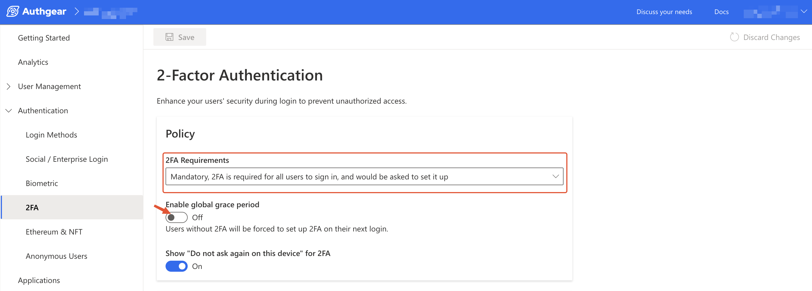

# Enable Two-Factor Authentication (2FA)

Authgear supports Two-Factor Authentication (2FA) or Multi-Factor Authentication (MFA) for additional layers of security in your application.

When you enable MFA on your application, Authgear will require your users to present two or more factors in order to log in. These factors could be their password and a One-time Password (OTP) that is sent to their registered email address or phone number. As a result, an attacker can not gain access to a user's account with only a compromised password.

In this post, you'll learn how to enable MFA or 2FA for your Authgear project and how to configure 2FA grace period.

### Prerequisites

* An Authgear account. Create one for free [here](https://www.authgear.com/).
* An Authgear Project.
* And basic experience [getting started](https://docs.authgear.com/get-started/start-building) with Authgear.

## 1. How to Enable 2FA

### Step 1: Open 2FA Settings Page

You can enable 2FA and configure other settings from the 2-Factor Authentication page in Authgear Portal.

To open the 2-Factor Authentication page, log in to Authgear Portal, select your project, then navigate to **Authentication** > **2FA**.

<figure><figcaption></figcaption></figure>

### Step 2: Select a 2FA Requirements Policy

Next, use the **2FA Requirements** dropdown on the 2-Factor Authentication page to set when to require users to use 2-Factor Authentication to sign in.

The available options are:

* **Disabled**: When this is selected, 2FA will not be required to log in for any user, including users who already have 2FA set up for their account.
* **Optional**: This policy will only require 2FA to log in for users who already have 2FA set up for their account. Users who have not set up 2FA can continue to log in without it.
* **Mandatory**: Use the mandatory policy to require 2FA for all users. That means users who have not set up 2FA will not be able to log in if no grace period is set. To use this option, consider further actions like [setting up a grace period for rollout](enable-two-factor-authentication-2fa.md#id-2.-2fa-grace-period-and-how-2fa-should-be-rolled-out).

Toggle the Show **"Do not ask again on this device" for 2FA** switch on if you wish to require 2FA only the first time a user logs in from a specific device.

### Step 3: Add Available 2-Factor Methods

The **Available 2-Factor** sub-section on the 2-Factor Authentication page shows a list of supported second-factor authentication methods. The supported methods include:

* Google Authenticator/Authy
* Additional Password
* OTP Code/Login Link via Email
* OTP Code via Phone

Check the box for each 2FA method you wish to enable for your project.

<figure><figcaption></figcaption></figure>

Use the **up** and **down** allows on the right of each method to order the priority of the 2FA methods.

Once you're done, click on the **Save** button at the top-left of the 2-Factor Authentication page to keep your new settings.

## 2. Grace Period in Mandatory 2FA

The 2FA Grace Period feature grants your users some time to set up 2FA for their accounts. This is very helpful for the Mandatory enforcement of 2FA.

The following are the two types of 2FA grace periods you can set for your Authgear project:

**Global Grace Period**: When this type of grace period is enabled, all users who do not have 2FA set up for their account will be asked to set up 2FA the next time they log in. When the Global Grace Period is disabled, users who have not set up 2FA for their account cannot log in. Instead, they'll get an error message requesting them to contact an admin.

**Individual Grace Period:** This is a type of grace period that is set per user. It grants a user 10 days to set up 2FA for their account. This is ideal for allowing individual users to set up 2FA when the Global Grace Period is disabled.

### How to roll out Mandatory 2FA

The following steps show how to roll out Mandatory 2FA using grace periods:

1. Change 2FA requirement policy to Mandatory
2. Enable Global Grace Period so that all users who haven't set up 2FA are required to do so the next time they login.
3. Use your own channel to notify user's about the duration of the global grace period you've decided.
4. Disable the Global Grace Period once the date you notified users of has passed. After you do this, users that still haven't set up 2FA will be unable to log in.
5. When users that could not set up their 2FA during the Global Grace Period contact you (the admin), enable individual grace period for them using the instructions in [step 2](enable-two-factor-authentication-2fa.md#step-2-enable-individual-grace-period).

### Step 1: Enable Global Grace Period

To enable the Global Grace Period, navigate to **Authentication** > **2FA** in the Authgear Portal. Then, set **2FA Requirements** to **Mandatory** so that you can view the **Enable global grace period** switch.

<figure><figcaption></figcaption></figure>

Toggle the **Enable global grace period** switch on so that your users without 2FA will be required to set up 2FA the next time they log in. Or set **Enable global grace period** off, if you do not want users without 2FA to log in, or set up 2FA without contacting an admin.

### Step 2: Enable Individual Grace Period

When you set the 2FA requirement for your project to Mandatory and Global Grace Period is turned off, you can still use the individual grace period to grant a specific user a grace period to set up 2FA for their account.

To set individual grace period, navigate to **User Management** > **User** in Authgear Portal. Then, select the user you wish to set individual grace period for by clicking on the row with their ID in your project's users' list.

From the selected user's details page, click on the **Account Security** tab, then the **Grant grace period to set up 2FA** button. You will see a prompt to confim your action, click **Confirm** to continue.

<figure><figcaption></figcaption></figure>

The duration of the individual grace period is 10 days. However, you can extend or cancel it from the user's details page.

