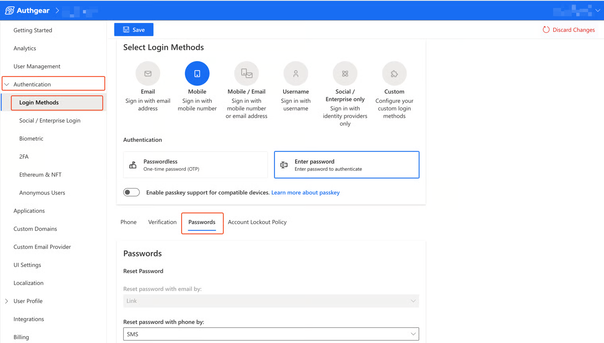

# Passwords

## Primary and Secondary Passwords

In Authgear, a password can be Primary or Secondary. Secondary passwords can be enabled as part of Two Factor Authentication (2FA).

The password policies for Primary and Secondary passwords are **not** configured independently. Password policy settings apply to both types.&#x20;

To configure your project's password policy, simply navigate to the password settings, and follow the corresponding guides.

## Primary password settings 

1. Navigate to **Authentication** > **Login Methods**.&#x20;
2. Select your **Login Method**. The login method selected determines the options available to customize.
3. Click on the **Passwords** tab to reveal the settings.&#x20;

<figure><figcaption></figcaption></figure>

**Note**: Make sure the login method you select has password enabled (you can not view the password settings screen if you only enable Passwordless login).

## Secondary password settings&#x20;

Navigate to **Authentication > 2FA.** You will be able to view the password settings if you enable "Additional Password" as a 2nd-factor authentication.

Please note that it is not recommended to use a password for both primary and secondary authentication at the same time.

<figure><figcaption></figcaption></figure>


In Multi Factor Authentication, users should provide multiple different forms of identification for extra security.&#x20;

