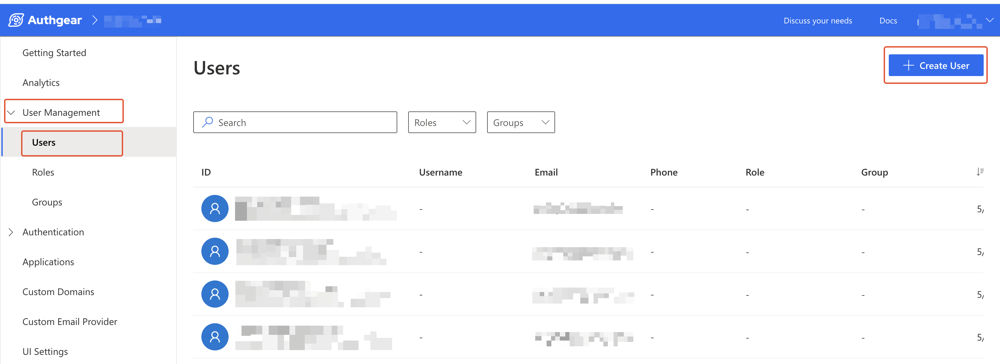
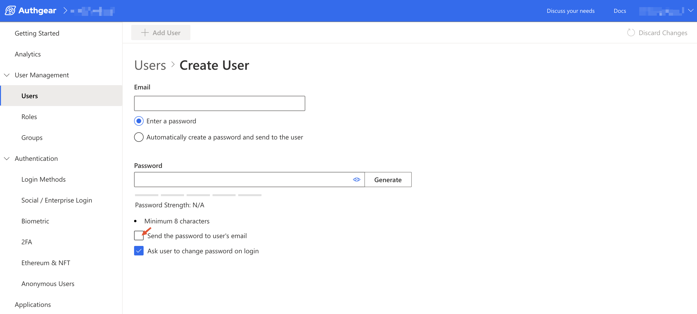

# How to Handle Password While Creating Accounts for Users

For creating accounts and sending users their passwords using Admin API, see `createUser` in the [Admin API documentation](../../../api-reference/apis/admin-api/api-queries-and-mutations.md#id-2.3.-createuser).&#x20;

In this post, we'll cover a few options and describe examples of automating the process of sending passwords to new users using the Authgear Portal or webhooks.

At this moment, Authgear only sends passwords to email accounts.&#x20;


For security reasons, it is not recommended to send users their passwords via text. SMS is unencrypted and insecure for transmitting passwords.


## How to create a user and send the password via email



Navigate to **User Management** > **Users**. From the Users page, click on the **Create User** button in the top right corner.

<figure><figcaption></figcaption></figure>




Enter the user's credentials and input a secure password you wish to set for the user, or click on **Generate** to have Authgear automatically create a new password.

<figure><figcaption></figcaption></figure>




Check the "Send the password to user's email" box to enable Authgear to send the new password to the user.

If you wish to force users to change their password upon logging in with the password you set for them, enable "Ask user to change password on login" as well. Otherwise, users can continue using the password you set for them.



## What happens if the user loses the preset password?

Users can still log in to their new account if they lose the password you set for them. They can click **Forgot Password** during login, and an OTP or link will be sent to the user. The user can then set a new password.
