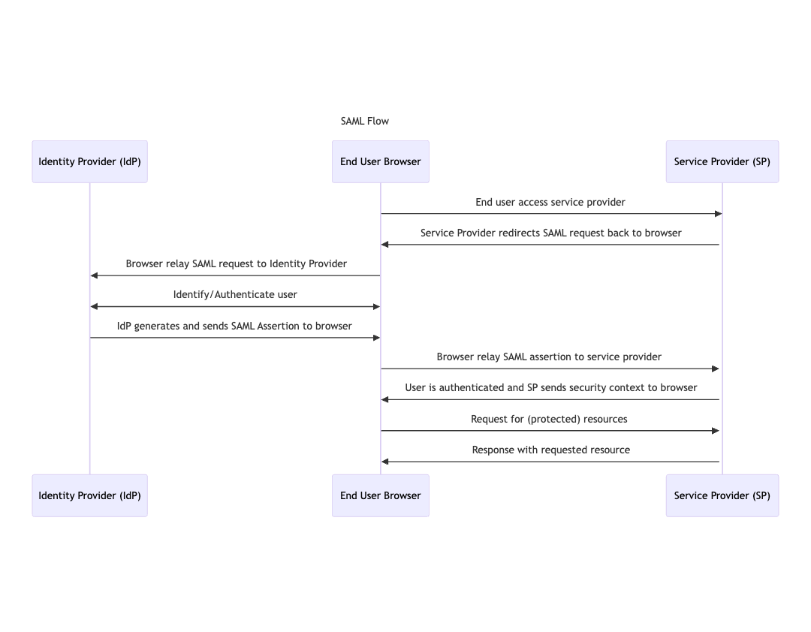

# Integration by SAML

Security Assertion Markup Language or short [SAML](https://docs.oasis-open.org/security/saml/Post2.0/sstc-saml-tech-overview-2.0.html) is a standard for exchanging security information between businesses. In SAML, one party acts as the Identity Provider (IdP), and the other party is the Service Provider (SP).

SAML allows the Identity Provider and Service Provider to authenticate and authorize without exchanging a user's password.

* **The Service Provider (SP)**: In SAML, this is the service that trust the Identity Provider to handle the process of user authentication.
* **The Identity Provider (IdP)**: handles user authentication and notifies the Service Provider once the user is authenticated.

<figure><figcaption></figcaption></figure>

Authgear supports the SAML protocol. Hence, you can set up third-party services like Salesforce, Dropbox, Figma, etc. to trust Authgear with the user authentication process.

## Specific Instructions for Service Providers

See the following guides for some popular service providers:

* [use-authgear-as-saml-identity-provider-for-salesforce.md](use-authgear-as-saml-identity-provider-for-salesforce.md "mention")
* [use-authgear-as-saml-identity-provider-for-dropbox.md](use-authgear-as-saml-identity-provider-for-dropbox.md "mention")

## How to Set up SAML in Authgear

To set up SAML in Authgear, you need to create an Authgear client application with the Application Type: `OIDC/SAML Client`. Then use the configuration for the Authgear client application to configure a SAML IdP on the Service Provider's platform.

The following steps show more details on how to set up an OIDC/SAML Client Application in Authgear Portal.

### Step 1: Create Authgear Client Application

Log in to Authgear Portal, then click on Applications from the navigation menu.

<figure><figcaption></figcaption></figure>

Click on Add Application to create a new client application. Or select an existing client application with the `OIDC/SAML Client` type.

Enter a **Name** for the application and select OIDC/SAML Client Application as the **Application Type**.

<figure><figcaption></figcaption></figure>

Click **Save** to proceed.

### Step 2: Enable SAML 2.0

By default, the SAML 2.0 Configuration is disabled for the client application.

Click on the SAML 2.0 tab then toggle **SAML 2.0 Support** switch to enable SAML 2.0.

<figure><figcaption></figcaption></figure>

You'll be required to enter at least one **Allowed Assertion Consumer Service URLs (ACS URLs)** before you can save your changes. Hence, get an **ACS URL** from the Service Provider you plan to use.

### Step 3: Configure Authgear as IdP on a Service Provider

Visit the portal for the Service Provider you plan to use and add Authgear as an Identity Provider using the SAML configuration from your Authgear client application.

Refer to the following instructions for a generic SP:

**Configuration on SP:**

* Enter the Identity Provider Metadata URL provided by Authgear if it's supported by the SP. e.g. `https://[AUTHGEAR_ENDPOINT]/saml2/metadata/[CLIENT_ID]`
* If the SP does not support uploading an IDP metadata file, you can manually enter the parameters into the SP. These values can be copied from the application settings page:
  * Issuer: `urn:[AUTHGEAT_ENDPOINT]`
  * Login URL: `https://[AUTHGEAR_ENDPOINT]/saml2/login/[CLIENT_ID]`
  * Logout URL: `https://[AUTHGEAR_ENDPOINT]/saml2/logout/[CLIENT_ID]`
  * Identity Provider Certificates in PEM format: Download from the application settings page

**Configuration on Authgear**

* Upload the Metadata XML file provided by your client application into the Authgear Portal
* You may also manually enter the parameters into the application settings page in the Portal:
  * NameID Format
    * `urn:oasis:names:tc:SAML:1.1:nameid-format:unspecified` , or
      * When the format is `unspecified`, you can choose to use the User ID, Email, Phone, or Username as the attribute value
    * `urn:oasis:names:tc:SAML:1.1:nameid-format:emailAddress`
  * Allowed Assertion Consumer Service URLs (ACS URLs)
  * Response Destination (Optional)
  * Subject Recipient (Optional)
  * Assertion Audience (Optional)
  * Assertion Valid Duration (seconds), Default: 1200
  * Enable/Disable Single Logout (SLO)
    * SLO Callback URL
    * Callback Binding
      * `urn:oasis:names:tc:SAML:2.0:bindings:HTTP-Redirect`, or
      * `urn:oasis:names:tc:SAML:2.0:bindings:HTTP-POST`
  * Enable/Disable message signature verification
    * Upload the SP's certificate in PEM format

You may find more detailed guides for adding IdP on the Service Provider's documentation.
