# Use Authgear as SAML Identity Provider for Salesforce

Security Assertion Markup Language or short [SAML](https://docs.oasis-open.org/security/saml/Post2.0/sstc-saml-tech-overview-2.0.html) is a standard for exchanging security information between businesses. In SAML, one party acts as the Identity Provider (IdP) and the other party is the Service Provider (SP).

The Service Provider (SP) trust the Identity Provider to handle the process of user authentication. The Identity Provider handles user authentication and notifies the Service Provider once the user is authenticated.

In this guide, you'll learn how to set up SAML with Authgear as an Identity Provider (IdP) and Salesforce as the Service Provider (SP) in SAML.

### Prerequisites

* An Authgear account. [Sign up](https://authgear.com) for free.
* A Salesforce account.

### Step 1: Create an Authgear Client Application

An Authgear Client application is required to set up Authgear as a SAML Identity Provider.\
To create an Authgear application, login to the Authgear Portal and navigate to the **Applications** in your project.&#x20;

<figure>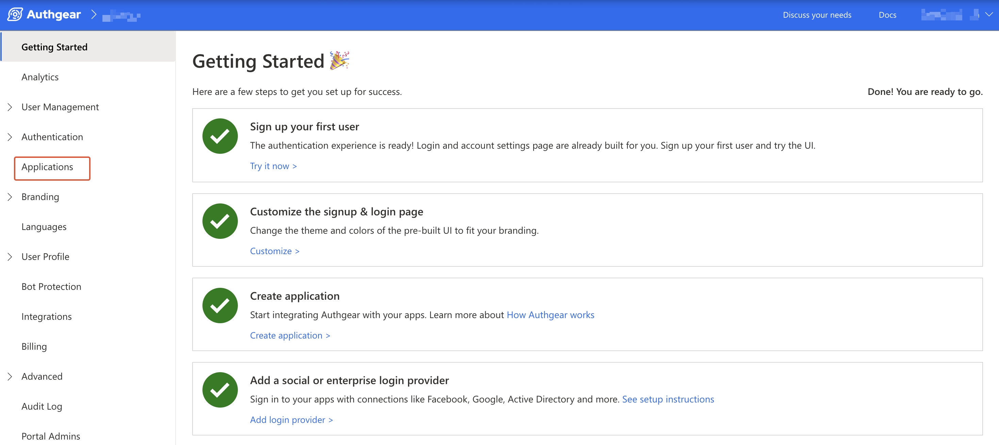<figcaption></figcaption></figure>

Click on **Add Application** to create a new application. Or, select an existing application that is of type `OIDC/SAML Client Application` and skip to step 2.

Now on the New Application page, enter a name for your application (e.g. My App) and set the Application Type to "OIDC/SAML Client Application".

<figure>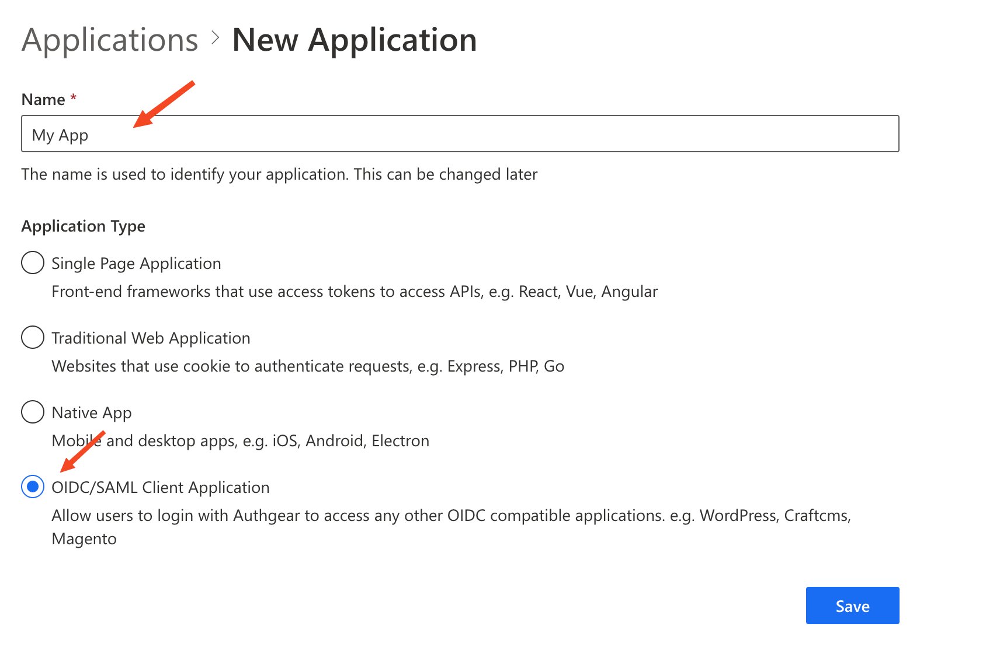<figcaption></figcaption></figure>

Click **Save** to continue.

If prompted to view a tutorial, click **Next** to proceed to the application configuration page.

### Step 2: Enable SAML 2.0 in Client Application

On the configuration page of your Authgear client application, switch to the **SAML 2.0** tab. Toggle the **SAML 2.0 Support** switch on to enable SAML for the application.

<figure><figcaption></figcaption></figure>

Next, change **NameID Format** to `urn:oasis:names:tc:SAML:1.1:nameid-format:emailAddress`.

Enter your Salesforce domain in the **Allowed Assertion Consumer Service URLs (ACS URLs)** field under SSO Settings. You can get value for your Salesforce domain from the My Domain page on the Salesforce Setup page.

<figure>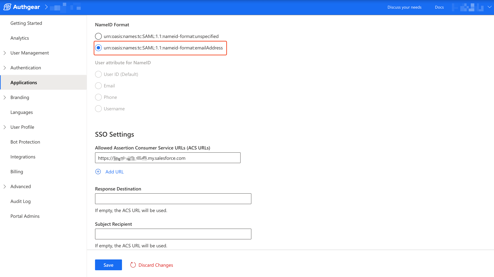<figcaption></figcaption></figure>

Click on **Save** to keep your changes.

### Step 3: Get SAML Identity Provider (IdP) Configuration and Download Certificate

Still, on the SAML 2.0 tab, scroll to the **Configuration Parameters** section and click on the **Download Metadata** button to download the Identity Provider Metadata XML file for your Authgear application to your computer.

Next, scroll to the Identity Provider Certificates section and click **Download Certificate** to download the certificate to your computer.

You will use the downloaded metadata file and certificate in later steps.

### Step 4: Enable SAML in Salesforce

To enable SAML in Salesforce, login to your Salesforce account, click on the Settings icon on the top right corner then select Setup. This will open the Salesforce Setup page.

<figure>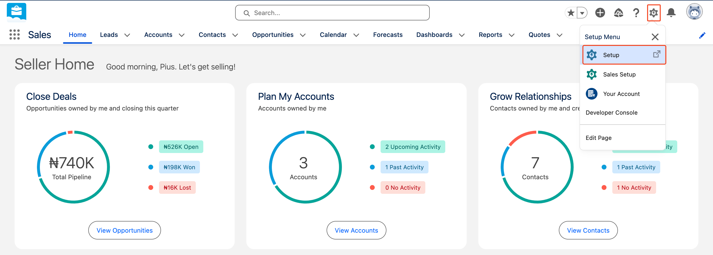<figcaption></figcaption></figure>

On the Setup page, type "single sign-on" in the **Quick find** search box on the left. Select **Single Sign-On** from the result to open the **Single Sign-On Settings** page.

<figure>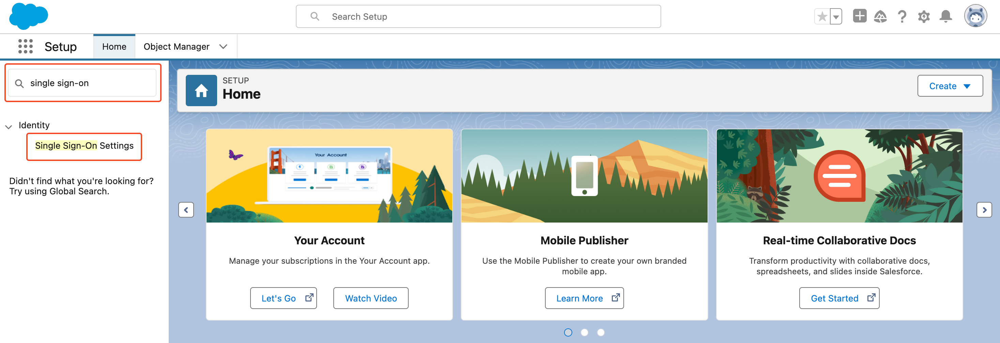<figcaption></figcaption></figure>

Next, click on the **Edit** button under Select Single Sign-On Settings then check the **SAML Enabled** box under **Federated Single Sign-On Using SAML**. Click **Save** to keep your changes.

<figure>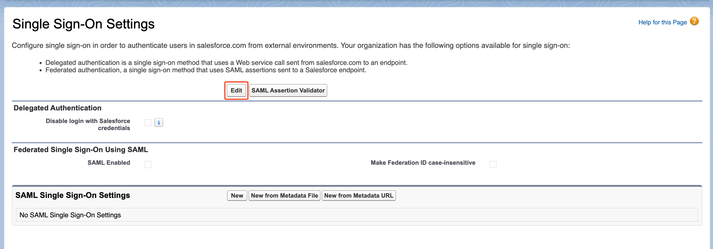<figcaption></figcaption></figure>

### Step 5: Add Authgear as SAML IdP in Salesforce

To add Authgear as a SAML Identity Provider, return to the main page of Single Sign-On Settings.&#x20;

<figure>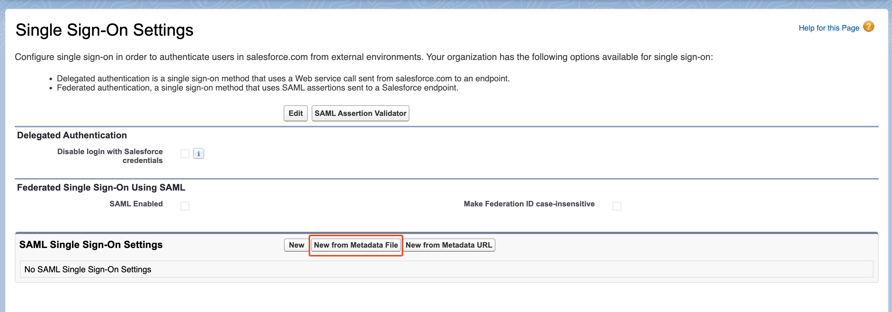<figcaption></figcaption></figure>

Next, click on the **New from Metadata File** button. Then, click Choose file, and select the Metadata XML file you downloaded in [Step 3](use-authgear-as-saml-identity-provider-for-salesforce.md#step-3-get-saml-identity-provider-idp-configuration-and-download-certificate). Click on Create to continue.

On the next screen, you should see configurations for your new SAML IdP, including the details from the metadata file. Edit the **Name** field to Authgear SAML. The value for the Name field will be visible on your Salesforce login page.

Next, click on the Choose file button next to Identity Provider Certificate then select the SAML IdP Certificate file you downloaded in [Step 3](use-authgear-as-saml-identity-provider-for-salesforce.md#step-3-get-saml-identity-provider-idp-configuration-and-download-certificate) from your computer.

<figure>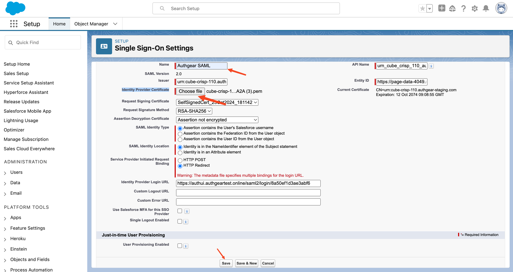<figcaption></figcaption></figure>

Once you're done with the above configurations, click **Save** to finish.

### Step 6: Enable Login with SAML in Salesforce

In order to log in with a specific SAML IdP, you must first enable the provider in Salesforce.

To enable your new SAML IdP (Authgear SAML) search for "my domain" in Quick find. Click on My Domain from the result. On the My Domain page, scroll to **Authentication Configuration** then click on the Edit button.

<figure>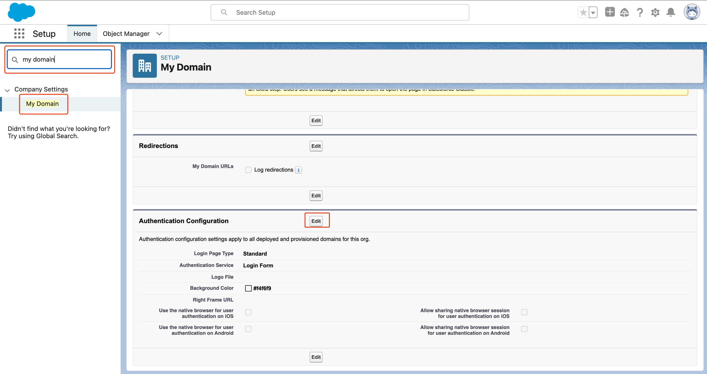<figcaption></figcaption></figure>

You should find your Authgear SAMP IdP under **Authentication Service**. Check the box next to Authgear SAML to enable it. Click **Save** to keep changes.

Once you have enabled your SAML Identity provider in this step, it will be visible on your Salesforce login page the next time you attempt login.

### Step 7: Log in to Salesforce using Authgear SAML &#x20;

Force you can log in to your Salesforce project using Authgear SAML, you need to create a user using an email address that is linked to a user account in your Authgear project.

To create a user in Salesforce, use type "users" in the Quick find search box, then select **Users** > **Users** from the result. This will take you to the All Users page.

From the All Users page, click on **New User**. Create a new user with an email address that's linked to an account on your Authgear project.

<figure>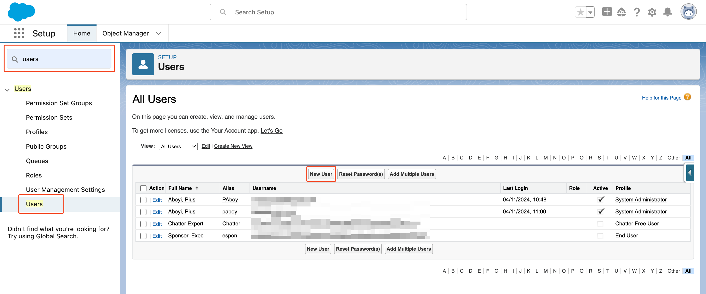<figcaption></figcaption></figure>

Now, to test your SAML implementation, log out of Salesforce and attempt logging in again. This time, you should see a Login with Authgear SAML button.&#x20;

When you click on Login with Authgear SAML, you should be redirected to Authgear Login page. Login to the account on your Authgear project that has the same email address as the new user you created earlier in this step. You should be successfully logged in to your Salesforce project.

<figure>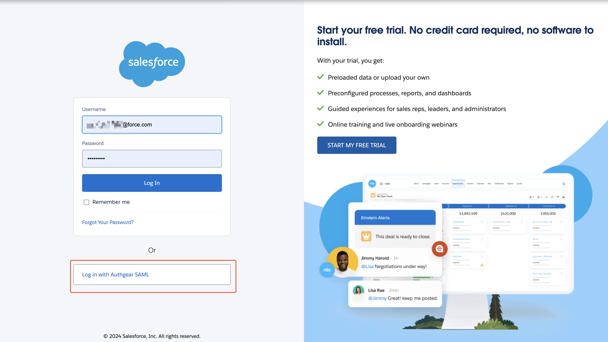<figcaption></figcaption></figure>