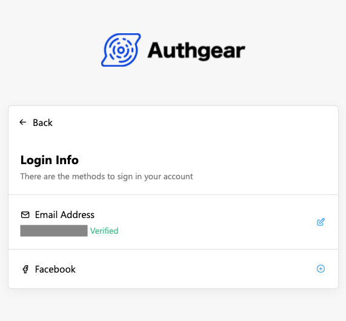

# Connect Apps to Facebook

This guide shows how to connect your Authgear application to Facebook so users can log in using the Login with Facebook feature.

<figure><figcaption></figcaption></figure>

## Step 1: Create an App in Facebook for Developers

If you are using Authgear in your existing Facebook Apps, you may skip to the next step to set up the OAuth client.

### Prerequisite

You will need a Facebook developer Account. Register as one by clicking **Get Started** in the [Facebook for Developers](https://developers.facebook.com/) website.

### Create an App

To create a new app, go to the Facebook Developers [Apps](https://developers.facebook.com/apps) panel then click the Click **Create App** button.

<figure><figcaption></figcaption></figure>

On the next screen, select **Other** as your app **use case** then, click **Next**.

In the **app type** selection screen, pick the option that best meets your requirements. For our example, we'll select the **Consumer** app type.

<figure><figcaption></figcaption></figure>

Enter your app name on the next screen and finish the app creation process.

## Step 2: Set up the OAuth Client

1. In the app panel, click **Add Product** next to **Products** in the sidebar.
2. Click the **Set Up** button in **Facebook Login**.
3. Go to **Settings** of **Facebook Login**.
4. Make sure **Client OAuth Login** and **Web OAuth Login** are enabled.
5. Add `https://<YOUR_AUTHGEAR_ENDPOINT>/sso/oauth2/callback/facebook` to **Valid OAuth Redirect URIs** and save the changes.&#x20;


Redirect URI has the form of `https://<YOUR_AUTHGEAR_ENDPOINT>/sso/oauth2/callback/:alias`. The `alias` is used as the identifier of OAuth provider. You can configure the `alias` in Authgear Portal.

See [Your Authgear Endpoint](../../../api-reference/glossary.md#your-authgear-endpoint) for instructions on how to get the value for `YOUR_AUTHGEAR_ENDPOINT`.


## Step 3: Configure Login with Facebook in Authgear Portal

### Get your OAuth Client details

After setting up the Facebook Login product, go to **App settings** > **Basic** in the sidebar.

You will need the **App ID** and **App Secret** to configure Facebook Login so, note them down.

### Configure in Authgear Portal

1. In the portal, go to **Authentication > Social / Enterprise Login**.
2. Enable **Login with Facebook**.
3. Fill in the **Client ID** with the **App ID** obtained from the Facebook Developers portal in the previous step.
4. **Save** the settings.

<figure><figcaption></figcaption></figure>

🎉 Done! You have just added Facebook Login to your apps!

Your end-users can now sign in with Facebook on Authgear's pre-built Log In and Sign Up page. Existing end-users can connect their account to Facebook in the [User Settings](../../../customization/built-in-ui/auth-ui.md) page.

