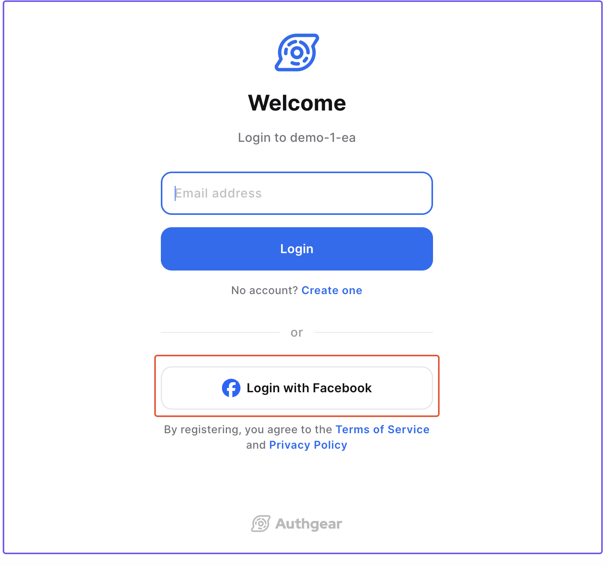

# Connect Apps to Facebook

This guide shows how to connect your Authgear application to Facebook so users can log in using the Login with Facebook feature.

<figure><figcaption></figcaption></figure>

## Step 1: Create an App in Facebook for Developers

If you are using Authgear in your existing Facebook Apps, you may skip to the next step to set up the OAuth client.

### Prerequisite

You will need a Facebook developer Account. Register as one by clicking **Get Started** in the [Facebook for Developers](https://developers.facebook.com/) website.

### Create an App

To create a new app, go to the Facebook Developers [Apps](https://developers.facebook.com/apps) panel then click the Click **Create App** button.

<figure><figcaption></figcaption></figure>

On the "**Use cases**" screen, select **Others** and "**Authenticate and request data from users with Facebook Login**" as your app **use case** then, click **Next**.

<figure><figcaption></figcaption></figure>

Follow the on-screen instructions to finish the app creation process.

## Step 2: Add "email" permission

1. Go to "Use Cases" configuration in your application just created.
2. Customize the "Authenticate and request data from users with Facebook Login" use case.
3. Enable "email" permission, make sure both "public\_profile" and "email" are enabled.

<figure><figcaption></figcaption></figure>

## Step 3: Set up the OAuth Client

1. In the use case settings, make sure **Client OAuth Login** and **Web OAuth Login** are enabled.
2. Add `https://<YOUR_AUTHGEAR_ENDPOINT>/sso/oauth2/callback/facebook` to **Valid OAuth Redirect URIs** and save the changes.

<figure><figcaption></figcaption></figure>


Redirect URI has the form of `https://<YOUR_AUTHGEAR_ENDPOINT>/sso/oauth2/callback/:alias`. The `alias` is used as the identifier of OAuth provider. You can configure the `alias` in Authgear Portal.

See [Your Authgear Endpoint](../../../api-reference/glossary.md#your-authgear-endpoint) for instructions on how to get the value for `YOUR_AUTHGEAR_ENDPOINT`.


## Step 4: Configure Login with Facebook in Authgear Portal

### Get your OAuth Client details

After setting up the OAuth Client, go to **App settings** > **Basic** in the sidebar.

<figure><figcaption></figcaption></figure>

You will need the **App ID** and **App Secret** to configure Facebook Login so, note them down.

App review submission maybe needed to complete this step. Please follow the on-screen instructions.

### Configure in Authgear Portal

1. In the portal, go to **Authentication > Social / Enterprise Login**.
2. Enable **Login with Facebook**.
3. Fill in the **Client ID** with the **App ID** obtained from the Facebook Developers portal, and **Client Secret** with the **App Secret** in the previous step.
4. **Save** the settings.

<figure><figcaption></figcaption></figure>

🎉 Done! You have just added Facebook Login to your apps!

Your end-users can now sign in with Facebook on Authgear's pre-built Log In and Sign Up page. Existing end-users can connect their account to Facebook in the [User Settings](../../../customization/ui-customization/built-in-ui/user-settings.md) page.

