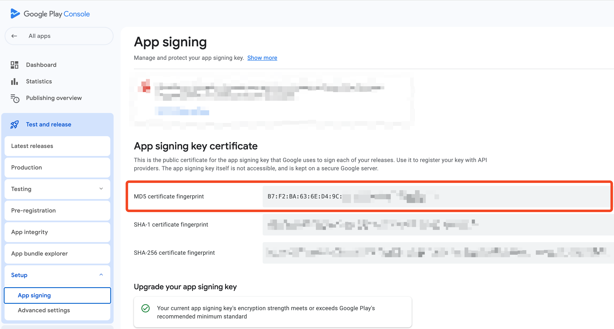

# Connect Mobile Apps to WeChat


**WeChat Open Platform account (微信开放平台账号)** is different from **WeChat Official account (微信公众平台账号)**. Authgear supports integrating WeChat Login with a WeChat Open Platform account.


## Prerequisite

- Register a WeChat Open Platform account (微信开放平台账号).
- Register a Mobile Application (移动应用).
  - For **iOS**, WeChat Open Platform requires your app to support Associated Domains and Universal Links. See [the official documentation](https://developer.apple.com/documentation/xcode/allowing-apps-and-websites-to-link-to-your-content/) from Apple for details.
  - For **Android**, WeChat Open Platform requires you to tell them the MD5 fingerprint of the signing keystore.

## Get the information from WeChat Open Platform

- Get the `appid` (**Client ID**).

<figure><figcaption>where to find appid</figcaption></figure>

- Get the `appsecret` (**Client Secret**). It will only be shown once. You need to re-generate if you lose it.

<figure><figcaption>where to find appsecret</figcaption></figure>

- Get the `原始ID` (**Account ID**) of your WeChat Open Platform account.

<figure><figcaption>where to find account ID</figcaption></figure>

## Configure Sign in with WeChat in the Authgear portal

1. Sign in to the Authgear portal.
2. Select your project.
3. In the navigation menu, go to **Authentication > Social / Enterprise Login**.
4. Click **Add Connection**.
5. Select **WeChat Mobile / 移动应用**.
6. Fill in **Client ID** with the `appid`.
7. Fill in **Client Secret** with the `appsecret`.
8. Fill in **Account ID** with the `原始ID`.
9. Add a WeChat Redirect URI. This is typically a custom URI with the scheme being your iOS bundle identifier or your Android package name. For example, `com.myapp://authgear/open_wechat_app`.
10. Save.

## Integrate the WeChat SDK into your iOS app


You can skip this section if you do not have an iOS app.



This section assumes you install the WeChat SDK with [CocoaPods](https://cocoapods.org/).


To integrate the WeChat SDK into your iOS app, you have to read [the official integration guide](https://developers.weixin.qq.com/doc/oplatform/Mobile_App/Access_Guide/iOS.html).

This section reminds you some of the important points that you may miss in the official integration guide.

### Install the latest version of the WeChat SDK for iOS

```
pod "WechatOpenSDK-XCFramework", "~> 2.0.4"
```

The latest version can be found at [this URL](https://cocoapods.org/pods/WechatOpenSDK)
As of the time of writing, the latest version is `2.0.4`.

### Specify your WeChat `appid` in Info.plist

```
	<key>CFBundleURLTypes</key>
	<array>
		<dict>
			<key>CFBundleTypeRole</key>
			<string>Editor</string>
			<key>CFBundleURLName</key>
			<string>weixin</string>
			<key>CFBundleURLSchemes</key>
			<array>
				<string>wxYOUR_WECHAT_APPID</string>
			</array>
		</dict>
	</array>
```

### Specify LSApplicationQueriesSchemes in Info.plist

```
	<key>LSApplicationQueriesSchemes</key>
	<array>
		<string>weixin</string>
		<string>weixinULAPI</string>
		<string>weixinURLParamsAPI</string>
	</array>
```

In case you have other schemes, you need to make sure the WeChat ones are the first 50 items.

### Make sure `OTHER_LDFLAGS` contains `-ObjC`


If you fail to do so, you will encounter [this error](https://developers.weixin.qq.com/community/develop/article/doc/000e8e316d4590c7ef92ec1a366c13).


The WeChat SDK for iOS depends on the Objective-C runtime. Therefore, your app has to link to the Objective-C runtime. To do so, you need to make sure `OTHER_LDFLAGS` contains `-ObjC`.

The `-ObjC` flag is so special in CocoaPods that you **CANNOT** add it with CocoaPods [post_install](https://guides.cocoapods.org/syntax/podfile.html#post_install) hook.

If your iOS app is written in [React Native](https://reactnative.dev/), the app is likely to have `OTHER_LDFLAGS` including `-ObjC` already, as React Native depend on the Objective-C runtime.

In other case, you need to manually edit your Build Settings to include the `-ObjC` flag.

### Add the integration code for the WeChat SDK for iOS




In your `AppDelegate.swift`

```swift
@UIApplicationMain
class AppDelegate: UIResponder, UIApplicationDelegate, WXApiDelegate {

  func application(_ application: UIApplication, didFinishLaunchingWithOptions launchOptions: [UIApplication.LaunchOptionsKey: Any]?) -> Bool {
    // Insert this line to register your WeChat mobile application.
    WXApi.registerApp("wxYOUR_WECHAT_APPID", universalLink: "https://myapp.com/wechat/")
    return true
  }

  func application(_ app: UIApplication, open url: URL, options: [UIApplication.OpenURLOptionsKey : Any] = [:]) -> Bool {
    // Forward the URL to the WeChat SDK.
    // If the URL is about WeChat integration, onResp will be called.
    WXApi.handleOpen(url, delegate: self)
    return true
  }

  func application(_ application: UIApplication, open url: URL, sourceApplication: String?, annotation: Any) -> Bool {
    // Forward the URL to the WeChat SDK.
    // If the URL is about WeChat integration, onResp will be called.
    WXApi.handleOpen(url, delegate: self)
    return true
  }

  func application(_ application: UIApplication, continue userActivity: NSUserActivity, restorationHandler: @escaping ([UIUserActivityRestoring]?) -> Void) -> Bool {
    // Forward the NSUserActivity to the WeChat SDK.
    // If the NSUserActivity is about WeChat integration, onResp will be called.
    WXApi.handleOpenUniversalLink(userActivity, delegate: self)
    return true
  }

  // Implements WXApiDelegate.
  // You need not do any thing special in this method.
  func onReq(_ req: BaseReq) {}

  // The WeChat SDK will call this method if the forwarded callbacks are about WeChat.
  func onResp(_ resp: BaseResp) {
    guard let authResp = resp as? SendAuthResp else {
      return
    }


    let errCode = WXErrCode(rawValue: authResp.errCode)
    if errCode == WXSuccess {
      let state = authResp.state
      let code = authResp.code
      // Forward code to Authgear SDK.
    } else {
      // Handle the error returned by the WeChat SDK properly to deliver good user experience.
    }
  }
}
```

In your `SceneDelegate` (if you have one)

```swift
class SceneDelegate: UIResponder, UIWindowSceneDelegate {
  func scene(_ scene: UIScene, continue userActivity: NSUserActivity) {
    // Assume your AppDelegate is the single point of handling WeChat callback,
    // you need to get it back.
    let appDelegate = UIApplication.shared.delegate as? AppDelegate

    // Forward the NSUserActivity to the WeChat SDK.
    // If the NSUserActivity is about WeChat integration, onResp on AppDelegate will be called.
    WXApi.handleOpenUniversalLink(userActivity, delegate: appDelegate)
  }
}
```




In your `AppDelegate.h`

```objc
// Import the WeChat SDK header file.
#import <WXApi.h>

// Declare your AppDelegate to be a WXApiDelegate.
@interface AppDelegate : UIResponder<UIApplicationDelegate, WXApiDelegate>

@end
```

In your `AppDelegate.m`

```objc
@implementation AppDelegate

- (BOOL)application:(UIApplication *)application didFinishLaunchingWithOptions:(NSDictionary *)launchOptions
{
  // Insert this line to register your WeChat mobile application.
  [WXApi registerApp:@"wxYOUR_WECHAT_APPID" universalLink:@"https://myapp.com/wechat/"];
  return true;
}

- (BOOL)application:(UIApplication *)application handleOpenURL:(NSURL *)url {
  // Forward the URL to the WeChat SDK.
  // If the URL is about WeChat integration, onResp will be called.
  [WXApi handleOpenURL:url delegate:self];
  return true;
}

- (BOOL)application:(UIApplication *)application openURL:(NSURL *)url sourceApplication:(NSString *)sourceApplication annotation:(id)annotation {
  // Forward the URL to the WeChat SDK.
  // If the URL is about WeChat integration, onResp will be called.
  [WXApi handleOpenURL:url delegate:self];
  return true;
}

- (BOOL)application:(UIApplication *)application continueUserActivity:(NSUserActivity *)userActivity restorationHandler:(void(^)(NSArray<id<UIUserActivityRestoring>> * __nullable restorableObjects))restorationHandler {
  // Forward the NSUserActivity to the WeChat SDK.
  // If the NSUserActivity is about WeChat integration, onResp will be called.
  [WXApi handleOpenUniversalLink:userActivity delegate:self];
  return true;
}

// Implements WXApiDelegate.
// You need not do any thing special in this method.
-(void) onReq:(BaseReq*)req
{
}

// The WeChat SDK will call this method if the forwarded callbacks are about WeChat.
-(void) onResp:(BaseResp*)resp
{
  if([resp isKindOfClass:[SendAuthResp class]]) {
    SendAuthResp *sendAuthResp = (SendAuthResp*)resp;
    if (sendAuthResp.errCode == WXSuccess) {
      NSString *state = sendAuthResp.state;
      NSString *code = sendAuthResp.code;
      // Forward code to Authgear SDK.
    } else {
      // Handle the error returned by the WeChat SDK properly to deliver good user experience.
    }
  }
}

@end
```

In your `SceneDelegate.m` (if you have one)

```objc
@implementation SceneDelegate

- (void)scene:(UIScene *)scene continueUserActivity:(NSUserActivity *)userActivity {
  // Assume your AppDelegate is the single point of handling WeChat callback,
  // you need to get it back.
  AppDelegate *appDelegate = (AppDelegate *)[[UIApplication sharedApplication] delegate];

  // Forward the NSUserActivity to the WeChat SDK.
  // If the NSUserActivity is about WeChat integration, onResp on AppDelegate will be called.
  [WXApi handleOpenUniversalLink:userActivity delegate:appDelegate];
}

@end
```




## Integrate the WeChat SDK into your Android app


You can skip this section if you do not have an Android app.


To integrate the WeChat SDK into your Android app, you have to read [the official integration guide](https://developers.weixin.qq.com/doc/oplatform/Mobile_App/Access_Guide/Android.html).

This section reminds you some of the important points that you may miss in the official integration guide.

### Install the latest version of the WeChat SDK for Android

```
implementation "com.tencent.mm.opensdk:wechat-sdk-android:6.8.34"
```

The latest version can be found at [this URL](https://central.sonatype.com/artifact/com.tencent.mm.opensdk/wechat-sdk-android)
As of the time of writing, the latest version is `6.8.34`.

### Declare `<queries>` in your `AndroidManifest.xml`

You need to declare in your `AndroidManifest.xml` that your app is supposed to query the existence of the WeChat app at runtime.

Add this to your `AndroidManifest.xml`.

```xml
    <queries>
        <package android:name="com.tencent.mm" />
    </queries>
```

### Declare your callback Activity in your `AndroidManifest.xml`

The WeChat SDK opens the Activity `PACKAGE_NAME.wxapi.WXEntryActivity`. You need to implement that Activity and declare it in your `AndroidManifest.xml`.

```xml
  <activity
    <!-- android:name MUST match the package name you tell WeChat Open Platform -->
    android:name="com.myapp.wxapi.WXEntryActivity"
    <!-- It must be exported, otherwise the WeChat app will not be able to open it -->
    android:exported="true"
    <!-- The official guide says it should be singleTask -->
    android:launchMode="singleTask"
    <!-- android:taskAffinity MUST match the package name you tell WeChat Open Platform -->
    android:taskAffinity="com.myapp"
    android:theme="@android:style/Theme.Translucent.NoTitleBar">
  </activity>
```

### Implement the callback Activity

The full Java name of the Activity must be `PACKAGE_NAME.wxapi.WXEntryActivity`. If the package name you tell WeChat Open Platform is `com.myapp`, then the full Java name of the Activity must be `com.myapp.wxapi.WXEntryActivity`.

Here is an example implementation that is based on BroadcastReceiver:

```java
import com.tencent.mm.opensdk.constants.ConstantsAPI;
import com.tencent.mm.opensdk.modelbase.BaseReq;
import com.tencent.mm.opensdk.modelbase.BaseResp;
import com.tencent.mm.opensdk.modelmsg.SendAuth;
import com.tencent.mm.opensdk.openapi.IWXAPI;
import com.tencent.mm.opensdk.openapi.IWXAPIEventHandler;
import com.tencent.mm.opensdk.openapi.WXAPIFactory;

public class WXEntryActivity extends Activity implements IWXAPIEventHandler {
    private IWXAPI api;

    @Override
    public void onCreate(Bundle savedInstanceState) {
        super.onCreate(savedInstanceState);

        api = WXAPIFactory.createWXAPI(this, "wxYOUR_WECHAT_APPID", true);
        api.registerApp("wxYOUR_WECHAT_APPID");

        try {
            Intent intent = getIntent();
            api.handleIntent(intent, this);
        } catch (Exception e) {
            e.printStackTrace();
        }
    }

    @Override
    protected void onNewIntent(Intent intent) {
        super.onNewIntent(intent);
        setIntent(intent);
        api.handleIntent(intent, this);
    }

    @Override
    public void onReq(BaseReq req) {
    }

    @Override
    public void onResp(BaseResp resp) {
        String error = null;

        switch (resp.errCode) {
            case BaseResp.ErrCode.ERR_OK:
                break;
            case BaseResp.ErrCode.ERR_USER_CANCEL:
                error = "errcode_cancel";
                break;
            case BaseResp.ErrCode.ERR_AUTH_DENIED:
                error = "errcode_deny";
                break;
            case BaseResp.ErrCode.ERR_UNSUPPORT:
                error = "errcode_unsupported";
                break;
            default:
                error = "errcode_unknown";
                break;
        }

        if (resp.getType() == ConstantsAPI.COMMAND_SENDAUTH) {
            SendAuth.Resp authResp = (SendAuth.Resp)resp;

            String state = authResp.state;
            Intent intent = new Intent(state);
            intent.putExtra("state", state);

            intent.setPackage(this.getApplicationContext().getPackageName());
            if (error != null) {
                intent.putExtra("error", error);
            } else {
                intent.putExtra("code", authResp.code);
            }

            this.getApplicationContext().sendBroadcast(intent);
        }
        finish();
    }
}
```

### Make sure your Android app is signed by the keystore you tell WeChat Open Platform

On WeChat Open Platform, you need to tell it the MD5 fingerprint of the keystore you use to sign your Android app.

If you use Google Play Console to distribute your Android app, it is likely that you are using [Play App Signing](https://support.google.com/googleplay/android-developer/answer/9842756?hl=en). With Play App Signing, you tell Google the fingerprint of the keystore you originally sign your app. Google removes the signature and uses its managed keystore to sign the app before distributing the app to Play Store. The final app running on the device of course bears the signature of the managed keystore. This is also the signature the WeChat SDK sees when it validates the signature.

To get the MD5 fingerprint of the managed keystore, refer to the following screenshot:

<figure><figcaption>where to find the MD5 fingerprint of the managed keystore</figcaption></figure>

Note that the MD5 fingerprint you see on Google Play Console is a **colon-delimited uppercase hex string**, while WeChat Open Platform expects you to provide a **plain lowercase hex string**.

For example, suppose the MD5 fingerprint you get from Google Play Console is `D4:1D:8C:D9:8F:00:B2:04:E9:80:09:98:EC:F8:42:7E`, you can use the following shell command to do the conversion.

```sh
$ echo "D4:1D:8C:D9:8F:00:B2:04:E9:80:09:98:EC:F8:42:7E" | sed 's/://g' | tr 'A-Z' 'a-z'
d41d8cd98f00b204e9800998ecf8427e
```

The output `d41d8cd98f00b204e9800998ecf8427e` is in the expected WeChat Open Platform format.

For those of you who produce the final signature of your app using your own keystore, you can use the following shell command to output the MD5 fingerprint.

```sh
keytool -exportcert -keystore "$STORE_FILE" -storepass "$STORE_PASSWORD" -alias "$KEY_ALIAS" -rfc | openssl x509 -noout -fingerprint -md5
```

Where
- `STORE_FILE` is an environment variable pointing to the keystore file on your machine, for example, `./mykeystore.jks`.
- `STORE_PASSWORD` is an environment variable containing the password of the keystore.
- `KEY_ALIAS` is an environment variable indicating which key in the keystore to use.

## Configure Authgear SDK for WeChat

You have 2 actions to take:

1. Switch to `WebKitWebViewUIImplementation` when you initialize the Authgear SDK.
2. Implement the callback / delegate of `WebKitWebViewUIImplementation`.

### Switch to `WebKitWebViewUIImplementation`




```swift
import Authgear

let uiImplementation = WKWebViewUIImplementation()
// Put the WeChat redirect URI you added in the Authgear portal here.
uiImplementation.wechatRedirectURI = URL(string: "com.myapp://authgear/open_wechat_app")!
// You need to implement the delegate to bridge between the WeChat SDK and the Authgear SDK.
uiImplementation.authgearDelegate = self

self.authgear = Authgear(
  clientId: "AUTHGEAR_CLIENT_ID",
  endpoint: "https://myapp.authgear.cloud",
  uiImplementation: uiImplementation
)
```




```java
WebKitWebViewUIImplementation impl = new WebKitWebViewUIImplementation();
impl.setWechatRedirectURI(Uri.parse("com.myapp://authgear/open_wechat_app"));
impl.setAuthgearDelegate(this);
boolean isSsoEnabled = false;
boolean isPreAuthenticatedURLEnabled = false;

this.mAuthgear = new Authgear(
  this.getApplicationContext(),
  "AUTHGEAR_CLIENT_ID",
  "https://myapp.authgear.cloud",
  new TransientTokenStorage(),
  impl,
  isSsoEnabled,
  isPreAuthenticatedURLEnabled,
  null,
  null
);
```




```typescript
import authgear, {
  WebKitWebViewUIImplementation,
} from '@authgear/react-native';

authgear.configure({
  clientID: "AUTHGEAR_CLIENT_ID",
  endpoint: "https://myapp.authgear.cloud",
  uiImplementation: new WebKitWebViewUIImplementation({
    ios: {
      wechatRedirectURI: "com.myapp://authgear/open_wechat_app",
    },
    android: {
      wechatRedirectURI: "com.myapp://authgear/open_wechat_app",
    },
    // You need to implement this callback to bridge between the WeChat SDK and the Authgear SDK.
    sendWechatAuthRequest,
  }),
})
```




```dart
import 'package:flutter_authgear/flutter_authgear.dart';

var authgear = Authgear(
  clientID: "AUTHGEAR_CLIENT_ID",
  endpoint: "https://myapp.authgear.cloud",
  uiImplementation: WebKitWebViewUIImplementation(
    options: WebKitWebViewUIImplementationOptions(
      ios: WebKitWebViewUIImplementationOptionsIOS(
        wechatRedirectURI: "com.myapp://authgear/open_wechat_app",
      ),
      android: WebKitWebViewUIImplementationOptionsAndroid(
        wechatRedirectURI: "com.myapp://authgear/open_wechat_app",
      ),
      // You need to implement this callback to bridge between the WeChat SDK and the Authgear SDK.
      sendWechatAuthRequest: sendWechatAuthRequest,
    ),
  ),
)
```




### Implement the callback / delegate of `WebKitWebViewUIImplementation`


This section assume you have integrated the WeChat SDK according to

- [Add the integration code for the WeChat SDK for iOS](#add-the-integration-code-for-the-wechat-sdk-for-ios)
- [Implement the callback Activity](#implement-the-callback-activity)

In particular,

- On iOS, you implement `WXApiDelegate` on your `AppDelegate`.
- On Android, your `WXEntryActivity` sends a broadcast with `state` being the Intent action.





In your `AppDelegate.swift`

```swift
import Authgear

@UIApplicationMain
class AppDelegate: UIResponder, UIApplicationDelegate, WXApiDelegate, AuthgearDelegate {
  // authgear is assumed to be initialised somewhere else.
  var authgear: Authgear!

  // Implements AuthgearDelegate
  func sendWechatAuthRequest(_ state: String) {
    // Open WeChat using the WeChat SDK.
    let req = SendAuthReq()
    req.scope = "snsapi_userinfo"
    req.state = state
    WXApi.send(req)
  }

  // Implements WXApiDelegate
  func onResp(_ resp: BaseResp) {
    guard let authResp = resp as? SendAuthResp else {
      return
    }

    let errCode = WXErrCode(rawValue: authResp.errCode)
    if errCode == WXSuccess {
      let state = authResp.state
      let code = authResp.code
      // Forward code to Authgear SDK.
      self.authgear?.wechatAuthCallback(code: code, state: state) { result in
        switch result {
        case .success():
          // The code was sent to Authgear successfully.
          // The end-user will proceed the login in the WebView.
          // You do not need to do anything here.
          break
        case let .failure(error):
          // Handle the error returned by the Authgear SDK properly to deliver good user experience.
        }
      }
    } else {
      // Handle the error returned by the WeChat SDK properly to deliver good user experience.
    }
  }
}
```




In your `MainActivity.java`

```java
public class MainActivity extends AppCompatActivity implements AuthgearDelegate {
  private IWXAPI mWeChatAPI;
  // mAuthgear is assumed to be initialised somewhere else.
  private Authgear mAuthgear;

  @Override
  public void sendWechatAuthRequest(String state) {
      if (!this.mWeChatAPI.isWXAppInstalled()) {
        // Handle WeChat not installed.
        return;
      }

      Context ctx = this.getApplicationContext();

      IntentFilter intentFilter = new IntentFilter(state);
      BroadcastReceiver br;
      br = new BroadcastReceiver() {
        @Override
        public void onReceive(Context context, Intent intent) {
          String state_ = intent.getStringExtra("state");
          if (state_ != null && state_.equal(state)) {
            ctx.unregisterReceiver(br);

            String code = intent.getStringExtra("code");
            String error = intent.getStringExtra("error");
            if (code != null) {
              mAuthgear.wechatAuthCallback(code, state, new OnWechatAuthCallbackListener() {
                @Override
                public void onWechatAuthCallback() {
                  // No need to do anything here.
                }

                @Override
                public void onWechatAuthCallbackFailed(Throwable throwable) {
                  // Handle error.
                }
              });
            } else {
              // Handle error.
            }
          }
        }
      }
      ContextCompat.registerReceiver(ctx, br, intentFilter, ContextCompat.RECEIVER_NOT_EXPORTED);

      SendAuth.Req req = new SendAuth.Req();
      req.scope = "snsapi_userinfo";
      req.state = state;
      this.mWeChatAPI.sendReq(req);
  }
}
```




In your React Native TypeScript code

```typescript
import {
  NativeModules,
} from "react-native";
import authgear from '@authgear/react-native';

// This is the callback you pass to WebKitWebViewUIImplementation.
async function sendWechatAuthRequest(state: string) {
  // MyWeChatModule is the Native Module you need to implement yourselves to bridge
  // between the WeChat SDK and the Authgear SDK.
  const { code } = await NativeModules.MyWeChatModule.sendWechatAuthRequest(state);
  await authgear.wechatAuthCallback(code, state);
}
```

In your iOS Native Module `MyWeChatModule.h`

```objc
#import <React/RCTBridgeModule.h>

static NSString *const kMyWeChatModuleNotification = @"MyWeChatModuleNotification";

@interface MyWeChatModule : NSObject <RCTBridgeModule>
@end
```

In your iOS Native Module `MyWeChatModule.m`

```objc
#import "MyWeChatModule.h"
#import <React/RCTUtils.h>
#import <WXApi.h>

@interface MyWeChatModule()
@property (nonatomic, strong) RCTPromiseResolveBlock sendWechatAuthResolve;
@property (nonatomic, strong) RCTPromiseRejectBlock sendWechatAuthReject;
@end

@implementation MyWeChatModule

RCT_EXPORT_MODULE(MyWeChatModule);

- (instancetype)init
{
  if ((self = [super init])) {
    // Listen to the notification posted by your WXApiDelegate.
    [[NSNotificationCenter defaultCenter] addObserver:self
                                             selector:@selector(handleWechatAuthResult:)
                                                 name:kMyWeChatModuleNotification
                                               object:nil];
  }
  return self;
}

RCT_EXPORT_METHOD(sendWechatAuthRequest:(NSString *)state
                                resolve:(RCTPromiseResolveBlock)resolve
                                 reject:(RCTPromiseRejectBlock)reject)
{
  self.sendWechatAuthResolve = resolve;
  self.sendWechatAuthReject = reject;

  dispatch_async(dispatch_get_main_queue(), ^{
    SendAuthReq* req = [[SendAuthReq alloc] init];
    req.scope = @"snsapi_userinfo";
    req.state = state;
    [WXApi sendReq:req completion:nil];
  });
}

- (void)handleWechatAuthResult:(NSNotification *)notification
{
  if (notification.userInfo[@"code"]) {
    self.sendWechatAuthResolve(notification.userInfo);
  } else {
    NSString *error = notification.userInfo[@"error"];
    self.sendWechatAuthReject(RCTErrorUnspecified, error, error);
  }
  [self cleanup];
}

- (void)cleanup
{
    self.sendWechatAuthResolve = nil;
    self.sendWechatAuthReject = nil;
}

@end
```

In your `WXApiDelegate`

```objc
-(void) onResp:(BaseResp*)resp
{
  if ([resp isKindOfClass:[SendAuthResp class]]) {
    SendAuthResp *sendAuthResp = (SendAuthResp*)resp;
    NSDictionary<NSString *, id> *payload;
    if (sendAuthResp.errCode == WXSuccess) {
      payload = @{
        @"code": sendAuthResp.code,
        @"state": sendAuthResp.state,
      };
    } else {
      NSString *error;
      switch (resp.errCode) {
        case WXErrCodeUserCancel:
          error = @"errcode_cancel";
          break;
        case WXErrCodeAuthDeny:
          error = @"errcode_deny";
          break;
        case WXErrCodeUnsupport:
          error = @"errcode_unsupported";
          break;
        default:
          error = @"errcode_unknown";
          break;
      }
      payload = @{
        @"error": error,
      };
    }
    // Send the notification to your MyWeChatModule.
    [[NSNotificationCenter defaultCenter] postNotificationName:kMyWeChatModuleNotification
                                                        object:nil
                                                      userInfo:payload];
  }
}
```

In your Android Native Module `MyWeChatModule`

```java
import android.content.BroadcastReceiver;
import android.content.Context;
import android.content.IntentFilter;
import androidx.core.content.ContextCompat;
import com.facebook.react.bridge.ReactContextBaseJavaModule;
import com.tencent.mm.opensdk.openapi.IWXAPI;
import com.tencent.mm.opensdk.openapi.WXAPIFactory;

public class MyWeChatModule extends ReactContextBaseJavaModule {
    private IWXAPI wechatAPI;

    WechatAuthModule(ReactApplicationContext context) {
        super(context);

        wechatAPI = WXAPIFactory.createWXAPI(context, "wxYOUR_WECHAT_APPID", true);
        wechatAPI.registerApp("wxYOUR_WECHAT_APPID");
    }

    @Override
    public String getName() {
        return "MyWeChatModule";
    }

    @ReactMethod
    public void sendWechatAuthRequest(String state, Promise promise) {
        if (!wechatAPI.isWXAppInstalled()) {
            promise.reject(new Exception("You have not installed the WeChat client app"));
            return;
        }

        Context ctx = this.getReactApplicationContext();

        IntentFilter intentFilter = new IntentFilter(state);
        BroadcastReceiver br;
        br = new BroadcastReceiver() {
            @Override
            public void onReceive(Context context, Intent intent) {
                String state_ = intent.getStringExtra("state");
                if (state_ != null && state_.equal(state)) {
                    ctx.unregisterReceiver(br);

                    String code = intent.getStringExtra("code");
                    String error = intent.getStringExtra("error");
                    if (code != null) {
                        WritableMap result = new WritableNativeMap();
                        result.putString("code", code);
                        result.putString("state", state);
                        promise.resolve(result);
                    } else {
                        promise.reject(error, error);
                    }
                }
            }
        }
        ContextCompat.registerReceiver(ctx, br, intentFilter, ContextCompat.RECEIVER_NOT_EXPORTED);

        SendAuth.Req req = new SendAuth.Req();
        req.scope = "snsapi_userinfo";
        req.state = state;
        wechatAPI.sendReq(req);
    }
}
```




In your Flutter code

```dart
import 'package:flutter/services.dart';
import 'package:flutter_authgear/flutter_authgear.dart';

// authgear is assumed to be initialised somewhere else.
var authgear;

const _nativeMethodChannel = MethodChannel("MyWeChatMethodChannel");

// This is the callback you pass to WebKitWebViewUIImplementation.
Future<void> sendWechatAuthRequest(String state) async {
  try {
    final code = await _nativeMethodChannel.invokeMethod("sendWechatAuthRequest", {
      "state": state,
    });
    await authgear.wechatAuthCallback(state: state, code: code);
  } on PlatformException catch (e) {
    print("exception: $e");
  }
}
```

In your `AppDelegate.swift`

```swift
import Flutter

@main
@objc class AppDelegate: FlutterAppDelegate, WXApiDelegate {

  private var wechat = [String: FlutterResult]()

  override func application(
    _ application: UIApplication,
    didFinishLaunchingWithOptions launchOptions: [UIApplication.LaunchOptionsKey: Any]?
  ) -> Bool {
    let controller = window?.rootViewController as! FlutterViewController
    let channel = FlutterMethodChannel(name: "MyWeChatMethodChannel", binaryMessenger: controller.binaryMessenger)
    channel.setMethodCallHandler {
      (call: FlutterMethodCall, result: @escaping FlutterResult) -> Void in
      let arguments = call.arguments as! Dictionary<String, AnyObject>
      let state = arguments["state"] as! String
      self.wechat[state] = result
      let req = SendAuthReq()
      req.scope = "snsapi_userinfo"
      req.state = state
      WXApi.send(req)
    }

    GeneratedPluginRegistrant.register(with: self)
    return super.application(application, didFinishLaunchingWithOptions: launchOptions)
  }

  override func application(_ app: UIApplication, open url: URL, options: [UIApplication.OpenURLOptionsKey : Any] = [:]) -> Bool {
      WXApi.handleOpen(url, delegate: self)
      return super.application(app, open: url, options: options)
  }

  override func application(_ application: UIApplication, open url: URL, sourceApplication: String?, annotation: Any) -> Bool {
      WXApi.handleOpen(url, delegate: self)
      return super.application(application, open: url, sourceApplication: sourceApplication, annotation: annotation)
  }

  override func application(_ application: UIApplication, continue userActivity: NSUserActivity, restorationHandler: @escaping ([UIUserActivityRestoring]?) -> Void) -> Bool {
    WXApi.handleOpenUniversalLink(userActivity, delegate: self)
    return super.application(application, continue: userActivity, restorationHandler: restorationHandler)
  }

  @objc
  func onReq(_ req: BaseReq) {
  }

  @objc
  func onResp(_ resp: BaseResp) {
    guard let authResp = resp as? SendAuthResp else {
      return
    }

    guard let state = authResp.state else {
      return
    }

    guard let result = wechat.removeValue(forKey: state) else {
      return
    }

    var error: String
    switch WXErrCode(rawValue: authResp.errCode) {
    case WXErrCodeUserCancel:
      error = "errcode_cancel"
    case WXErrCodeAuthDeny:
      error = "errcode_deny"
    case WXErrCodeUnsupport:
      error = "errcode_unsupported"
    default:
      error = "errcode_unknown"
    }

    switch WXErrCode(rawValue: authResp.errCode) {
    case WXSuccess:
      let code = authResp.code
      result(code)
    default:
      result(FlutterError(code: error, message: error, details: nil))
    }
  }
}
```

In your `MainActivity.kt`

```kotlin
class MainActivity: FlutterFragmentActivity() {

  private var api: IWXAPI? = null

  override fun configureFlutterEngine(flutterEngine: FlutterEngine) {
    super.configureFlutterEngine(flutterEngine)

    MethodChannel(flutterEngine.dartExecutor.binaryMessenger, "MyWeChatMethodChannel").setMethodCallHandler { call, result ->
        handleMethodCall(call, result)
    }
  }

  private fun handleMethodCall(call: MethodCall, result: MethodChannel.Result) {
    val api = api!!
    if (!api.isWXAppInstalled) {
        result.error("errcode_not_installed", "errcode_not_installed", null)
        return
    }

    val state = call.argument<String>("state")!!
    val req = SendAuth.Req()
    req.scope = "snsapi_userinfo"
    req.state = state

    var broadcastReceiver: BroadcastReceiver?
    broadcastReceiver = object : BroadcastReceiver() {
      override fun onReceive(context: Context?, intent: Intent?) {
        val state_ = intent.getStringExtra("state")
        if (state_ == state) {
          this@MainActivity.applicationContext.unregisterReceiver(broadcastReceiver)

          val code = intent.getStringExtra("code")
          val error = intent.getStringExtra("error")
          if (code != null) {
            result.success(code)
          } else {
            result.error(error, error, nil)
          }
        }
      }
    }
    val intentFilter = IntentFilter(state)
    ContextCompat.registerReceiver(this.applicationContext, broadcastReceiver, intentFilter, ContextCompat.RECEIVER_NOT_EXPORTED)
    api.sendReq(req)
  }
}
```



