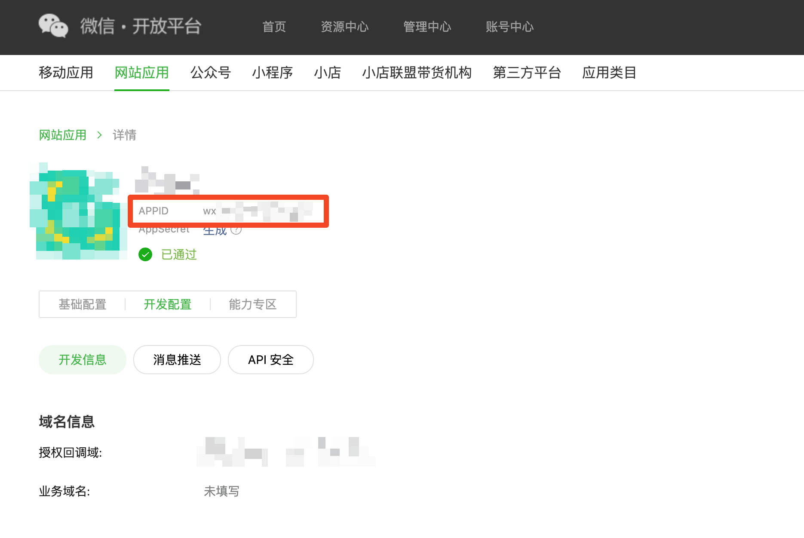
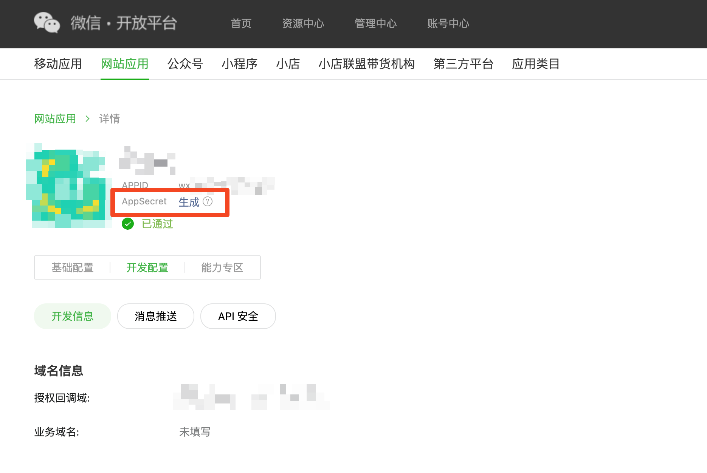

# Connect Websites to WeChat


**WeChat Open Platform account (微信开放平台账号)** is different from **WeChat Official account (微信公众平台账号)**. Authgear supports integrating WeChat Login with a WeChat Open Platform account.


## Prerequisite

- Register a WeChat Open Platform account (微信开放平台账号).
- Register a Website Application (网站应用).


The 授权回调域 is the domain of your Authgear project, e.g. `myapp.authgear.cloud`. It is without URL scheme. If you ever change your Authgear project domain, you **MUST** update 授权回调域.


## Get the information from WeChat Open Platform

- Get the `appid` (**Client ID**)

<figure><figcaption>where to find appid</figcaption></figure>

- Get the `appsecret` (**Client Secret**). It will only be shown once. You need to re-generate if you lose it.

<figure><figcaption>where to find appid</figcaption></figure>

- Get the `原始ID` (**Account ID**) of your WeChat Open Platform account.

<figure><figcaption>where to find account ID</figcaption></figure>

## Configure Sign in with WeChat in the Authgear portal

1. Sign in to the Authgear portal.
2. Select your project.
3. In the navigation menu, go to **Authentication > Social / Enterprise Login**.
4. Click **Add Connection**.
5. Select **WeChat Web / 网站应用**.
6. Fill in **Client ID** with the `appid`.
7. Fill in **Client Secret** with the `appsecret`.
8. Fill in **Account ID** with the `原始ID`.
9. Save.

## Done!

No further changes are needed. The Sign in with WeChat button should be shown in the signup / login page now.
