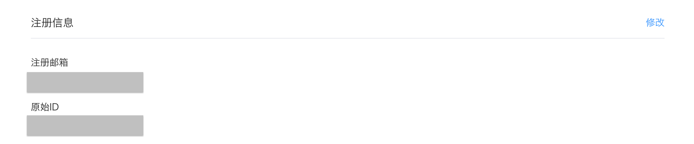
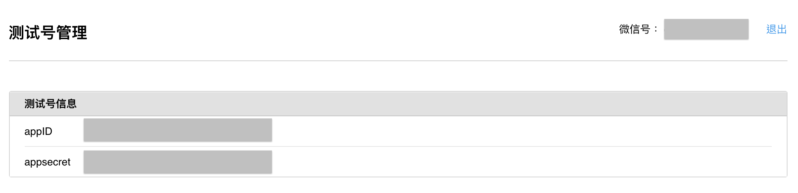
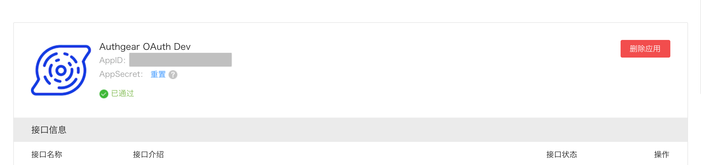

# Connect Apps to WeChat

## Web

### Prerequisite

To create a website application in WeChat, you can choose to setup a website application and wait for approval or a sandbox account for testing.

### Setup the Website Application (网站应用)

* Register an account in [WeChat Open Platform](https://open.weixin.qq.com).
* Create Website Application (网站应用), fill in information and wait for approval (It may take few days).
* View the application detail page, obtain the "AppID" and "AppSecret" on the top of the application page.
* Go to Account Center > Basic information, to obtain the "原始ID".



### Setup the Sandbox Application (微信公众平台接口测试帐号)

* Use your WeChat app to login in [微信公众平台接口测试帐号申请](https://mp.weixin.qq.com/debug/cgi-bin/sandbox?t=sandbox/login).
* Obtain the "appID", "appSecret" and "原始ID". The "原始ID" is the "微信号" in the top right corner.



* Fill in 接口配置信息. The URL must be pointing at a publicly reachable server. The token is a string of your choice.
* Implement the 接口配置信息 server. Here is an example written in Golang.

```go
package main

import (
    "crypto/sha1"
    "crypto/subtle"
    "encoding/hex"
    "fmt"
    "io"
    "net/http"
    "sort"
    "strings"
)

type WechatVerifyHandler struct {
    Token string
}

func (h *WechatVerifyHandler) ServeHTTP(w http.ResponseWriter, r *http.Request) {
    err := r.ParseForm()
    if err != nil {
        http.Error(w, err.Error(), http.StatusBadRequest)
        return
    }

    signature := r.Form.Get("signature")
    timestamp := r.Form.Get("timestamp")
    nonce := r.Form.Get("nonce")
    echostr := r.Form.Get("echostr")

    token := h.Token

    tmpArr := []string{token, timestamp, nonce}
    sort.Strings(tmpArr)

    tmpStr := strings.Join(tmpArr, "")

    hasher := sha1.New()
    io.WriteString(hasher, tmpStr)
    computedHash := hasher.Sum(nil)
    computedhashInHex := hex.EncodeToString(computedHash)

    if subtle.ConstantTimeCompare([]byte(signature), []byte(computedhashInHex)) == 1 {
        w.Write([]byte(echostr))
        return
    }

    http.Error(w, fmt.Sprintf("%v != %v", signature, computedhashInHex), http.StatusBadRequest)
}

func main() {
    http.Handle("/", &WechatVerifyHandler{
        Token: "TOKEN", // Change this value to the value you told Wechat!
    })
    http.ListenAndServe(":9999", nil)
}
```

* Fill in JS接口安全域名. The value is your Authgear domain name plus port, e.g. `192.168.2.88:3000` or `myapp.authgear.cloud`
* Fill in 网页授权获取用户基本信息. The value is your Authgear domain name plus port, e.g. `192.168.2.88:3000` or `myapp.authgear.cloud`
* Look for an QR code in the sandbox settings page. You must scan it with your Wechat app and follow the sandbox account.

### Configure Sign in with WeChat through the Authgear portal

In the portal, do the following:

1. In the portal, go to **Authentication > Social / Enterprise Login**.
2. Enable **Sign in with WeChat (Web/网站应用)**.
3. Fill in **Client ID** with the **AppID**.
4. Fill in **Client Secret** with the **AppSecret**.
5. Fill in **原始 ID** with the **原始 ID**.
6. Check the checkbox **Is Sandbox account** if you are using sandbox account.
7. **Save** the settings.

## Mobile app (Native iOS app, Native Android app, React Native, and Flutter)

### Overview of Setting Up Wechat

Wechat integration is a bit more complicated then other social login, here are the overview of what needs to be done:

* Register an account and create mobile application in WeChat Open Platform. Approval is needed in this process.
* Enable and configure WeChat Login in Authgear portal.
* Include Authgear SDK on your app.
* Implement a delegate function to be triggered when user clicks the "Login with WeChat" button during authorization. You need to integrate WeChat SDK to open WeChat app to perform authentication in the delegate function (we have sample code below). After obtaining the authorization code from WeChat, call the Authgear callback with the auth code and complete the "Login With WeChat" process.

Here are the detailed steps for iOS, Android, React Native, and Flutter.

### Prerequisite - Setup the Mobile Application (移动应用)

* Register an account in [WeChat Open Platform](https://open.weixin.qq.com).
* Create Mobile Application (移动应用), fill in information and wait for approval (It may take few days).
* View the application detail page, obtain the `AppID` and `AppSecret` on the top of the page.



* Go to Account Center > Basic information, to obtain the "原始ID".


* Save those values, we will need them in the section below.

### Update code based on platform

#### Native iOS application

* Setup Authgear iOS SDK.
* Follow [iOS接入指南](https://developers.weixin.qq.com/doc/oplatform/Mobile\_App/Access\_Guide/iOS.html) to setup WeChat SDK. For the coding part, we will further explain in the below steps.
*   `WechatOpenSDK` is Objective-C library. If you are using swift. You will need to create bridging header. To setup bridge header, please check [Importing Objective-C into Swift](https://developer.apple.com/documentation/swift/imported\_c\_and\_objective-c\_apis/importing\_objective-c\_into\_swift). Here is the example `WechatOpenSDK-Bridging-Header.h`.

    ```
      #ifndef WechatOpenSDK_Bridging_Header_h
      #define WechatOpenSDK_Bridging_Header_h

      #import "WXApiObject.h"
      #import "WXApi.h"

      #endif
    ```
* After setting up the `WechatOpenSDK`, universal link should be enabled in your application. We will need two links for the setup. One is for the WeChat SDK used, another is for the Authgear SDK to trigger delegate function when user click "Login with WeChat" button. Here are the suggestion of the links.
  * **WECHAT\_UNIVERICAL\_LINK**: `https://{YOUR_DOMAIN}/wechat`
  * **WECHAT\_REDIRECT\_URI\_FOR\_AUTHGEAR**: `https://{YOUR_DOMAIN}/open_wechat_app`
* Login WeChat Open platform, open the application detail page, update the development information iOS section.

 (5) (5) (5) (1) (1) (1) (1) (1) (1) (1) (1) (9).png>)

* Fill in "Bundle ID" field with your app bundle id.
* Fill in "Universal Links" with "WECHAT\_UNIVERICAL\_LINK" above.
* Go to Authgear portal, do the following:
  * In the portal, go to **Authentication > Social / Enterprise Login**.
  * Enable **Sign in with WeChat (Mobile/移动应用)**.
  * Fill in **Client ID** with the **AppID**.
  * Fill in **Client Secret** with the **AppSecret**.
  * Fill in **原始 ID** with the **原始 ID**.
  * Add **WECHAT\_REDIRECT\_URI\_FOR\_AUTHGEAR** above in **WeChat redirect URIs**.
  * **Save** the settings.
* Update the code
  *   Setup WeChat SDK when app launch

      ```swift
        // Replace WECHAT_APP_ID with wechat app id
        // Replace WECHAT_UNIVERICAL_LINK with the link defined above
        WXApi.registerApp("WECHAT_APP_ID", universalLink: "WECHAT_UNIVERICAL_LINK")
        WXApi.startLog(by: .detail) { log in
            print(#line, "wechat sdk wxapi: " + log)
        }
      ```
  *   Setup Authgear delegate and call WeChat SDK when `sendWechatAuthRequest` is triggered

      ```swift
        // Replace self with the object that you implement the AuthgearDelegate
        authgear.delegate = self

        // Replace WECHAT_APP_ID with wechat app id
        extension MyClass: AuthgearDelegate {
            func sendWechatAuthRequest(_ state: String) {
                let req = SendAuthReq()
                req.openID = "WECHAT_APP_ID"
                req.scope = "snsapi_userinfo"
                req.state = state
                WXApi.send(req)
            }
        }
      ```
  *   Handle universal link

      ```swift
        // Update App Delegate
        func application(_ application: NSApplication,
                        continue userActivity: NSUserActivity,
                        restorationHandler: @escaping ([NSUserActivityRestoring]) -> Void) -> Bool {
            // wechat sdk handle, replace self with object implement WXApiDelegate
            WXApi.handleOpenUniversalLink(userActivity, delegate: self)
            // authgear sdk handle
            return authgear.application(application, continue: userActivity, restorationHandler: restorationHandler)
        }

        // If your app has opted into Scenes, Update Scene Delegate
        func scene(_ scene: UIScene, continue userActivity: NSUserActivity) {
            // wechat sdk handle, replace self with object implement WXApiDelegate
            WXApi.handleOpenUniversalLink(userActivity, delegate: self)

            // authgear sdk handle
            authgear.scene(scene, continue: userActivity)
        }

        // Implement WXApiDelegate
        extension MyClass: WXApiDelegate {
            func onReq(_ req: BaseReq) {}
            func onResp(_ resp: BaseResp) {
                // Receive code from WeChat, send callback to authgear
                // by calling `authgear.wechatAuthCallback`
                if resp.isKind(of: SendAuthResp.self) {
                    if resp.errCode == 0 {
                        let _resp = resp as! SendAuthResp
                        if let code = _resp.code, let state = _resp.state {
                            authgear.wechatAuthCallback(code: code, state: state) { result in
                                switch result {
                                case .success():
                                    // send wechat auth callback to authgear successfully
                                case let .failure(error):
                                    // failed to send wechat auth callback to authgear
                                }
                            }
                        }
                    } else {
                        // failed to obtain code from wechat sdk
                    }
                }
            }
        }
      ```
  *   Provide `wechatRedirectURI` when calling `authenticate` and `promoteAnonymousUser` in authgear sdk

      ```swift
        // Replace "WECHAT_REDIRECT_URI_FOR_AUTHGEAR" with link defined above
        container?.authenticate(
            redirectURI: "REDIRECT_URI",
            prompt: "login",
            wechatRedirectURI: "WECHAT_REDIRECT_URI_FOR_AUTHGEAR"
        ) { result in
        }

        // For anonymous user support only
        // Replace "WECHAT_REDIRECT_URI_FOR_AUTHGEAR" with link defined above
        container?.promoteAnonymousUser(
            redirectURI: "REDIRECT_URI",
            wechatRedirectURI: "WECHAT_REDIRECT_URI_FOR_AUTHGEAR"
        ) { result in
        }

        // Open setting page
        // Replace "WECHAT_REDIRECT_URI_FOR_AUTHGEAR" with link defined above
        container?.open(
            page: .settings,
            wechatRedirectURI: "WECHAT_REDIRECT_URI_FOR_AUTHGEAR"
        )
      ```
* Here is the completed [example](https://github.com/authgear/authgear-sdk-ios/tree/master/example).

#### Native Android application

* Setup Authgear iOS SDK.
* Follow [Android接入指南](https://developers.weixin.qq.com/doc/oplatform/Mobile\_App/Access\_Guide/Android.html) to setup Wechat SDK. For the coding part, we will further explain in the below steps.
* Login WeChat Open platform, open the application detail page, update the development information Android section.

 (5) (5) (5) (1) (1) (1) (1) (1) (1) (1) (1) (2).png>)

* Fill in application signature, you can obtain it with command `keytool -list -v -keystore YOUR_KEYSTORE_FILE_PATH`. WeChat needs the certificate fingerprint in MD5, remove `:` in the fingerprint. It should be string in length 32.
* Fill in your package name
* We will need to define a custom url for Authgear SDK to trigger delegate function when user click "Login with WeChat" button. Here is the example, you should update it with your own scheme.
  * **"WECHAT\_REDIRECT\_URI\_FOR\_AUTHGEAR"**: `com.myapp://host/open_wechat_app`
* Go to Authgear portal, do the following:
  * In the portal, go to **Authentication > Social / Enterprise Login**.
  * Enable **Sign in with WeChat (Mobile/移动应用)**.
  * Fill in **Client ID** with the **AppID**.
  * Fill in **Client Secret** with the **AppSecret**.
  * Fill in **原始 ID** with the **原始 ID**.
  * Add **WECHAT\_REDIRECT\_URI\_FOR\_AUTHGEAR** above in **WeChat redirect URIs**.
  * **Save** the settings.
* Update the code
  *   Update application `AndroidManifest.xml`

      ```markup
        <!-- Your application configuration. Omitted here for brevity -->
        <application>
        <!-- Other activities or entries -->

        <!-- It should be added when setting up Authgear SDK -->
        <activity android:name="com.oursky.authgear.OauthRedirectActivity"
            android:exported="true"
            android:launchMode="singleTask">
            <intent-filter>
                <action android:name="android.intent.action.VIEW" />
                <category android:name="android.intent.category.DEFAULT" />
                <category android:name="android.intent.category.BROWSABLE" />
                <!-- This is the redirectURI, It should be added when setting up Authgear SDK -->
                <data android:scheme="com.myapp"
                    android:host="host"
                    android:pathPrefix="/path"/>
                <!-- Add this for WeChat setup, this should match the WECHAT_REDIRECT_URI_FOR_AUTHGEAR defined above -->
                <data android:scheme="com.myapp"
                    android:host="host"
                    android:pathPrefix="/open_wechat_app"/>
            </intent-filter>
        </activity>

        <!-- Add this for WeChat SDK setup, replace YOUR_PACKAGE_NAME-->
        <activity
            android:name=".wxapi.WXEntryActivity"
            android:exported="true"
            android:label="@string/app_name"
            android:launchMode="singleTask"
            android:taskAffinity="YOUR_PACKAGE_NAME"
            android:theme="@android:style/Theme.Translucent.NoTitleBar"></activity>
        </application>
      ```
  *   Configure WeChat SDK

      ```java
        private IWXAPI wechatAPI;

        private setupWechatSDK() {
            wechatAPI = WXAPIFactory.createWXAPI(app, YOUR_WECHAT_APP_ID, true);
            wechatAPI.registerApp(YOUR_WECHAT_APP_ID);
        }
      ```
  *   Setup Authgear delegate

      ```java
        mAuthgear.setDelegate(new AuthgearDelegate() {
            @Override
            public void sendWechatAuthRequest(String state) {
                if (!wechatAPI.isWXAppInstalled()) {
                    // User have not installed WeChat app, show them the error
                    return;
                }
                SendAuth.Req req = new SendAuth.Req();
                req.scope = "snsapi_userinfo";
                req.state = state;
                wechatAPI.sendReq(req);
            }
        });
      ```
  *   Create wxapi directory in the directory named after your package name and create `WXEntryActivity` activity. In `WXEntryActivity`, pass the received intent and the object that implements IWXAPIEventHandler API to the `handleIntent` method of the `IWXAPI` API, as shown below:

      ```java
        api.handleIntent(getIntent(), this);
      ```

      You will be able to receive the authentication code and state in `onResp` method, call Authgear `wechatAuthCallback` with `code` and `state`.

      ```java
        mAuthgear.wechatAuthCallback(code, state, new OnWechatAuthCallbackListener() {
            @Override
            public void onWechatAuthCallback() {
            }

            @Override
            public void onWechatAuthCallbackFailed(Throwable throwable) {
            }
        });
      ```
  *   Provide `wechatRedirectURI` when calling `authorize` and `promoteAnonymousUser` in Authgear SDK.

      ```java
        // Replace "WECHAT_REDIRECT_URI_FOR_AUTHGEAR" with link defined above
        AuthenticateOptions options = new AuthenticateOptions(AUTHGEAR_REDIRECT_URI);
        options.setWechatRedirectURI(WECHAT_REDIRECT_URI_FOR_AUTHGEAR);
        mAuthgear.authenticate(options, new OnAuthenticateListener() {
            @Override
            public void onAuthenticated(@Nullable UserInfo userInfo) {
            }

            @Override
            public void onAuthenticationFailed(@NonNull Throwable throwable) {
            }
        });

        // For anonymous user support only
        // Replace "WECHAT_REDIRECT_URI_FOR_AUTHGEAR" with link defined above
        PromoteOptions options = new PromoteOptions(AUTHGEAR_REDIRECT_URI);
        options.setWechatRedirectURI(WECHAT_REDIRECT_URI_FOR_AUTHGEAR);
        mAuthgear.promoteAnonymousUser(options, new OnPromoteAnonymousUserListener() {
            @Override
            public void onPromoted(@NonNull UserInfo userInfo) {
            }

            @Override
            public void onPromotionFailed(@NonNull Throwable throwable) {
            }
        });

        // Open setting page
        // Replace "WECHAT_REDIRECT_URI_FOR_AUTHGEAR" with link defined above
        SettingOptions options = new SettingOptions();
        options.setWechatRedirectURI(WECHAT_REDIRECT_URI_FOR_AUTHGEAR);
        mAuthgear.open(Page.Settings, options);
      ```
* Here is the completed [example](https://github.com/authgear/authgear-sdk-android/tree/main/javasample).

#### React Native

* Setup Authgear SDK
* Follow [iOS接入指南](https://developers.weixin.qq.com/doc/oplatform/Mobile\_App/Access\_Guide/iOS.html) and [Android接入指南](https://developers.weixin.qq.com/doc/oplatform/Mobile\_App/Access\_Guide/Android.html) to setup WeChat SDK. For the coding part, we will further explain in the below steps.
* In iOS, after setting up the WechatOpenSDK, universal link should be enabled in your application. We will need two links for the setup. One is for the WeChat SDK used, another is for the Authgear SDK to trigger delegate function when user click "Login with WeChat" button. Here are the suggestion of the links.
  * **IOS\_WECHAT\_UNIVERSAL\_LINK**: `https://{YOUR_DOMAIN}/wechat`
  * **IOS\_WECHAT\_REDIRECT\_URI\_FOR\_AUTHGEAR**: `https://{YOUR_DOMAIN}/open_wechat_app`
* In android, you need to sign your app to use WeChat SDK. Obtain your application signature by running command `keytool -list -v -keystore YOUR_KEYSTORE_FILE_PATH` with your keystore file. WeChat needs the certificate fingerprint in MD5, remove `:` in the fingerprint. It should be string in length 32.
* Login WeChat Open platform, open the application detail page, update the development information iOS and Android sections.

 (5) (5) (5) (5) (2).png>)

* In iOS
  * Fill in "Bundle ID" field with your app bundle id.
  * Fill in "Universal Links" with "IOS\_WECHAT\_UNIVERSAL\_LINK" above.
* In Android
  * Fill in application signature.
  * Fill in your package name
* For android, we will need to define a custom url for Authgear SDK to trigger delegate function when user click "Login with WeChat" button. Here is the example, you should update it with your own scheme.
  * **ANDROID\_WECHAT\_REDIRECT\_URI\_FOR\_AUTHGEAR**: `com.myapp://host/open_wechat_app`
* Login Authgear portal, go to "Single-Sign On" page, then do the following:
  * Enable "Sign in with WeChat (Mobile/移动应用)"
  * Fill in "Client ID" with the WeChat "AppID".
  * Fill in "Client Secret" with the WeChat "AppSecret".
  * Fill in "原始 ID" with the WeChat "原始 ID".
  * Add "IOS\_WECHAT\_REDIRECT\_URI\_FOR\_AUTHGEAR" and "ANDROID\_WECHAT\_REDIRECT\_URI\_FOR\_AUTHGEAR" above into "WeChat redirect URIs"
  * Click save.
* Update the code
  *   In Android, Update application `AndroidManifest.xml`.

      ```markup
        <!-- Your application configuration. Omitted here for brevity -->
        <application>
        <!-- Other activities or entries -->

        <!-- It should be added when setting up Authgear SDK -->
        <activity android:name="com.authgear.reactnative.OAuthRedirectActivity"
            android:exported="true"
            android:launchMode="singleTask">
            <intent-filter>
                <action android:name="android.intent.action.VIEW" />
                <category android:name="android.intent.category.DEFAULT" />
                <category android:name="android.intent.category.BROWSABLE" />
                <!-- This is the redirectURI, It should be added when setting up Authgear SDK -->
                <data android:scheme="com.myapp"
                    android:host="host"
                    android:pathPrefix="/path"/>
                <!-- Add this for WeChat setup, this should match the WECHAT_REDIRECT_URI_FOR_AUTHGEAR defined above -->
                <data android:scheme="com.myapp"
                    android:host="host"
                    android:pathPrefix="/open_wechat_app"/>
            </intent-filter>
        </activity>

        <!-- Add this for WeChat SDK setup, replace YOUR_PACKAGE_NAME-->
        <activity
            android:name=".wxapi.WXEntryActivity"
            android:exported="true"
            android:label="@string/app_name"
            android:launchMode="singleTask"
            android:taskAffinity="YOUR_PACKAGE_NAME"
            android:theme="@android:style/Theme.Translucent.NoTitleBar"></activity>
        </application>
      ```
  *   In iOS, update your App Delegate

      ```
        - (BOOL)application:(UIApplication *)application continueUserActivity:(NSUserActivity *)userActivity restorationHandler:(void (^)(NSArray *))restorationHandler {
            [WXApi handleOpenUniversalLink:userActivity delegate:self];
            [AGAuthgearReactNative application:application continueUserActivity:userActivity restorationHandler:restorationHandler];
            return YES;
        }
      ```
  *   Provide `wechatRedirectURI` when calling Authgear SDK `authorize` and `promoteAnonymousUser` in js

      ```javascript
        // REPLACE IOS_WECHAT_REDIRECT_URI_FOR_AUTHGEAR and ANDROID_WECHAT_REDIRECT_URI_FOR_AUTHGEAR
        const wechatRedirectURI = Platform.select<string>({
            android: 'ANDROID_WECHAT_REDIRECT_URI_FOR_AUTHGEAR',
            ios: 'IOS_WECHAT_REDIRECT_URI_FOR_AUTHGEAR',
        });

        authgear
            .authenticate({
                redirectURI: "REDIRECT_URI",
                wechatRedirectURI: wechatRedirectURI

            });

        // For anonymous user support only
        authgear
            .promoteAnonymousUser({
                redirectURI: "REDIRECT_URI",
                wechatRedirectURI: wechatRedirectURI
            });

        // Open setting page
        authgear
            .open(Page.Settings, {
                wechatRedirectURI: wechatRedirectURI,
            })
      ```
  *   Setup Authgear delegate and open WeChat SDK when sendWechatAuthRequest is triggered

      ```javascript
        authgear.delegate = {
            sendWechatAuthRequest: (state) => {
                // User click login with WeChat
                // Implement native modules to use WeChat SDK to open 
                // WeChat app for authorization.
                // After obtaining authorization code, call Authgear.wechatAuthCallback
                // to complete the authorization.
                const {WechatAuth} = NativeModules;
                WechatAuth.sendWechatAuthRequest(state)
                .then((result: {code: string; state: string}) => {
                    // Native module sending back the code after login with
                    // WeChat app. Call Authgear.wechatAuthCallback
                    return authgear.wechatAuthCallback(result.code, result.state);
                })
                .then(() => {
                    // Send WeChat callback to authgear successfully
                })
                .catch((err: Error) => {
                    // error ocurred
                });
            }
        }
      ```
  * Implement the NativeModules to use WeChat SDK to open WeChat app for authorization. Here is the completed [example](https://github.com/authgear/authgear-sdk-js/tree/master/example/reactnative).

#### Flutter

* Setup Authgear SDK
* Follow [iOS接入指南](https://developers.weixin.qq.com/doc/oplatform/Mobile\_App/Access\_Guide/iOS.html) and [Android接入指南](https://developers.weixin.qq.com/doc/oplatform/Mobile\_App/Access\_Guide/Android.html) to setup WeChat SDK. For the coding part, we will further explain in the below steps.
* In iOS, after setting up the WechatOpenSDK, universal link should be enabled in your application. We will need two links for the setup. One is for the WeChat SDK used, another is for the Authgear SDK to trigger delegate function when user click "Login with WeChat" button. Here are the suggestion of the links.
  * **IOS\_WECHAT\_UNIVERSAL\_LINK**: `https://{YOUR_DOMAIN}/wechat`
  * **IOS\_WECHAT\_REDIRECT\_URI\_FOR\_AUTHGEAR**: `https://{YOUR_DOMAIN}/open_wechat_app`
* In android, you need to sign your app to use WeChat SDK. Obtain your application signature by running command `keytool -list -v -keystore YOUR_KEYSTORE_FILE_PATH` with your keystore file. WeChat needs the certificate fingerprint in MD5, remove `:` in the fingerprint. It should be string in length 32.
* Login WeChat Open platform, open the application detail page, update the development information iOS and Android sections.

 (5) (5) (5) (5) (2).png>)

* In iOS
  * Fill in "Bundle ID" field with your app bundle id.
  * Fill in "Universal Links" with "IOS\_WECHAT\_UNIVERSAL\_LINK" above.
* In Android
  * Fill in application signature.
  * Fill in your package name
* For android, we will need to define a custom url for Authgear SDK to trigger delegate function when user click "Login with WeChat" button. Here is the example, you should update it with your own scheme.
  * **ANDROID\_WECHAT\_REDIRECT\_URI\_FOR\_AUTHGEAR**: `com.myapp://host/open_wechat_app`
* Login Authgear portal, go to "Single-Sign On" page, then do the following:
  * Enable "Sign in with WeChat (Mobile/移动应用)"
  * Fill in "Client ID" with the WeChat "AppID".
  * Fill in "Client Secret" with the WeChat "AppSecret".
  * Fill in "原始 ID" with the WeChat "原始 ID".
  * Add "IOS\_WECHAT\_REDIRECT\_URI\_FOR\_AUTHGEAR" and "ANDROID\_WECHAT\_REDIRECT\_URI\_FOR\_AUTHGEAR" above into "WeChat redirect URIs"
  * Click save.
* Update the code
  *   In Android, Update application `AndroidManifest.xml`.

      ```markup
        <!-- Your application configuration. Omitted here for brevity -->
        <application>
        <!-- Other activities or entries -->

        <!-- It should be added when setting up Authgear SDK -->
        <activity android:name="com.authgear.flutter.OAuthRedirectActivity"
            android:exported="true"
            android:launchMode="singleTask">
            <intent-filter>
                <action android:name="android.intent.action.VIEW" />
                <category android:name="android.intent.category.DEFAULT" />
                <category android:name="android.intent.category.BROWSABLE" />
                <!-- This is the redirectURI, It should be added when setting up Authgear SDK -->
                <data android:scheme="com.myapp"
                    android:host="host"
                    android:pathPrefix="/path"/>
                <!-- Add this for WeChat setup, this should match the WECHAT_REDIRECT_URI_FOR_AUTHGEAR defined above -->
                <data android:scheme="com.myapp"
                    android:host="host"
                    android:pathPrefix="/open_wechat_app"/>
            </intent-filter>
        </activity>

        <!-- Add this for WeChat SDK setup, replace YOUR_PACKAGE_NAME-->
        <activity
            android:name=".wxapi.WXEntryActivity"
            android:exported="true"
            android:label="@string/app_name"
            android:launchMode="singleTask"
            android:taskAffinity="YOUR_PACKAGE_NAME"
            android:theme="@android:style/Theme.Translucent.NoTitleBar"></activity>
        </application>
      ```
  *   Provide `wechatRedirectURI`.

      ```dart
        // REPLACE IOS_WECHAT_REDIRECT_URI_FOR_AUTHGEAR and ANDROID_WECHAT_REDIRECT_URI_FOR_AUTHGEAR
        var wechatRedirectURI = "";
        if (Platform.isIOS) {
            wechatRedirectURI = 'IOS_WECHAT_REDIRECT_URI_FOR_AUTHGEAR';
        } else if (Platform.isAndroid) {
            wechatRedirectURI = 'ANDROID_WECHAT_REDIRECT_URI_FOR_AUTHGEAR';
        }

        await authgear.authenticate(redirectURI: "REDIRECT_URI", wechatRedirectURI: wechatRedirectURI);

        // For anonymous user support only
        await authgear.promoteAnonymousUser(redirectURI: "REDIRECT_URI", wechatRedirectURI: wechatRedirectURI);

        // Open setting page
        await authgear.open(SettingsPage.settings, wechatRedirectURI: wechatRedirectURI);
      ```
  *   Provide sendWechatAuthRequest

      ```dart
      final authgear = Authgear(
          sendWechatAuthRequest: sendWechatAuthRequest,
      );

      Future<void> sendWechatAuthRequest(state: String) async {
          // Implement your platform specific code to use WeChat SDK to open WeChat app.
          // After success, pass the code back to Authgear.
          await authgear.wechatAuthCallback(state: state, code: code);
      }
      ```
  * Implement the platform specific code to use WeChat SDK to open WeChat app for authorization. Here is the completed [example](https://github.com/authgear/authgear-sdk-flutter/tree/main/example).
