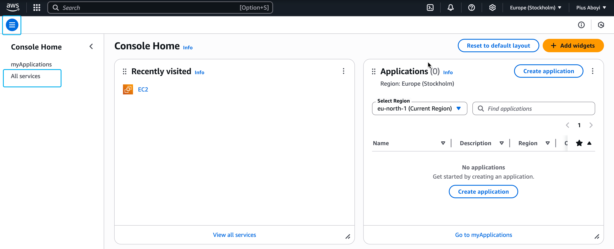
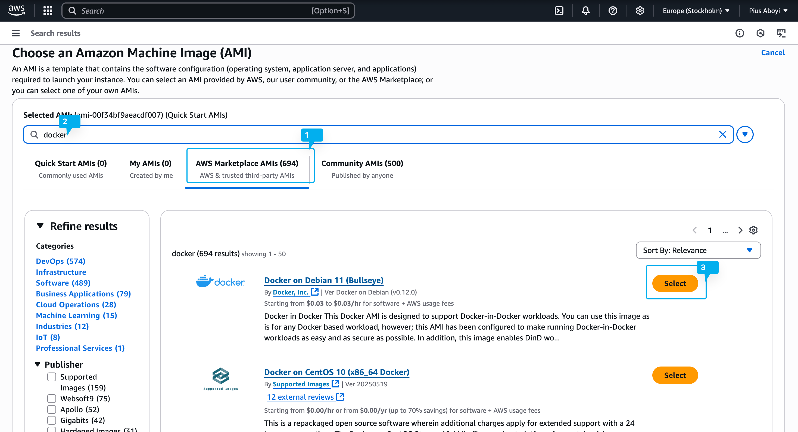
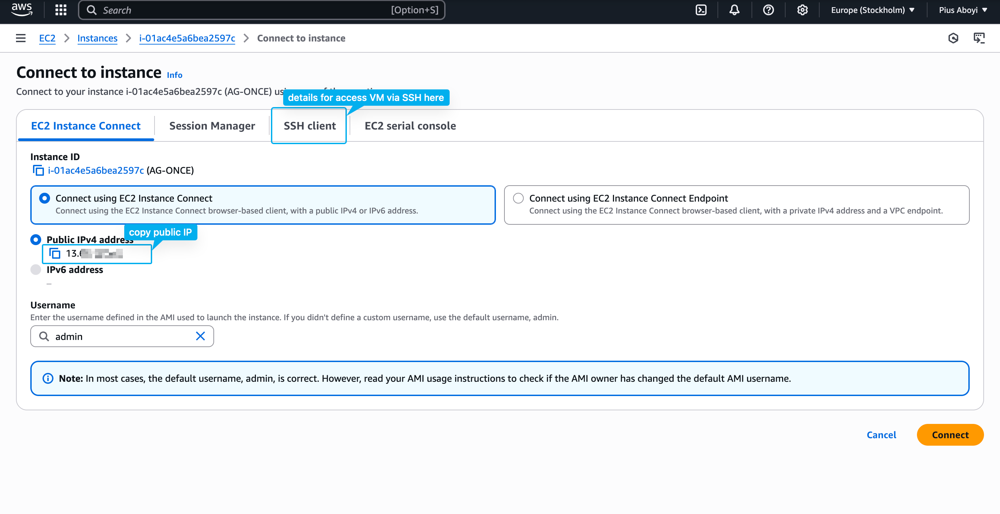
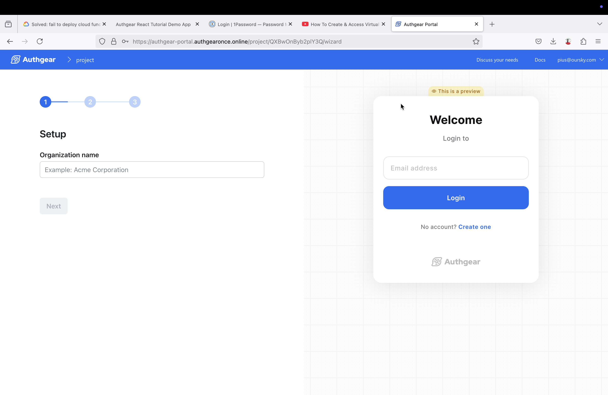

# Install Authgear ONCE on Amazon Web Services (AWS)

In this guide, you'll learn how to install Authgear ONCE on a virtual machine hosted on Amazon Web Services (AWS).

### Prerequisites

Before you get started, make sure to have the following:

* First, you need a valid Authgear ONCE license. You can purchase from[ authgear.com](https://www.authgear.com/).
* An[ AWS account](https://aws.amazon.com/) that you'll use to create a virtual machine.
* A domain name.
* Sendgrid account or SMTP server.

### Step 1: Create an EC2 Instance (Virtual Machine)

Log in to the AWS console.

From the Console home page, click on the three (3) horizontal line icon, then navigate to **All services** > **Compute** > **EC2**.

<figure><figcaption><p>aws navigatiion menu</p></figcaption></figure>

Next, click on the Launch instance button on the EC2 dashboard.

Enter a name for your instance in the **Name and tag** field. Then, click on the **Browse more AMIs** button.

On the **Choose an Amazon Machine Image (AMI)** page, click on **AWS Marketplace AMIs**.

Then, enter "docker" in the search box and hit the Enter/Return key.&#x20;

Select your preferred Linux distro from the search results to continue. For example, Docker on Debian 11. Click on **Subscribe on instance launch** on the next screen.

<figure><figcaption><p>AWS Image market place</p></figcaption></figure>

Do the following to complete setting up your VM:

* Create a new RSA (with the .pem file format) login Key pair or select an existing one. Download the key and keep it safe, as you'll be using it to log in to the VM via SSH.
* Enable both **Allow** **HTTPS traffic from the internet** and **Allow HTTP traffic from the internet** under **Network settings**. Leave other settings unchanged.
* Click **Launch instance** to finish the setup.

### Step 2: Get Public IP and SSH into the EC2 Virtual Machine

Once your VM is created, click on Connect to instance to view the public IP address and details for accessing the machine via SSH. Note the public IP address as you'll need it to set up A records for your domain name.

Follow the instructions on the **SSH client** tab to log in to your VM.

<figure><figcaption><p>get vm ip address</p></figcaption></figure>

### Step 3: Set up DNS A Records for Domain Name

Configure your domain name with the following A records and the public IP address of your VM.

| Type | Name                     | Value         | Usage                                                                                |
| ---- | ------------------------ | ------------- | ------------------------------------------------------------------------------------ |
| A    | auth                     | IP of your VM | The authentication endpoint                                                          |
| A    | authgear-portal          | IP of your VM | The admin portal for CIAM functions                                                  |
| A    | authgear-portal-accounts | IP of your VM | A domain for logging into the Authgear portal. You don't need to access it directly. |

<figure><figcaption><p>Example of A records on Namecheap</p></figcaption></figure>

### Step 4: Prepare External Email Provider

Authgear ONCE supports Sendgrid and SMTP server for sending verification and other system emails.

To configure your Authgear ONCE instance to use Sendgrid do the following:

1. Add a sender address in Sendgrid portal, it should be the address you plan to add as sender in Authgear ONCE.
2. Create an API key in Sendgrid portal. Note down the API key as you can only view it once.

To use SMTP, create an SMTP server and note the configurations.

### Step 5: Run Installation Script

Log in to your VM via SSH and run the installation script. You can find the command for running the script in the Authgear ONCE purchase mail sent to you. The installation command should look like this:

```sh
/bin/sh -c "$(curl -fsSL https://once-license-staging.authgear.com/install/470E06-E59449-FA1A3C-AA693D-22CF93-V3)"
```

The installation script is interactive and will walk you through all the steps for configuring your domain, email provider, and Portal admin account.

### Step 6. Log in to Your Authgear Portal&#x20;

After a successful installation, visit `authgear-portal.your-domain.com` (change `your-domain.com` to your actual domain name) to view the admin Portal for your new Authgear instance.

Log in to the portal using the email address and password for the admin account you created during the installation.

<figure><figcaption><p>Onboarding screen for admin Portal of new Authgear ONCE instance</p></figcaption></figure>
