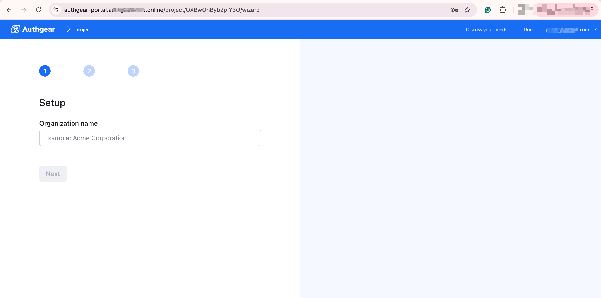

# Install Authgear ONCE on Vultr

In this guide, you'll learn how to install Authgear ONCE on [Vultr](https://www.vultr.com). Before you continue, make sure you have your Authgear ONCE license ready. You can purchase one from [authgear.com](https://www.authgear.com/).



### Step 1: Create a Server (Virtual Machine)

1. Log in to Vultr and then click on **Deploy +** to create a new server.
2. Select the specification based on your need. For low volume usage, choose virtual machines of "Shared CPU" type.
3. While creating your new server, select a machine that has Docker pre-installed, or manually install Docker after your server is created.
   1.  &#x20;**(Recommended)** To create a machine with Docker pre-installed, switch to the **Marketplace Apps** tab in the **Configure Software & Deploy Instance** page, then search for "**Docker**" and click on "Docker on Ubuntu" from the results.

       <figure><figcaption><p>Deploy a server with Docker pre-installed</p></figcaption></figure>
   2. To manually install Docker, visit [https://docs.docker.com/get-started/get-docker/](https://docs.docker.com/get-started/get-docker/) for a detailed guide on how to manually install Docker on different machines.
4. Note the **IPv4 address** for your server as you'll use it later to set up **A** record on your domain name DNS.
5. SSH into your machine or use the **View Console** feature in Vultr portal to access your server via a terminal. The username and password can be found in the Server Information page.

<figure><figcaption><p>Vultr's Server Information page show the public IP and View Console button</p></figcaption></figure>

### Step 2: Set up DNS A Records for Domain Name

A domain name is required to install Authgear ONCE (e.g, yourcoolproject.com). Hence, register a domain name with any domain name registrar that allows you to create custom A records.

Log in to your domain registrar's portal and navigate to the DNS management page for your domain.

To use the default domain setup, add new DNS records using the IPv4 address for your server, one each for the following subdomains:

<table><thead><tr><th width="66.83203125">Type</th><th width="275">Name</th><th>Usage</th></tr></thead><tbody><tr><td>A</td><td><code>auth</code></td><td>The authentication endpoint</td></tr><tr><td>A</td><td><code>authgear-portal</code></td><td>The admin portal for CIAM functions</td></tr><tr><td>A</td><td><code>authgear-portal-accounts</code></td><td>A domain for logging into the Authgear portal. You don't need to access it directly.</td></tr></tbody></table>

<figure><figcaption><p>Example: Add the A records in DNS management in Namecheap</p></figcaption></figure>

### Step 3: Prepare External Email Provider

During the installation of Authgear ONCE, you'll be asked to configure what provider your instance will use for sending email. For example, you can configure your project to use SMTP or a service like Sendgrid.

If you plan to use Sendgrid, do the following before you proceed to the installation:

1. Add the sender email address you plan to use in the Sendgrid portal.
2. Create an API key on the Sendgrid portal and keep it safe, as you can only view it once.

### Step 4: Run Installation Script

In this step, you'll run the installation script that's included in the "Installing Authgear once" mail that was sent to you after you purchased the Authgear ONCE license.

To run the command, open your server in SSH or Vultr's Console, then run the installation script. The script looks like the following:

```
/bin/sh -c "$(curl -fsSL https://once-license.authgear.com/install/YOUR-AUTHGEAR-ONCE-LICENSE-KEY)"
```

Now, follow the prompt to complete the installation of your Authgear ONCE Instance.

The installation prompt will let you do things like:

* Configure the domain name for your Authgear ONCE instance.
* Create an admin user account that you'll use to log in to the Authgear Portal.
* Configure Email Provider for sending system emails.

#### Configure Email Provider

You must configure an email provider to use Authgear. Authgear ONCE will use this email provider to send verification emails and other types of system emails to your users.

The supported options for setting up an email provider are Sendgrid and SMTP.

Select **Sendgrid** to configure your Sendgrid account as the default email provider.

Or, select **SMTP** to manually configure other email providers using SMTP.

If you'd like to proceed and configure email later in Authgear Portal, select the **Skip** option.

```
? Email provider:
> Sendgrid
  SMTP
  Skip, set up later in the portal

```

If you select Sendgrid, the next prompt will request for your Sendgrid API key. Enter the API key, then hit the Enter/Return key to continue.

Next, provide a valid sender email address that you have registered on Sendgrid. This address will be used for sending system emails.

Finally, enter one of your email addresses that you want a test message to be sent to in the Testing email service prompt.

```
Testing email service
✓ Enter an email address to receive a test email:
johndoe@gmail.com 
```

After that, you'll be prompted to confirm whether you got the test email in your inbox. If you got the mail in your inbox or spam, select **Yes** to finish the installation.

```
? A test email is sent to apeapius@gmail.com, did you receive it:
> Yes
  No, retry sending email
  No, review email provider setup

```

### Step 5. Log in to Your Authgear Portal

Once installation is successful, visit `authgear-portal.domain-name.com` (Replace `domain-name.com` with your actual domain) to log in to the admin Portal for your new Authgear instance.

Log in to the Portal using the email address and password you created in step 4 of the installation prompt.

<figure><figcaption><p>Onboarding screen in Portal for new Authgear ONCE instance.</p></figcaption></figure>
