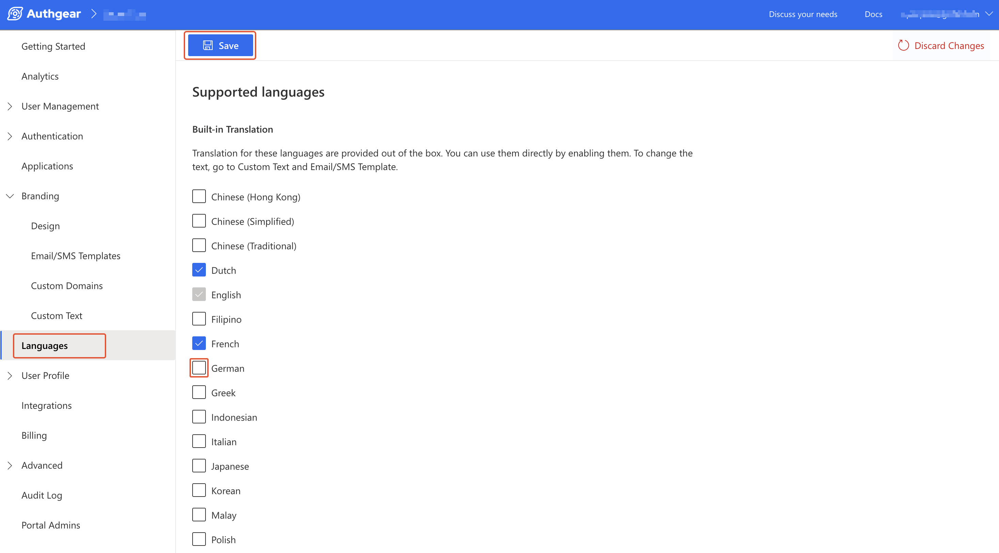
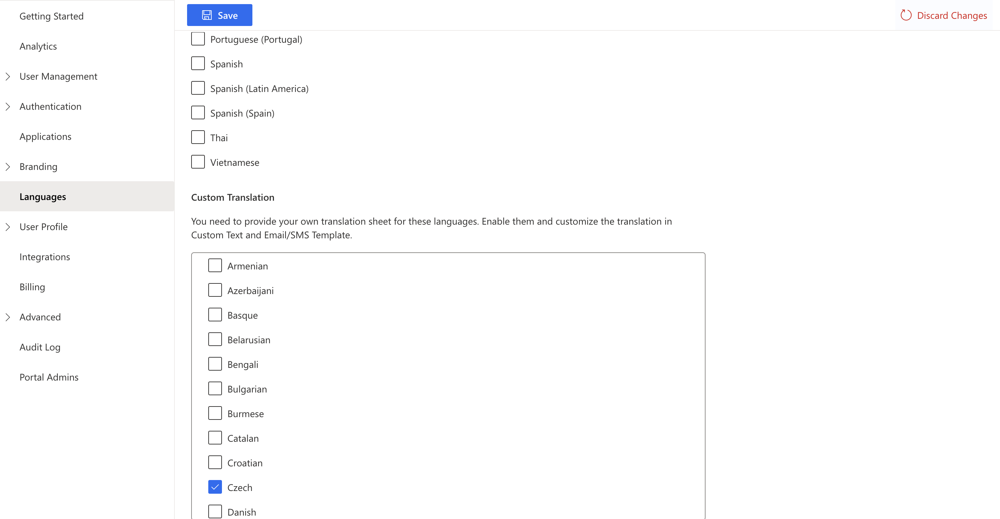
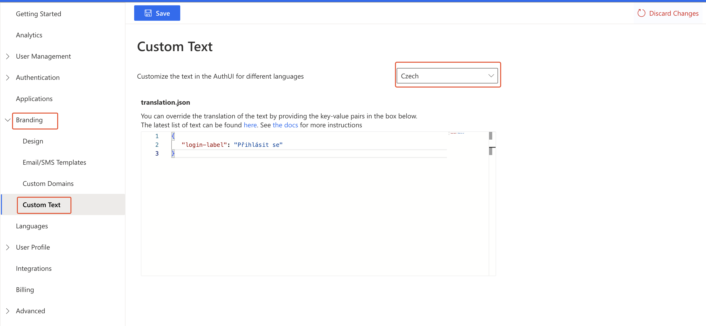

# Languages and Localization

Out of the box, Authgear provides multiple languages that your application can display. If a language you wish to use is not in the list of built-in languages, you can still add your own **translation.json** to add support for the language.

Authgear will display text in a language based on your user's locale. In case the user's locale does not match any of the available languages for your project, the primary language will be used.

In this guide, you'll learn how to **enable a supported language**, **set the primary language** for your project, and **add more languages** using custom translation.

To access the Language settings for your project, navigate to the **Languages** section in the Authgear Portal.

### 1. Enable a Supported Language

You must enable a language before you can set it as a primary language or customize it. To enable a language, go to the **Languages** section in the portal, scroll to the language (built-in or custom translation), and check the box next to it. Finally, click on the **Save** button on the top left corner of the screen to keep your changes.

Expand to see supported languages

**Built-in Translation**&#x20;

Translations for these languages are provided out of the box.

* Chinese (Hong Kong)
* Chinese (Simplified)
* Chinese (Traditional)
* Dutch
* English
* Filipino
* French
* German
* Greek
* Indonesian
* Italian
* Japanese
* Korean
* Malay
* Polish
* Portuguese
* Portuguese (Brazil)
* Portuguese (Portugal)
* Spanish
* Spanish (Latin America)
* Spanish (Spain)
* Thai
* Vietnamese

**Custom Translation**&#x20;

Requires you to provide your own translation. Enable a language and customize the translation in Custom Text and Email/SMS Template.

* Afrikaans
* Amharic
* Arabic
* Armenian
* Azerbaijani
* Basque
* Belarusian
* Bengali
* Bulgarian
* Burmese
* Catalan
* Croatian
* Czech
* Danish
* Estonian
* Finnish
* Galician
* Georgian
* Hindi
* Hungarian
* Icelandic
* Kannada
* Khmer
* Kyrgyz
* Lao
* Latvian
* Lithuanian
* Macedonian
* Malayalam
* Marathi
* Mongolian
* Nepali
* Norwegian
* Persian
* Romanian
* Russian
* Serbian
* Sinhala
* Slovak
* Slovenian
* Swahili
* Swedish
* Tamil
* Telugu
* Turkish
* Ukrainian
* Zulu

<figure><figcaption></figcaption></figure>

### 2. Set Primary Language

The primary language is the language that will be displayed when a user's locale does not match any of the supported languages.

Use the Language dropdown in the Primary Language subsection of Languages in the portal to set your project's primary language.

### 3. Add More Languages

You can add more languages using custom translation.json. To do this, first enable the language from the **Custom Translation** subsection of Languages in the portal. For example, enable a language such as Czech, Danish, or Estonian from the custom translation subsection and then proceed to write the translation.

<figure><figcaption></figcaption></figure>

Next, go to **Branding** > **Custom Text** in Authgear Portal. Then, select the language you wish to add from the dropdown at the top right corner.

Enter the [appropriate key-value pair](https://github.com/authgear/authgear-server/blob/2a6f1bfbb9b8/resources/authgear/templates/en/translation.json) in the **translation.json** text field to translate different UI texts for the language. See [Custom Text](../ui-customization/built-in-ui/localization.md) to learn more about editing **translation.json**.

<figure><figcaption></figcaption></figure>
