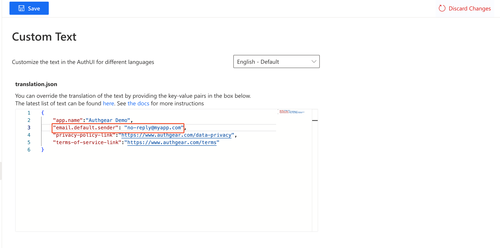
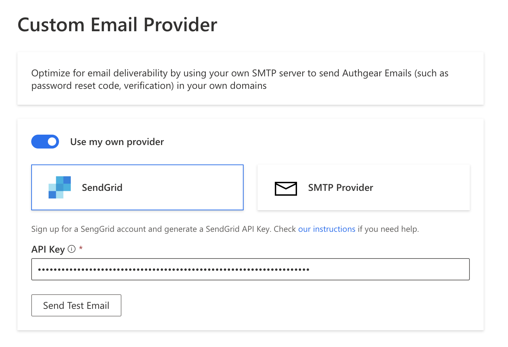
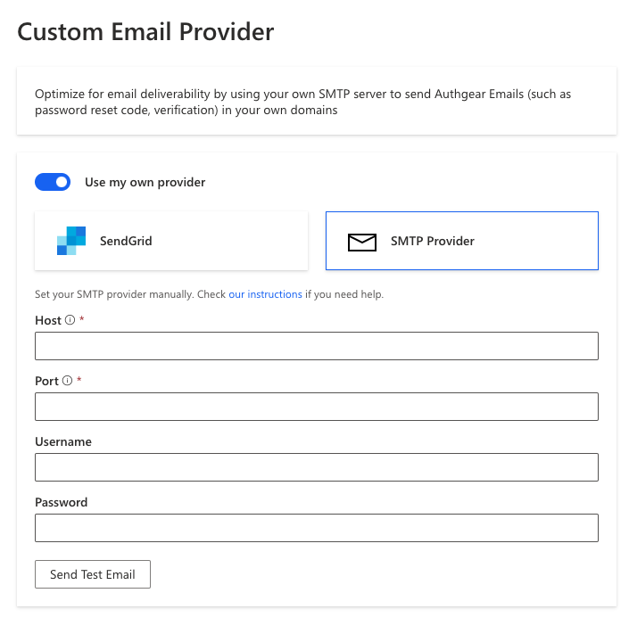

# Custom Email Provider

To send Authgear emails to end-users with your own domain, e.g. `support@myapp.com`. You will need to configure the external SMTP provider.

Authgear currently supports **SendGrid** and other custom SMTP Providers.

## Send from an email address under your domain

The sender address can be configured by changing the value of the`email.default.sender` key in the localization JSON. Go to **Portal** > **Branding** > **Custom Text** and add/change the value of `email.default.sender` to your own email address, for example `no-replay@myapp.com`, and **Save** the settings. The value can be set separately for each locale.&#x20;

<figure><figcaption></figcaption></figure>

## Sender domain authentication

Before adding the email service provider to Authgear, make sure the sender domain is verified and authenticated on the email service. For example, your domain `myapp.com` should be configured in your SendGrid account so Authgear can use the account to send emails with `no-reply@myapp.com`.

Follow the instructions from the email service provider for setting up your domain:

* [How to set up domain authentication on SendGrid](https://docs.sendgrid.com/ui/account-and-settings/how-to-set-up-domain-authentication)

## Configure the external SMTP provider

The external SMTP provider can be set up in **Portal** > **Advanced** > **Custom Email Provider**. Enable the **Use my own provider** toggle to see the fields.

### Use SendGrid as external SMTP provider

1. Log in to your SendGrid account
2. Create API Key in **Settings** > **API Keys**
3. Set the **API Key Name** for your reference the choose **Restricted Access** under **API Key Permissions**
4. Under **Access Details,** expand **Mail Send** and give **Full Access** to the **Mail Send** permission
5. Click **Create & View.** Copy the API key created and save it somewhere safe
6. In Authgear **Portal**, navigate to **Custom Email Provider**&#x20;
7. Enable **Use my own provider**.&#x20;
8. Choose **SendGrid** and paste the API key you copied, and **Save**
9. You can send a test email to check the configuration

### Using other SMTP Providers

Other SMTP providers can be set manually by providing the **Host**, **Port**, **Username**, and **Password**. They can be obtained from the documentation or instructions from your email service provider.

