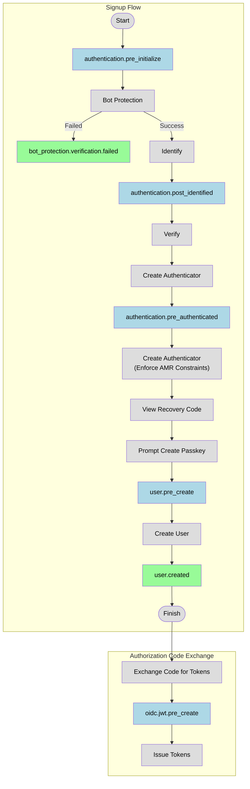
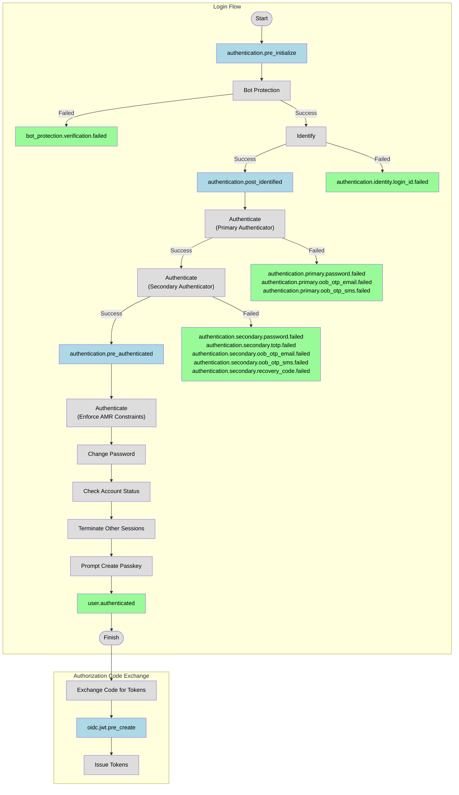

# Events and Hooks

Events are divided into two kinds, **Blocking** and **Non-blocking**.

Each event can have multiple hooks. The delivery order of non-blocking events is unspecified. Blocking events are delivered in the order as in the configuration.

## Event Body

Events have the following shape as the body:

```json
{
  "id": "0E1E9537-DF4F-4AF6-8B48-3DB4574D4F24",
  "seq": 435,
  "type": "user.pre_create",
  "payload": { /* ... */ },
  "context": {
    "app_id": "project-1"
    "client_id": "bfb2e0e0e7f3cfa2"
    "timestamp": 1670570552,
    "user_id": "f333b70b-4436-4efb-a40b-d9ed7a74d319",
    "preferred_languages": ["en-US", "zh-HK"],
    "language": "en-US",
    "triggered_by": "user"
    "oauth": {
      "state": "eyJ0b2tlbiI6IlgxS1RRTUM1TkRRUzQzOFAifQ"
    },
    "ip_address": "178.238.11.6",
    "geo_location_code": "GB",
    "user_agent": " Mozilla/5.0 (Windows NT 10.0; Win64; x64) AppleWebKit/537.36 (KHTML, like Gecko) Chrome/79.0.3945.79 Safari/537.36",

  }
}
```

* `id`: The ID of the event.
* `seq`: A monotonically increasing signed 64-bit integer.
* `type`: The type of the event.
* `payload`: The payload of the event, varies with type. See [blocking-events.md](blocking-events.md "mention") and [non-blocking-events.md](non-blocking-events.md "mention") for the detailed payload for each event.
* `context`: The context of the event.

### Event Context

The body of the context provides the details about the client and authentication signal collected:

* `app_id`: The ID of the Authgear project.
* `client_id`: The client ID of the application, if present.
* `timestamp`: signed 64-bit UNIX timestamp of when this event is generated. Retried deliveries do not affect this field.
* `user_id`: The ID of the user associated with the event. It may be absent. For example, the user has not authenticated yet.
* `ip_address`: The IP address of the HTTP request, if present.
* `user_agent`: The User-Agent HTTP request header, if present.
* `triggered_by`: The origin of the event, possible values are:
  * `user`: The event originates from a end-user facing UI.
  * `admin_api`: The event originates from the Admin API.
  * `system`: The event originates from a background job.
  * `portal`: The event originates from the management portal that does not use the Admin API, for example, "Collaborator invitation accepted",  "Domain created".
* `preferred_languages`: User preferred languages which are inferred from the request. It is the value of `ui_locales` query parameter if it is provided, or the value of the `Accept-Language` header. It is an empty array when the event is not generated by the end user.
* `language`: The locale which is derived based on user's preferred languages and app's languages config. The fallback value is the fallback language of the app.
* `geo_location_code`: The (ISO 3166-1 alpha-2 code)\[[https://www.iban.com/country-codes](https://www.iban.com/country-codes)] of the location derived from the ip address. `null` if the location cannot be determined by the ip address, for example, it is an internal ip address.
* `oauth`: Data related to OAuth. The field does not exist if the event is not from an OAuth flow (Such as SAML login).
  * `state`: `state` of the authorization request.
  * `x_state`: `x_state` of the authorization request.

## Blocking Events

Blocking events are triggered before the operation is performed, such as before user creation. This allow you to abort or alter the operations programmatically.

Learn more in:


[blocking-events.md](blocking-events.md)


## Non-blocking Events

Non-blocking events are triggered after the operation is performed. They are delivered to your hooks asynchronously after the operation is performed.

Learn more in:


[non-blocking-events.md](non-blocking-events.md)


## **Event Trigger Points in Signup/Login Flows**

This section outlines when each event is triggered within the _**default**_ signup and login flows, helping you understand where your hooks can interact with Authgear.

Note that the event timing may be changed in a customized authentication flow.

Legends:

* <mark style="background-color:blue;">**Blue**</mark>: Blocking events
* <mark style="background-color:green;">**Green**</mark>: Non-blocking events

### Default Signup flow



### Default Login Flow


