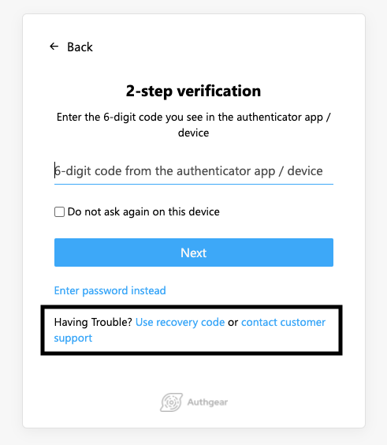

# Customer Support Link

In the case of losing access to the MFA authenticators, the end-user can recover their account by using the emergency Recovery Codes. However they may have lost the codes and need customer support.

## Set customer support link

You can add a customer support link in the Portal.

1. Go to **UI Settings** in the Portal
2. Fill in the **Customer Support Link** in the **Link Settings** section
3. **Save** the settings.

The value will be used as the `href` of `<a>` HTML tag. It can be a URL or a `mailto:` link.



## Customize the label

You can also modify the text shown to the end-users by including two special translation keys in `translation.json`.

```javascript
{
    "enter-recovery-code-instead-v1": "Having Trouble? <button class=\"btn secondary-btn\" type=\"submit\">Use recovery code</button>",
    "enter-recovery-code-instead-with-customer-support-v1": "Having Trouble? <button class=\"btn secondary-btn\" type=\"submit\">Use recovery code</button> or <a class=\"link\" target=\"_blank\" href={customerSupportLink}>contact customer support</a>",
}
```
