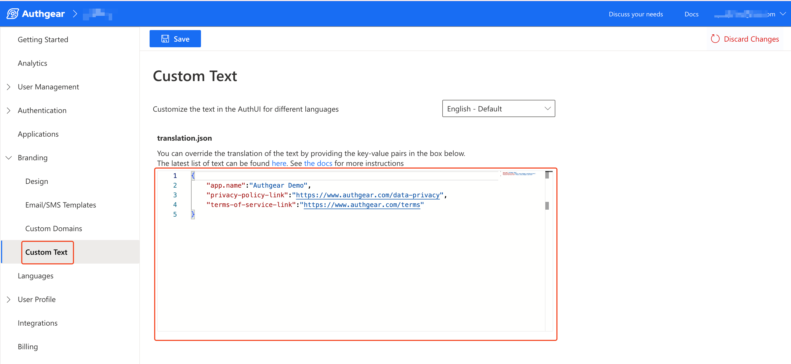

# Custom Text

You can customize the default text displayed in the AuthUI or provide your own translations by editing `translation.json`. **Custom Text** allows you to override specific UI strings across different languages.

Follow these steps to change any text in AuthUI.

1. Go to **Portal** > **Branding** > **Custom Text**
2. In the text box, add new key–value pairs or modify the values of existing keys in the JSON object.
   1. See default translation.json [here](https://github.com/authgear/authgear-server/blob/52b0c60d8ea2/resources/authgear/templates/en/translation.json) for a list of available keys and their default values.

Authgear uses **ICU Message Format** for message values.

<figure><figcaption></figcaption></figure>


Any value you provide will override the default. If you remove a key–value pair, Authgear will fall back to the default translation.


### Example: Displaying the Application Client Name in AuthUI

The AuthUI normally displays:

> **“Sign up or Log in to \[Organization Name]”**

This helps users understand that they will authenticate using credentials shared across all applications in the organization.

In some cases, however, you may want to display the **client application's name** instead of the organization name. You can achieve this using a `select` expression in ICU Message Format:


```
"v2.page.signup-login.default.subtitle": "Sign up or Log in to {ClientName, select, null {{AppName}} other {{ClientName}}}"
```


**Variables**

* `AppName`: The organization name configured in the **Design** page.
* `ClientName`: The name of the application client, found in the application’s **Details** page.

With this configuration:

* If `ClientName` is not provided, AuthUI will show the organization name (`AppName`).
* If `ClientName` is available, it will show the client application's name instead.
