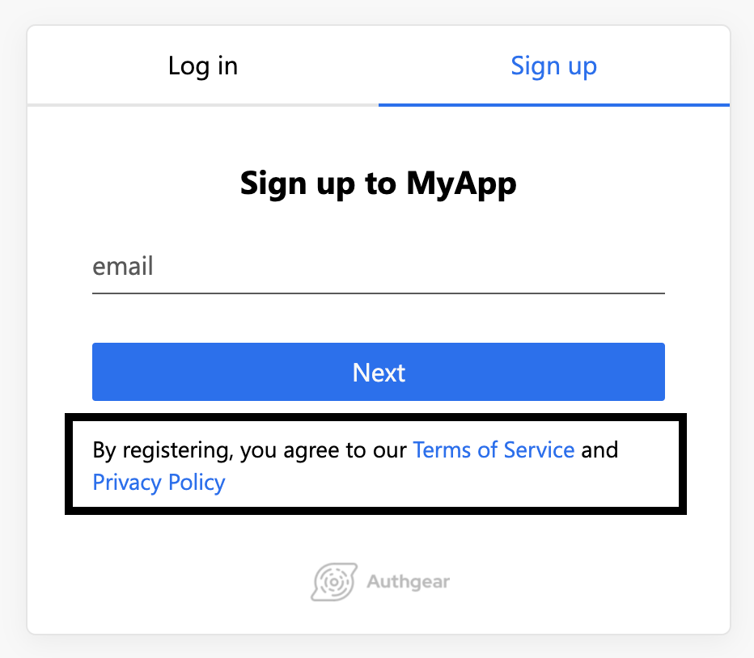

# Privacy Policy & Terms of Service Links

You can add a privacy policy and a terms of service link to the sign up page.&#x20;

&#x20;

## Change in the Portal

These two links can be easily added in the project Portal

1. Go to **UI Settings** in the Portal
2. Fill in the **Privacy Policy Link** and **Terms of Service Link** in the **Link Settings** section
3. **Save** the settings.

The values will be used as the `href` of `<a>` HTML tag so they must be valid URL. If both of the links are left empty, the whole paragraph on the signup page will be hidden.

## Edit translation.json

You can also add these links by including two special translation keys in translation.json.

The keys are `terms-of-service-link` and `privacy-policy-link`. The values will be used as the `href` of `<a>` HTML tag so they must be valid URL.

For example,

```javascript
{
  "terms-of-service-link": "https://mycompany.com/terms-of-service",
  "privacy-policy-link": "https://mycompany.com/privacy-policy"
}
```

If you wish to hide the whole paragraph, set BOTH to empty string.
