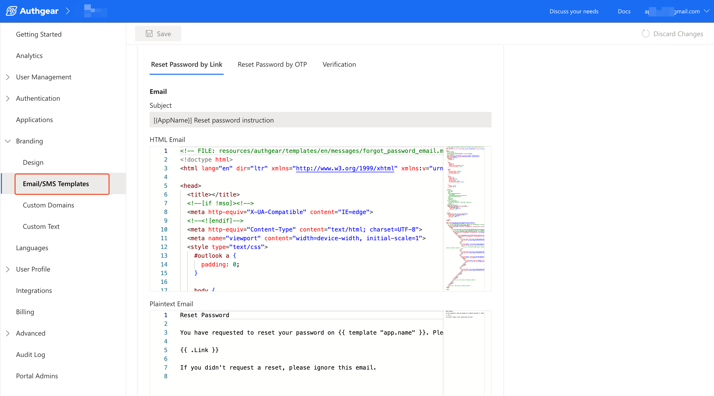

# Custom Email and SMS Templates

Authgear sends emails and SMS messages for events such as verifying an email address, signing in with a one-time password (OTP) or magic link, and resetting a password. You can fully customize the wording, branding, and layout of these messages from the Portal.

To set a custom email or SMS template, log in to Authgear Portal then navigate to **Branding** > **Email/SMS Templates**.

<figure><figcaption></figcaption></figure>

**Note:** You must upgrade your [project plan](https://docs.authgear.com/reference/billing-faq) to a paid plan to edit the templates.

### How templates work

Messages are rendered with [Go's templating engine](https://pkg.go.dev/text/template), and translation strings additionally support [ICU MessageFormat](https://unicode-org.github.io/icu/userguide/format_parse/messages/) for pluralization and selection. You can mix both in a single string:

* Insert a value with `{{ .Code }}` (Go template) or `{Code}` (ICU).
* Branch on a value with `{{ if .HasPassword }}…{{ else }}…{{ end }}` (Go template) or `{HasPassword, select, true{…} other{…}}` (ICU).

The teamplates support the same set of variables described below.

### Template variables

#### Available in every email and SMS template

| Variable                    | Description               |
| --------------------------- | ------------------------- |
| `{{ template "app.name" }}` | Your organization's name. |

The organization name is referenced as `{{ template "app.name" }}`, not as a data field. It is itself a translatable string, so changing the `app.name` translation updates it everywhere at once.

#### Per message type

<table><thead><tr><th width="178.64453125">Variable</th><th>Description</th><th>Available in</th></tr></thead><tbody><tr><td><code>{{ .Code }}</code></td><td>The one-time verification / OTP code. For magic-link and reset-by-link messages this is the same code encoded in the link.</td><td>Email/SMS verification, OOB OTP, login link, forgot password (link <strong>and</strong> OTP), WhatsApp OTP</td></tr><tr><td><code>{{ .Link }}</code></td><td>The full magic sign-in / verification / reset link.</td><td>Login-link and forgot-password <strong>link</strong> messages</td></tr><tr><td><code>{{ .Email }}</code></td><td>The recipient's email address.</td><td>Email messages, new-user password email</td></tr><tr><td><code>{{ .Phone }}</code></td><td>The recipient's phone number.</td><td>SMS messages</td></tr><tr><td><code>{{ .Password }}</code></td><td>An administrator-generated password.</td><td>"Send password to user" emails (Welcome email)</td></tr></tbody></table>

#### Advanced variables

These variables are also available in the rendering context. They are not used by the built-in templates, but you can reference them in custom templates.

| Variable             | Type    | Description                                                                                                   | Available in                                   |
| -------------------- | ------- | ------------------------------------------------------------------------------------------------------------- | ---------------------------------------------- |
| `{{ .HasPassword }}` | boolean | `true` if the user already has a password set. Use it to switch wording between "reset" and "set" a password. | Forgot-password email/SMS                      |
| `{{ .Host }}`        | string  | The host the request originated from (e.g. `auth.example.com`).                                               | OTP, verification, login-link, forgot-password |
| `{{ .ClientID }}`    | string  | The OAuth client ID that started the flow.                                                                    | Interactive web flows only                     |
| `{{ .ClientName }}`  | string  | The OAuth client's display name.                                                                              | Interactive web flows only                     |
| `{{ .State }}`       | string  | The OAuth `state` parameter.                                                                                  | Interactive web flows only                     |
| `{{ .XState }}`      | string  | The Authgear `x_state` parameter.                                                                             | Interactive web flows only                     |
| `{{ .UILocales }}`   | string  | The requested `ui_locales`.                                                                                   | Interactive web flows only                     |

Variables marked "Interactive web flows only" are populated from the request's UI parameters. They are **empty** when a message is sent outside an interactive flow, for example via the Admin API.

### Variables by message

Variables you can use in each message in the Email/SMS Templates page.

| Message                | Variables you can use                                 |
| ---------------------- | ----------------------------------------------------- |
| Reset Password by Link | `{{ .Link }}`, `{{ .Code }}`                          |
| Reset Password by OTP  | `{{ .Code }}`                                         |
| Verification           | `{{ .Code }}`                                         |
| Passwordless via Email | `{{ .Link }}` (link mode) or `{{ .Code }}` (OTP mode) |
| Passwordless via SMS   | `{{ .Code }}`                                         |
| MFA via Email          | `{{ .Code }}`                                         |
| MFA via SMS            | `{{ .Code }}`                                         |
| Welcome Message        | `{{ .Email }}`, `{{ .Password }}`                     |

### Examples

#### **SMS verification**

```
{{ .Code }} is your {{ template "app.name" }} verification code.
```

#### **Set password vs. reset password using `{{ .HasPassword }}`**

The forgot-password (link) message is also used to let a new user set their first password. Use `{{ .HasPassword }}` to adapt the wording.

Two equivalent forms are supported: ICU `select` (handy for one-line subjects) and Go-template `if` (handy for multi-line bodies)

**Subject:**

```
{HasPassword, select, true{Reset your account password} other{Set a password for your account}}
```

**Email content:**

```
{{ if .HasPassword }}
You requested to reset your password on {{ template "app.name" }}. Click the link below to choose a new password.
{{ else }}
Welcome to {{ template "app.name" }}! Click the link below to set a password for your account.
{{ end }}

{{ .Link }}
```

### Important notice for sending SMS to Chinese phone numbers (+86):

The template for SMS to Chinese numbers cannot be modified. As a result, Authgear will always use the default template for Chinese numbers even when you have set a custom template. All SMS other than OTPs (e.g. password reset links) will not be delivered.

Authgear will use your custom SMS template for other users with non-Chinese phone numbers.

The following is the content of the SMS template **regardless of locale** when sending to a Chinese phone number:

```
【简信】你的 {app-name} 登錄驗證碼是 {code}
```

The reason for this fallback is that services are required to register their SMS templates in advance with the officials before they can deliver to Chinese numbers. Authgear has registered the default SMS template such that it will deliver without any further action on your side.

Enterprise users who still wish to customize their SMS template for Chinese numbers can [contact us](https://www.authgear.com/schedule-demo) for more details.

### Important notice for sending SMS to Vietnamese (+84) and Taiwanese (+886) phone numbers

Due to the regulatory requirements from the local governments, all SMS messages to Vietnam & Taiwan must include the application name in the message body. If your users in Vietnam & Taiwan experience difficulties receiving SMS, try adding `[Authgear]` at the begining of the SMS template. SMS without `[Authgear]` may be blocked by the mobile operators. For example, your OTP message could appears like:

```
[Authgear] {code} is your {app-name} one-time password.
Don't share it with anyone.
```

```
[Authgear] {code} là mã xác minh {app-name} của bạn.
Vui lòng không chia sẻ mã này với bất kỳ ai.
```

```
[Authgear] {code} 是你的 {app-name} 驗證碼。
切勿分享給任何人。
```

Enterprise users who still wish to customize the beginning part of the message for Vietnamese & Taiwanese numbers can [contact us](https://www.authgear.com/schedule-demo) for more details.
