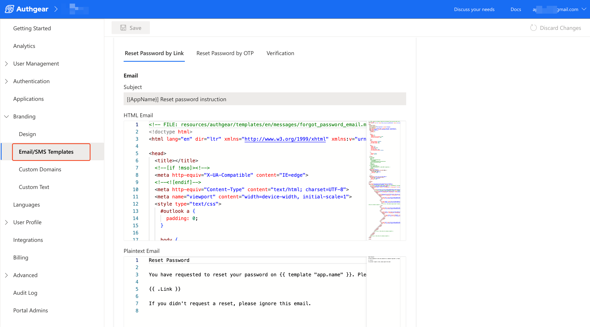

# Custom Email and SMS Templates

Authgear allows you to modify the default Email/SMS template content for sending password reset and verification messages.

To set a custom email or SMS template, log in to Authgear Portal then navigate to **Branding** > **Email/SMS Templates**.

<figure><figcaption></figcaption></figure>

You can edit the Email/SMS Templates for each language you have enabled for your application.

**Note:** You must upgrade your [project plan](https://docs.authgear.com/reference/billing-faq) to a paid plan to edit the templates.

### Important notice for sending SMS to Chinese phone numbers (+86):

The template for SMS to Chinese numbers can not be modified. As a result, even when you have set a custom template, Authgear will use the default template for Chinese numbers.&#x20;

Authgear will use your custom SMS template for other users with non-Chinese phone numbers.

The following is the content of the default SMS template:

For `locale = en` or other languages

```
【Authgear】{code} is your {app-name} one-time password.
```

For `locale = zh-Hant` (Traditional Chinese)

```
【Authgear】你的{app-name}一次性密碼為 {code}，請勿分享給任何人
```

For `locale = zh-Hans` (Simplified Chinese)

```
【Authgear】你的{app-name}一次性密码为 {code}，请勿分享给任何人
```

The reason for falling back to the above default SMS template is that services are required to register their SMS templates before they can deliver to Chinese numbers. Authgear has registered the default SMS template so that one will deliver without any further action on your side.

Enterprise users who still wish to customize their SMS template for Chinese numbers can [contact us](https://www.authgear.com/schedule-demo) for more details.

### Important notice for sending SMS to Vietnamese phone numbers (+84)

Due to the regulatory requirements from the local government, all SMS messages to Vietnam must include the application name in the message body. If your users in Vietnam experience difficulties receiving SMS, try adding `[Authgear]` at the begining of the SMS template. SMS without `[Authgear]` may be blocked by the mobile operators.  For example, your OTP message could appears like:

```
[Authgear] {code} is your {app-name} one-time password.
Don't share it with anyone.
```

Enterprise users who still wish to customize the beginning part of the message for Vietnamese numbers can [contact us](https://www.authgear.com/schedule-demo) for more details.
