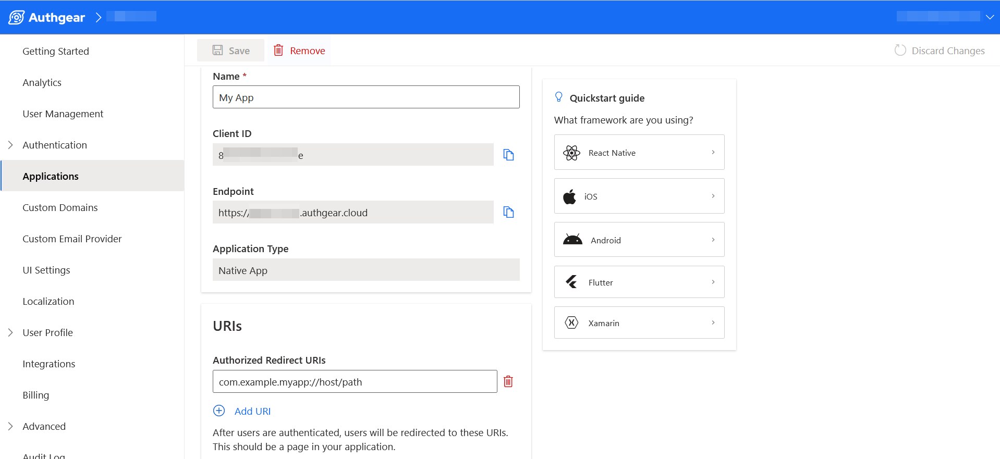
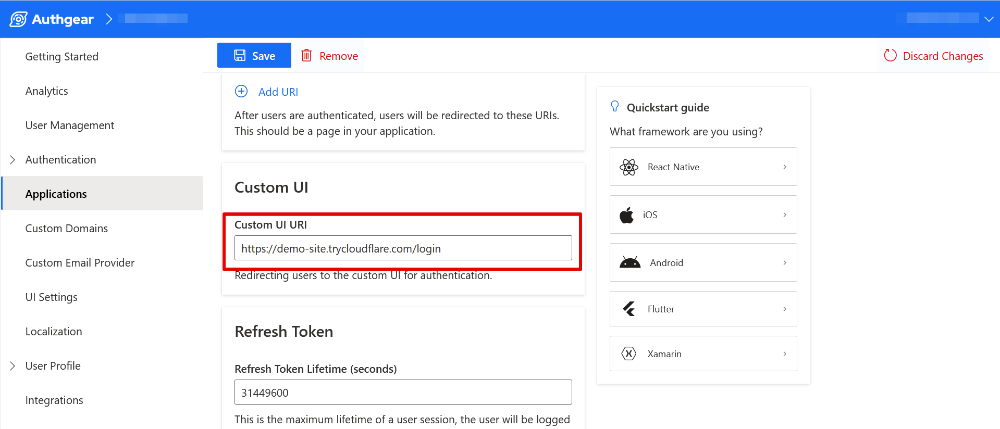

# Add Custom Login/Signup UI to Native Apps

Implementing custom login and signup screens in any native application (Flutter, React Native, Kotlin, or iOS) doesn't require much change to the code for your existing native apps that use Authgear.

At the moment, we don't support direct interaction between your native code and the Authentication Flow API that powers custom UIs. That means you'll need to use the platform-specific [SDKs](broken-reference) we already provide and call the authenticate method to start the authentication flow.

In this guide, we'll teach you how to implement custom authentication UIs in a Flutter app using the Flutter SDK and Authentication Flow API.

### Part 1: Configure Authgear Project in Portal

The main factor that enables custom UI in your Authgear application is specifying a custom UI URL in Authgear. Once this value is set, calling the authenticate method in any of the native SDKs will open the custom login/signup UI in a Web View instead of the default Auth UI.&#x20;

#### Step 1: Set up an Authgear Application

If you do not already have an Authgear application, login to Authgear Portal and navigate to **Application** > **Add Application** to create an application.

Enter your application name and select **Native App** as **Application Type** then click the **Save** button to continue.

<figure><figcaption></figcaption></figure>

#### Step 2: Set Authorized Redirect URI

In this step, you'll add a URI that Authgear will use to return your application to the front of the screen when authentication is complete.

For our example Flutter app, this URI will start with the package name for our app followed by `://host/path`.

To set the Redirect URI, scroll down to the **Authorized Redirect URI** under the **URIs** section of your application configuration page. Enter the correct URI for your application then click **Save**.

<figure><figcaption></figcaption></figure>

**Note**: You can find the package name for your Flutter app in `android/app/build.gradle` under `android > namespace`.

#### Step 3: Set Custom UI URI

Setting a value for Custom UI URI in Authgear Portal will redirect users of your application to your custom authentication UI instead of the default Auth UI. Hence, this is the most important step in adding custom login and signup UIs to your native application.

To set the Custom UI URI, scroll down to the **Custom UI** section on your application configuration page in the Authgear Portal. Then, add the URL to your custom login/signup page in the **Custom UI URI** text field.

<figure><figcaption></figcaption></figure>

This URL is a publicly accessible link on the web that hosts the code that implements your custom UI and does the actual interaction with the Authentication Flow API. Check out our examples for implementing custom login and signup UI pages using [PHP](implement-authentication-flow-api-using-php.md) and [JavaScript(Express)](implement-authentication-flow-api-using-express.md) to learn more.

### Part 2: Implement Flutter Application

If you have an existing Flutter app that implements the default AuthUI, it may not require any change to make use of the Custom UI URI you've set in the previous step.

But if you're creating a new application, follow these steps:

#### Step 1: Create a Flutter App

Run the following command to create a new Flutter application:

```sh
flutter create myapp
```

Make sure you have your local machine set up for Flutter development before you run the above command. See the official guide for setting up Flutter [here](https://docs.flutter.dev/get-started/install). Once you're down, open the new project folder in your preferred code editor (VS Code or Android Studio).

#### Step 2: Install Authgear Flutter SDK

Now install the Authgear Flutter SDK by running the following command from your project directory:

```sh
flutter pub add flutter_authgear
```

#### Step 3: Implement Authgear

To implement Authgear in your Flutter app use the SDK, please follow these instructions on the [Authgear Flutter SDK guide page](https://docs.authgear.com/get-started/native-mobile-app/flutter).

You can also find similar guides for other native platforms below:

* [React Native](https://docs.authgear.com/get-started/native-mobile-app/react-native)
* [Android SDK](https://docs.authgear.com/get-started/native-mobile-app/android)
* [iOS](https://docs.authgear.com/get-started/native-mobile-app/ios)
* [Xamarin](https://docs.authgear.com/get-started/native-mobile-app/xamarin)

#### Step 5: Test Your App

To test your application, run the following command:

```sh
flutter run
```

Tap on the **Authenticate** button when your app runs on a physical device or emulator.  You should see the custom UI instead of the default Auth UI.

### Conclusion

A very important to remember from the above guide is that when using custom authentication UI with a native application you can set up your app as you usually would with the default Auth UI. However, the main difference is that you should provide a link to your custom UI in the Authgear portal.

To learn more about using Authgear in your Flutter app, check out this page about the [Authgear Flutter SDK](https://docs.authgear.com/get-started/native-mobile-app/flutter).
