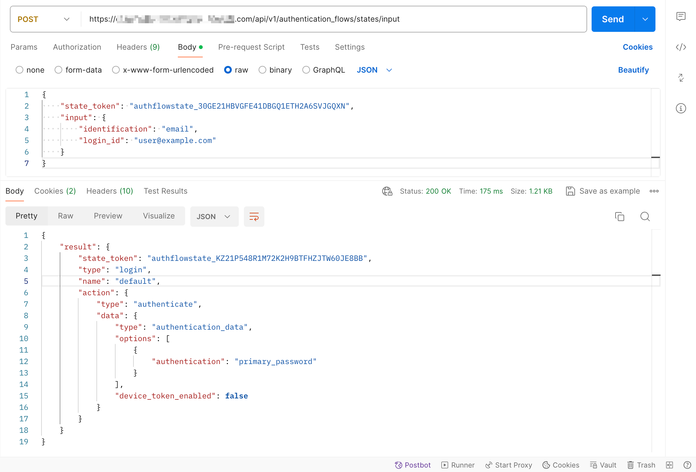
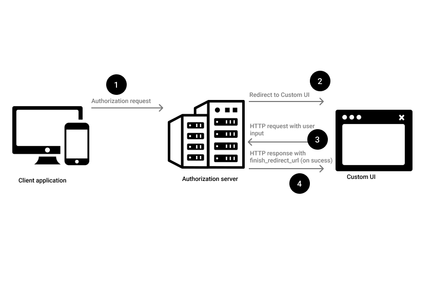

# Authentication Flow API

Build your own custom UI for login, signup, and more powered by the Authentication Flow API.

By default, when you set up an Authgear project, it makes use of the regular AuthUI offered by Authgear. Although AuthUI offers many customization options such as the ability to change the theme and color or add your brand logo to authentication pages, you might have more needs. With the Authentication Flow API, you can build your own authentication UI from the ground up, and using your preferred programming language and tool.

### What is the Authentication Flow API?

The Authentication Flow API is an REST HTTP API that you can use to create and run an authentication flow. You can use this API to create your own custom UI for pages like login, signup, account recovery, 2FA, and more.

To use the API on its own you make an HTTP request to one of the valid endpoints as shown below:

**Endpoint:** `{your-authgear-project-domain}/api/v1/authentication_flows`

**Request method:** POST

**Request header:**

```json
{
    "Content-Type": "application/json",
    "Accept": "application/json",
}
```

All requests to the API should include the above header.

**Request body:**

```json
{
    "type": "login",
    "name": "default"
}
```

The following is a sample of the response you would get from the Authentication Flow API for the above request:

```json
{
    "result": {
        "state_token": "authflowstate_VGHZ8SBCKGZK2KW84TCAKWGM8QZH0B69",
        "type": "login",
        "name": "default",
        "action": {
            "type": "identify",
            "data": {
                "options": [
                    {
                        "identification": "phone"
                    },
                    {
                        "identification": "email"
                    },
                    {
                        "identification": "oauth",
                        "provider_type": "google",
                        "alias": "google"
                    }
                ]
            }
        }
    }
}
```

The above response means you've successfully started a new login flow using the API.

To continue and finish the authentication flow, you can send the value for `state_token` from the above response in your next HTTP request to the `api/v1/authentication_flows/states/input` endpoint like the example shown below:

**Endpoint:** `{your-authgear-project-domain}/api/v1/authentication_flows/states/input`

**Request method:** POST

To help you understand the structure of the Authentication Flow API HTTP(S) request, here is an example of an actual request in Postman:

<figure><figcaption></figcaption></figure>

**Request body:**

```json
{
    "state_token": "authflowstate_VGHZ8SBCKGZK2KW84TCAKWGM8QZH0B69",
    "input": {
        "identification": "email",
        "login_id": "user@example.com"
    }
}
```

In this second request (or second step of the authentication flow), we use the `state_token` from the response to the previous request in the request body to continue the authentication flow. The request body includes the `input` field that passes the type of  `identification`  the user will provide (for example, `email`) and the `login_id` which is the actual value for the user's identification.

The response to the above request should look like this:

```json
{
    "result": {
        "state_token": "authflowstate_ABCJVB0IJKLQ2S1K2G34RX56R1C1E789",
        "type": "login",
        "name": "default",
        "action": {
            "type": "authenticate",
            "data": {
                "type": "authentication_data",
                "options": [
                    {
                        "authentication": "primary_password"
                    }
                ],
                "device_token_enabled": false
            }
        }
    }
}
```

You may send more requests just like this second request depending on the number of steps required for your specific authentication flow. For example, to complete the login authentication flow, send another request with the the authenticator (password) like this:

```json
{
    "state_token": "authflowstate_ABCJVB0IJKLQ2S1K2G34RX56R1C1E789",
    "input": {
        "authentication": "primary_password",
        "password": "sup3r$tr0ngpa$$"
    }
}
```

To use the Authentication Flow API to build your custom UI, you need to configure a Custom UI URI in the Authgear portal. This URI should point to your custom authentication page.

For more details about the Authentication Flow API endpoints, inputs, response, and more visit the [API reference page](../../../reference/apis/authentication-flow-api.md).

### How the Authentication Flow API Works

The following flowchart shows the steps in a simple Authentication Flow API implementation:

<figure><figcaption><p>flowchart showing how authentication flow API works</p></figcaption></figure>

#### Step 1: Make Authorization Request

When you use the authentication flow API to power your custom UI, the authentication flow for your app will start with your app sending an authorization request to Authgear's authorization server as shown in **step 1** in the figure above.

#### Step 2: Redirect to Custom UI

If you have Authentication Flow API enabled and a Custom UI URI set for your Authgear App, the authorization server will redirect your users to the custom UI as shown in **step 2** above.

#### Step 3: Make HTTP Requests to Authentication Flow API Endpoints

In your custom UI, implement the code that interacts with the Authentication Flow API (using HTTP requests) as demonstrated in **step 3** of the above figure.

#### Step 4: Finish the Authentication Flow

In an authentication flow with multiple steps, the custom UI and Authgear's authentication server may perform **steps 3** and **4** in the above figure multiple times. In such cases, only the final response at the end of the authentication flow will include a **finish\_redirect\_url**.

You must redirect your user to the **finish\_redirect\_url** to complete the authentication flow.

To dive deeper into how to use the Authentication Flow API to power your custom UI, check out the following tutorials for your preferred programming languages and frameworks.


[implement-authentication-flow-api-using-php.md](implement-authentication-flow-api-using-php.md)



[implement-authentication-flow-api-using-express.md](implement-authentication-flow-api-using-express.md)

