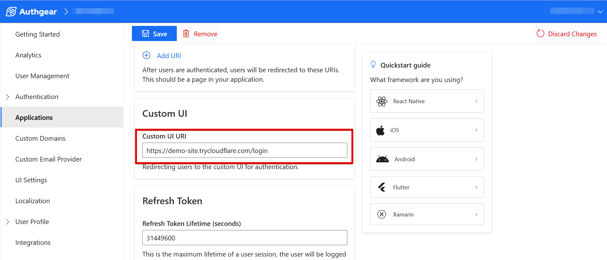

# Implement Authentication Flow API using Express

With the Authentication Flow API, you can replace the default Auth UI provided by Authgear with your own custom UI built from the ground up.

In this post, we'll walk you through an example of building your own custom login and signup pages using Express and the Authentication Flow API.

Before we continue, it's important for you to familiarize yourself with the following concepts about the Authentication Flow API:

* **URL Query**: This is an additional set of URL query parameters that Authgear adds to your Custom UI URI during the initialization of the authentication flow. The initial request to the Authentication Flow API must include this URL query in order to return get value for `finish_redirect_uri` at the end of the flow.
* **Endpoint**: Your Authgear project's domain is visible on your application configuration page in Authgear Portal, under the **Endpoint** section. Your full endpoint is your Authgear domain followed by a valid path for an operation (such as starting a new authentication flow, or sending input to an existing flow. For example, `https://my-project.authgear.cloud/api/v1/authentication_flows` to start an authentication flow and `https://my-project.authgear.cloud/api/v1/authentication_flows/states/input` to send input to an existing flow.
* **State Token**: The Authentication Flow API supports authentication with multi-step UI just like the default authentication flow in Auth UI. State tokens can be used to make this type of type of authentication flow work. You can pass information about a previous step to the next step by using the state token. For example, using the state token in the result of step A as input in step B to continue using the state of the previous step.
* **Inputs**: You can pass values to Authentication Flow API using the `input` or `batch_input` parameters in your HTTP request body. Use the `batch_input` to send multiple values as in an array and `input` when you are passing only 1 value.
* **Finish Redirect URI**: This is a URL that you can use to redirect back to your app at the end of the authentication flow.

**Note**: In order to follow this tutorial and implement the example app, you need to enable a login method that supports "Email and Password" under **Authentication** > **Login Methods** in Authgear Portal. Also, disable 2FA Requirements from **Authentication** > **2FA** in Authgear Portal.

### Prerequisites

In order to follow along with the example in this post, you should have the following:

* [Node.js](https://nodejs.org/) is installed on your local machine.
* A code editor such as VS Code, Sublime, Atom, etc.
* An Authgear account. You can create one for free [here](https://www.authgear.com/).
* Be familiar with CLI tools like npm.
* Enable Custom UI for your Authgear Project. [Contact us](https://www.authgear.com/talk-with-us) to enable custom UI.

Next, set up your Authgear project to use custom authentication UI by following the steps below.

### Part 1: Configure Authgear Project in Portal

An important part of getting your application ready to use custom authentication UI is to configure your Authgear project in Portal. In this section, we'll cover the configuration required for the example app.

#### Step 1: Set up Authgear Application

Login to the Authgear Portal and navigate to the **Application** section. Select an existing application and modify it or click on the **Add Application** button to create a new application.

Configure your application using the following details:

* **Application name**: My app \<or any name of your choice>
* **Application type**: **OIDC Client Application**

Once you're done, click on the **Save** button to continue.

**Note**: You can select any Application Type on the Portal depending on the nature of your client application that will be interacting with Authgear and your Custom UI.

To follow this example, select **OIDC Client Application** as your Application type.

<figure><figcaption></figcaption></figure>

#### Step 2: Add Authorized Redirect URIs

An **Authorized Redirect URI** is a page on your application that you want Authgear to redirect users to at the end of an authentication flow.

To add an Authorized Redirect URI, scroll to the URIs section on your Authgear application configuration page. Click on the **Add URI** button then enter a valid URI for your application.

For our example, the redirect URI will be:

```
http://localhost:3000/
```

Once you're done, click on the **Save** button to keep your changes.

<figure><figcaption><p>authgear portal app config redirect uri</p></figcaption></figure>

#### Step 3: Set Custom UI URI

To use your custom authentication UI with Authgear, you need to specify the URI for your custom UI in the Authgear portal using the custom UI URI field. This will cause your application to show the custom UI instead of the default Auth UI during login/sign. The custom UI URI is basically a link to your custom login page.

Since we'll be testing the example app on a browser that runs on the same computer as the Express server, you can use the following value for the Custom UI URI:

```
http://localhost:3000/login
```

Alternatively, you can get a public URL for our local Express app with **CloudFlare Tunnel**. See more instructions on how to set up CloudFlare tunnel on your local machine [here](https://developers.cloudflare.com/pages/how-to/preview-with-cloudflare-tunnel/).

To set the custom UI URI, scroll to the **Custom UI** section on your application configuration page and paste the URL (e.g the unique public URL from CloudFlare Tunnel) in the **Custom UI URI** text box.

**Note**: For our example app, you must include the `/login` path in the URL so that the user is redirected straight to our login route.

<figure><figcaption></figcaption></figure>

#### Step 4: Enable Email + Password Login Option and Disable 2FA

For our example app in this tutorial, users will be using their email and password to log in. Hence, you are required to enable this option in the Authgear Portal.

To do that, enable the "Email + Password" option under **Authentication** > **Login Methods**.

<figure><figcaption></figcaption></figure>

Also, disable 2FA (if enabled) so that the authentication flow does not include an extra step which our demo app will not cover. You can disable 2FA Requirements in **Authentication** > **2FA** in the Authgear Portal.

<figure><figcaption></figcaption></figure>

### Part 2: Implementing Authentication Flow API

In this part of the guide, we'll implement custom login and signup pages using Express and the Authentication Flow API.

The application you'll build in this part is the same application your Custom UI URI should point to.

#### Step 1: Setup Authgear Express Example App

Create a basic Express application for your Authgear project.

To do that, first run the following commands on your computer to create a new project folder and install all the necessary dependencies:

Create project folder/directory:

```sh
mkdir authgear-express-example
```

Change your working directory to the new folder by running the following command:

```sh
cd authgear-express-example
```

Install Express:

```sh
npm install express
```

For our example application, we'll be using the Axios node package to make HTTP requests. Run the following command to install Axios in your project:

```sh
npm install axios
```

Install dotenv. We'll use this package to enable the use of .env file to store project configuration:

```sh
npm install dotenv
```

After installing the above dependencies, create a new app.js file in the project directory you created earlier. Add the following code to the file:

```javascript
const express = require('express');
const axios = require('axios');
require("dotenv").config();

const app = express();
app.use(express.urlencoded({ extended: true }));
const port = process.env.PORT || 3000;

const config = {
  client: {
    id: process.env.CLIENT_ID,
    secret: process.env.CLIENT_SECRET,
    redirect_url: process.env.REDIRECT_URL
  },
  auth: {
    tokenHost: process.env.AUTHGEAR_ENDPOINT,
    tokenPath: '/oauth2/token',
    authorizePath: '/oauth2/authorize'
  },
};

app.get('/', async (req, res) => {

  if (req.query.code != null) {
    const data = {
      client_id: config.client.id,
      client_secret: config.client.secret,
      code: req.query.code,
      grant_type: 'authorization_code',
      response_type: 'code',
      redirect_uri: config.client.redirect_url,
      scope: "openid"
    };

    try {
      const getToken = await axios.post(`${config.auth.tokenHost}${config.auth.tokenPath}`, data, {
        headers: { "Content-Type": "application/x-www-form-urlencoded" }
      });

      const accessToken = getToken.data.access_token;

      //Now use access token to get user info.
      const getUserInfo = await axios.get(`${config.auth.tokenHost}/oauth2/userinfo`, { headers: { "Authorization": "Bearer " + accessToken } });
      const userInfo = getUserInfo.data;
      res.send(`
        <div style="max-width: 650px; margin: 16px auto; background-color: #EDEDED; padding: 16px;">
          <p>Welcome ${userInfo.email}</p>
          <p>This demo app shows you how to add user authentication to your Express app using Authgear</p>
          <div>
            <pre>${JSON.stringify(userInfo, null, 2)}</pre>
          </div>
            <p>Checkout <a href="https://docs.authgear.com">docs.authgear.com</a> to learn more about adding Authgear to your apps.</p>
          
        </div>
    `);
    } catch (error) {
      res.send("An error occurred! Login could not complete. Error data: " + JSON.stringify(error.response.data));
    }
  }

  else {
    res.send(`
      <div style="max-width: 650px; margin: 16px auto; background-color: #EDEDED; padding: 16px;">
        <p>Hi there!</p>
        <p>This demo app shows you how to add user authentication to your Express app using Authgear</p>
          <p>Checkout <a href="https://docs.authgear.com">docs.authgear.com</a> to learn more about adding Authgear to your apps.</p>
        <a href="/startLogin">Login</a>
      </div>
    `);
  }
});

app.get('/startLogin', (req, res) => {
  res.redirect(`${config.auth.tokenHost}${config.auth.authorizePath}/?client_id=${config.client.id}&redirect_uri=${config.client.redirect_url}&response_type=code&scope=openid`);
});
```

Create a `.env` file then add the following code to it:

```properties
CLIENT_ID=paste_your_client_id_here
CLIENT_SECRET=paste_your_client_id_here
AUTHGEAR_ENDPOINT=paste_your_client_id_here
REDIRECT_URL=http://localhost:3000/
```

Add the correct values from your Authgear application configuration page in the .env file.

At the end of this step, you should have an Express application that can connect to Authgear. However, we are yet to implement the custom login/signup page. In the next steps, we'll implement both pages.

#### Step 2: Create Login Page

Add the following code to your app.js file just below the `app.get('/startLogin',...)` route:

```javascript

function rawURLQuery(url) {
    const index = url.indexOf('?');
    return (index >= 0) ? `?${url.substr(index + 1)}` : "";
}

app.get('/login', (req, res) => {
    //get URL query
    const URLQuery = rawURLQuery(req.url);
    res.send(`
    <!DOCTYPE html>
    <html lang="en">

    <head>
        <meta charset="UTF-8">
        <meta name="viewport" content="width=device-width, initial-scale=1.0">
        <link rel="stylesheet" href="https://cdn.jsdelivr.net/npm/bootstrap@4.0.0/dist/css/bootstrap.min.css"
            integrity="sha384-Gn5384xqQ1aoWXA+058RXPxPg6fy4IWvTNh0E263XmFcJlSAwiGgFAW/dAiS6JXm" crossorigin="anonymous">
        <title>Login</title>
    </head>

    <body>
        <div class="container pt-4">
            <form class="" action="./login" method="POST" enctype="application/x-www-form-urlencoded">
                <div class="">
                    <label class="">
                        Email
                    </label>
                    <input name="email" id="email" type="email" class="form-control mb-2" placeholder="Enter your email" />
                </div>
                <div>
                    <label>
                        Password
                    </label>
                    <input name="password" id="password" type="password" class="form-control mb-2" placeholder="Enter your password" />
                </div>
                <input type="hidden" name="url_query" value="${URLQuery}">
                <button type="submit" class="btn btn-primary">
                    Submit
                </button>
            </form>
            <div>
                <span>Or</span>
                <a href="/signup?${URLQuery}">Sign Up</a>
            </div>
        </div>
    </body>
    </html>
    `);
});

app.listen(port, () => {
    console.log(`server started on port ${port}!`);
});
```

The above code sets up a basic email + password login page using Express.

The `rawURLQuery()` function extracts the URL query we mentioned earlier from the URL of the login page. The code includes the query as the value for an `<input type="hidden">` so that we can include the value in the request we'll make to the Authentication Flow API later.

The following screenshot shows the output of the login page in a browser:

<figure><figcaption></figcaption></figure>

#### Step 3: Implement Login Flow

Now your application needs to make an HTTP request to the Authentication Flow API with the user inputs to authenticate them.

First, we'll create a `userLogin()` function that sends the HTTP request. To do that, add the following code to your **app.js** just above the declaration of the `rawURLQuery()` function:

```javascript
const endpoint = process.env.AUTHGEAR_ENDPOINT;

async function userLogin(email, password, url_query) {
    const url = `${endpoint}/api/v1/authentication_flows?${url_query}`;

    const input = {
        "type": "login",
        "name": "default",
        "batch_input":
            [
                {
                    "identification": "email",
                    "login_id": email
                },
                {
                    "authentication": "primary_password",
                    "password": password
                }
            ]
    };

    const headers = {
        "Content-Type": "application/json",
        "Accept": "application/json",
    }

    try {
        const startLogin = await axios.post(`${url}`, input, {
            headers: headers
        });
        return startLogin;
    }
    catch (error) {
        return error.response;

    }
}
```

Here are a few key things to note about the above code:

* The code initiates an Authentication Flow API request of type `login` and finishes the entire login flow in a single step (one HTTP request).
* As we mentioned earlier, the URL query from Authgear is added to the API endpoint for the initial request.
* The user inputs (email and password) are sent in the request body using the `batch_input` parameter.

The structure of the HTTP response will look like this:

```json
{
    "result": {
        "state_token": "authflowstate_RB482Y95Q4BT8D4CAHXD499Y21MGAH2J",
        "type": "login",
        "name": "default",
        "action": {
            "type": "finished",
            "data": {
                "finish_redirect_uri": "https://cube-crisp-110.authgear-staging.com/oauth2/consent?code=HD2AS7394RJCGVYWYHQHXGDKYX8BZ28Q"
            }
        }
    }
}
```

Now add the following code after the `app.get('/login',...)` route to create a new route that handles the action of submitting the login form:

```javascript
app.post('/login', async (req, res) => {
    try {
        const apiResponse = await userLogin(req.body.email, req.body.password, req.body.url_query);
        if (apiResponse.status == 200 && apiResponse.data.result.action.data.finish_redirect_uri !== undefined) {
            res.redirect(apiResponse.data.result.action.data.finish_redirect_uri);
        } else {
            //this code will run usually when your authentication flow starts without the URL Query in the initial request.
            res.send(apiResponse.data);
        }
    }
    catch (error) {
        console.log(error);
        res.send("Error: authentication failed!");
    }
});
```

Once the login flow is complete and a `finish_redirect_uri` is returned, we redirect the user to this URL for Authgear to finish the authentication process and redirect the user back to your application.

#### Step 4: Test the Login Flow

To test your progress so far, start your Express app by running the following command:

```sh
node app.js
```

Now open your app in a web browser by visiting `localhost:3000`. Once the page loads, click on the **Login** link. You should be redirected to the custom login page instead of the default Auth UI by Authgear.

Enter a valid email and password and click the Submit button. You should be redirected back to your application on successful login.

#### Step 5: Initialize Signup Flow

This step includes an example of using the Authentication Flow API for user signup. Unlike in the previous login flow example, this time we'll use the API to perform a signup flow using 2 steps(also 2 HTTP requests).

The first step is to initialize the signup flow. To do that, create an `initSignUp()` function just after the `userLogin()` function in **app.js** using the following code:

```javascript
//function for first step of signup flow
async function initSignUp(url_query) {
    const url = `${endpoint}/api/v1/authentication_flows?${url_query}`;

    const input = {
        "type": "signup",
        "name": "default"
    };

    const headers = {
        "Content-Type": "application/json",
        "Accept": "application/json",
    }

    try {
        startSignUp = await axios.post(url, input, {
            headers: headers
        });

        return startSignUp.data.result.state_token;
    }
    catch (error) {
        return error.response;
    }
}
```

Here is a breakdown of what the above code does:

* First, in the code, the value for the URL query is added to the Authentication Flow API endpoint so as to meet the requirement for getting the `finish_redirect_uri` at the end of the flow.
* The type of authentication flow is also specified as `signup` in the `input` variable that's passed in the HTTP request body.
* The function returns the value of `state_token` from the HTTP request response. This value is required in the next step (request) to continue the signup flow.

#### Step 6: Create Signup Page

To create the actual page with a signup, add the following code just after the `app.post('/login',...)` route in **app.js**:

```javascript
app.get('/signup', async (req, res) => {
    const URLQuery = rawURLQuery(req.url);
    res.send(`
        <!DOCTYPE html>
        <html lang="en">
        
        <head>
            <meta charset="UTF-8">
            <meta name="viewport" content="width=device-width, initial-scale=1.0">
            <link rel="stylesheet" href="https://cdn.jsdelivr.net/npm/bootstrap@4.0.0/dist/css/bootstrap.min.css"
                integrity="sha384-Gn5384xqQ1aoWXA+058RXPxPg6fy4IWvTNh0E263XmFcJlSAwiGgFAW/dAiS6JXm" crossorigin="anonymous">
            <title>Register</title>
        </head>
        
        <body>
            <div class="container pt-4">
                <form class="" action="./signup" method="POST" enctype="application/x-www-form-urlencoded">
                    <div class="form-group">
                        <label class="">
                            Email
                        </label>
                        <input name="email" type="email" class="form-control mb-2" placeholder="Enter your email" />
                    </div>
                    <div class="form-group">
                        <label>
                            Password
                        </label>
                        <input name="password" type="password" class="form-control mb-2" placeholder="Enter your password" />
                    </div>
                    <div class="form-group">
                        <label>
                            Repeat Password
                        </label>
                        <input name="password2" type="password" class="form-control mb-2" placeholder="Enter your password" />
                    </div>
                    <input type="hidden" name="state_token" value="${await initSignUp(URLQuery)}">
                    <button type="submit" class="btn btn-primary">
                        Submit
                    </button>
                </form>
            <div>
        </body>
        </html>
    
    `);
});
```

The above code contains the HTML code for rendering a simple email and password signup page. It also calls the `initSignUp()` to start the authorization flow and add the state token in an `<input type="hidden">`.

#### Step 7: Complete the Signup Flow

To complete the signup flow, first create a `submitSignUpData()` function by adding the following code just after the `initSignUp()` function in **app.js**:

```javascript
async function submitSignUpData(email, password, state_token) {
    const url = `${endpoint}/api/v1/authentication_flows/states/input`;

    const input = {
        "state_token": state_token,
        "batch_input":
            [
                {
                    "identification": "email",
                    "login_id": email
                },
                {
                    "authentication": "primary_password",
                    "new_password": password
                }
            ]
    };

    const headers = {
        "Content-Type": "application/json",
        "Accept": "application/json",
    }

    try {
        const sendSignUpData = await axios.post(`${url}`, input, {
            headers: headers
        });
        return sendSignUpData;
    }
    catch (error) {
        console.log(error.response);
        return error.response;
    }
}
```

The above code implements the second step of the signup flow. It takes the state token from the first step and sends it in the second HTTP request so that the flow can continue.

Next, add the following code just after the `app.get('/signup',...)` route:

```javascript
app.post('/signup', async (req, res) => {
    try {
        const apiResponse = await submitSignUpData(req.body.email, req.body.password, req.body.state_token);
        if (apiResponse.status == 200 && apiResponse.data.result.action.data.finish_redirect_uri !== undefined) {
            res.redirect(apiResponse.data.result.action.data.finish_redirect_uri);
        } else {
            //this code will run usually when your authentication flow starts without the URL Query in the initial request.
            res.send(apiResponse.data);
        }
    }
    catch (error) {
        console.log(error)
        res.send("Error: authentication failed!");
    }
});
```

The above code calls the `submitSignUpData()` function which initiates the second step of the signup flow and submits the user inputs. At the end, the user is redirected to the `finish_redirect_uri` again to complete the authentication process.

### Conclusion

Just like we've implemented custom UI for email and password authentication in this example, you can design custom UIs for other authentication flows that Authgear supports. For example, OTP and TOTP.

To learn more about all the endpoints the Authentication Flow API supports, and their inputs and outputs, you should check out the API reference page for Authentication Flow API.

You can find the complete code for the example application in this post in our [Authentication Flow API Example GitHub repository](https://github.com/authgear/authflow-example-express).
