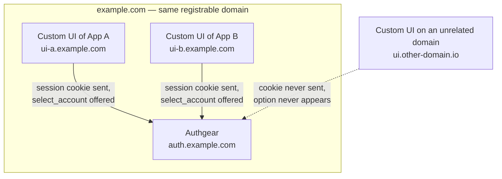
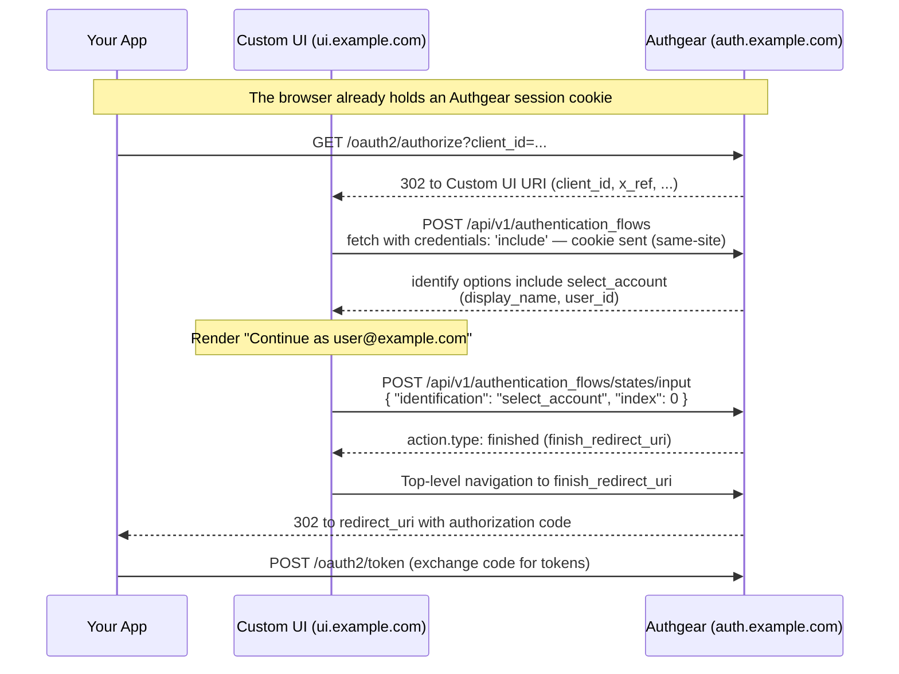

# Single Sign-On Continuation with Custom UI

When an end-user already has an active Authgear session in their browser, your Custom UI can show a **"Continue as user@example.com"** option instead of asking them to enter their credentials again. This is powered by `select_account`, an identification option you can add to the `identify` step of `login` and `signup_login` flows.

`select_account` works through the same Authentication Flow API endpoints your Custom UI already calls — there is no new endpoint and no new token. When the browser has an eligible session, the `identify` step's response includes an extra option describing the account; when there is none, the response looks exactly as it did before, so a Custom UI that does not recognize the option keeps working unchanged.

If you are new to building a Custom UI, read the [Authentication Flow API](authentication-flow-api.md) overview first.

## Use cases

**Single sign-on across apps in the same project.** Two applications, App A and App B, are OAuth clients of the same Authgear project, and each has its own Custom UI. A user signs in to App A, then opens App B for the first time in the same browser. Because the Authgear session cookie is shared, App B's Custom UI can offer to continue as the same account — the user clicks once instead of typing their credentials again.

**A single "Continue" entry point.** Your Custom UI uses one combined screen (a `signup_login` flow) instead of separate sign-in and sign-up pages. When a session already exists, the screen shows "Continue as user@example.com" alongside the usual email and social login options. Declining is nothing special: the user simply picks another option, and can even register a second account that way.

## Prerequisites

* **Your Custom UI must be same-site with your Authgear endpoint.** The browser only sends the Authgear session cookie to the Authentication Flow API when your Custom UI and your Authgear endpoint share a registrable domain — for example `auth.example.com` and `ui.example.com`. In practice this means setting up a [Custom Domain](../../custom-domain.md) for your project. A Custom UI hosted on an unrelated domain never sees the `select_account` option.
* **Custom UI URI configured.** Your OAuth client must have its **Custom UI URI** set in the Authgear Portal (**Applications** > your application > **Custom UI**). Authgear allows cross-origin requests with credentials from origins registered as a Custom UI URI, so no extra CORS setup is needed on your side.
* **Send the session cookie from the browser.** Calls to the Authentication Flow API made with `fetch()` must use `credentials: 'include'`, otherwise the session cookie is not sent and the option never appears.




If your Custom UI has separate sign-in and sign-up screens, its **first** call to create a flow must be of type `login` or `signup_login` — never `signup` directly. `select_account` only exists in those two flow types, so starting with `signup` means you never find out that a session exists. Create a separate `signup` flow afterward only if the user has no eligible session (or declines it) and wants a new account.


## How it works

The select-account exchange sits inside the same OAuth flow every Custom UI already follows — the only new parts are the extra option in the `identify` response and the one-click input that completes it:



The user never typed a credential — the only interaction was the click on "Continue as user@example.com". When there is no eligible session, the third step's response simply has no `select_account` entry and your UI proceeds as a normal login.

## Step 1: Add select\_account to your flow config

In the Authgear Portal, go to **Advanced** > **Edit Config** and add `select_account` to the `identify` step of your login flow, under the `authentication_flow` section:


```yaml
authentication_flow:
  login_flows:
  - name: default
    steps:
    - type: identify
      one_of:
      - identification: select_account
      - identification: email
        steps:
        - type: authenticate
          one_of:
          - authentication: primary_password
```


The `select_account` entry above has no nested `steps`, so choosing it completes the login immediately. To ask for something extra first (for example a 2FA code), give the entry its own nested `authenticate` step — see [Require 2FA on continuation](#require-2fa-on-continuation) below.

## Step 2: Detect the option in your Custom UI

Create the flow as usual, forwarding the query parameters Authgear passed to your Custom UI URI (in particular `client_id` and `x_ref`) via `url_query`:

```javascript
const response = await fetch("https://auth.example.com/api/v1/authentication_flows", {
  method: "POST",
  credentials: "include", // required: sends the Authgear session cookie
  headers: { "Content-Type": "application/json" },
  body: JSON.stringify({
    type: "login",
    name: "default",
    url_query: window.location.search.substring(1),
  }),
});
```

When the browser has an eligible session, the `identify` step's `options` include a `select_account` entry with the account's display name and user ID:

```json
{
    "result": {
        "state_token": "authflowstate_VGHZ8SBCKGZK2KW84TCAKWGM8QZH0B69",
        "type": "login",
        "name": "default",
        "action": {
            "type": "identify",
            "data": {
                "type": "identification_data",
                "options": [
                    {
                        "identification": "select_account",
                        "display_name": "user@example.com",
                        "user_id": "user_01J8ZC0M2N3P4Q5R6S7T8V9W0X"
                    },
                    {
                        "identification": "email"
                    }
                ]
            }
        }
    }
}
```

Use `display_name` to render the "Continue as user@example.com" button. Unlike `masked_display_name` elsewhere in this API, it is returned unmasked: it identifies the account already bound to the caller's own session cookie, so there is nothing to hide.

When there is no eligible session, the `select_account` entry is simply absent and the response is identical to what it was before this feature.

## Step 3: Submit the selection

When the user clicks "Continue as...", submit the option by its `index` — its position in the `options` array:

```json
{
    "state_token": "authflowstate_VGHZ8SBCKGZK2KW84TCAKWGM8QZH0B69",
    "input": {
        "identification": "select_account",
        "index": 0
    }
}
```

With the minimal config from Step 1, the flow finishes immediately:

```json
{
    "result": {
        "state_token": "authflowstate_ABCJVB0IJKLQ2S1K2G34RX56R1C1E789",
        "type": "login",
        "name": "default",
        "action": {
            "type": "finished",
            "data": {
                "finish_redirect_uri": "https://auth.example.com/oauth2/consent?..."
            }
        }
    }
}
```

Redirect the browser to `finish_redirect_uri` with a top-level navigation (not a `fetch()` call), exactly as for any other completed flow. The user never re-entered credentials — they only clicked once.


`user_id` is informational and read-only. The input only ever carries `index`; the server re-resolves the account from its own session cookie at submission time, so a forged or stale `user_id` can never be used to select a different account.


## Step 4: Handle the user declining

There is no dedicated "decline" input. If the user wants to sign in as someone else, submit any other option's input instead, for example:

```json
{
    "state_token": "authflowstate_VGHZ8SBCKGZK2KW84TCAKWGM8QZH0B69",
    "input": {
        "identification": "email",
        "login_id": "another-user@example.com"
    }
}
```

The flow then proceeds exactly as a normal login.

## Using select\_account in signup\_login flows

In a `signup_login` flow, `select_account` declares a `login_flow` only — it can only ever continue an existing login, never a signup. Choosing it switches into the named login flow, so **that login flow must itself declare a `select_account` entry** for the switch to land anywhere:


```yaml
authentication_flow:
  signup_login_flows:
  - name: default
    steps:
    - type: identify
      one_of:
      - identification: select_account
        login_flow: default_login
      - identification: email
        signup_flow: default_signup
        login_flow: default_login

  login_flows:
  - name: default_login
    steps:
    - type: identify
      one_of:
      - identification: select_account
      - identification: email
        steps:
        - type: authenticate
          one_of:
          - authentication: primary_password
```


Any steps configured after `identify` in the target login flow (for example `terminate_other_sessions`) still run — continuing via `select_account` does not skip them.

## Require 2FA on continuation

To ask for a fresh second factor specifically when continuing with an existing session — without adding that step to normal logins — give the `select_account` entry its own nested `authenticate` step:


```yaml
      one_of:
      - identification: select_account
        steps:
        - type: authenticate
          one_of:
          - authentication: secondary_totp
```


Submitting `select_account` then returns an `authenticate` action instead of finishing:

```json
{
    "result": {
        "state_token": "authflowstate_XYZ3JVB0IJKLQ2S1K2G34RX56R1C1E78",
        "type": "login",
        "name": "default",
        "action": {
            "type": "authenticate",
            "authentication": "secondary_totp",
            "data": {
                "type": "authentication_data",
                "options": [
                    { "authentication": "secondary_totp" }
                ]
            }
        }
    }
}
```

Submit the TOTP code as usual to complete the flow.

## Enforcing login\_hint or id\_token\_hint

If your application passes `login_hint` or `id_token_hint` in the authorization request, Authgear forwards both parameters on the redirect to your Custom UI URI, alongside `client_id` and `x_ref`.

The Authentication Flow API deliberately does **not** filter the `select_account` option by these hints — the option is offered whenever an eligible session exists. If you want "only offer continuation when it matches the hint" behavior, implement it in your Custom UI: resolve the hint yourself, compare it against the option's `user_id`, and hide the option on a mismatch, falling back to whatever your UI does when there is no eligible session. A Custom UI that does not care about hints can ignore `user_id` entirely.

## Error handling

If the session changes between the option being shown and the input being submitted — for example the user logged out or switched accounts in another tab — the API responds with:

```json
{
    "error": {
        "name": "Unauthorized",
        "reason": "SelectAccountSessionChanged",
        "message": "session no longer matches the selected account",
        "code": 401
    }
}
```

Handle this by restarting the flow: create a new authentication flow and render whatever options the fresh response contains.

## When the option will not appear

The `select_account` option is omitted, and the response looks exactly as it did before this feature, when any of the following holds:

* There is no active session, or the session cookie was not sent (missing `credentials: 'include'`, or the Custom UI is not same-site with Authgear).
* The flow config's `identify` step does not list `select_account`.
* The authorization request carries `prompt=login`, or its `max_age` has expired (which Authgear treats as `prompt=login`).
* The session was established with SSO disabled — for example an SDK configured with `isSSOEnabled: false`, which suppresses the shared session cookie (see [SSO with mobile apps / websites](../../../authentication-and-access/single-sign-on/sso-with-mobile-app-web-spa.md)).


`prompt=select_account` in the authorization request is unrelated to this feature and has no effect, despite sharing the name.

