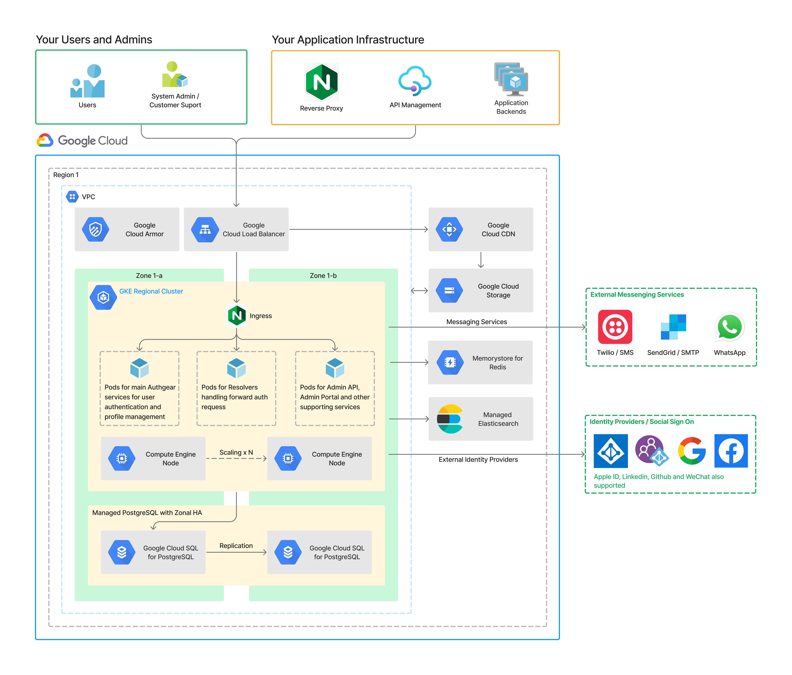

# Google Cloud Reference Architecture

<figure><figcaption></figcaption></figure>

([Link](https://oursky.notion.site/Authgear-Reference-Architecture-Public-Page-099f15d621784f9299c86a6dcf55bade) to download original FigJam file)

### Cloud Resources Requirements

<table data-full-width="false"><thead><tr><th width="188">Products</th><th width="309">Purposes</th><th>Suggested Specification</th></tr></thead><tbody><tr><td>Google Kubernetes Engine</td><td>Pods to run the applications, cache for user sessions</td><td>e2-standard-2 (2 vCPUs, 8GB RAM) x 3 minimum for k8s</td></tr><tr><td>Google Cloud SQL for PostgreSQL</td><td>Store system settings, user profiles, audit logs</td><td>db-standard-2 (2 vCPUs, 7.5GB RAM) x 2 for high availability</td></tr><tr><td>Memorystore for Redis</td><td>Store user sessions and usage analytics</td><td>Require approximately 30kB per user. Please refer to <a data-mention href="../helm.md">helm.md</a></td></tr><tr><td>(Optional Components)</td><td>
Google Cloud Storage:
<ul><li>Storage of the user profile images </li></ul>
Managed Elasticsearch:
<ul><li>To support search in Authgear admin portal</li></ul>
Networking:
<ul><li>Google Cloud Armor (WAF)</li><li>Google Cloud Load Balancer</li><li>Google Cloud CDN</li></ul>
CI/CD
<ul><li>Container registry</li><li>Secret management</li></ul>
Logging and Monitoring tools
</td><td>N/A</td></tr></tbody></table>

