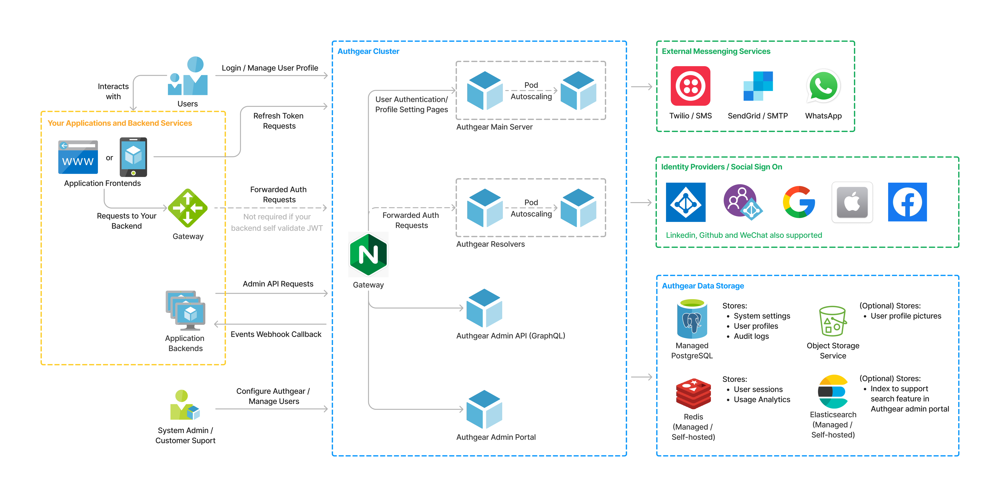

# Reference Architecture Diagrams

Authgear Enterprise Plan offers self-managed options for customers to run the whole application on their private cloud or public cloud instances using our docker images. This is generally useful for regulated industries such as Financial, Insurance or Public Sectors which must retain the processing and storage of user data on-premises or in specific geographical area.

### Authgear Application Architecture Diagram

<figure><figcaption></figcaption></figure>

([Link](https://oursky.notion.site/Authgear-Reference-Architecture-Public-Page-099f15d621784f9299c86a6dcf55bade) to download original FigJam file)

### Resources Reference

| Component                            | Purposes                                                    | Minimum Requirements                                                                                                             |
| ------------------------------------ | ----------------------------------------------------------- | -------------------------------------------------------------------------------------------------------------------------------- |
| Kubernetes Engine / Virtual Machines | Containers to run the applications, cache for user sessions | 
3 nodes with

2 vCPUs, 8 GB RAM  for High Availability
                                                         |
| PostgreSQL                           | Store system settings, user profiles, audit logs            | 
2 nodes with 2 vCPUs, 8GB RAM, 500GB Storage  for High Availability
                                              |
| Redis                                | Cache for user sessions, rate limits and usage analytics    | RAM: Approximately 30kB per user                                                                                                 |
| **Optional Components**              |                                                             |                                                                                                                                  |
| ElasticSearch                        | Support search in Authgear Admin Portal                     |                                                                                                                                  |
| S3-Compatible Object Storage         | Storage of images                                           | S3, MinIO                                                                                                                        |
| Network & Security                   | For high availability, load balancing and security          | <ul><li>Web Application Firewall</li><li>Load Balancer</li><li>CDN with DDOS Protection</li><li>Logging and Monitoring</li></ul> |
| SMS & Email Gateway                  | Send email or SMS                                           |                                                                                                                                  |
| CI/CD                                | For shift deployment                                        | <ul><li>Container Registry</li><li>Secret Management Solutions</li></ul>                                                         |

### Deployment Options

* Depending on [backend-api](../../get-started/backend-api/ "mention") approach, Authgear Resolvers is not needed if your backend self-validate user cookies or JWT.
* It's recommended to use managed redis, postgresql and elasticsearch to reduce maintenance overhead.
* Persistent redis is optional — the advantage of persistent redis is users can keep their session in the event of redis restart or downtime.
* User profile image is disabled by default, if enabled an S3-Compatible Object Storage is required.
* Elasticsearch is optional and only needed to support user search in the Authgear admin portal.
* Please refer to [helm.md](../helm.md "mention") for deployment options and details.
