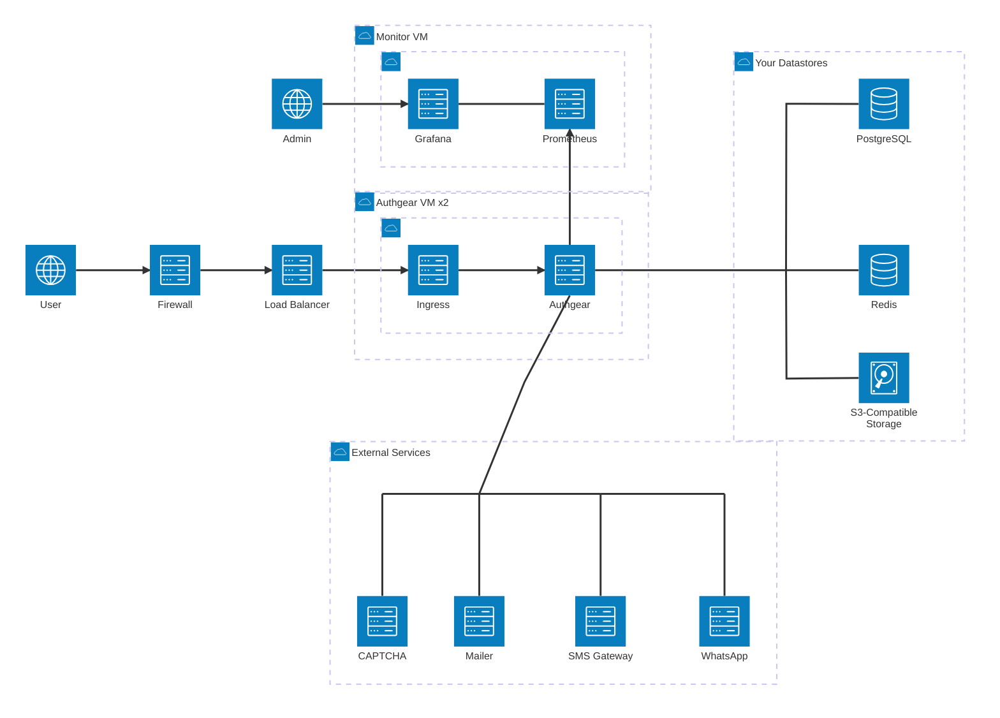
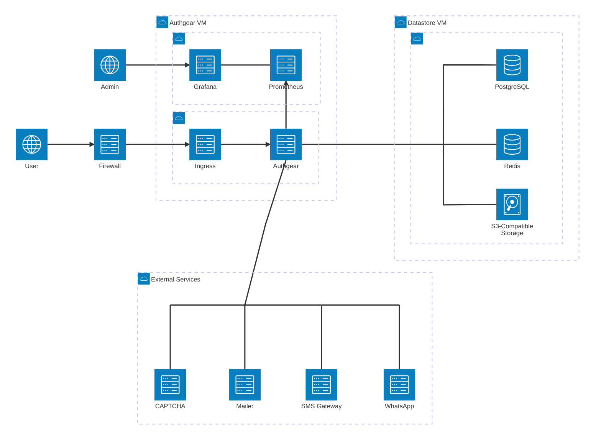
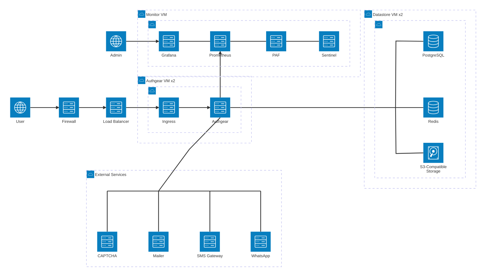

# Docker Compose Reference Architecture

This page describes a reference architecture for running Authgear on conventional virtual machines with Docker Compose or Podman Compose. It suits deployments where a Kubernetes cluster is unavailable, or not worth operating for a single application. For the Kubernetes-based architecture, see [On-Premises Reference Architecture](on-premises-reference-architecture.md).

## Components

The system has three parts.

1. **Authgear**: the application services and their ingress (a reverse proxy), run under Compose on one or two Authgear VMs.
2. **Monitoring stack**: Prometheus and Grafana, run under Compose. In single-instance setups they share the Authgear VM. In high availability setups they run on a separate monitor VM.
3. **Datastores**: PostgreSQL, Redis, and S3-compatible object storage.

## Choosing a Setup

A setup is one datastore option run at one availability tier. Two choices determine it.

### Who Runs the Datastores

* [**Option 1: Your Own Datastores**](#option-1-your-own-datastores). You supply PostgreSQL, Redis, and object storage from services you already operate. Choose this when your platform team already runs them. It is the preferred option for production, because backup, patching, and failover stay with the team that already handles them.
* [**Option 2: Included Datastores**](#option-2-included-datastores). The datastores are installed on dedicated datastore VMs as part of the deployment. Choose this when no managed datastores are available, such as air-gapped sites and bare-metal data centres, or when you want a self-contained, disposable environment.

### Availability Tier

| Tier              | Typical use                                              | Availability                                                                                       |
| ----------------- | -------------------------------------------------------- | -------------------------------------------------------------------------------------------------- |
| Single instance   | Non-production: development, staging, and demonstration. | One instance of each component. Expect downtime during upgrades and reboots. Not for live traffic. |
| High availability | Production.                                              | Replicated components with no single point of failure.                                             |

Non-production normally runs the cheaper single-instance tier. If staging must behave exactly like production, run high availability in both environments at the corresponding increase in cost.

### VM Count

|                                   | Single instance | High availability              |
| --------------------------------- | --------------- | ------------------------------ |
| **Option 1: your own datastores** | 1               | 2, plus an optional monitor VM |
| **Option 2: included datastores** | 2               | 4, plus a monitor VM           |

Counts exclude the load balancer, which you provide in the high availability tier. Use the same option for both environments, so that non-production mirrors production's data layer.

## Option 1: Your Own Datastores

The deployment adds only the VMs that run Authgear and the monitoring stack. The datastores are services you already operate, sized as listed in each inventory, and their availability is your responsibility.

### Option 1: Single Instance

Authgear, its ingress, and the monitoring stack share a single VM. That VM is the only infrastructure the deployment adds, and the only single point of failure it introduces.

#### Inventory

In addition to the [common inventory](#common-inventory), you provide the following.

| Item           | Minimum                         | Recommended                      | Quantity | Remarks                                                               |
| -------------- | ------------------------------- | -------------------------------- | -------- | --------------------------------------------------------------------- |
| Authgear VM    | 2 CPU / 16 GB / 40 GB Data Disk | 4 CPU / 16 GB / 100 GB Data Disk | 1        | Also runs the monitoring stack.                                       |
| PostgreSQL     | 2 CPU / 16 GB / 40 GB Data Disk | 4 CPU / 16 GB / 100 GB Data Disk | 1        | Your existing service. Size the disk to the expected number of users. |
| Redis          | 1 CPU / 4 GB / 10 GB Data Disk  | 1 CPU / 8 GB / 10 GB Data Disk   | 1        | Your existing service.                                                |
| Object storage | 40 GB Storage                   | 80 GB Storage                    | 1        | Your existing service.                                                |

### Option 1: High Availability

Authgear runs on two VMs behind a load balancer, so either can be rebooted or upgraded without an outage. The monitoring stack moves to an optional monitor VM. Without that VM, the setup has no monitoring.

#### Inventory

In addition to the [common inventory](#common-inventory), you provide the following.

| Item           | Minimum                         | Recommended                      | Quantity | Remarks                                                               |
| -------------- | ------------------------------- | -------------------------------- | -------- | --------------------------------------------------------------------- |
| Load balancer  |                                 |                                  | 1        | Must be highly available itself.                                      |
| Authgear VM    | 2 CPU / 16 GB / 40 GB Data Disk | 4 CPU / 16 GB / 100 GB Data Disk | 2        | For failover, not capacity.                                           |
| Monitor VM     | 1 CPU / 8 GB / 40 GB Data Disk  | 1 CPU / 8 GB / 40 GB Data Disk   | 1        | Optional. Runs the monitoring stack. Without it, there is no monitoring. |
| PostgreSQL     | 2 CPU / 16 GB / 40 GB Data Disk | 4 CPU / 16 GB / 100 GB Data Disk | 1        | Your existing service. Size the disk to the expected number of users. |
| Redis          | 1 CPU / 4 GB / 10 GB Data Disk  | 1 CPU / 8 GB / 10 GB Data Disk   | 1        | Your existing service.                                                |
| Object storage | 40 GB Storage                   | 80 GB Storage                    | 1        | Your existing service.                                                |

## Option 2: Included Datastores

PostgreSQL, Redis, and S3-compatible object storage are installed on dedicated datastore VMs as part of the deployment. This is the only option that needs no managed datastore from you, at the cost of more VMs.

### Option 2: Single Instance

The datastores run on one datastore VM, and Authgear, its ingress, and the monitoring stack on one Authgear VM. Every component is a single instance, so either VM failing takes the service down. This is the cheapest setup and the quickest to stand up.

#### Inventory

In addition to the [common inventory](#common-inventory), you provide the following. The datastores are installed on the datastore VM as part of the deployment.

| Item         | Minimum                          | Recommended                      | Quantity | Remarks                                                                                    |
| ------------ | -------------------------------- | -------------------------------- | -------- | ------------------------------------------------------------------------------------------ |
| Authgear VM  | 2 CPU / 16 GB / 40 GB Data Disk  | 4 CPU / 16 GB / 100 GB Data Disk | 1        | Also runs the monitoring stack.                                                            |
| Datastore VM | 2 CPU / 16 GB / 100 GB Data Disk | 4 CPU / 16 GB / 200 GB Data Disk | 1        | Runs PostgreSQL, Redis, and object storage. Size the disk to the expected number of users. |

### Option 2: High Availability

Replicated PostgreSQL, Redis, and object storage run on two datastore VMs. Authgear runs on two further VMs behind the load balancer. The monitor VM runs the monitoring stack and the failover controllers: [pg\_auto\_failover](https://github.com/hapostgres/pg_auto_failover) (PAF) for PostgreSQL and Sentinel for Redis. This is the largest footprint.

#### Inventory

In addition to the [common inventory](#common-inventory), you provide the following. The datastores are installed on the datastore VMs as part of the deployment.

| Item          | Minimum                          | Recommended                      | Quantity | Remarks                                                              |
| ------------- | -------------------------------- | -------------------------------- | -------- | -------------------------------------------------------------------- |
| Load balancer |                                  |                                  | 1        | Must be highly available itself.                                     |
| Authgear VM   | 2 CPU / 16 GB / 40 GB Data Disk  | 4 CPU / 16 GB / 100 GB Data Disk | 2        | For failover, not capacity.                                          |
| Datastore VM  | 2 CPU / 16 GB / 100 GB Data Disk | 4 CPU / 16 GB / 200 GB Data Disk | 2        | Primary and replica. Size the disk to the expected number of users.  |
| Monitor VM    | 1 CPU / 8 GB / 40 GB Data Disk   | 1 CPU / 8 GB / 40 GB Data Disk   | 1        | Runs the monitoring stack and the PAF and Sentinel failover controllers. |

## Requirements

### Common Inventory

Every setup needs the following, in addition to the VMs listed in its inventory.

| Item        | Quantity          | Remarks                                                                                                                                                                                                                                                       |
| ----------- | ----------------- | ------------------------------------------------------------------------------------------------------------------------------------------------------------------------------------------------------------------------------------------------------------- |
| IP address  | 1                 | For the ingress, or for the load balancer in the high availability tier.                                                                                                                                                                                      |
| Domain      | 2 + 1 per project | Two system domains for the Authgear Portal and Portal Login, for example `portal.example.com` and `accounts.example.com`, plus one Authgear Endpoint domain per [project](../../get-started/5-minute-guide.md), for example `auth.example.com`.                |
| Certificate | 1                 | Wildcard certificate covering the domains above.                                                                                                                                                                                                              |
| Firewall    | 1                 | In front of the ingress or load balancer.                                                                                                                                                                                                                     |
| Mailer      | 1                 | Optional. SMTP server or SendGrid.                                                                                                                                                                                                                            |
| SMS         | 1                 | Optional. Gateway account for SMS delivery.                                                                                                                                                                                                                   |
| WhatsApp    | 1                 | Optional. Business account for WhatsApp delivery.                                                                                                                                                                                                             |
| CAPTCHA     | 1                 | Optional. Google reCAPTCHA or Cloudflare Turnstile.                                                                                                                                                                                                           |

### Datastore Requirements

With Option 1 you supply the datastores. With Option 2 they are installed to the same requirements.

| Datastore      | Requirement                                    |
| -------------- | ---------------------------------------------- |
| PostgreSQL     | 16.14, with the `pg_partman` extension 16.5.1. |
| Redis          | 6.2.20.                                        |
| Object storage | Any S3-compatible implementation.              |

### Expected Capacity

With 100 concurrent users logging in, the Minimum and Recommended specifications in the inventories above are expected to sustain:

| Specification | Logins per second |
| ------------- | ----------------- |
| Minimum       | 5                 |
| Recommended   | 15                |

Throughput is bound by the database, not by the number of Authgear VMs, so the high availability tier adds availability, not capacity. It therefore fixes Authgear at two VMs, enough for failover and rolling upgrades. A third would add nothing.

### Datastore High Availability

With Option 1, datastore availability is your responsibility. With Option 2, the single-instance tier has no redundancy, and the high availability tier uses PAF for PostgreSQL and Sentinel for Redis, both driven from the monitor VM. The [High Availability](on-premises-reference-architecture.md#high-availability) section of the On-Premises Reference Architecture describes how these components work.

## Network, Monitoring, and Backups

The firewall rules, hostnames, WAF paths, and backup guidance in [On-Premises Reference Architecture](on-premises-reference-architecture.md) apply to this architecture too. Where that page says Kubernetes, read the Authgear VMs. In the single-instance tier, the ingress on the Authgear VM takes the place of the load balancer.

Metrics are collected by the Prometheus and Grafana instances that ship with the deployment. Access logs come from the ingress on each Authgear VM. Audit logs are persisted in PostgreSQL, so include the database in your backup policy.
