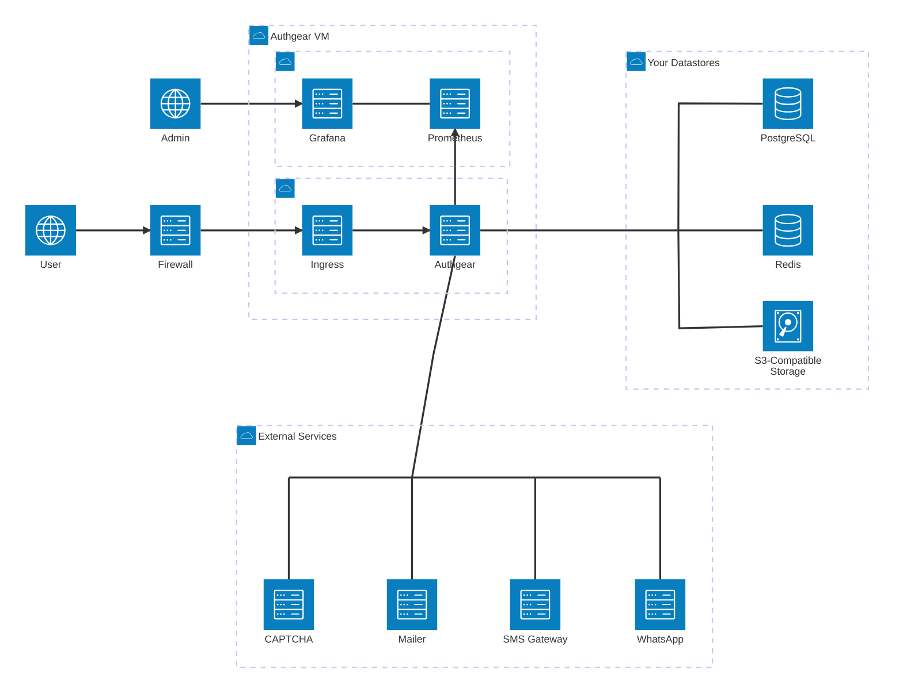
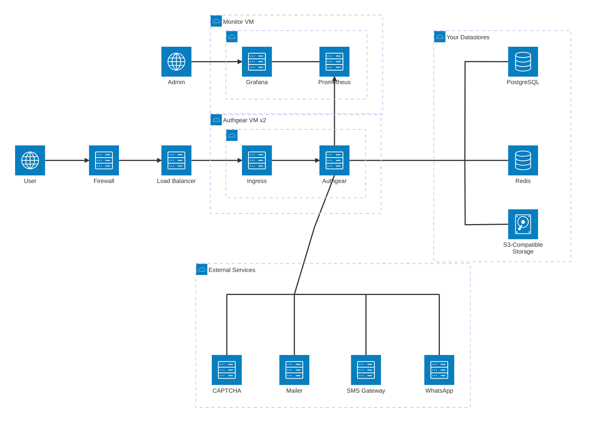
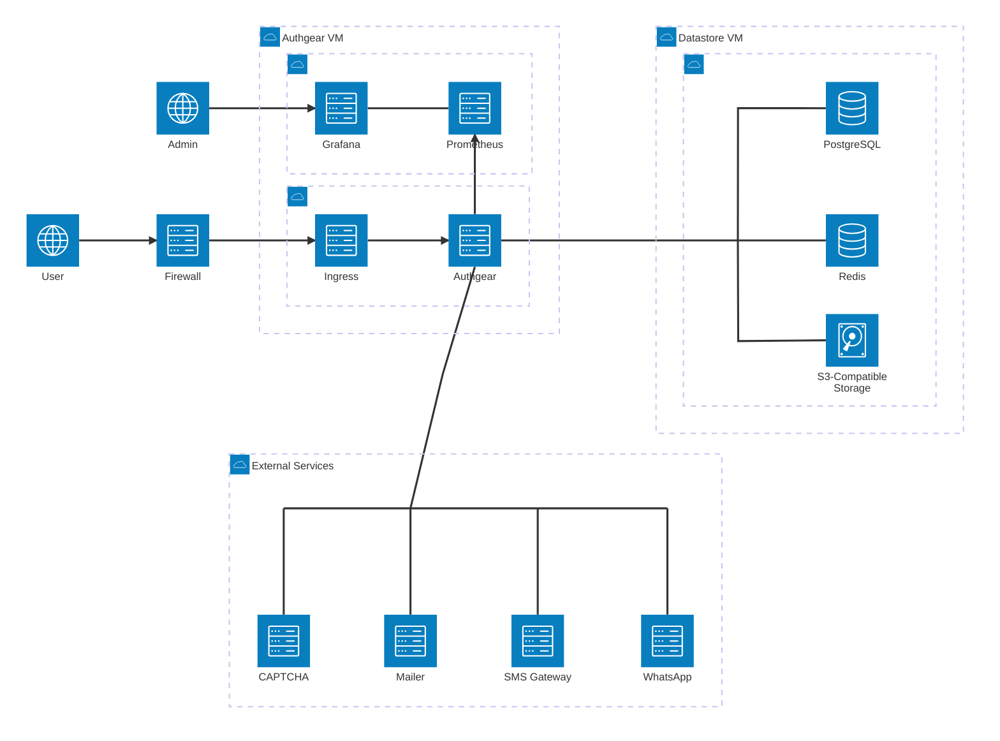

# Docker Compose Reference Architecture

This page describes a reference architecture for running Authgear on conventional virtual machines with Docker Compose or Podman Compose. It suits deployments where a Kubernetes cluster is unavailable, or not worth operating for a single application. For the Kubernetes-based architecture, see [On-Premises Reference Architecture](on-premises-reference-architecture.md).

## Environments

Plan for two types of environment.

| Environment    | Purpose                                  | Availability                                                                |
| -------------- | ---------------------------------------- | --------------------------------------------------------------------------- |
| Non-production | Development, staging, and demonstration. | Single instance per component. Expect downtime during upgrades and reboots. |
| Production     | Live traffic.                            | Replicated components with no single point of failure.                      |

Non-production normally runs the cheaper non-HA setup. If staging must behave exactly like production, run the HA setup in both environments at the corresponding increase in cost.

## Components

The system has two major parts.

1. **Authgear**: the application services, their ingress (a reverse proxy), and the monitoring stack (Prometheus and Grafana), all run under Compose.
2. **Datastores**: PostgreSQL, Redis, and S3-compatible object storage.

Use datastores you already operate where you can. Most cloud platforms and data centres offer managed PostgreSQL, Redis, and object storage, and using them keeps backup, patching, and failover with the team that already runs your other data services. Where no such service is available, the datastores are installed on dedicated VMs as part of the deployment.

## Deployment Setups

The four setups combine two choices: with or without high availability (HA), and whether you supply the datastores or they are included in the deployment.

| Setup | Datastores | Availability | VMs                   | Choose when                                                                                                                                                                                              |
| ----- | ---------- | ------------ | --------------------- | -------------------------------------------------------------------------------------------------------------------------------------------------------------------------------------------------------- |
| **A** | You supply | No HA        | 1                     | You already run managed PostgreSQL, Redis, and object storage, and need a non-production environment that reuses them. The cheapest way to match production's data layer.                                |
| **B** | You supply | HA           | 2 (3 with monitoring) | Production, where your platform team already operates highly available datastores. The preferred production setup, because backup, patching, and failover stay with the team that already runs them.    |
| **C** | Included   | No HA        | 2                     | You have no datastores to offer, or want a self-contained, disposable environment. The lowest cost and the fastest to stand up. Not for real users.                                                      |
| **D** | Included   | HA           | 5                     | Production with no managed datastore offering, such as air-gapped sites or bare-metal data centres. The full stack runs on VMs you provide, at the highest VM count.                                     |

A typical deployment pairs one non-production setup with one production setup: A with B, or C with D.

### Expected Capacity

At 100 users, the expected sustained throughput is:

| Specification | Logins per second |
| ------------- | ----------------- |
| Minimum       | 5                 |
| Recommended   | 15                |

Throughput is bound by the database, not by the number of Authgear VMs, so setups A and C differ from B and D in availability alone. The HA setups therefore fix Authgear at two VMs, enough for failover and rolling upgrades. A third would add nothing.

### Datastore Requirements

You supply the datastores in setups A and B. In setups C and D they are installed to the same requirements.

| Datastore      | Requirement                                        |
| -------------- | -------------------------------------------------- |
| PostgreSQL     | 16.14, with the `pg_partman` extension 16.5.1.     |
| Redis          | 6.2.20.                                            |
| Object storage | Any S3-compatible implementation.                  |

### High Availability

Datastore availability is your responsibility in setups A and B. Setup C has no redundancy: each datastore is a single instance. Setup D provides it with [pg\_auto\_failover](https://github.com/hapostgres/pg_auto_failover) (PAF) for PostgreSQL and Sentinel for Redis, both driven from the monitor VM. The [High Availability](on-premises-reference-architecture.md#high-availability) section of the On-Premises Reference Architecture describes how these components work.

## Setup A: No HA, You Supply Datastores

You supply PostgreSQL, Redis, and object storage. Authgear, its ingress, and the monitoring stack share a single Docker host. That host is the only infrastructure the deployment adds, and the only single point of failure it introduces.

### Inventory

You provide the following.

| Item        | Minimum                         | Recommended                      | Quantity | Remarks                                                                                                                                                                              |
| ----------- | ------------------------------- | -------------------------------- | -------- | ------------------------------------------------------------------------------------------------------------------------------------------------------------------------------------ |
| IP address  |                                 |                                  | 1        |                                                                                                                                                                                      |
| Domain      |                                 |                                  | 2 + P    | Two system domains for the Authgear Portal and Portal Login (for example `portal.example.com` and `accounts.example.com`), plus one Authgear Endpoint domain per project (P).         |
| Certificate |                                 |                                  | 1        | Wildcard certificate covering the domains above.                                                                                                                                     |
| Firewall    |                                 |                                  | 1        |                                                                                                                                                                                      |
| Authgear VM | 2 CPU / 16 GB / 40 GB Data Disk | 4 CPU / 16 GB / 100 GB Data Disk | 1        | Also runs the monitoring stack.                                                                                                                                                      |
| Database    | 2 CPU / 16 GB / 40 GB Data Disk | 4 CPU / 16 GB / 100 GB Data Disk | 1        | Your existing service. Size the disk to the expected number of users.                                                                                                                |
| Redis       | 1 CPU / 4 GB / 10 GB Data Disk  | 1 CPU / 8 GB / 10 GB Data Disk   | 1        | Your existing service.                                                                                                                                                               |
| S3          | 40 GB Storage                   | 80 GB Storage                    | 1        | Your existing service.                                                                                                                                                               |
| Mailer      |                                 |                                  | 1        | Optional. SMTP server or SendGrid.                                                                                                                                                   |
| SMS         |                                 |                                  | 1        | Optional. Gateway account for SMS delivery.                                                                                                                                          |
| WhatsApp    |                                 |                                  | 1        | Optional. Business account for WhatsApp delivery.                                                                                                                                    |
| CAPTCHA     |                                 |                                  | 1        | Optional. Google reCAPTCHA or Cloudflare Turnstile.                                                                                                                                  |

## Setup B: HA, You Supply Datastores

You supply PostgreSQL, Redis, and object storage, and own their availability. Authgear runs on two VMs behind a load balancer, so either can be rebooted or upgraded without an outage. Monitoring moves to its own VM.

### Inventory

You provide the following.

| Item          | Minimum                         | Recommended                      | Quantity | Remarks                                                                                                                                                                      |
| ------------- | ------------------------------- | -------------------------------- | -------- | ---------------------------------------------------------------------------------------------------------------------------------------------------------------------------- |
| IP address    |                                 |                                  | 1        |                                                                                                                                                                              |
| Domain        |                                 |                                  | 2 + P    | Two system domains for the Authgear Portal and Portal Login (for example `portal.example.com` and `accounts.example.com`), plus one Authgear Endpoint domain per project (P). |
| Certificate   |                                 |                                  | 1        | Wildcard certificate covering the domains above.                                                                                                                             |
| Firewall      |                                 |                                  | 1        |                                                                                                                                                                              |
| Load balancer |                                 |                                  | 1        | Must be highly available itself.                                                                                                                                             |
| Authgear VM   | 2 CPU / 16 GB / 40 GB Data Disk | 4 CPU / 16 GB / 100 GB Data Disk | 2        | For failover, not capacity.                                                                                                                                                  |
| Monitor VM    | 1 CPU / 8 GB / 40 GB Data Disk  | 1 CPU / 8 GB / 40 GB Data Disk   | 1        | Optional. Grafana dashboards over Prometheus.                                                                                                                                |
| Database      | 2 CPU / 16 GB / 40 GB Data Disk | 4 CPU / 16 GB / 100 GB Data Disk | 1        | Your existing service. Size the disk to the expected number of users.                                                                                                        |
| Redis         | 1 CPU / 4 GB / 10 GB Data Disk  | 1 CPU / 8 GB / 10 GB Data Disk   | 1        | Your existing service.                                                                                                                                                       |
| S3            | 40 GB Storage                   | 80 GB Storage                    | 1        | Your existing service.                                                                                                                                                       |
| Mailer        |                                 |                                  | 1        | Optional. SMTP server or SendGrid.                                                                                                                                           |
| SMS           |                                 |                                  | 1        | Optional. Gateway account for SMS delivery.                                                                                                                                  |
| WhatsApp      |                                 |                                  | 1        | Optional. Business account for WhatsApp delivery.                                                                                                                            |
| CAPTCHA       |                                 |                                  | 1        | Optional. Google reCAPTCHA or Cloudflare Turnstile.                                                                                                                          |

## Setup C: No HA, Included Datastores

With no datastores of your own, PostgreSQL, Redis, and object storage run on a datastore VM, and Authgear, its ingress, and the monitoring stack run on a second. Every component is a single instance, so either host failing takes the service down. This is the cheapest option and the quickest to stand up.

### Inventory

You provide the following. The datastores are installed on the database VM as part of the deployment.

| Item        | Minimum                          | Recommended                      | Quantity | Remarks                                                                                                                                                                      |
| ----------- | -------------------------------- | -------------------------------- | -------- | ---------------------------------------------------------------------------------------------------------------------------------------------------------------------------- |
| IP address  |                                  |                                  | 1        |                                                                                                                                                                              |
| Domain      |                                  |                                  | 2 + P    | Two system domains for the Authgear Portal and Portal Login (for example `portal.example.com` and `accounts.example.com`), plus one Authgear Endpoint domain per project (P). |
| Certificate |                                  |                                  | 1        | Wildcard certificate covering the domains above.                                                                                                                             |
| Firewall    |                                  |                                  | 1        |                                                                                                                                                                              |
| Authgear VM | 2 CPU / 16 GB / 40 GB Data Disk  | 4 CPU / 16 GB / 100 GB Data Disk | 1        | Also runs the monitoring stack.                                                                                                                                              |
| Database VM | 2 CPU / 16 GB / 100 GB Data Disk | 4 CPU / 16 GB / 200 GB Data Disk | 1        | Runs PostgreSQL, Redis, and object storage. Size the disk to the expected number of users.                                                                                   |
| Mailer      |                                  |                                  | 1        | Optional. SMTP server or SendGrid.                                                                                                                                           |
| SMS         |                                  |                                  | 1        | Optional. Gateway account for SMS delivery.                                                                                                                                  |
| WhatsApp    |                                  |                                  | 1        | Optional. Business account for WhatsApp delivery.                                                                                                                            |
| CAPTCHA     |                                  |                                  | 1        | Optional. Google reCAPTCHA or Cloudflare Turnstile.                                                                                                                          |

## Setup D: HA, Included Datastores

With no datastores of your own, replicated PostgreSQL, Redis, and object storage run on two dedicated VMs. Authgear runs on two further VMs behind the load balancer, and the monitor VM carries the failover controllers: PAF for PostgreSQL and Sentinel for Redis. This is the largest footprint, and the only option that needs no managed datastore from you.

### Inventory

You provide the following. The datastores are installed on the database VMs as part of the deployment.

| Item          | Minimum                          | Recommended                      | Quantity | Remarks                                                                                                                                                                      |
| ------------- | -------------------------------- | -------------------------------- | -------- | ---------------------------------------------------------------------------------------------------------------------------------------------------------------------------- |
| IP address    |                                  |                                  | 1        |                                                                                                                                                                              |
| Domain        |                                  |                                  | 2 + P    | Two system domains for the Authgear Portal and Portal Login (for example `portal.example.com` and `accounts.example.com`), plus one Authgear Endpoint domain per project (P). |
| Certificate   |                                  |                                  | 1        | Wildcard certificate covering the domains above.                                                                                                                             |
| Firewall      |                                  |                                  | 1        |                                                                                                                                                                              |
| Load balancer |                                  |                                  | 1        | Must be highly available itself.                                                                                                                                             |
| Authgear VM   | 2 CPU / 16 GB / 40 GB Data Disk  | 4 CPU / 16 GB / 100 GB Data Disk | 2        | For failover, not capacity.                                                                                                                                                  |
| Database VM   | 2 CPU / 16 GB / 100 GB Data Disk | 4 CPU / 16 GB / 200 GB Data Disk | 2        | Primary and replica. Size the disk to the expected number of users.                                                                                                          |
| Monitor VM    | 1 CPU / 8 GB / 40 GB Data Disk   | 1 CPU / 8 GB / 40 GB Data Disk   | 1        | Also runs the PAF and Sentinel failover controllers.                                                                                                                         |
| Mailer        |                                  |                                  | 1        | Optional. SMTP server or SendGrid.                                                                                                                                           |
| SMS           |                                  |                                  | 1        | Optional. Gateway account for SMS delivery.                                                                                                                                  |
| WhatsApp      |                                  |                                  | 1        | Optional. Business account for WhatsApp delivery.                                                                                                                            |
| CAPTCHA       |                                  |                                  | 1        | Optional. Google reCAPTCHA or Cloudflare Turnstile.                                                                                                                          |

## Network, Monitoring, and Backups

The firewall rules, hostnames, WAF paths, and backup guidance in [On-Premises Reference Architecture](on-premises-reference-architecture.md) apply to this architecture too. Where that page says Kubernetes, read the Authgear VMs.

Metrics are collected by the Prometheus and Grafana instances that ship with the deployment, on the Authgear VM in setups A and C and on the monitor VM in setups B and D. Access logs come from the ingress on each Authgear VM. Audit logs are persisted in PostgreSQL, so include the database in your backup policy.
