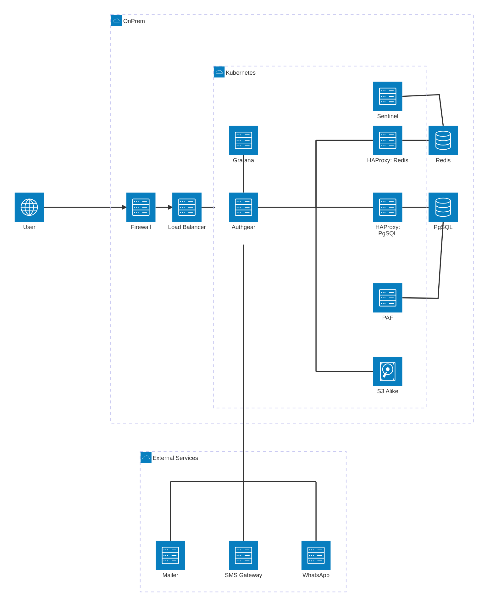

# Infrastructure for On-Premises Deployment

This page describes the reference architecture for deploying Authgear on-premises.

## Architecture

## Hardware Requirements

| Component | Specification | Count | HA Mechanism | Notes |
|-----------|--------------|-------|--------------|-------|
| Kubernetes | 4 vCPUs / 16 GB RAM / 100 GB disk | 3 | N/A | Use a managed Kubernetes service or k3s on VMs |
| PostgreSQL | 2 vCPUs / 16 GB RAM / 100 GB disk | 2 | Auto failover | Primary-standby setup |
| Redis | 2 vCPUs / 16 GB RAM / 100 GB disk | 2 | Auto failover | Primary-standby setup |


Increase the specifications above if you expect high traffic or large numbers of users.


## High Availability

### Application

Authgear runs as multiple replicas in Kubernetes. Each replica has a health probe configured for automatic restart on failure.

### PostgreSQL

Use a managed PostgreSQL service on your on-premises infrastructure if one is available. If not, run PostgreSQL on Linux VMs.

The setup uses a primary-standby topology with automatic failover via [pg_auto_failover](https://github.com/hapostgres/pg_auto_failover).

Components:

- **Two PostgreSQL instances** on separate VMs, managed with `pg_autoctl`.
- **Monitoring agent** running in Kubernetes, executing `pg_auto_failover`. Requires persistent storage. If your cluster has no persistent volumes, deploy the monitoring agent on a dedicated VM instead.
- **PAF (Python-based wrapper)** running in Kubernetes, reports primary/standby status to HAProxy.
- **HAProxy** running in Kubernetes, routes all database traffic to the current primary instance.

### Redis

Use a managed Redis service on your on-premises infrastructure if one is available. If not, run Redis on Linux VMs.

The setup uses a primary-standby topology with automatic failover via Sentinel.

Components:

- **Two Redis instances** on separate VMs.
- **Sentinel** running in Kubernetes, monitors Redis and triggers failover. Requires persistent storage. If your cluster has no persistent volumes, deploy Sentinel on a dedicated VM instead.
- **HAProxy** running in Kubernetes, routes all Redis traffic to the current primary instance and performs health checks on all cluster members.

## Firewall Rules

| Direction | Protocol / Port | Source | Destination | Action | Notes |
|-----------|----------------|--------|-------------|--------|-------|
| IN | HTTP:80 | `*` | Load Balancer | Allow | Required for Let's Encrypt cert-manager only |
| IN | HTTPS:443 | `*` | Load Balancer | Allow | Kubernetes ingress |
| OUT | HTTPS:443 | Kubernetes | Mailer | Allow | Some mailers use SMTP instead |
| OUT | HTTPS:443 | Kubernetes | SMS Gateway | Allow | |
| OUT | HTTPS:443 | Kubernetes | WhatsApp | Allow | |

## Logs, Monitoring, and Alerts

### Access Logs

Access logs are available from the Kubernetes ingress controller and can be viewed in Grafana.

### Application Logs

Application logs are available from Kubernetes pod logs and can be viewed in Grafana.

### Audit Logs

Audit logs are accessible from the Authgear Portal or by querying the database directly.

### Infrastructure Monitoring

Monitor infrastructure health using your on-premises monitoring stack.

### Backups

Database backups are not automated. Set up a backup schedule and procedure that meets your recovery requirements.
