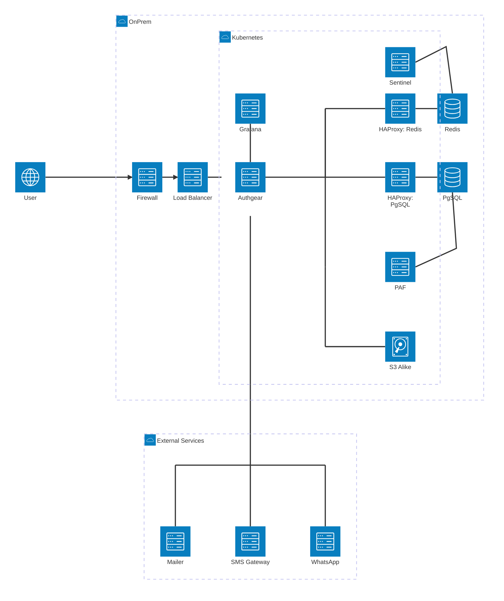

# Infrastructure for On-Premises Deployment

This page describes the reference architecture for deploying Authgear on-premises.

## Architecture

## Hardware Requirements

The following hardware is suggested for an on-premises Authgear cluster.

### Kubernetes Cluster

- 3× machines, 4 vCPUs / 16 GB RAM / 100 GB disk — nodes in the Kubernetes cluster
- Use a managed Kubernetes service, or k3s on VMs

### PostgreSQL (HA)

- 1× machine, 2 vCPUs / 16 GB RAM / 100 GB disk — primary
- 1× machine, 2 vCPUs / 16 GB RAM / 100 GB disk — standby

### Redis (HA)

- 1× machine, 1 vCPU / 16 GB RAM / 100 GB disk — master
- 1× machine, 1 vCPU / 16 GB RAM / 100 GB disk — replica


Increase the specifications above if you expect high traffic or large numbers of users.


## High Availability

### Application

Authgear runs as multiple replicas in Kubernetes. Each replica has a health probe configured for automatic restart on failure.

### PostgreSQL

Use a managed PostgreSQL service on your on-premises infrastructure if one is available. If not, run PostgreSQL on Linux VMs.

The setup uses a primary-standby topology with automatic failover via [pg_auto_failover](https://github.com/hapostgres/pg_auto_failover).

Components:

- **Two PostgreSQL instances** on separate VMs, managed with `pg_autoctl`.
- **Monitoring agent** running in Kubernetes, executing `pg_auto_failover`. Requires persistent storage. If your cluster has no persistent volumes, deploy the monitoring agent on a dedicated VM instead.
- **PAF (Python-based wrapper)** running in Kubernetes, reports primary/standby status to HAProxy.
- **HAProxy** running in Kubernetes, routes all database traffic to the current primary instance.

### Redis

Use a managed Redis service on your on-premises infrastructure if one is available. If not, run Redis on Linux VMs.

The setup uses a primary-standby topology with automatic failover via Sentinel.

Components:

- **Two Redis instances** on separate VMs.
- **Sentinel** running in Kubernetes, monitors Redis and triggers failover. Requires persistent storage. If your cluster has no persistent volumes, deploy Sentinel on a dedicated VM instead.
- **HAProxy** running in Kubernetes, routes all Redis traffic to the current primary instance and performs health checks on all cluster members.

## Firewall Rules

### Network Firewall (L3/L4)

| Direction | Protocol | Port | Source | Destination | Action | Notes |
|-----------|----------|------|--------|-------------|--------|-------|
| IN | TCP | 443 | `*` | Load Balancer | Allow | Kubernetes ingress (HTTPS) |
| OUT | TCP | 587 | Kubernetes | Mailer (SMTP) | Allow | SMTP submission; use 465 if the mailer requires SMTPS |
| OUT | TCP | 443 | Kubernetes | Mailer (HTTPS API) | Allow | Only if the mailer uses an HTTPS API instead of SMTP |
| OUT | TCP | 443 | Kubernetes | SMS Gateway | Allow | |
| OUT | TCP | 443 | Kubernetes | WhatsApp API | Allow | |

Protocols are transport-layer (TCP/UDP). HTTP and HTTPS are application-layer and should not appear in firewall rules.

### Web Application Firewall (WAF)

#### Hostnames

Each Authgear environment (production, staging, etc.) uses three subdomains:

| Hostname | Purpose | Example |
|----------|---------|---------|
| Authgear Endpoint | Serves OAuth 2.0 / OIDC / SAML endpoints for your end-user applications | `auth.example.com` |
| Authgear Portal | Admin UI where tenant administrators manage users, configure auth flows, and view audit logs | `authgear-portal.example.com` |
| Portal Login | Authenticates administrators into the Authgear Portal | `accounts.portal.example.com` |

Deploy a separate set of three subdomains per environment. Naming is up to you — for example, a staging environment might use `auth-stg.example.com`, `authgear-portal-stg.example.com`, and `accounts.portal-stg.example.com`.

#### Key Paths on the Authgear Endpoint Host

The Authgear Endpoint host serves the following key paths. Make sure your WAF rules do not block or challenge them.

| Path | Purpose |
|------|---------|
| `/.well-known/openid-configuration` | OIDC discovery |
| `/.well-known/oauth-authorization-server` | OAuth 2.0 authorization server metadata |
| `/oauth2/authorize` | OAuth 2.0 authorization endpoint |
| `/oauth2/token` | OAuth 2.0 token endpoint |
| `/oauth2/userinfo` | OIDC userinfo |
| `/oauth2/end_session` | OIDC RP-initiated logout |
| `/oauth2/revoke` | OAuth 2.0 token revocation |
| `/api/v1/authentication_flows` | Authentication Flow API (for custom auth UIs) |
| `/_api/admin/graphql` | Admin API (server-to-server) |
| `/_api/admin/users/import`, `/_api/admin/users/export` | User import / export APIs |
| `/_resolver/resolve` | Backend forward-auth resolver |
| `/saml2/metadata/{client_id}` | SAML 2.0 IdP metadata (if SAML is in scope) |
| `/saml2/login/{client_id}`, `/saml2/logout/{client_id}` | SAML 2.0 SSO / SLO endpoints |

In addition, the Authgear Endpoint host serves AuthUI — the end-user login, signup, and settings pages — at routes such as `/login`, `/signup`, `/settings`, and `/reset_password`, plus static assets with versioned filenames.

The Authgear Portal and Portal Login hosts also serve a single-page app with many dynamic API and asset requests.

## Logs, Monitoring, and Alerts

### Metrics and Application Logs

Authgear exports metrics and application logs via OpenTelemetry (OTel). Collect and store them with any OTel-compatible stack. We recommend the [LGTM stack](https://grafana.com/about/grafana-stack/) — Loki (logs), Grafana (dashboards), Tempo (traces), and Mimir or Prometheus (metrics) — but any equivalent toolchain works.

### Access Logs

Access logs are produced by the Kubernetes ingress controller. Ship them to your log store alongside application logs.

### Audit Logs

Audit logs are viewable in the Authgear Portal and are persisted in the PostgreSQL database. Include the database in your backup policy to retain audit history.

### Infrastructure Monitoring

Monitor node, database, and Redis health using your on-premises monitoring stack (e.g., Prometheus node-exporter, postgres-exporter, redis-exporter scraped into Mimir/Prometheus).

### Backups

Database backups are not automated by Authgear. Configure a backup schedule and restore procedure that meets your recovery requirements (RPO/RTO).
