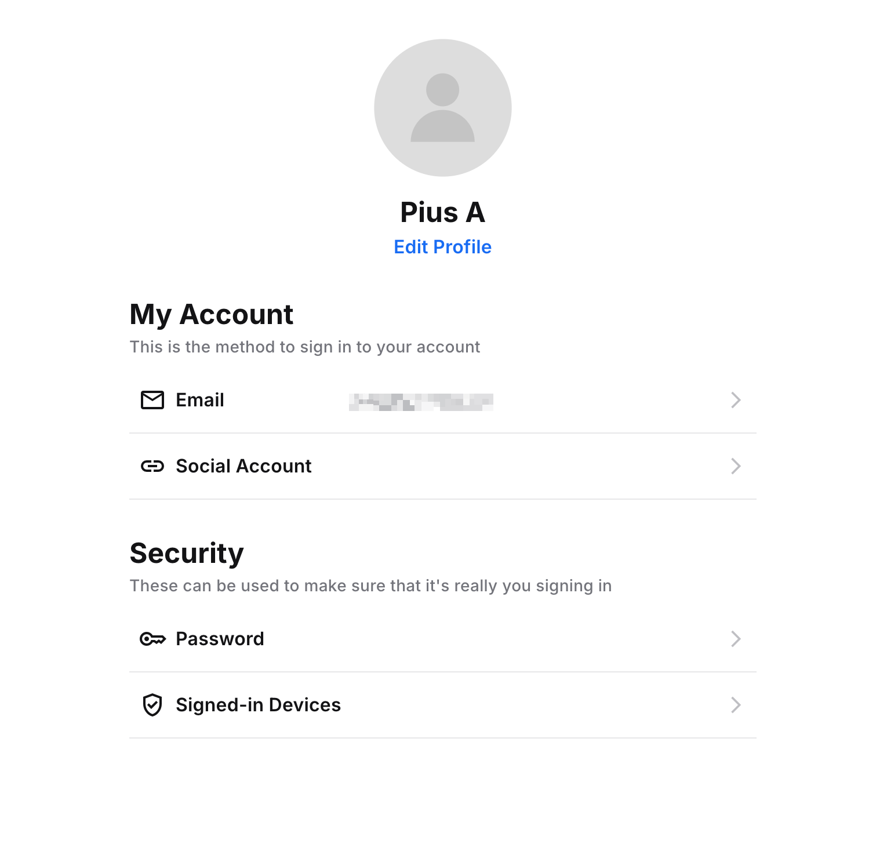
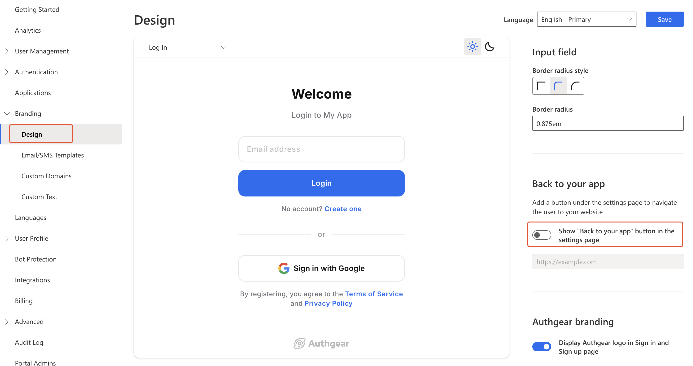

# User Settings

The User Settings page provides a prebuilt user interface for logged-in users of an Authgear project to view and edit their account settings.

<figure><figcaption><p>user settings ui</p></figcaption></figure>

## Actions in the settings page

The end-user can perform the following actions on the setting page:

* Change their password.
* Add or change their email, phone number, or username.
* Connect or disconnect to identity providers.
* Manage their signed-in sessions.
* Enable or disable 2-step verification.
* and many more.

## Open the settings page in websites

Use the `open()` method of the Authgear Web SDK to open the built-in settings page.

```tsx
import authgear, { Page } from "@authgear/web";

const openSettings = () = {
    authgear.open(Page.Settings)
}
```

## Open the settings page with the SDK in mobile apps

If you are working on a mobile app, you can open the settings page using any of our mobile SDKs. When the end-user has signed in, the SDK provides a method to open the settings page in a Webview.



```typescript
import React, { useCallback } from "react";
import authgear, { Page } from "@authgear/react-native";
import { View, Button } from "react-native";

function SettingsScreen() {
  const onPressOpenSettingsPage = useCallback(() => {
    authgear.open(Page.Settings).then(() => {
      // When the promise resolves, the webview have been closed.
    });
  }, []);
  return (
    <View>
      <Button
        title="Open Settings Page"
        onPress={onPressOpenSettingsPage}
      />
    </View>
  );
}
```



```dart
Future<void> onPressOpenSettingsPage() async {
  await authgear.open(SettingsPage.settings);
}
```



```csharp
async void OnOpenSettingsClicked(object sender, EventArgs args)
{
  await authgear.OpenAsync(SettingsPage.Settings);
}
```



```swift
func onPressOpenSettingsPage(sender: UIButton, forEvent event: UIEvent) {
    authgear.open(.settings) {
        // When the completion handler is called, the webview is closed.
    }
}
```



```java
public void onClickOpenSettingsPage() {
    authgear.open(Page.Settings, null, new OnOpenURLListener() {
        @Override
        public void onClosed() {
            // The webview is closed.
        }

        @Override
        public void onFailed(Throwable throwable) {
            // Some error occurred.
        }
    });
}
```



## Back to my app button

In a web-based application, you may want to add the "Back to my app" button to the settings page so the user can navigate back to your website after changing the settings.

To enable the back button, navigate to **Branding** > **Design** in Authgear Portal.\
Toggle the **Show “Back to your app” button in the settings page** switch on. Enter the destination URL for the 'Back to my app' button below the switch.

Click **Save** to apply your new settings.

<figure><figcaption></figcaption></figure>

## Customize User Settings Page

You can customize the look and feel of the User Settings page using the [UI design](branding.md) tool in Authgear Portal.

Navigate to **Branding** > **Design** in Authgear Portal to customize the User Settings page.

The theme (dark, light, or auto), logo, colors, border, etc. you set for AuthUI will also apply to the User Settings page.
