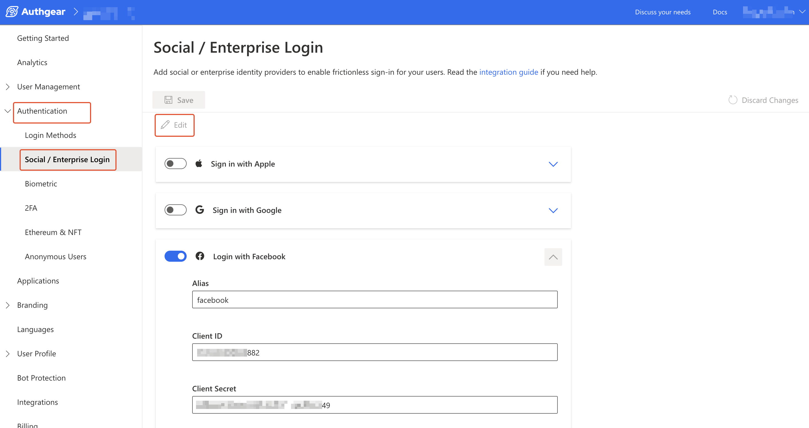
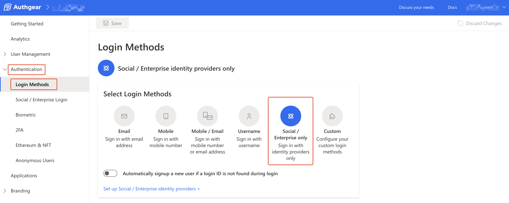

# Skip Login Screen and Direct Users to Enterprise Login

You can use Authgear's `x_oauth_provider_alias` parameter to add social/enterprise login to your application without showing any AuthUI pages. To do this, you must enable the **Social/Enterprise only** login method for your project in Authgear Portal.

In this post, you'll learn how to use the `x_oauth_provider_alias` parameter to skip AuthUI and take users directly to a social/enterprise login provider's authorization page.

### Pre-requisite

* An Authgear account. Create one for free [here](https://authgear.com).

### What We Will Build

* In this post, we'll walk through the steps for adding only the social/enterprise login method to an Authgear application.
* We'll use the Authgear SDK for React Native to set the `x_oauth_provider_alias` parameter and show how to use `x_oauth_provider_alias` without the SDK in an example Express app.&#x20;

<figure><figcaption></figcaption></figure>

The sequence diagram above demonstrates the flow for using `x_oauth_provider_alias` to skip AuthUI.

First, when the user clicks on the sign-in button, your application will call your Authgear project's `authorize` endpoint with the x\_oauth\_provider\_alias parameter appended.

Next, when Authgear server receives the call, it redirects to the third-party OAuth (Social/EnterpriseLogin) provider's authorization server. The user is then shown the  OAuth provider's login/authorization page for them to grant authorization. Once that is done, the OAuth provider returns an authorization code to Authgear.

In the next step, Authgear exchanges the authorization code for an access token, refresh token, and ID token and then starts creating a new user or logging the existing user in.

The rest of the flow from there involves the usual sending of the authorization code to the client application and the client application exchanging the authorization code for an access token, refresh token, and ID token.

### Step 1: Configure a Social/Enterprise Login Provider

The first step is to add the Social/Enterprise login provider you wish to use to your Authgear project. For our example, we'll be adding Facebook.

To add a new provider, log in to Authgear Portal, select your project, then navigate to **Authentication** > **Social/Enterprise Login**.

Next, click on the **Edit** button, then enter the **Client ID** and **Client Secret** for the Social/Entreprise login provider then click **Save**. Also, note the value for **Alias** as you'll use it in a later step.

See our guide [here](../authentication-and-access/social-enterprise-login-providers/social-login-providers/facebook.md) for instructions on how to get a Client ID and Client Secret for Facebook Login.

<figure><figcaption></figcaption></figure>

### Step 2: Enable Social/Enterprise Only Login Method

An important step for making Authgear to skip AuthUI is to enable the Social/Enterprise only login method. By doing this, Authgear will understand that the only login method your app will use is from a third-party OAuth provider. As a result, it's ok to skip showing AuthUI for login, registration, or login method selection and go to the OAuth provider's authorization page directly.

To enable Social/Enterprise only, navigate to **Authentication** > **Login Methods**. Next, select the **Social/Enterprise only** Login Method and click **Save**.

<figure><figcaption></figcaption></figure>

### Step 3: Set x\_oauth\_provider\_alias Parameter

Now that you've set up everything to allow your application to use only Social/Enterprise Login, you can open Authgear's `authorize` endpoint with the `x_oauth_provider_alias` parameter to start an authorization request that will skip AuthUI.

We will show 2 ways to do this. The first is using the SDK and the second is by passing `x_oauth_provider_alias` as a URL query parameter.

#### 1. Adding x\_oauth\_provider\_alias using Authgear SDK

The following example shows how to add `x_oauth_provider_alias` using the Authgear React Native SDK:

```javascript
authgear
  .configure({
    clientID: '<YOUR_CLIENT_ID>',
    endpoint: '<YOUR_AUTHGEAR_PROJECT_ENDPOINT>',
  })
  .then(() => {
    authgear
      .authenticate({
        redirectURI: 'com.reactnativeauth://host/path',
        oauthProviderAlias: 'facebook',
      })
      .then(({userInfo}) => {
        Alert.alert('Login successful, welcome ' + userInfo.email);
      });
  });
```

The key thing about using the above option is the presence of `oauthProviderAlias: 'facebook'` in the `authenticate()` method of the Authgear SDK. This parameter tells Authgear to redirect directly to an OAuth provider, given that the Social/Enterprise provider is configured properly as shown in [step 1](how-to-use-social-enterprise-login-providers-without-authui.md#step-1-configure-a-social-enterprise-login-provider). Also, the **Social/Enterprise only** Login method is enabled.

Note that the value for `oauthProviderAlias` must be the Alias for the social/enterprise provider you configured in step 1.

#### 2. Add x\_oauth\_provider\_alias to the Authorization URL

You can manually add `x_oauth_provider_alias` parameter to the Authgear authorization endpoint when you're not using the Authgear SDK.

The following example shows how to add `x_oauth_provider_alias` to the Authgear authorization endpoint:

```javascript
app.get("/login", (req, res) => {
  const url = new URL("<YOUR_AUTHGEAR_PROJECT_ENDPOINT>/oauth2/authorize");
  url.searchParams.set('client_id', config.client.id);
  url.searchParams.set('redirect_uri', "http://localhost:3000");
  url.searchParams.set('scope', "openid offline_access");
  url.searchParams.set('x_oauth_provider_alias', 'facebook')

  res.redirect(url);

});
```

The above code will append `&x_oauth_provider_alias=facebook` to the authorization URL.
