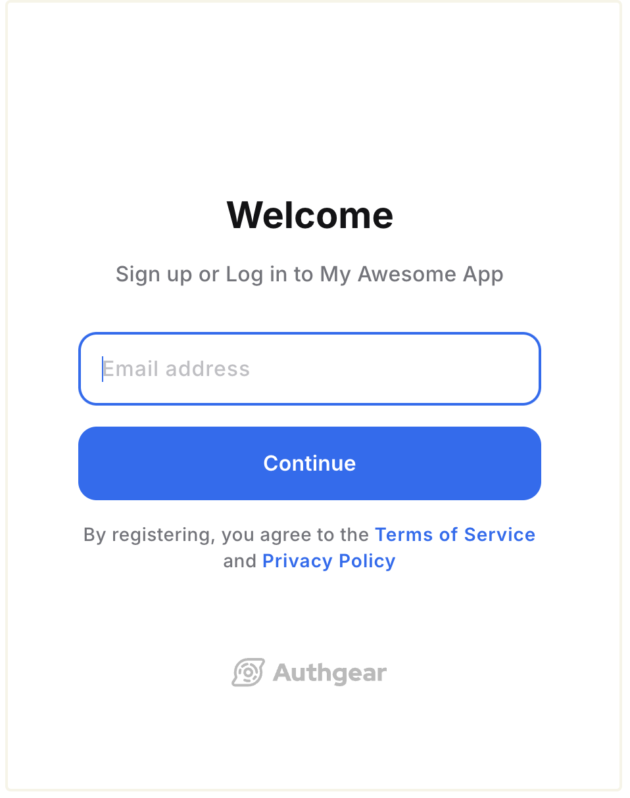
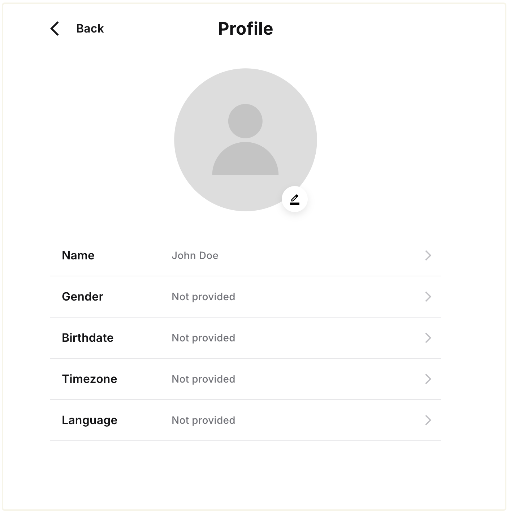

# 5-Minute Guide

Authgear makes it easy to add user authentication and authorization to any application. In this guide, we'll show you how to get started with Authgear in 5 minutes.

### Video Guide



### 1. Create Authgear account&#x20;

To start using Authgear in your application, create a free Authgear account on [authgear.com](https://authgear.com).&#x20;

After you sign up, you'll see the onboarding screen that will guide you through the process of creating your first Authgear project.

### 2. Authgear Projects&#x20;

An Authgear project is similar to a container that holds all your users, settings, and client applications. You need an Authgear project before you can start signing users up.

You can create multiple projects under one account based on your needs. When you create multiple projects, each project is isolated from the others. For example, you can create **Project 1** for your e-commerce business and **Project 2** for a fitness club you organize. **Project 1** and **Project 2** will not share the same users or settings.

To create an additional project, log in to your Authgear account then click on the "Create Project" button.&#x20;

### 3. Testing your signup/login page

Now that you have created a project in Authgear, you're ready to integrate Authgear into your applications for your customers/users to sign up and log in. See our documentation for adding Authgear to your application or website [here](start-building.md) for your favourite framework and programming language.

Before any integration, you can try out the signup flow for your project from the "Getting Started" page.&#x20;

<figure><figcaption></figcaption></figure>

You should be greeted with the AuthUI Login/Sign-up page. Use the form to create a new user account under your project.&#x20;

<figure><figcaption></figcaption></figure>


The flow for sign-up and login will differ based on the login method you enable for your Authgear project. For example, users can sign up using their phone number and password if you enable the **Mobile** login method.


### 4. User Settings Page

After logging in from the previous step, you can **check out the Pre-Built User Settings Page**. This page is the default page where users of your project can edit their profile and manage security settings.

<figure><figcaption></figcaption></figure>

Click on the **Edit Profile** to edit and view profile attributes such as first name, last name,  photo, etc.

<figure><figcaption></figcaption></figure>

Users can manage the identities (email address, phone number, or social media account) linked to their account under the **My Account** section of the User Settings page.

The **Security** section of the User Settings page has the following options:

* **Password:** users can change their password from here.
* **2-step verification:** users can click on this option to view and manage 2-step authenticators for their account. The option is only available when you enable 2FA for your project in **Authgear Portal** > **Authentication** > **2FA**.
* **Signed-in device:** from this page, the user can view browsers and devices that their account is currently signed in on.
* **Advanced Settings:** contains additional settings. For example, when you enable [Account Deletion](../admin/user-management/account-deletion.md) for your project, users can click on this link to access the **Delete Account** button.

You can learn more about the User Settings page [here](../customization/ui-customization/built-in-ui/auth-ui.md).

### 5. Integrate Authgear with Your Application or Website

To get more from Authgear and use Authgear to add user authentication to your web or mobile application, you should integrate Authgear to your application or website.&#x20;

Authgear has official SDKs for integrating Authgear with React, React Native, ionic, Native Android, iOS, and Flutter applications. See the [Start Building](start-building.md) section of Authgear documentation for detailed instructions for each SDK and using other frameworks without the official SDK.

### 6. View and Manage Your Users

Authgear offers multiple options for viewing and managing all users who sign up for your project. These options include:

* Authgear Portal
* [Admin API](../reference/apis/admin-api/)

The quickest way to manage your users is from the Authgear Portal. To open the user management page in the Authgear Portal, click on the **User Management** link in the navigation bar on the left side.

Click on **Users** to view a list of all the users in your project.  Click on a user from the list to view their complete profile and perform administrative operations like modify profile details, suspend/unsuspend user, delete account, etc.

You can also add new users to your project from the User Management page. To do that, click on the **Create User** button on the right.

<figure><figcaption></figcaption></figure>

### 7. Continue Exploring Authgear

Continue to navigate around the Authgear Portal to see all the features and settings available for your project.&#x20;

You can also check out any of the following guides to learn more about Authgear:&#x20;

* [customize the look of AuthUI](../customization/ui-customization/built-in-ui/branding.md) login and sign-up page to match your branding needs using the Design tool
* guides on how to [integrate Authgear to your app](start-building.md).
* how to [enable 2FA for your project](../authentication-and-access/authentication/enable-two-factor-authentication-2fa.md).
