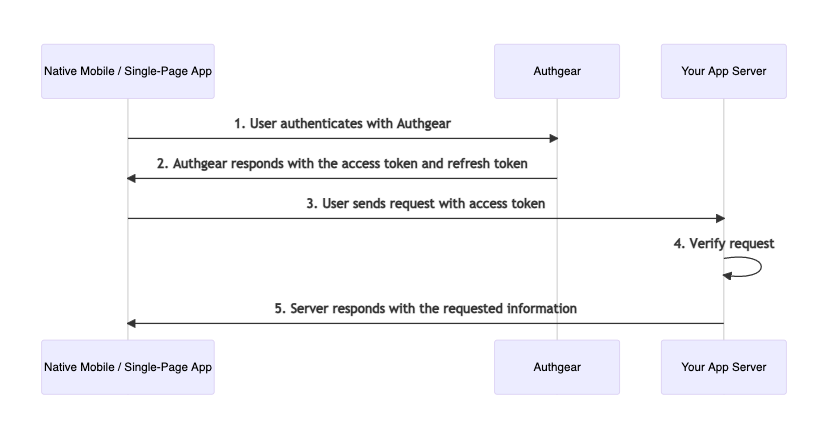

# Token-based (Native mobile or Single-page app)

By using Authgear, you can add the login feature to your mobile native app and single-page application easily. Authgear supports various authentication methods, that you can easily turn on and configure in the portal.

## **Overview**

### **How it works**

Your app server will receive a request with the access token



### Verify request in your app server

To verify the request in your app server, you can choose to **Forward authentication to Authgear Resolver Endpoint** or **Verify JSON Web Token (JWT) in your app server.**


## Request Example

```bash
> GET /api_path HTTP/1.1
> Host: yourdomain.com
> Authorization: Bearer <AUTHGEAR_ACCESS_TOKEN>
```

## Get Started

The following tutorials show you how to add user login to your native mobile or single-page app using Authgear.

### 1. Frontend Integration

Choose your platform below:


[website.md](../single-page-app/website.md)



[react-native.md](../native-mobile-app/react-native.md)



[android](../native-mobile-app/android/)



[ios.md](../native-mobile-app/ios.md)



[flutter.md](../native-mobile-app/flutter.md)



[xamarin.md](../native-mobile-app/xamarin.md)


### 2. Backend Integration


[backend-integration.md](../backend-api/backend-integration.md)

