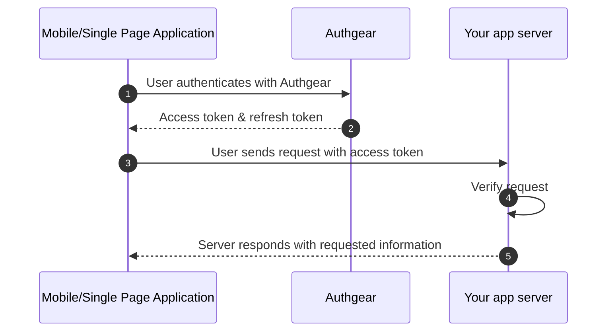
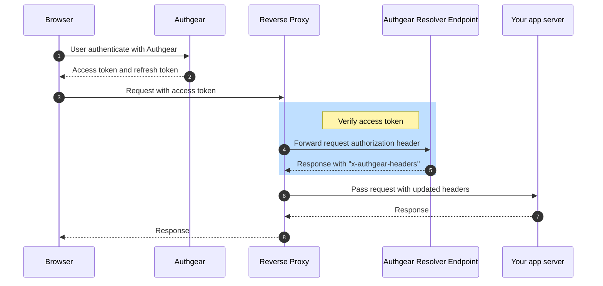

# Backend/API Integration

[](https://r.jina.ai/https://docs.authgear.com/get-started/backend-api)

If your API or backend service needs authentication, you can validate the session in your application server code. Each request from the client to your application server should contain an access token or a cookie. Your backend server should validate them for each HTTP request.

There are different approaches to verify the requests based on whether you validate JWT (JSON Web Tokens) in your server, or forward authentication to Authgear Resolver Endpoint.

|                           | Validate JSON Web Token (JWT) in your application server                                                                                                                   | Forward Authentication to Authgear Resolver Endpoint                                                                    |
| ------------------------- | -------------------------------------------------------------------------------------------------------------------------------------------------------------------------- | ----------------------------------------------------------------------------------------------------------------------- |
| Reliability               | <p><strong>Medium</strong><br>JWT only updates when expire. That means before the token expiry, your application may see the user is valid even they has been disabled</p> | <p><strong>High</strong><br>Update near real-time, based on your reserve proxy cache setting</p>                        |
| Integration difficulties  | <p><strong>Easy</strong><br>You only need to add code in your application to validate and decode JWT</p>                                                                   | <p><strong>Medium</strong><br>Need to setup extra reverse proxy to resolve authentication information</p>               |
| Transportation of session | **Access Token** in `Authorization` header                                                                                                                                 | <p><strong>Session ID</strong> in Cookies or <br><strong>Access Token</strong> in <code>Authorization</code> header</p> |

## Simple: Validate JWT in your server

Authgear uses [JSON Web Token (JWT)](https://jwt.io/?_gl=1*1ybgym6*rollup_ga*MTI1NDM1NjUwMy4xNjg3NzEyNTIz*rollup_ga_F1G3E656YZ*MTY5MTEzNjEzNS45NS4xLjE2OTExMzYxNDguNDcuMC4w*_ga*MTI1NDM1NjUwMy4xNjg3NzEyNTIz*_ga_QKMSDV5369*MTY5MTEzNjEzNS44Ny4xLjE2OTExMzYxNDguNDcuMC4w&_ga=2.165043391.1472871049.1691063710-1254356503.1687712523) for secure data transmission, authentication, and authorization.&#x20;



Authgear returns the `access token` and `refresh token` to the client app after authentication. Your client app should call the backend with the access token in the Authorization header. The tokens should be parsed and validated in the backend server to ensure they are not compromised and the signature is authentic.&#x20;

Request example:

```bash
> GET /api_path HTTP/1.1
> Host: yourdomain.com
> Authorization: Bearer <AUTHGEAR_ACCESS_TOKEN_IN_JWT>
```

Read more on [Validate JWT in your application server](jwt.md) guide.


[jwt.md](jwt.md)



## Advanced: Forward Authentication to Authgear Resolver Endpoint

Forward Authentication is a process where an intermediate **reverse** **proxy or API Gateway** is responsible for authenticating a request before it reaches the intended application or service. This can add an extra layer of security and centralize the authentication logic. An intermediate service forwards each incoming HTTP request to the Authgear Resolver Endpoint to verify the access token or cookie in the HTTP header.&#x20;

Read more on [Forward Authentication to Authgear Resolver Endpoint](nginx.md) guide.

### Forward Access Token in Authorization Header




Instead of validating the access token in the backend, a reverse proxy forwards the request to an [Authgear Resolver Endpoint](nginx.md#authgear-resolver-endpoint). This endpoint resolves and verifies the access token in the **Authorization Header** of the request.

### Forward Cookie in HTTP header


In this approach, instead of validating the token in authorization header, Authgear returns `Set-Cookie` headers and sets cookies to the browser. The cookies are HTTP only and share under the same root domains. So you will need to setup the **custom domain** for Authgear, such as `identity.yourdomain.com`.

If you have multiple applications under `yourdomain.com`, all applications would share the same session cookie automatically. After that, you can verify the cookies using the [Resolver Endpoint](nginx.md).

Request example:

```javascript
> GET /api_path HTTP/1.1
> Host: yourdomain.com
> cookie: session=<AUTHGEAR_SESSION_ID>
```
