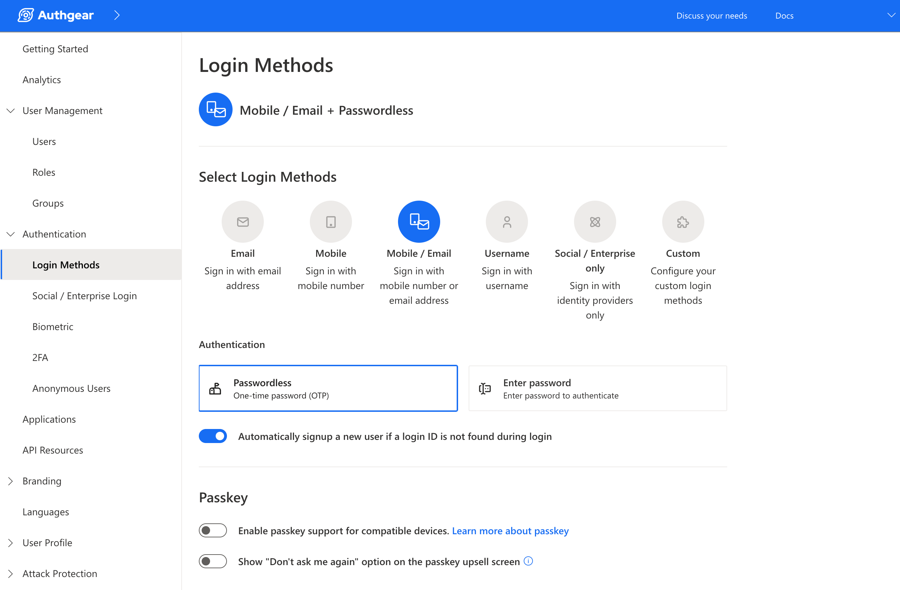

# Validate JWT in your application server

In this section, we will go through how to decode the JWT token to obtain the currently logged-in user.

Before we start, make sure the option **Issue JWT as access token** is enabled in your Application settings in the Portal.&#x20;

<figure><figcaption><p>Enable this option in application settings in the portal</p></figcaption></figure>

With the **Issue JWT as access token** option turned on in your application, Authgear will issue JWT as access tokens. The incoming HTTP requests should include the access token in their `Authorization` headers. Without setting the reverse proxy, your backend server can use your Authgear **JWKS** to verify the request and decode user information from the JWT access token.

## Find the JSON Web Key Sets (JWKS) endpoint

This Discovery endpoint serves as a JSON document containing the OpenID Connect configuration of your app. It includes the authorization endpoint, the token endpoint, and the JWKS endpoint.

`https://<YOUR_AUTHGEAR_ENDPOINT>/.well-known/openid-configuration`&#x20;

The JSON Web Key Sets (JWKS) endpoint can be found in `jwks_uri` in the configuration.

**OpenID Connect Configuration JSON Example**

Here is [an example of how it looks](https://accounts.portal.authgear.com/.well-known/openid-configuration).

```json
{
    "issuer": "https://project-id.authgear.cloud",
    "authorization_endpoint": "https://project-id.authgear.cloud/oauth2/authorize",
    "jwks_uri": "https://project-id.authgear.cloud/oauth2/jwks", // the JWKS endpoint
    ...
}
```

## Decode user from an access token

Follow this step-by-step example to verify and decode the JWT token.



### Step 1: Install packages

```bash
pip install cryptography
pip install PyJWT
```

### Step 2: Find the JSON Web Key Sets (JWKS) endpoint

Define a function to find the JWKS endpoint from the OpenID Connect configuration. Use your Authgear endpoint as the `base_address`

```python
import json
from contextlib import closing
from urllib.request import urlopen

base_address = "https://<your_app_endpoint>"

def fetch_jwks_uri(base_address):
    doc_url = base_address + "/.well-known/openid-configuration"
    with closing(urlopen(doc_url)) as f:
        doc = json.load(f)
    jwks_uri = doc["jwks_uri"]
    if not jwks_uri:
        raise Exception('Failed to fetch jwks uri.')
    return jwks_uri
```

### Step 3: Get the JWT token from the Authorization header

Define a function to extract the access token from the Authorization header in the incoming request. It should look like `Authorization: Bearer <access_token>`.

```python
def parse_header(authz_header):
    parts = authz_header.split(" ")
    if len(parts) != 2:
        return

    scheme = parts[0]
    if scheme.lower() != "bearer":
        return

    return parts[1]
```

### Step 4: Verify and decode the JWT token

Here we show an example of using the Flask web framework to guard a path. You may need to adjust some of the codes to suit your technologies.

```python
from flask import request
import jwt
from jwt import PyJWKClient

@app.route("/hello")
def hello():
    authz_header = request.headers.get("Authorization")
    if not authz_header:
        return {
            "message": "authz header not found"
        }

    # get jwt token from Authorization header
    token = parse_header(authz_header)
    if token:
        try:
            # fetch jwks_uri from the Authgear Discovery Endpoint
            jwks_uri = fetch_jwks_uri(base_address)
            # Reuse PyJWKClient for better performance
            jwks_client = PyJWKClient(jwks_uri)
            signing_key = jwks_client.get_signing_key_from_jwt(token)
            user_data = jwt.decode(
                token,
                signing_key.key,
                algorithms=["RS256"],
                audience=base_address,
                options={"verify_exp": True},
            )
            return {
                "message": "Hello!",
                "user_data": user_data
            }
        except:
            return {
                "message": "JWT decode failed"
            }
    else:
        return {
            "message": "no token"
        }
```



### Step 1: Install dependencies

```bash
npm install --save axios jwks-rsa jsonwebtoken
```

### Step 2: Find the JWKS Endpoint

Use the following method to get the JWKS URI (you'll need to URI to extract the public signing key from a JWT).

```javascript
const appUrl = ""; //place your authgear app endpoint here
const getJwksUri = async (appUrl) => {
    const config_endpoint = appUrl + "/.well-known/openid-configuration";
    const data = await axios.get(config_endpoint);
    return data.data.jwks_uri;
}
```

### Step 3: Extract JWT from Request Header

Use the following code to extract only the token part from a `Bearer [token]` authorization header in your Express app:

```javascript
const express = require("express");
const axios = require("axios");
const node_jwt = require('jsonwebtoken');
const jwksClient = require('jwks-rsa');

const app = express();
const port = 3002;
app.get('/', async (req, res) => {

    const requestHeader = req.headers;
    if (requestHeader.authorization == undefined) {
        res.send("Invalid header");
        return;
    }
    const authorizationHeader = requestHeader.authorization.split(" ");
    const access_token = authorizationHeader[1];

}
```

### Step 4: Decode Access Token

Next, decode the access token so that you can extract the JWT `kid` from the result. You'll need this \`kid to get the public signing key. Use the following code to decode the JWT:

```javascript
const decoded_access_token = node_jwt.decode(access_token, {complete: true});
```

### Step 5: Get JWT Signing Keys and Verify the JWT

Use the following code to extract the JWT public keys then verify the JWT using the keys:

```javascript
const jwks_uri = await getJwksUri(appUrl);
    const client = jwksClient({
        strictSsl: true,
        jwksUri: jwks_uri
    });
    const signing_key = await client.getSigningKey(decoded_access_token.header.kid);

    try {
        const verify = node_jwt.verify(access_token, signing_key.publicKey, { algorithms: ['RS256'] });
        res.send(JSON.stringify(verify))
    }
    catch(error) {
        res.send(error);  
    }
    
```

Here's what your Express app should look like after putting the code in all the steps together:

```javascript
const express = require("express");
const axios = require("axios");
const node_jwt = require('jsonwebtoken');
const jwksClient = require('jwks-rsa');

const app = express();
const port = 3002;

const appUrl = "https://demo-1-ea.authgear.cloud";
const getJwksUri = async (appUrl) => {
    const config_endpoint = appUrl + "/.well-known/openid-configuration";
    const data = await axios.get(config_endpoint);
    return data.data.jwks_uri;
}

app.get('/', async (req, res) => {

    const requestHeader = req.headers;
    if (requestHeader.authorization == undefined) {
        res.send("Invalid header");
        return;
    }
    const authorizationHeader = requestHeader.authorization.split(" ");
    const access_token = authorizationHeader[1];
    const decoded_access_token = node_jwt.decode(access_token, {complete: true});
    const jwks_uri = await getJwksUri(appUrl);
    const client = jwksClient({
        strictSsl: true,
        jwksUri: jwks_uri
    });
    const signing_key = await client.getSigningKey(decoded_access_token.header.kid);

    try {
        const verify = node_jwt.verify(access_token, signing_key.publicKey, { algorithms: ['RS256'] });
        res.send(JSON.stringify(verify))
    }
    catch(error) {
        res.send(error);  
    }
});

app.listen(port, () => {
    console.log(`server started on port ${port}`);
});
```



Use your Authgear endpoint as `base_address`

```go
import (
    "context"
    "encoding/json"
    "fmt"
    "net/http"
    "regexp"
    "time"

    "github.com/lestrrat-go/jwx/jwk"
    "github.com/lestrrat-go/jwx/jwt"
)


var (
    authzHeaderRegexp = regexp.MustCompile("(?i)^Bearer (.*)$")
    baseAddress       = "https://<your_app_endpoint>"
)

type OIDCDiscoveryDocument struct {
    JWKSURI string `json:"jwks_uri"`
}

func FetchOIDCDiscoveryDocument(endpoint string) (*OIDCDiscoveryDocument, error) {
    resp, err := http.DefaultClient.Get(endpoint)
    if err != nil {
        return nil, err
    }
    defer resp.Body.Close()

    if resp.StatusCode != http.StatusOK {
        return nil, fmt.Errorf(
            "failed to fetch discovery document: unexpected status code: %d",
            resp.StatusCode,
        )
    }

    var document OIDCDiscoveryDocument
    err = json.NewDecoder(resp.Body).Decode(&document)
    if err != nil {
        return nil, err
    }
    return &document, nil
}

func FetchJWK(baseAddress string) (jwk.Set, error) {
    doc, err := FetchOIDCDiscoveryDocument(
        baseAddress + "/.well-known/openid-configuration",
    )
    if err != nil {
        return nil, err
    }

    set, err := jwk.Fetch(context.Background(), doc.JWKSURI)
    return set, err
}

// DecodeUser parse request Authorization header and obtain user id and claims
func DecodeUser(r *http.Request) (string, map[string]interface{}, error) {
    // fetch jwks_uri from Authgear
    // you can cache the value of jwks to have better performance
    set, err := FetchJWK(baseAddress)
    if err != nil {
        return "", nil, fmt.Errorf("failed to fetch JWK: %s", err)
    }

    // get jwt token from Authorization header
    authzHeader := r.Header.Get("Authorization")
    match := authzHeaderRegexp.FindStringSubmatch(authzHeader)
    if len(match) != 2 {
        return "", nil, fmt.Errorf("no token")
    }

    // parse jwt token
    token, err := jwt.ParseString(match[1], jwt.WithKeySet(set))
    if err != nil {
        return "", nil, fmt.Errorf("invalid token: %s", err)
    }

    // validate jwt token
    err = jwt.Validate(token,
        jwt.WithClock(jwt.ClockFunc(
            func() time.Time { return time.Now().UTC() },
        )),
        jwt.WithAudience(baseAddress),
    )
    if err != nil {
        return "", nil, fmt.Errorf("invalid token: %s", err)
    }

    return token.Subject(), token.PrivateClaims(), nil
}

func handler(w http.ResponseWriter, r *http.Request) {
    // decode user example
    userid, claims, err := DecodeUser(r)
    isUserVerified, _ :=
        claims["https://authgear.com/claims/user/is_verified"].(bool)
    isAnonymousUser, _ :=
        claims["https://authgear.com/claims/user/is_anonymous"].(bool)

    // ... your handler logic
}
```



### Step 1: Install Packages

First, install the dependencies required by running these com

```bash
composer require firebase/php-jwt
```

```bash
composer require guzzlehttp/guzzle
```

### Step 2: Find the JWKS Endpoint&#x20;

Create a function that finds the JWKS endpoint from your Authgear application endpoint using the following code:

```php
<?php
require 'vendor/autoload.php';
use Firebase\JWT\JWT;

use Firebase\JWT\JWK;
use Firebase\JWT\Key;
use GuzzleHttp\Client;

$appUrl = ""; //place your authgear app endpoint here

function getJwksUri($appUrl) {
    $configEndpoint = $appUrl . "/.well-known/openid-configuration";
    $httpClient = new Client();
    $response = $httpClient->request('GET', $configEndpoint);
    $responseObject = json_decode($response->getBody());
    return $responseObject->jwks_uri;
}
```

### Step 3: Get Signing Key

Add the following code to your application to get the JWT signing key:

```php
$jwksUri = getJwksUri($appUrl);
$httpClient = new Client();
$jwksUriResponse = $httpClient->request('GET', $jwksUri);
$keysObject = json_decode($jwksUriResponse->getBody());

$jwks = (array) ($keysObject->keys)[0];

$parsedKey = JWK::parseKey($jwks, "RS256");
$signingKey = $parsedKey->getKeyMaterial();
```

### Step 4: Extract the JWT From the Request Header

To extract the access token from the HTTP request use the following code:

```php
if (!isset($_SERVER['HTTP_AUTHORIZATION']))
    throw new Exception("Invalid authorization header");
$authorizationHeader = $_SERVER['HTTP_AUTHORIZATION'];
$jwt = (explode(" ", $authorizationHeader))[1];
```

### Step 5: Validate and Decode JWT

Finally, decode the JWT signing key.

```php
$decoded = JWT::decode($jwt, new Key($signingKey, 'RS256'));
echo json_encode($decoded);
```





### Check the validity of JWT

The `auth_time` claim in an **OIDC ID token** represents the time **when the user authentication occurred**. Extract the `auth_time` claim from the token, which should represent the time of the original authentication in seconds. If the difference between the current time and `auth_time` exceeds your threshold (for example, 5 minutes), initiate the [re-authentication](../../how-to-guide/authenticate/reauthentication.md) process.

See an example of how to verify the signature of the ID token, and then validate the claims `auth_time` inside [here](../../how-to-guide/authenticate/reauthentication.md#backend-integration).

## Decode user from cookies

Validating JWT in your application server is _currently_ only available for **Token-based authentication**.


For Cookie-based authentication, JWT in cookies is not supported yet. [You can track the issue here](https://github.com/authgear/authgear-server/issues/1180).


