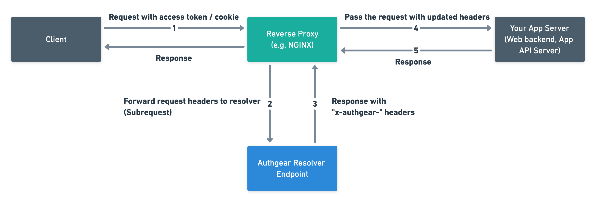

# Forward Authentication to Authgear Resolver Endpoint

In this section, we will explain how to set up a reverse proxy in NGINX to protect your app server from unauthorized access with the Authgear resolver. You can forward the requests without the request body to the resolver endpoint. Authgear will look at the `Authorization` and `Cookie` in the HTTP header, verify the token, and respond to HTTP 200 with `X-Authgear-` headers for session validity, the user id...etc.

If you use a popular reverse proxy on your deployment, such as [NGINX](https://www.nginx.com/), [Traefik](https://traefik.io/traefik/), or API Gateways such as [Apache APISIX](https://apisix.apache.org/), you can configure it with a few simple lines of forward auth config. Your backend should read the returned headers to determine the identity of the user of the HTTP request.

You can also use the forward authentication features of the other popular reverse proxy. e.g.

* [Traefik ForwardAuth middleware](https://doc.traefik.io/traefik/v2.0/middlewares/forwardauth/)

## Authgear Resolver Endpoint

Authgear provides an endpoint for forward authentication. Subrequests should be made to the following endpoint for authentication.

`https://<your_app_endpoint>/_resolver/resolve`

## How Forward Authentication Works



1. After the user is logged in, send an application request to your server from the client app with access token/cookies.
2. Set up a reverse proxy in your infrastructure to authenticate HTTP requests. The reverse proxy will forward the incoming HTTP requests without the request body to the Authgear Resolver Endpoint.
3. Authgear resolver parses the access token and returns HTTP headers including the user login state. The headers are starting with `x-authgear-`.
4. You have to instruct your reverse proxy to include those extra headers, before forwarding the request to your backend server.
5. Your backend server looks at the headers and responds to the client app accordingly. e.g. Returns the user's content or HTTP 401 if the user is not logged in.

There are so many reverse proxies available in the wild. So here we are going to illustrate the idea of using Nginx as the reverse proxy.

## Using Nginx as the reverse proxy

We will use the module `auth_request` in NGINX. The module is not built by default, it should be enabled with the `--with-http_auth_request_module`configuration parameter.

Run this command and verify that the output includes `--with-http_auth_request_module`:

```bash
$ nginx -V 2>&1 | grep -- 'http_auth_request_module'
```

The trick here is to declare an internal `location` and use `auth_request` to initiate a subrequest to the resolved endpoint.

### Example configuration

```
server {
  # Use variable in proxy_pass with resolver to respect DNS TTL.
  # Note that /etc/hosts and /etc/resolv.conf are NOT consulted if resolver is used.
  # See https://www.nginx.com/blog/dns-service-discovery-nginx-plus/
  resolver 8.8.8.8;
  
  # Location that requires request authentication
  location / {
    set $backend http://www.mycompany.com;
    proxy_pass $backend;
    proxy_set_header Host $host;
    # Specify the auth_request directive to initiate subrequests to the to the internal location.
    # This corresponds to the Step 2.
    auth_request /_auth;

    # Copy the `x-authgear-*` headers from the response of the subrequest to Nginx variables.
    # This corresponds to the Step 3.
    auth_request_set $x_authgear_session_valid $upstream_http_x_authgear_session_valid;
    auth_request_set $x_authgear_user_id $upstream_http_x_authgear_user_id;
    auth_request_set $x_authgear_user_anonymous $upstream_http_x_authgear_user_anonymous;
    auth_request_set $x_authgear_user_verified $upstream_http_x_authgear_user_verified;
    auth_request_set $x_authgear_session_acr $upstream_http_x_authgear_session_acr;
    auth_request_set $x_authgear_session_amr $upstream_http_x_authgear_session_amr;
    auth_request_set $x_authgear_session_authenticated_at $upstream_http_x_authgear_session_authenticated_at;
    auth_request_set $x_authgear_user_can_reauthenticate $upstream_http_x_authgear_user_can_reauthenticate;

    # Include the headers in the request that will be sent to your backend server.
    # This corresponds to the Step 4.
    proxy_set_header x-authgear-session-valid $x_authgear_session_valid;
    proxy_set_header x-authgear-user-id $x_authgear_user_id;
    proxy_set_header x-authgear-user-anonymous $x_authgear_user_anonymous;
    proxy_set_header x-authgear-user-verified $x_authgear_user_verified;
    proxy_set_header x-authgear-session-acr $x_authgear_session_acr;
    proxy_set_header x-authgear-session-amr $x_authgear_session_amr;
    proxy_set_header x-authgear-session-authenticated-at $x_authgear_session_authenticated_at;
    proxy_set_header x-authgear-user-can-reauthenticate $x_authgear_user_can_reauthenticate;

    # Your backend must inspect the request headers to determine whether the request is authenticated or not.
    # This corresponds to the Step 5.
  }

  location = /_auth {
    # Set this location for internal use only
    internal;
    # Replace <YOUR_AUTHGEAR_ENDPOINT> with your authgear endpoint.
    # For example, https://example.authgear.cloud
    set $resolver <YOUR_AUTHGEAR_ENDPOINT>/_resolver/resolve;
    proxy_pass $resolver;
    # Set the host so that authgear knows which app is calling the resolver endpoint
    # Replace <YOUR_AUTHGEAR_ENDPOINT_HOST> with the host of your authgear endpoint.
    # For example, example.authgear.cloud
    proxy_set_header Host <YOUR_AUTHGEAR_ENDPOINT_HOST>;
    # The body is supposed to be consumed by your backend server.
    # Pass only the headers to the resolver
    proxy_pass_request_body off;
    proxy_set_header Content-Length "";
  }
}
```


See docs for `auth_request` in NGINX for more details. [http://nginx.org/en/docs/http/ngx\_http\_auth\_request\_module.html](http://nginx.org/en/docs/http/ngx\_http\_auth\_request\_module.html)


## Optimizing the performance

If the reverse proxy, Authgear, and your backend server are in different regions, authenticating every request could result in a huge downgrade in the performance.

You may consider enabling caching.

```
http {
  # ...
  proxy_cache_path /tmp/cache keys_zone=auth_cache:10m;

  # The server block.
  server {
    # ...
    location = /_auth {
      # ...
      proxy_cache auth_cache;
      proxy_cache_key "$cookie_session|$http_authorization";
      proxy_cache_valid 200 10m;  # Adjust cache duration as desired.
    }
  }
}
```

## Reference on the headers

See the list of `x-authgear-` headers in the specs: [https://github.com/authgear/authgear-server/blob/master/docs/specs/api-resolver.md](https://github.com/authgear/authgear-server/blob/master/docs/specs/api-resolver.md)
