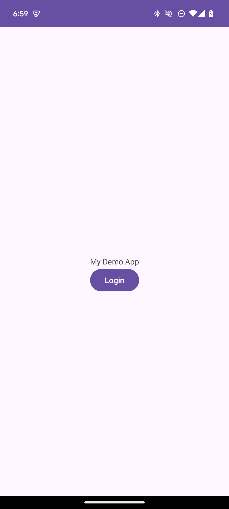

# Android SDK

This guide provides instructions on integrating Authgear with an Android app. Supported platforms include:

* Android 5.0 (API 21) or higher

Follow this guide to add Authgear to your Android app in 🕐 10 minutes.


You can find the full code for the demo app for this tutorial in [this Github repo](https://github.com/authgear/authgear-example-android)


## Setup Application in Authgear

Sign up for an Authgear Portal account at [https://portal.authgear.com](https://portal.authgear.com/). Or you can use your self-deployed Authgear.

From the Project listing, create a new Project or select an existing Project. After that, we will need to create an application in the project.

### **Step 1: Create an application in the Portal**

Go to **Applications** on the left menu bar.

<figure><figcaption></figcaption></figure>

Click **⊕Add Application** in the top toolbar.

Input the name of your application and select **Native App** as the application type. Click "Save".

You will see a list of guides that can help you for setting up, then click "Next".

.png>)

### **Step 2: Configure the application**

Define a custom URI scheme that Authgear will use to redirect users back to your app after they have authenticated. The scheme should be based on the package name for your Android app. For the demo app, we'll be creating in this guide the scheme is: `com.example.authgeardemo://host/path`. To learn more about setting up a custom URI scheme in Android, see the official documentation [here](https://developer.android.com/training/app-links/deep-linking).

Head back to Authgear Portal, and add the URL scheme you have defined as a Redirect URI. For our demo app, add the following URI:

```
com.example.authgeardemo://host/path
```

Click "Save" in the top toolbar and note the **Client ID** as you'll use it later in your Android app. You can also obtain it again from the Applications list later.

.png>)

## Add Authgear to an Android Application

In this step, we'll add user authentication to an Android application using the Authgear client application we set up in the previous steps.

### Pre-requisites

To follow along, you need to have the following:

* Android Studio installed on your computer
* Basic knowledge of Kotlin or Java

### Step 1: Create an Android App project

For the purpose of this guide, we'll be creating a new simple Android app project. Feel free to skip this step if you are adding Authgear to your existing app.

Open Android Studio and create a new project with the following details:

* Select **Empty View Activity** on the Activity selection screen.
* **Name**: My Dem App
* **Build configuration language**: Groovy DSL


The reason for recommending you use Groovy DSL as **Build configuration language** for this guide is to make it easier to copy and paste the Gradle configurations we've provided without having to make many rewrites.


### Step 2: Add Authgear SDK to your project

The Authgear Android SDK makes it easier to interact with Authgear endpoints and services from your Android app.

To add the SDK to your app, first, add the `jitpack.io` repository to your project by adding the following to your project's `settings.gradle` file:

```groovy
dependencyResolutionManagement {
    repositoriesMode.set(RepositoriesMode.FAIL_ON_PROJECT_REPOS)
    repositories {
        mavenCentral()
        maven { url 'https://jitpack.io' }
    }
}
```

Next, add `authgear` in the `dependencies` section of your app-level (`/app/build.gradle`) `build.gradle`. Use `$branch-SNAPSHOT` (e.g. `main-SNAPSHOT`) for the latest version in a branch or a release tag/git commit hash of the desired version.

```groovy
dependencies {
    // Other implementations
    implementation 'com.github.authgear:authgear-sdk-android:SNAPSHOT'
}
```

Replace `SNAPSHOT` with the latest version of the Authgear SDK from: [https://github.com/authgear/authgear-sdk-android/tags](https://github.com/authgear/authgear-sdk-android/tags). For example, replacing SNAPSHOT with `2024-12-11.0` to use the latest version at the time of writing this.

#### Enable Java 8+ API desugaring support

To enable Java 8+ API desugaring support for your project, make the following changes to the app-level `build.gradle` file.

1. Add `coreLibraryDesugaringEnabled true` to the `android` > `compileOptions` section:

```gradle
compileOptions {
    coreLibraryDesugaringEnabled true
}
```

2. Then add the coreLibraryDesugaring to the dependencies section:

```gradle
dependencies {
    // Other implementations
    coreLibraryDesugaring 'com.android.tools:desugar_jdk_libs:2.0.3'
}
```

Learn more about Java 8+ API desugaring support [here](https://developer.android.com/studio/write/java8-support#library-desugaring).

Sync Gradle to continue.

### Step 3: Initialize Authgear

In this step, we'll initialize Authgear in the onCreate method of our app's `MainActivity.kt` class using a member variable. Alternatively, you can initialize Authgear in any class that's the entry point for your app:

First, declare a member variable `authgear` like this:

```kotlin
class MainActivity : AppCompatActivity() {

    private lateinit var authgear: Authgear

    override fun onCreate(savedInstanceState: Bundle?) {
        super.onCreate(savedInstanceState)
        ...
    }
}
```

Next, we'll initialize a new instance of the Authgear SDK and call the `configure()` method in the onCreate function.

```kotlin
override fun onCreate(savedInstanceState: Bundle?) {
        super.onCreate(savedInstanceState)
        setContentView(R.layout.activity_main)

        authgear = Authgear(application, "<ClIENT_ID>", "<AUTHGEAR_ENDPOINT>")
        authgear.configure(object : OnConfigureListener {
            override fun onConfigured() {
                // Authgear can be used.
            }

            override fun onConfigurationFailed(throwable: Throwable) {
                Log.d("TAG", throwable.toString())
                // Something went wrong, check the client ID or endpoint.
            }
        })
}
```

Replace `<CLIENT_ID>` and `<ENDPOINT>` with the values from the configuration page of your Authgear client application.

The complete code for `MainActivity.kt` at this point should look like this:

```kotlin
class MainActivity : AppCompatActivity() {

    private lateinit var authgear: Authgear
    
    override fun onCreate(savedInstanceState: Bundle?) {
        super.onCreate(savedInstanceState)
        setContentView(R.layout.activity_main)
        
        authgear = Authgear(application, "<ClIENT_ID>", "<AUTHGEAR_ENDPOINT>")
        authgear.configure(object : OnConfigureListener {
            override fun onConfigured() {
                // Authgear can be used.
            }

            override fun onConfigurationFailed(throwable: Throwable) {
                Log.d("TAG", throwable.toString())
                // Something went wrong, check the client ID or endpoint.
            }
        })

    }
}
```


Import any class that shows as unresolved.


### Step 4: Add Login Button

In this step, we'll add a login button that when the user taps on will open the login/sign-up page.

Open `res/layout/activity_main.xml` and delete the default "Hello World!" TextView.

Switch to the code view of `activity_main.xml` and add the login button and a TextView inside the root view (ConstraintsLayout).

```xml
<TextView
        android:id="@+id/app_title"
        android:layout_width="wrap_content"
        android:layout_height="wrap_content"
        android:text="My Demo App!"
        app:layout_constraintBottom_toBottomOf="parent"
        app:layout_constraintEnd_toEndOf="parent"
        app:layout_constraintStart_toStartOf="parent"
        app:layout_constraintTop_toTopOf="parent" />

<Button
    android:id="@+id/login_btn"
    android:layout_width="wrap_content"
    android:layout_height="wrap_content"
    android:text="Login"
    app:layout_constraintEnd_toEndOf="parent"
    app:layout_constraintStart_toStartOf="parent"
    app:layout_constraintTop_toBottomOf="@+id/textView" />
```

Also, add the following views to `activity_main.xml` to include a Progress Bar, a User Settings button, and a Logout button that will be visible to a logged-in user.

```xml
<ProgressBar
    android:id="@+id/progressBar"
    style="?android:attr/progressBarStyleHorizontal"
    android:layout_width="0dp"
    android:layout_height="wrap_content"
    android:layout_marginTop="48dp"
    android:indeterminate="true"
    android:visibility="invisible"
    app:layout_constraintEnd_toEndOf="parent"
    app:layout_constraintStart_toStartOf="parent"
    app:layout_constraintTop_toTopOf="parent" />
<TextView
    android:id="@+id/welcome_text"
    android:layout_width="wrap_content"
    android:layout_height="wrap_content"
    android:text="welcome user"
    app:layout_constraintEnd_toEndOf="parent"
    app:layout_constraintStart_toStartOf="parent"
    app:layout_constraintTop_toTopOf="@+id/login_btn" />

<Button
    android:id="@+id/user_settings_btn"
    android:layout_width="wrap_content"
    android:layout_height="wrap_content"
    android:text="User Settings"
    app:layout_constraintEnd_toEndOf="parent"
    app:layout_constraintStart_toStartOf="parent"
    app:layout_constraintTop_toBottomOf="@+id/welcome_text" />

<Button
    android:id="@+id/logout_btn"
    android:layout_width="wrap_content"
    android:layout_height="wrap_content"
    android:text="Logout"
    app:layout_constraintEnd_toEndOf="parent"
    app:layout_constraintStart_toStartOf="parent"
    app:layout_constraintTop_toBottomOf="@+id/user_settings_btn" />

<androidx.constraintlayout.widget.Group
    android:id="@+id/logged_in_views"
    android:layout_width="wrap_content"
    android:layout_height="wrap_content"
    android:visibility="gone"
    app:constraint_referenced_ids="welcome_text,user_settings_btn,logout_btn" />
```

The complete content of `activity_main.xml` can be found [here](https://github.com/authgear/authgear-example-android/blob/main/app/src/main/res/layout/activity_main.xml).

**Enable View Binding**

Next, set up [view binding](https://developer.android.com/topic/libraries/view-binding) so that you can easily reference Views in your `MainActivity.kt` file. Add the following to your app-level (`/app/build.gradle`) `build.gradle` file under the `android` block to enable view binding:

```groovy
buildFeatures {
    viewBinding = true
}
```

Create a `binding` member variable in `MainActivity.kt` and modify the `onCreate()` method as shown below to use view binding in `setContentView`:

```kotlin
class MainActivity : AppCompatActivity() {

    private lateinit var authgear: Authgear
    private lateinit var binding: ActivityMainBinding

    override fun onCreate(savedInstanceState: Bundle?) {
        super.onCreate(savedInstanceState)
        binding = ActivityMainBinding.inflate(layoutInflater)
        val view = binding.root
        setContentView(view)
        // ... the rest of onCreate continues
    }
}
```

### Step 5: Start the authentication flow

Create a `startLogin()` method in the `MainActivity.kt` inside `class MainActivity : AppCompatActivity(){}`. This method will call the Authgear SDK's `authenticate()` method to start a new authentication flow.

```java
fun startLogin() {
    binding.progressBar.visibility =  View.VISIBLE
    val options = AuthenticateOptions("com.example.authgeardemo://host/path")
    authgear.authenticate(options, object : OnAuthenticateListener {
        override fun onAuthenticated(userInfo: UserInfo) {

            updateUi(authgear)
        }

        override fun onAuthenticationFailed(throwable: Throwable) {
            binding.progressBar.visibility =  View.INVISIBLE

            Log.d("TAG", throwable.toString())
        }


    })
}
```

Next, implement the `updateUi()` method that was called in `startLogin()`. This function will update the Views on the screen when the user's logged-in state changes.

The `updateUi()` method also calls the `fetchUserInfo()` method of the Authgear SDK. This will return the [User Info](../../../reference/apis/oauth-2.0-and-openid-connect-oidc/userinfo.md) of the current user such as their email address, name, etc.

```kotlin
fun updateUi(authgear: Authgear) {
    val state = authgear.sessionState
    if (state.toString() == ("AUTHENTICATED")) {
        binding.loginBtn.visibility = View.GONE
        binding.loggedInViews.visibility = View.VISIBLE
        // Get userInfo and display in welcome text
        authgear.fetchUserInfo(object: OnFetchUserInfoListener {
            override fun onFetchedUserInfo(userInfo: UserInfo) {
                binding.welcomeText.text = userInfo.email
            }

            override fun onFetchingUserInfoFailed(throwable: Throwable) {
                Log.d("TAG", "Failed to fetch UserInfo")
            }

        })
    } else {
        binding.loggedInViews.visibility = View.GONE
        binding.loginBtn.visibility = View.VISIBLE
    }
    binding.progressBar.visibility =  View.INVISIBLE
}
```

Finally, call the `startLogin()` method on click of the Login button by adding an onClickListener in the onCreate() method.

```kotlin
binding.loginBtn.setOnClickListener {
    startLogin()
}
```

#### Checkpoint

At this point, if you try to run your application on a mobile device or emulator, you should be able to see the authentication UI (login/sign-up page) when you click on the Login button. However, you will be unable to complete authentication at this point because you have not implemented the activity that handles the Redirect URI.

<figure><figcaption><p>Demo app screenshot</p></figcaption></figure>

## Step 6: Setup Redirect URI for Your Android App

Add the following activity entry to the `AndroidManifest.xml` of your app. The intent system would dispatch the redirect URI to `OAuthRedirectActivity` and the SDK would handle the rest.

<pre class="language-xml"><code class="lang-xml">&#x3C;!-- Your application configuration. Omitted here for brevity -->
&#x3C;application>
<strong>    &#x3C;!-- Other activities or entries -->
</strong>
    &#x3C;!-- Add the following activity -->
    &#x3C;!-- android:exported="true" is required -->
    &#x3C;!-- See https://developer.android.com/about/versions/12/behavior-changes-12#exported -->
    &#x3C;activity android:name="com.oursky.authgear.OAuthRedirectActivity"
        android:exported="true"
        android:launchMode="singleTask">
        &#x3C;intent-filter>
            &#x3C;action android:name="android.intent.action.VIEW" />
            &#x3C;category android:name="android.intent.category.DEFAULT" />
            &#x3C;category android:name="android.intent.category.BROWSABLE" />
            &#x3C;!-- Configure data to be the exact redirect URI your app uses. -->
            &#x3C;!-- Here, we are using com.authgear.example://host/path as configured in the portal -->
            &#x3C;!-- NOTE: The redirectURI supplied in AuthenticateOptions *has* to match as well -->
            &#x3C;data android:scheme="com.example.authgeardemo"
                android:host="host"
                android:pathPrefix="/path"/>
        &#x3C;/intent-filter>
    &#x3C;/activity>
&#x3C;/application>
</code></pre>

#### Targeting API level 30 or above (Android 11 or above)

If your Android app is targeting API level 30 or above (Android 11 or above), you need to add a `queries` section to `AndroidManifest.xml`.

```xml
<?xml version="1.0" encoding="utf-8"?>
<manifest xmlns:android="http://schemas.android.com/apk/res/android">
  <!-- Other elements such <application> -->
  <queries>
    <intent>
      <action android:name="android.support.customtabs.action.CustomTabsService" />
    </intent>
  </queries>
</manifest>
```

### Step 7: Implement User Logout

Add a `logout()` method to your MainActivity.kt class that will call the Authgear SDK's logout() method and end the current user session.

```kotlin
fun logout() {
    binding.progressBar.visibility =  View.VISIBLE
    authgear.logout(true, object: OnLogoutListener {
        override fun onLogout() {
            updateUi(authgear)
        }

        override fun onLogoutFailed(throwable: Throwable) {
            Log.d("TAG", throwable.toString())
        }

    })
}
```

Finally, add an onClickListener for the Logout button that calls the above `logout()` method in the onCreate() method.

```kotlin
binding.logoutBtn.setOnClickListener {
    logout()
}
```

### Step 7: Open User Settings Page

Authgear offers a pre-built User Settings page that user's can use to view, modify their profile attributes and security settings.

Add the following `openUserSettings()` method to your MainActivity.kt class:

```kotlin
fun openUserSettings() {
    authgear.open(Page.SETTINGS)
}
```

Then add an onClickListener for the User Settings button in the onCreate() method that calls the above openUserSettings() method.

```kotlin
binding.userSettingsBtn.setOnClickListener {
    openUserSettings()
}
```

### Additional Actions

#### Get the Logged In State

You can use the user's logged-in state to determine whether a user is logged in and display content like their user info and a logout button as we have done in the `updateUi()` method in [step 5](./#step-5-start-the-authentication-flow). The `SessionState` reflects the user logged-in state in the SDK local state. That means even if the `SessionState` is `AUTHENTICATED`, the session may be invalid if it is revoked remotely. After initializing the Authgear SDK, call `fetchUserInfo` to update the `SessionState` as soon as it is proper to do so.

```kotlin
// After authgear.configure, it only reflect SDK local state.
// value can be NO_SESSION or AUTHENTICATED
val state = authgear.sessionState
```

The value of `SessionState` can be `UNKNOWN`, `NO_SESSION` or `AUTHENTICATED`. Initially, the `sessionState` is `UNKNOWN`. After a call to `authgear.configure`, the session state would become `AUTHENTICATED` if a previous session was found, or `NO_SESSION` if such session was not found.

#### Fetching User Info

In some cases, you may need to obtain current user info through the SDK. (e.g. Display email address in the UI as we did in [step 5](./#step-5-start-the-authentication-flow)). Use the `fetchUserInfo` function to obtain the user info, see [example](../../../reference/apis/oauth-2.0-and-openid-connect-oidc/userinfo.md).

#### Using the Access Token in HTTP Requests

Call `refreshAccessTokenIfNeeded` every time before using the access token, the function will check and make the network call only if the access token has expired. Include the access token in the Authorization header of your application request. If you are using OKHttp in your project, you can also use the interceptor extension provided by the SDK, see [detail](okhttp-interceptor-extension.md).

```java
try {
    authgear.refreshAccessTokenIfNeededSync()
} catch (e: OAuthException) {
    // Something went wrong
}

val accessToken = authgear.accessToken 
if (accessToken == null) {
    // The user is not logged in, or the token is expired.
    // It is up to the caller to decide how to handle this situation.
    // Typically, the request could be aborted
    // immediately as the response would be 401 anyways.
    return
}

val headers = mutableMapOf<String, String>()
headers["authorization"] = "Bearer $accessToken"

// Submit the request with the headers..
```

## **Next steps** <a href="#secure-your-application-server-with-authgear" id="secure-your-application-server-with-authgear"></a>

To protect your application server from unauthorized access. You will need to [integrate Authgear to your backend](../../backend-api/).


[backend-api](../../backend-api/)


## Android SDK Reference

For detailed documentation on the Flutter SDK, visit [Android SDK Reference](https://authgear.github.io/authgear-sdk-android/)

### Footnote

\[^1]: For further instruction on setting up custom URI scheme in Android, see [https://developer.android.com/training/app-links/deep-linking](https://developer.android.com/training/app-links/deep-linking) \[^2]: For more explanation on JWT, see [https://en.wikipedia.org/wiki/JSON\_Web\_Token](https://en.wikipedia.org/wiki/JSON_Web_Token)
